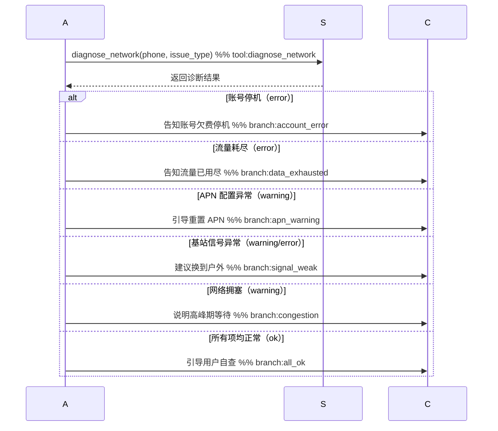

# 组件详解：智能电信客服系统

**功能**: 000-baseline | **日期**: 2026-03-19

> 本文档详述 32 个核心组件的实现细节，面向开发者参考。
> 架构总览见 [plan.md](../plan.md)，接口规范见 [apis.md](apis.md)，数据模型见 [data-model.md](../data-model.md)。

---

## 1. Agent 执行器（backend/src/engine/runner.ts）

### 1.1 职责

- 初始化 MCP 连接，获取 telecom_service 工具列表
- 从数据库加载会话历史
- 调用 Vercel AI SDK `generateText` 驱动 ReAct 循环
- 提取结构化卡片数据返回前端

### 1.2 关键配置

```typescript
const result = await generateText({
  model: chatModel,           // SiliconFlow 模型（通过 createOpenAI 适配）
  system: systemPrompt,       // system-prompt.md 渲染后的内容（含用户手机号）
  messages: history,          // 从 SQLite 加载的历史消息
  tools: {
    ...mcpTools,              // telecom_service 的 5 个工具
    ...skillsTools,           // get_skill_instructions / get_skill_reference
  },
  maxSteps: 10,               // ReAct 循环最大步数
  onStepFinish: logStep,      // 每步完成后记录日志
});
```

### 1.3 系统提示词（system-prompt.md）

Agent 身份定义与行为规范，包含动态占位符：

```markdown
你是"小通"，电信智能客服。用户手机号：{{PHONE}}，无需询问。

工具调用规则：
1. 同一步骤并行调用技能工具和 MCP 工具，禁止拆分为多步
2. 查话费必须调用 query_bill 工具
3. 退订前须向用户确认业务名称和费用影响
4. 超出范围时引导拨打 10086 或前往营业厅

技能映射：
  账单/费用 → bill-inquiry
  退订增值业务 → service-cancel
  套餐/升级 → plan-inquiry
  故障/网速/信号 → fault-diagnosis
```

### 1.4 超时与错误处理

| 项目 | 配置 |
|------|------|
| Agent 执行超时 | 180 秒 |
| ReAct 最大步数 | 10 步 |
| MCP 连接失败 | 抛出异常，返回 HTTP 500 |
| LLM 无响应 | 由 AbortSignal 超时控制 |

### 1.5 结构化卡片提取

Agent 执行完成后，从工具调用结果中识别并提取 4 种卡片数据返回前端：

| 卡片类型 | 触发工具 | 前端渲染 |
|---------|---------|---------|
| `bill_card` | `query_bill` | 账单明细表格 |
| `cancel_card` | `cancel_service` | 退订确认信息 |
| `plan_card` | `query_plans` | 套餐对比卡片 |
| `diagnostic_card` | `diagnose_network` | 诊断步骤列表 |

---

## 2. Skills 知识层（backend/skills/）

Skills 是 Agent 的领域知识模块。v3 架构下，每个 Skill 目录结构如下：

```
skill-name/
├── SKILL.md              # 必须：自包含系统提示词（frontmatter + 完整流程逻辑）
├── references/           # 可选：参考文档（政策、规则、套餐详情等）
│   └── *.md
├── scripts/              # 可选：可执行脚本（诊断编排等）
│   └── *.ts
└── _shared/
    └── types.ts          # 跨技能共享类型定义
```

### 2.0 SKILL.md 结构（v3）

每个 SKILL.md 是一份**自包含的系统提示词**，遵循统一的 v3 结构：

1. **Frontmatter（YAML）**：`mode`（agent 工具调用模式 / prompt 纯提示词模式）、`trigger`（触发关键词）、`channels`（适用渠道列表，决定哪些 bot 加载该技能）
2. **触发条件**：用户意图匹配规则
3. **工具与分类**：该技能可调用的 MCP 工具及其分类说明
4. **客户引导状态图（Mermaid）**：流程逻辑的**唯一事实来源（single source of truth）**，使用以下注解标记：
   - `%% tool:<name>` — 标记 MCP 工具调用节点（用于实时高亮）
   - `%% ref:<file>` — 标记需要加载的参考文档
   - `%% branch:<name>` — 标记分支节点（用于结果高亮）
   - `<<choice>>` 分支节点必须覆盖所有可能路径（分支完备性要求）
5. **升级处理**：超出技能范围时的转人工 / 升级规则
6. **合规规则**：该技能特有的合规约束
7. **回复规范**：语气、格式、长度等输出要求

状态图是 Agent 执行流程的唯一权威定义，代码层不硬编码业务分支逻辑。

### 2.0b 渠道路由

Frontmatter 中的 `channels` 字段决定该技能被哪些 bot 实例加载：

| 渠道标识 | 说明 |
|---------|------|
| `online` | 在线文字客服 |
| `voice` | 语音客服 |
| `outbound-collection` | 外呼催收 |
| `outbound-marketing` | 外呼营销 |

Bot 启动时根据自身渠道标识过滤并加载匹配的技能集。

### 2.1 业务技能（biz-skills）

共 7 个业务技能：

| 技能 | 说明 | channels |
|------|------|----------|
| `bill-inquiry` | 账单查询（话费、账单、费用明细、发票） | online, voice |
| `plan-inquiry` | 套餐咨询（套餐内容、对比、升降级） | online, voice |
| `service-cancel` | 业务退订（增值业务退订，含用户确认步骤） | online, voice |
| `fault-diagnosis` | 网络故障诊断（无信号、网速慢、通话中断），含 `scripts/` 诊断编排器 | online, voice |
| `telecom-app` | 电信 App 问题诊断（锁定、登录失败、设备兼容性、可疑活动） | online, voice |
| `outbound-collection` | 外呼催收话术流程 | outbound-collection |
| `outbound-marketing` | 外呼营销话术流程 | outbound-marketing |

后端内部分析技能（不在 Agent 工具列表中，仅由后端代码调用）也遵循相同的 SKILL.md 约定：

| 目录 | 用途 |
|------|------|
| `handoff-analysis/SKILL.md` | 转人工分析提示词，产出 JSON 块 + 自然语言摘要 |
| `emotion-detection/SKILL.md` | 情绪分类提示词，5 类情绪体系 |

### 2.2 技术技能（tech-skills）

| 技能 | 说明 |
|------|------|
| `skill-creator-spec` | 技能创建器的系统提示词模板，含编写规范（按阶段拆分加载）、Few-shot 示例、能力落地检查指引、draft 结构化校验脚本 |

`skill-creator-spec/SKILL.md` 作为技能创建器（§ 27）的驱动提示词模板，内含 5 个占位符（`{{CONTEXT}}`、`{{CAPABILITY_CHECK}}`、`{{FEW_SHOT}}`、`{{SPEC}}`、`{{SKILL_INDEX}}`），按阶段动态注入。编写规范已拆分为 `spec-overview.md`、`spec-writing.md`、`spec-checklist.md`、`spec-example.md` 四个文件按需加载。`scripts/` 目录包含 draft 结构化校验脚本。

### 2.3 故障诊断脚本编排

`fault-diagnosis` 技能包含可执行诊断脚本：

```
fault-diagnosis/
├── SKILL.md
├── references/
│   └── troubleshoot-guide.md
└── scripts/
    ├── run_diagnosis.ts      # 诊断编排器（主入口）
    ├── check_account.ts      # 账号状态检查
    ├── check_signal.ts       # 信号/SIM 卡检查
    ├── check_data.ts         # 流量/APN 检查
    ├── check_call.ts         # 语音服务检查
    └── types.ts              # 共用类型定义
```

**诊断脚本编排（`scripts/run_diagnosis.ts`）：**

```
runDiagnosis(subscriber, issue_type)
    │
    ├─ checkAccount(subscriber)          → 账号状态（active / suspended）
    │
    ├─ issue_type = "no_signal"/"no_network" → checkSignal()
    │     ├─ 基站信号检测
    │     ├─ SIM 卡状态
    │     └─ APN 配置检查
    │
    ├─ issue_type = "slow_data"          → checkData(subscriber)
    │     ├─ 流量用量检查
    │     ├─ APN 配置
    │     └─ 网络拥塞检测
    │
    └─ issue_type = "call_drop"          → checkCall(subscriber)
          ├─ 通话服务状态
          ├─ 语音服务检查
          └─ 拥塞检测
```

---

## 3. MCP Server 执行层

5 个独立 MCP Server，分别运行在端口 18003-18007：

| 服务名 | 端口 | 工具 |
|--------|------|------|
| user-info-service | 18003 | `query_subscriber`, `query_bill`, `query_plans` |
| business-service | 18004 | `cancel_service`, `issue_invoice` |
| diagnosis-service | 18005 | `diagnose_network`, `diagnose_app` |
| outbound-service | 18006 | `record_call_result`, `send_followup_sms`, `create_callback_task`, `record_marketing_result` |
| account-service | 18007 | `verify_identity`, `check_account_balance`, `check_contracts` |

**传输：** StreamableHTTP（stateless，每请求独立）

### 3.1 工具列表

| 工具 | 功能 | 所属服务 | 关键参数 |
|------|------|----------|----------|
| `query_subscriber` | 查询用户基本信息 | user-info-service | `phone: string` |
| `query_bill` | 查询账单明细 | user-info-service | `phone`, `month?: string`（YYYY-MM） |
| `query_plans` | 查询可用套餐 | user-info-service | `plan_id?: string` |
| `cancel_service` | 退订增值业务 | business-service | `phone`, `service_id: string` |
| `issue_invoice` | 开具电子发票 | business-service | `phone`, `month: string`, `email: string` |
| `diagnose_network` | 网络故障诊断 | diagnosis-service | `phone`, `issue_type: enum` |
| `diagnose_app` | App 安全诊断 | diagnosis-service | `phone`, `issue_type: enum` |
| `record_call_result` | 记录通话结果 | outbound-service | `result`, `remark?`, `callback_time?` |
| `send_followup_sms` | 发送跟进短信 | outbound-service | `sms_type` |
| `create_callback_task` | 创建回访任务 | outbound-service | `callback_phone?`, `preferred_time` |
| `record_marketing_result` | 记录营销结果 | outbound-service | `result`, `remark?` |
| `verify_identity` | 身份验证 | account-service | `phone`, `id_type`, `id_number` |
| `check_account_balance` | 查询账户余额 | account-service | `phone` |
| `check_contracts` | 查询合约 | account-service | `phone` |

### 3.2 MCP 管理功能

- **Server CRUD**：创建、更新、删除 MCP 服务器配置，支持工具自动发现（discover）、调用（invoke）、模拟调用（mock-invoke）
- **Tool Schema 定义**：手动定义或通过 auto-discover 从服务器获取工具 schema
- **Mock 规则**：42 条 mock 规则覆盖全部技能场景，测试时使用 `useMock: true` 模式
- **工具启用/禁用**：按工具粒度控制可用性
- **工具概览**：展示工具与技能引用的映射关系

### 3.3 测试数据（SQLite）

MCP Server 与后端共享同一个 SQLite 文件（`backend/data/telecom.db`），数据由 `db:seed` 初始化，进程重启后持久保留。

测试用户、套餐、增值业务的完整数据见 **[04-data-model.md §§ 1、3、4](04-data-model.md)**。

---

## 4. 语音客服路由（backend/src/chat/voice.ts）

### 4.1 WebSocket 代理

提供 `GET /ws/voice` WebSocket 端点，作为浏览器与 GLM-Realtime 之间的有状态代理：

- 前端连接时，后端同时建立到 GLM-Realtime 的 NodeWebSocket 连接
- 大多数事件（音频流、VAD 事件、字幕事件）直接双向透传
- `response.function_call_arguments.done` 由后端拦截处理（不透传）

### 4.2 VoiceSessionState

每个 WebSocket 会话维护独立状态对象，跟踪：

```typescript
class VoiceSessionState {
  turns: TurnRecord[]           // 对话轮次（用户 + 助手）
  toolCalls: ToolRecord[]       // 工具调用历史
  consecutiveToolFails: number  // 连续工具失败次数
  collectedSlots: Record<string, unknown>  // 已收集槽位（手机号/业务ID等）
  transferTriggered: boolean    // 已触发转人工标志，防止双重触发
}
```

### 4.3 VOICE_TOOLS（GLM 工具列表）

GLM-Realtime 可调用的 6 个工具（扁平格式，不含 `tool_choice`）：

| 工具名 | 说明 |
|--------|------|
| `query_subscriber` | 查询账户信息 |
| `query_bill` | 查询账单明细 |
| `query_plans` | 查询套餐列表 |
| `cancel_service` | 退订增值业务 |
| `diagnose_network` | 网络故障诊断 |
| `transfer_to_human` | 转人工（后端拦截，不调 MCP） |

---

## 5. handoff-analyzer（backend/src/agent/card/handoff-analyzer.ts）

### 5.1 定位

**纯后端内部技能**，不在 `VOICE_TOOLS` 中定义，GLM 不可见、不可调用。
仅在 `chat/voice.ts` 的 `triggerHandoff()` 中由后端代码主动调用。

### 5.2 分析方式（重构后）

原先的 5 个并行 LLM 调用已替换为**单次 LLM 调用**，通过 `backend/skills/handoff-analysis/SKILL.md` 统一提示词驱动。`parseOutput()` 将 LLM 响应拆分为 JSON 块与自然语言摘要两部分。

当工具调用历史为空时，降级策略通过工具调用历史推断意图，避免空分析。

### 5.3 HandoffAnalysis 结构

```typescript
interface HandoffAnalysis {
  customer_intent:        string;     // 客户诉求（简短）
  main_issue:             string;     // 核心问题描述
  business_object:        string[];   // 涉及的业务对象（套餐/账单/业务ID等）
  confirmed_information:  string[];   // 已核实信息（手机号、身份等）
  actions_taken:          string[];   // 已执行操作列表
  current_status:         string;     // 当前处理状态
  handoff_reason:         string;     // 转人工原因
  next_action:            string;     // 建议坐席下一步操作
  priority:               string;     // 优先级："高" | "中" | "低"
  risk_flags:             string[];   // 风险标签
  session_summary:        string;     // 自然语言会话摘要（80-150字）
}
```

风险标签枚举：`complaint` / `high_value` / `churn_risk` / `overdue` / `repeated_contact` / `angry` / `high_risk_op`

---

## 6. emotion-analyzer（backend/src/agent/card/emotion-analyzer.ts）

### 6.1 定位

**纯后端内部技能**，在每次用户语音转写完成后异步触发，不阻塞主音频流程。

### 6.2 分析方式

单次 LLM 调用，通过 `backend/skills/emotion-detection/SKILL.md` 提示词驱动 5 类情绪分类，返回结构：

```typescript
interface EmotionResult {
  label: string;  // "平静" | "礼貌" | "焦虑" | "不满" | "愤怒"
  emoji: string;  // 对应表情符号
  color: string;  // 前端展示色（CSS 颜色值）
}
```

结果以 `emotion_update` WebSocket 事件推送给前端，供实时情绪状态展示。

---

## 7. 前端页面

### 6.1 文字客服（ChatPage.tsx）

| 依赖 | 用途 |
|------|------|
| React 18 + TypeScript | UI 框架 |
| Vite | 构建工具，开发代理 `/api` → `:18472` |
| shadcn/ui + Tailwind CSS | UI 组件库 + 样式（Button, Input, Select, Table, Badge, Card, Dialog 等） |
| @base-ui/react | shadcn/ui 底层原语（Select, Checkbox, RadioGroup 等） |
| react-markdown + remark-gfm | Markdown 渲染 |
| lucide-react | 图标库 |

**功能模块：**
- 聊天气泡（用户 / 小通）+ Markdown 渲染
- 4 种结构化卡片（账单 / 退订 / 套餐 / 诊断）
- 5 个快捷 FAQ 按钮
- 会话重置（`DELETE /api/sessions/:id`）
- 端到端耗时显示（`_ms` 字段）

**Editor 页面（知识库编辑器）：**
- 文件树展示所有 Skill `.md` 文件（`GET /api/files/tree`）
- 在线编辑并保存（`GET/PUT /api/files/content`）
- 无需重启即可更新 Skill 知识

### 6.2 语音客服（VoiceChatPage.tsx）

**状态机（`ConnState`）：**

```
disconnected → connecting → idle ⇄ listening ⇄ thinking ⇄ responding
                                                              ↓
                                                         transferred
```

**音频链路：**
- **输入**：`AudioContext(16kHz)` → `ScriptProcessorNode` → Int16 PCM → base64 → WS
- **输出**：base64 MP3 ← WS → `MediaSource API` → `<audio>` → 扬声器

**核心功能：**
- Server VAD 全程免唤醒，实时显示对话字幕；`silence_duration_ms: 1500` 减少误打断
- 打断机制：用户说话时自动停止当前播报
- 手动转人工按钮（连接状态下可用），向 GLM 注入用户消息触发转接
- 实时情绪展示：接收 `emotion_update` 事件，在界面展示当前用户情绪（label + emoji）
- Handoff 卡片（转人工后展示）：
  - 顶部：`session_summary` 自然语言摘要段落
  - 头部信息行：`customer_intent` + `priority` 优先级徽章 + `current_status` 状态徽章
  - 核心字段：`main_issue`、`next_action`、`risk_flags`、`business_object` 标签组
  - 可折叠块：`confirmed_information`（已核实信息）、`actions_taken`（已执行操作）
  - 已移除原有的 `recent_turns` 原文逐字列出区块

---

## 8. 在线文字客服 WebSocket 路由（backend/src/chat/chat-ws.ts）

### 31.1 端点

`GET /ws/chat`，持久 WebSocket 连接，每个标签页一条连接，跨多轮对话复用。

**查询参数：**

| 参数 | 说明 |
|------|------|
| `phone` | 用户手机号 |
| `lang` | 语言 `zh` / `en` |

### 31.2 消息协议

| 方向 | type | 说明 |
|------|------|------|
| 客户端 → 后端 | `chat_message` | `{message, session_id, user_phone, lang}` |
| 后端 → 客户端 | `user_message` | `{text, msg_id}` — 回显给坐席侧（经 Session Bus 转发） |
| 后端 → 客户端 | `skill_diagram_update` | `{skill_name, mermaid, msg_id}` — 实时推送，可多次 |
| 后端 → 客户端 | `text_delta` | `{delta, msg_id}` — 流式文字增量 |
| 后端 → 客户端 | `response` | `{text, card, skill_diagram, msg_id}` — 最终答复 |
| 后端 → 客户端 | `error` | `{message}` — 处理异常 |

### 31.3 Session Bus 集成

chat-ws 处理完每条消息后，把所有事件（`user_message`、`text_delta`、`skill_diagram_update`、`response`）通过 `sessionBus.publish(phone, event)` 广播，坐席侧 `/ws/agent` 订阅并实时接收。

`transfer_to_human` 工具调用结果通过独立的 `transfer_data` 总线事件传递给 agent-ws，由坐席侧发起 Handoff 分析，不在客户侧触发。

### 31.4 与 HTTP `/api/chat` 的区别

| 特性 | HTTP POST `/api/chat` | WebSocket `/ws/chat` |
|------|----------------------|----------------------|
| 流程图高亮 | ✗（只有最终 `skill_diagram`） | ✓（`skill_diagram_update` 实时推送） |
| 连接复用 | ✗（每次新连接） | ✓（多轮对话复用同一 WS） |
| Session Bus 集成 | ✗ | ✓（坐席侧实时同步） |
| 推荐使用场景 | 历史/简单集成 | 在线对话（当前默认） |

---

## 9. 坐席工作台 WebSocket 路由（backend/src/agent/chat/agent-ws.ts）

### 29.1 端点

`GET /ws/agent`，持久 WebSocket，坐席工作台页面专用。

**查询参数：**

| 参数 | 说明 |
|------|------|
| `phone` | 当前跟踪的用户手机号 |
| `lang` | 语言 `zh` / `en` |

### 29.2 事件流

```
连接建立
  └─ sessionBus.subscribe(phone, handler)   ← 订阅该 phone 的所有事件

收到 Session Bus 事件：
  source=user, type=user_message
    → analyzeEmotion(text) async → ws.send({ type: 'emotion_update', ... })
    → ws.send(event)                       ← 转发给坐席

  source=user, type=transfer_data
    → runHandoffAnalysis(turns, tools)     ← 坐席侧异步分析
    → ws.send({ type: 'handoff_card', data })
    → return（不转发原始 transfer_data）

  其他 source=user 事件
    → ws.send(event)                       ← 直接转发

收到坐席消息（type=agent_message）：
  → sessionBus.publish(phone, { type: 'agent_message', text })  ← 推送给客户侧
  → runAgent(message, history, phone, lang) → 流式返回坐席
  → ws.send({ type: 'handoff_card', data }) 若坐席自己触发了转人工
```

### 29.3 消息协议

**客户端 → 后端：**

| type | 说明 |
|------|------|
| `agent_message` | `{message}` — 坐席发送消息给 AI |

**后端 → 客户端：**

| type | 来源 | 说明 |
|------|------|------|
| `user_message` | Session Bus（客户侧） | 客户发的消息，`{text, msg_id}` |
| `text_delta` | Session Bus / Agent | 流式文字增量 |
| `skill_diagram_update` | Session Bus / Agent | 流程图更新 |
| `response` | Session Bus / Agent | 最终答复，含 `card`（非 handoff_card） |
| `emotion_update` | agent-ws 内部 | `{label, emoji, color}` 情感分析结果 |
| `handoff_card` | agent-ws 内部 | `{data: HandoffAnalysis}` 转人工摘要 |
| `agent_message` | Session Bus 回显 | 坐席自己发的消息（用于确认） |
| `error` | agent-ws | 错误信息 |

### 29.4 消息去重

每条事件携带 `msg_id`（UUID），前端用 `Set<string>` 去重，防止 React StrictMode 双调用导致重复处理。

---

## 10. Session Bus（backend/src/services/session-bus.ts）

### 10.1 职责

服务端内存发布/订阅，解耦 `chat-ws`（生产者）与 `agent-ws`（消费者），无需持久化，进程内有效。

### 10.2 接口

```typescript
sessionBus.publish(phone: string, event: object): void
sessionBus.subscribe(phone: string, handler: (event) => void): () => void
sessionBus.getSession(phone: string): string | undefined
sessionBus.setSession(phone: string, sessionId: string): void
```

### 10.3 特殊总线事件

| type | 发布者 | 消费者 | 说明 |
|------|--------|--------|------|
| `transfer_data` | chat-ws（runner 返回 transferData 时） | agent-ws | 转人工所需的对话轮次、工具记录、意图参数 |

此事件不转发给前端，仅供 agent-ws 触发 Handoff 分析。

---

## 11. 实时流程图高亮（Mermaid Diagram Live Highlighting）

### 31.1 设计目标

Agent 执行每个业务步骤时，右侧 `DiagramPanel` 实时高亮 mermaid 时序图中**正在发生的节点**，让操作人员直观看到 Agent 正在走哪条处理路径。

两类高亮叠加在同一张图上：

| 颜色 | 标记类型 | 语义 |
|------|---------|------|
| 黄色 `rgba(255, 200, 0, 0.35)` | `%% tool:<name>` | Agent 正在调用该 MCP 工具 |
| 绿色 `rgba(100, 220, 120, 0.4)` | `%% branch:<name>` | 诊断结果走向该响应分支 |

---

### 31.2 第一层：SKILL.md 注解标记

在 mermaid 时序图的关键行末尾用 `%%` 注释打标记（mermaid 将 `%%` 后的内容视为注释，不影响渲染）：



同一 SKILL.md 可以包含中英文两个 mermaid 块（用 `<!-- lang:en -->` 分隔），两个块分别打标记。

---

### 31.3 第二层：runner.ts 高亮函数（backend/src/engine/runner.ts）

**`highlightMermaidTool(rawMermaid, toolName)`**

扫描每一行，找到含 `%% tool:<toolName>` 的行，用 mermaid `rect` 块包裹（黄色背景）：

```
原始行：    A->>S: diagnose_network(...) %% tool:diagnose_network
高亮后：    rect rgba(255, 200, 0, 0.35)
              A->>S: diagnose_network(...) %% tool:diagnose_network
            end
```

**`highlightMermaidBranch(rawMermaid, branchName)`**

同理，找到含 `%% branch:<branchName>` 的行，用绿色 `rect` 块包裹。

**`determineBranch(diagnosticSteps)`**

将 `diagnose_network` 返回的 `diagnostic_steps` 数组映射到分支名称：

| 优先级 | 步骤名（中/英） | 条件 | 分支名 |
|--------|--------------|------|-------|
| 1 | `账号状态检查` / `Account Status` | status=error | `account_error` |
| 2 | `流量余额检查` / `Data Balance` | status=error | `data_exhausted` |
| 3 | `APN 配置检查` / `APN Configuration` | status=warning/error | `apn_warning` |
| 4 | `基站信号检测` / `Base Station Signal` | status=warning/error | `signal_weak` |
| 5 | `网络拥塞检测` / `Network Congestion` | status=warning/error | `congestion` |
| 6 | （无任何 error/warning） | — | `all_ok` |

**`extractMermaidFromContent(markdown, lang)`**

从 SKILL.md 中提取对应语言的 mermaid 块：
- `lang='zh'`：取第一个 ` ```mermaid ``` ` 块
- `lang='en'`：优先取 `<!-- lang:en -->` 后的块，不存在则回退到第一块

---

### 31.4 第三层：onStepFinish 触发 + WebSocket 推送

Vercel AI SDK 每个步骤完成时调用 `onStepFinish`，此时 `toolCalls` 与 `toolResults` 均已就绪：

```
Step N 完成（onStepFinish 回调）
    │
    ├─ toolCalls 含 "get_skill_instructions"
    │       → 读 SKILL.md，extractMermaidFromContent()
    │       → onDiagramUpdate(skillName, rawMermaid)        ← 无高亮，面板提前出现
    │
    └─ toolCalls 含 SKILL_TOOL_MAP 中的工具（如 "diagnose_network"）
            → 在 toolResults 中找对应结果
            → 解析 diagnostic_steps → determineBranch()
            → highlightMermaidTool(raw, toolName)
            → highlightMermaidBranch(above, branchName)
            → onDiagramUpdate(skillName, 双重高亮图)
```

`onDiagramUpdate` 是 `runAgent()` 的可选回调参数，由 `chat/chat-ws.ts` 注入：

```typescript
await runAgent(message, history, userPhone, lang,
  (skillName, mermaid) =>
    ws.send(JSON.stringify({ type: 'skill_diagram_update', skill_name: skillName, mermaid }))
);
```

前端收到 `skill_diagram_update` 事件后，通过卡片系统路由到 DiagramContent 卡片重新渲染（旧 DiagramPanel 已被卡片系统取代）。

最终 `response` 事件中的 `skill_diagram` 也使用高亮版（`diagnose_network` 完成后在后处理循环中覆盖），确保最终结果不降级回无高亮版本。

---

### 31.5 SKILL_TOOL_MAP（工具 → Skill 名称映射）

```typescript
const SKILL_TOOL_MAP: Record<string, string> = {
  diagnose_network: 'fault-diagnosis',
  diagnose_app:     'telecom-app',
};
```

扩展高亮支持：在 `SKILL_TOOL_MAP` 添加映射 + 在对应 SKILL.md 的 mermaid 中打 `%% tool:` 和 `%% branch:` 标记即可，无需改动 runner.ts 核心逻辑。

---

---

## 12. 坐席工作台前端（AgentWorkstationPage.tsx）

### 28.1 路由

`/agent` 页面，独立于客户侧 `/chat`。

### 28.2 功能模块

| 模块 | 说明 |
|------|------|
| 用户选择器 | 下拉切换跟踪用户，触发 WS 重建 |
| BroadcastChannel 同步 | 监听 `ai-bot-user-sync` 频道，客户侧换用户时自动同步 |
| 持久 WS `/ws/agent` | 连接后订阅 Session Bus，实时接收所有事件 |
| 对话记录区 | 展示客户消息（user bubble）+ AI/坐席回复（bot bubble）|
| 卡片面板（CardPanel）| 右侧 2 列 Grid，展示流程图 / 情感分析 / 转人工摘要 |
| 坐席输入框 | 坐席可主动向 AI 发送消息 |
| 消息去重 | `processedMsgIds` Set，基于 `msg_id` 防止 StrictMode 重复处理 |

### 28.3 WS 事件路由

```
ws.onmessage (msg.type)
  ├─ user_message    → 添加 user bubble + 空 bot bubble（等待 text_delta）
  ├─ text_delta      → 追加到 pending bot bubble
  ├─ response        → 更新 pending bot bubble（最终文本 + 非 handoff 卡片）
  ├─ agent_message   → skip（坐席自己发的，已在本地添加）
  ├─ error           → 替换 pending bot bubble 为错误提示
  └─ 其他（findCardByEvent）
      ├─ skill_diagram_update → DiagramContent 卡片
      ├─ emotion_update       → EmotionContent 卡片
      └─ handoff_card         → HandoffContent 卡片
```

---

## 13. 坐席卡片系统（frontend/src/agent/cards/）

### 29.1 设计目标

可扩展的卡片框架：**添加新卡片 = 写内容组件 + 调用 `registerCard()`**，无需修改 `AgentWorkstationPage`。

### 29.2 核心类型（registry.ts）

```typescript
interface CardDef {
  id: string;
  title: Record<Lang, string>;
  Icon: LucideIcon;
  headerClass: string;          // Tailwind header 样式（使用 shadcn 语义色如 bg-muted）
  colSpan: 1 | 2;               // 2 列 Grid 中占几列
  defaultOpen: boolean;
  defaultCollapsed: boolean;
  wsEvents: string[];           // 该卡片处理的 WS 事件类型列表
  dataExtractor: (msg) => unknown;   // 从原始 WS 消息提取卡片数据
  component: ComponentType<{ data: unknown; lang: Lang }>;
}

interface CardState {
  id: string;
  order: number;          // 排序（拖拽后改变）
  isOpen: boolean;        // 是否显示
  isCollapsed: boolean;   // 是否折叠（仅显示 header）
  data: unknown;          // 最新数据
}
```

### 29.3 注册函数

| 函数 | 说明 |
|------|------|
| `registerCard(def)` | 注册卡片定义 |
| `getCardDef(id)` | 按 id 获取定义 |
| `findCardByEvent(type)` | 按 WS 事件类型查找卡片 |
| `getAllCardDefs()` | 获取所有已注册定义 |
| `buildInitialCardStates()` | 构建初始运行时状态数组 |

### 29.4 内置卡片

注册顺序决定默认布局（col-span-1 先注册，col-span-2 最后，保证小卡片并排在顶部）：

| id | colSpan | wsEvents | 说明 |
|----|---------|----------|------|
| `emotion` | 1 | `emotion_update` | 情感横条（😊→😠 渐变轨道 + 指示器） |
| `handoff` | 1 | `handoff_card` | 转人工摘要（意图/问题/动作/风险） |
| `diagram` | 2 | `skill_diagram_update` | 流程图（Mermaid 渲染，可滚动） |

### 29.5 CardPanel 布局

```
┌───────────────────────────────────────┐  ← 460px 宽
│  [情感分析]  │  [转人工摘要]           │  ← row 1: 各占 col-span-1
├─────────────────────────────────────  │
│           [  流程图  ]                │  ← row 2: col-span-2
└───────────────────────────────────────┘
```

- CSS `grid grid-cols-2 gap-3 grid-flow-dense`：`dense` 填充拖拽后产生的空格，保证小卡片始终并排
- 拖拽排序：HTML5 drag-and-drop，`onDrop` 时交换两卡片的 `order` 值
- 关闭卡片：`isOpen: false`，底部显示恢复芯片（restore chip）

### 29.6 EmotionContent 情感横条

```
😊                        😠
 ══════════════●══════════
           焦虑
```

- 渐变轨道：`from-green-400 via-yellow-400 via-orange-400 to-red-500`（数据可视化，保留具体色值）
- 指示器位置由 `color` 字段映射：`green→12%` / `amber→42%` / `orange→68%` / `red→88%`
- 位置变化：CSS `transition: left 0.5s ease` 平滑滑动
- 空状态：无指示器，显示"等待客户发言…"

---

## 14. 数据库（SQLite + Drizzle ORM）

**位置：** `backend/data/telecom.db`（首次启动自动创建）
**并发：** WAL 模式，后端（Bun）与 MCP Server（Node.js）共享同一文件，无锁冲突
**Schema：** 共 25+ 张表（核心业务 11 张 + KM 13 张 + 变更审批/测试用例），完整定义见 **[04-data-model.md](04-data-model.md)**。

**操作命令：**

```bash
# 初始化 / 更新 Schema
cd backend && bunx drizzle-kit push

# 写入测试数据（幂等，重复执行安全）
bun run db:seed

# 可视化管理
bunx drizzle-kit studio
```

---

## 15. 合规用语拦截引擎（backend/src/services/keyword-filter.ts）

### 31.1 职责
实时检测机器人回复和坐席发言中的违规内容，实现三层拦截：
- **banned**：硬拦截，不可发送（推诿、态度恶劣、催收违规等）
- **warning**：软告警，允许发送但提醒（过度承诺等）
- **pii**：个人敏感信息脱敏（身份证号、银行卡号）

### 31.2 核心实现
使用 Aho-Corasick 多模式匹配自动机，O(n) 复杂度扫描文本，启动时一次性构建，支持运行时热重载。

### 31.3 拦截点
| 拦截点 | 文件 | 模式 |
|--------|------|------|
| 文字客服 bot 回复 | chat/chat-ws.ts | 同步拦截 + PII 脱敏 |
| 语音 bot 转写文本 | chat/voice.ts | 异步告警（音频已播放无法回收） |
| 坐席发言 | agent/chat/agent-ws.ts | 同步拦截（banned → 阻止发送，warning → 告警放行） |

### 31.4 前端展示
坐席工作台 CardPanel 注册 `compliance` 卡片（`ComplianceContent.tsx`），累积模式展示实时告警列表。

### 31.5 词库管理 API
- `GET /api/compliance/keywords` — 获取全部词库
- `POST /api/compliance/keywords` — 新增关键词
- `DELETE /api/compliance/keywords/:id` — 删除关键词
- `POST /api/compliance/keywords/reload` — 热重载 AC 自动机
- `POST /api/compliance/check` — 在线检测（调试用）

---

## 16. 版本管理（Skill Version Management）

### 28.1 概念模型

Skills 以文件目录形式存储，版本管理采用完整快照机制：

```
backend/skills/
├── biz-skills/{skill-name}/          # 生产目录（仅 publish 时更新）
│   ├── SKILL.md
│   ├── references/
│   └── scripts/
└── .versions/{skill-name}/           # 版本存储
    ├── v1/                           # 完整目录快照
    ├── v2/
    └── v3/
```

- 每个版本是技能目录的完整快照（SKILL.md + references/ + scripts/）
- 所有编辑操作在 `.versions/` 中进行，`biz-skills/` 主目录仅在 publish 时更新
- Draft 文件（`.draft` 后缀）跟踪未保存的逐文件变更，对用户不可见

### 28.2 版本状态

| 状态 | 说明 |
|------|------|
| `saved` | 版本文件已保存，可用于测试或发布 |
| `published` | 当前活跃版本，文件已复制到 `biz-skills/`，同一时间只有一个版本可为 published |

### 28.3 文件级 Draft 跟踪

- 编辑文件后标记黄色圆点（unsaved）
- 保存文件后标记绿色圆点（saved）
- 切换文件时自动保存 draft（`.draft` 文件）
- 打开文件时自动加载已有 draft
- Published 版本的文件为只读

### 28.4 核心操作

| 操作 | API | 说明 |
|------|-----|------|
| 创建版本 | `POST /api/skill-versions/create-from` | 从已有版本复制创建新版本 |
| 保存文件 | `PUT /api/files/content` | 写入 `.versions/` 中的文件 |
| 测试版本 | `POST /api/skill-versions/test` | 使用该版本文件运行 Agent，使用 mock 规则 |
| 发布版本 | `POST /api/skill-versions/publish` | 将 `.versions/v{N}/` 复制到 `biz-skills/`，存在 `.draft` 文件时拒绝发布 |
| 创建文件/文件夹 | `POST /api/files/create-file`, `POST /api/files/create-folder` | 在非 published 版本中创建 |

### 28.5 数据存储

- `skill_registry` 表 — id, published_version, latest_version, description
- `skill_versions` 表 — id, skill_id, version_no, status (saved/published), snapshot_path, change_description

### 28.6 前端 Skill Editor 布局

三栏布局：

```
┌─────────────────┬──────────────────────────┬─────────────────────────┐
│  Left (order 1) │   Center (order 2)       │   Right (order 99)      │
│                 │                          │                         │
│  ← 返回 + 技能名 │  编辑器                   │  Tab: "需求访谈"          │
│  版本列表        │  保存按钮 + 预览切换        │  Tab: "测试"             │
│  文件树          │  版本状态指示              │  （对话式 UI）            │
│                 │                          │                         │
└─────────────────┴──────────────────────────┴─────────────────────────┘
```

- 左栏：返回按钮 + 技能名称 → 版本列表 → 文件树
- 中栏：编辑器（含保存按钮 + preview 切换 + 版本状态显示）
- 右栏：双 Tab — "需求访谈"（requirement chat）/ "测试"（test with conversation UI）

---

## 17. 技能版本测试

### 29.1 职责
在不影响生产环境的情况下测试技能版本的变更。

### 29.2 工作原理
通过 `POST /api/skill-versions/test` 直接测试版本快照，无需独立沙箱环境。测试时使用 symlink 指向版本快照目录，默认启用 mock 模式（`useMock: true`），使用 42 条预配置的 mock 规则。

### 29.3 Runner 改造
`runAgent()` 新增 `overrideSkillsDir` 可选参数，测试时传入版本快照路径。

---

## 18. 自然语言配置编辑（backend/src/agent/km/skills/skill-edit.ts）

### 30.1 职责
业务人员通过自然语言描述需求，系统自动定位文件、生成修改 Diff、确认后写入。

### 30.2 需求澄清（POST /api/skill-edit/clarify）
多轮对话式澄清：LLM 判断需求完整性，缺少信息时返回澄清问题，完整时返回结构化意图（target_skill, change_type, details, risk_level）。

### 30.3 Diff 生成（POST /api/skill-edit/）
LLM 通过 read_skill 工具读取目标文件，生成精确的 old_fragment → new_fragment 替换方案，返回 Diff 预览。

### 30.4 确认写入（POST /api/skill-edit/apply）
验证 old_fragment 仍存在于文件中（防止并发冲突），执行替换并调用 saveSkillWithVersion 创建版本记录。

---

## 19. 权限控制（backend/src/services/auth.ts）

### 31.1 角色层级
| 角色 | 级别 | 权限范围 |
|------|------|---------|
| auditor | 1 | 只读查看 |
| reviewer | 2 | 审核变更 |
| config_editor | 3 | 编辑话术、FAQ |
| flow_manager | 4 | 修改流程、版本回滚 |
| admin | 5 | 全部权限 |

### 31.2 中间件
`requireRole(minRole)` — 从 `X-User-Id` 请求头获取用户，查询 SQLite `users` 表，比较角色级别。开发模式下无认证头时自动放行。

---

## 20. 可观测指标采集（VoiceSessionState 扩展）

### 28.1 新增指标
| 指标 | 采集方式 |
|------|---------|
| 首包响应时延 | `markUserEnd()` → `markFirstAudioPack()` 时间差 |
| 打断次数 | `input_audio_buffer.speech_started` 事件计数 |
| 冷场次数 | 用户说完 5 秒内无首包音频 |
| 会话时长 | `sessionStartTs` → `onClose` 时间差 |

### 28.2 输出
会话结束时通过 `logger.info('voice', 'session_metrics', state.getMetrics())` 输出汇总日志，包含 avg/p95 首包时延、打断次数、冷场次数等。

### 28.3 文字通道指标
chat-ws.ts 在 onClose 时输出 `session_summary` 日志：message_count, tool_call_count, tool_success_rate, transfer_triggered, auto_resolved, duration_ms。

---

## 21. 外呼语音系统（backend/src/chat/outbound.ts + frontend OutboundVoicePage.tsx）

### 29.1 职责

提供语音外呼能力，支持催收和营销两种场景。与语音客服（voice.ts）共享 GLM-Realtime 代理架构，但使用独立的工具集和 system prompt。

### 29.2 WebSocket 端点

`GET /ws/outbound`，查询参数：

| 参数 | 说明 |
|------|------|
| `task` | 任务类型 `collection` / `marketing` |
| `id` | 任务 ID（如 `C001`、`M001`） |
| `lang` | 语言 `zh` / `en` |
| `phone` | 客户手机号 |

### 29.3 外呼专用工具（OUTBOUND_TOOLS）

工具调用在本地 mock 处理，不走 MCP：

| 工具名 | 说明 | 关键参数 |
|--------|------|----------|
| `record_call_result` | 记录通话结果 | `result`（ptp/refusal/dispute/callback/converted 等 10 种）、`remark`、`callback_time`、`ptp_date` |
| `send_followup_sms` | 发送跟进短信 | `sms_type`（payment_link/plan_detail/callback_reminder/product_detail） |
| `transfer_to_human` | 转人工 | `reason`、`current_intent`、`recommended_action` |
| `create_callback_task` | 创建回访任务 | `callback_phone`、`preferred_time` |

### 29.4 System Prompt 构建

`buildOutboundPrompt()` 函数根据任务类型和语言动态生成 system prompt：
- 从 `outbound_tasks` 表加载任务数据（JSON 含 zh/en 变体）
- 注入占位符：`{{PHONE}}`、`{{CURRENT_DATE}}`、`{{TASK_TYPE}}`、`{{TASK_INFO}}`、`{{VOICE_STYLE}}`
- 语音风格：催收→沉稳认真型，营销→热情活泼型

### 29.5 会话流程

```
连接建立
  └─ 后端连接 GLM-Realtime + session.update（注入工具、system prompt、语音配置）

GLM 返回 session.updated
  └─ 触发 response.create → 机器人先说开场白
  └─ 推送外呼技能流程图（outbound-collection / outbound-marketing）

用户语音转写完成
  └─ 发布 user_message 到 Session Bus + 异步情感分析

工具调用拦截（不透传 GLM）
  ├─ transfer_to_human → triggerHandoff() + 推送高亮流程图
  └─ 其他工具 → 本地 mock 处理 → 返回结果给 GLM → 推送高亮流程图

WebSocket 关闭
  └─ 等待 pendingHandoff 完成 → 关闭 GLM 连接
```

### 29.6 前端 OutboundVoicePage

使用 `useVoiceEngine` 共享 Hook 管理音频管线和 WebSocket 连接。特有功能：
- 麦克风门控：`micReadyRef` 在机器人开场白结束（第一个 `response.done`）后才允许发送音频，避免回声污染 VAD
- 任务切换时自动断开并清空对话
- 外呼任务卡片展示（OutboundTaskContent）

### 29.7 灰度路由

外呼路由支持灰度发布：`resolveSkillsDir()` 根据手机尾号与灰度百分比决定使用生产或 `.canary/` 目录的 Skill。

---

## 22. useVoiceEngine 共享 Hook（frontend/src/chat/hooks/useVoiceEngine.ts）

### 30.1 职责

抽取 VoiceChatPage 和 OutboundVoicePage 共用的 WebSocket 连接管理、音频采集/播放逻辑为独立 Hook，消除代码重复。

### 30.2 核心返回值

```typescript
useVoiceEngine(disconnectedState): {
  // 状态
  connState, messages, errorMsg, handoffCtx,
  // Refs
  wsRef, messagesEndRef, pendingUserIdRef, botMsgIdRef, botTextRef,
  transferToBotRef, disconnectRef, connectRef,
  // 音频
  playChunk, stopPlayback, stopMic,
  // 消息
  upsertMsg, nextMsgId,
  // 连接
  connectWs, disconnect, reset,
}
```

### 30.3 关键方法

| 方法 | 说明 |
|------|------|
| `connectWs(url, onMessage, options?)` | 建立 WS + 麦克风采集管线（16kHz PCM → base64），支持 `micGateRef` 门控 |
| `playChunk(base64)` | MP3 流式播放（MediaSource API） |
| `stopPlayback()` | 停止音频播放 |
| `stopMic()` | 断开麦克风但保持 WS |
| `upsertMsg(msg)` | 按 ID 插入或更新消息 |
| `disconnect()` | 关闭 WS + 释放所有资源 |
| `reset()` | 全量清理状态（消息、错误、handoff） |

### 30.4 类型

```typescript
type VoiceConnState = 'disconnected' | 'connecting' | 'idle' | 'ringing'
  | 'listening' | 'thinking' | 'responding' | 'transferred' | 'ended';

interface VoiceMessage {
  id: number; role: 'user' | 'bot' | 'agent' | 'handoff';
  text: string; time: string;
  emotion?: EmotionResult; handoffCtx?: HandoffContext;
}
```

---

## 23. TTS 语音合成（backend/src/services/tts.ts）

### 31.1 职责

将文本转为语音音频，用于坐席消息 TTS 播放和外呼场景。

### 31.2 接口

```typescript
async function textToSpeech(text: string, lang: 'zh' | 'en' = 'zh'): Promise<string>
```

- **返回**：base64 编码的 MP3 音频
- **API**：SiliconFlow OpenAI 兼容接口 `/v1/audio/speech`
- **模型**：`FunAudioLLM/CosyVoice2-0.5B`
- **配置**：response_format=mp3, speed=1.0

---

## 24. 实时翻译（backend/src/services/translate-lang.ts）

### 28.1 职责

支持中英双语客服场景，当客户与坐席使用不同语言时实时翻译。

### 28.2 接口

| 函数 | 说明 |
|------|------|
| `translateText(text, targetLang)` | 单次 LLM 翻译，通过 SiliconFlow API |
| `translateMermaid(mermaid, targetLang)` | 翻译 Mermaid 图标签，保持语法不变；结果缓存 |

### 28.3 翻译策略

- 仅 zh → en 方向翻译，zh 输入直接返回原文
- Mermaid 翻译使用 `tech-skills/translate-lang/SKILL.md` 提示词
- 翻译结果带缓存（key: `${lang}:${mermaid}`），避免重复调用
- 翻译失败时回退到原文

---

## 25. 语言会话管理（backend/src/services/lang-session.ts）

### 29.1 职责

按手机号维护客户侧和坐席侧的语言选择，WebSocket 连接建立时设置，语言切换时 WebSocket 重建。

### 29.2 接口

```typescript
setCustomerLang(phone: string, lang: Lang): void
setAgentLang(phone: string, lang: Lang): void
getLangs(phone: string): { customer: Lang; agent: Lang }
```

存储：内存 Map，默认 customer=zh / agent=zh。

---

## 26. 跨窗口用户同步（frontend/src/chat/userSync.ts）

### 30.1 职责

客户侧切换用户时，通过 BroadcastChannel API 通知坐席工作台自动跟随切换，无需手动操作。

### 30.2 接口

| 函数 | 说明 |
|------|------|
| `broadcastUserSwitch(phone)` | 广播 `user_switch` 事件到所有标签页 |
| `useAgentUserSync(onSwitch)` | React Hook，订阅广播事件，触发回调 |

频道名：`ai-bot-user-sync`。

---

## 27. AI 技能创建器（backend/src/agent/km/skills/skill-creator.ts）

### 27.1 职责

通过多轮对话引导业务人员从零创建新 Skill，LLM 驱动的需求访谈 → 草稿生成 → 自动校验 → 确认保存流程。参考 Anthropic skill-creator 设计模式。

### 27.2 提示词架构

技能创建器由 `tech-skills/skill-creator-spec/SKILL.md` 驱动，该文件是一份**自包含的系统提示词**，包含 5 个占位符，按阶段动态注入以减少 token 消耗：

| 占位符 | 注入内容 | 注入阶段 |
|--------|---------|---------|
| `{{CONTEXT}}` | 当前会话上下文（mode、phase、skill_id、existing_skill） | 所有阶段 |
| `{{CAPABILITY_CHECK}}` | 能力落地检查详细步骤 A-G（`references/interview-capability-check.md`） | interview |
| `{{FEW_SHOT}}` | 3 个 Few-shot 示例（`references/few-shot-examples.md`） | interview + draft |
| `{{SPEC}}` | 业务技能编写规范（按阶段拆分加载） | 所有阶段（内容不同） |
| `{{SKILL_INDEX}}` | 现有技能索引（名称 + description） | 所有阶段 |

`{{SPEC}}` 按阶段加载不同的规范文件：

| 阶段 | 加载文件 | 说明 |
|------|---------|------|
| interview | `spec-overview.md` (~111 行) | 目录结构、frontmatter、章节顺序 |
| draft | `spec-overview.md` + `spec-writing.md` + `spec-example.md` (~571 行) | 完整编写指引 + 示例 |
| confirm | `spec-checklist.md` (~57 行) | 检查清单（已标注 `[AUTO]` 自动化项） |
| done | 空 | 不注入 |

### 27.3 工作流阶段

```
interview → draft → [自动校验] → confirm → done
                       ↓ (有问题)
                  校验反馈注入历史 → LLM 自修复 → 重新生成 draft
```

| 阶段 | 说明 |
|------|------|
| `interview` | LLM 逐步访谈收集需求（角色、触发条件、渠道、流程、能力落地检查、升级处理、合规规则、回复规范） |
| `draft` | 生成 SKILL.md + references + assets 草稿；生成后**自动执行结构化校验** |
| `confirm` | 用户确认或修改；自动生成 3-5 条测试用例 |
| `done` | 写入 SKILL.md + references/ + assets/ 到磁盘，测试用例写入数据库 |

### 27.4 Draft 自动校验流程

LLM 生成 draft 后，`runValidation()` 自动执行以下确定性校验：

| 校验模块 | 检查内容 | 级别 |
|---------|---------|------|
| `validate_frontmatter` | YAML frontmatter 字段完整性（name/desc/version/tags/mode/trigger/channels） | error |
| `validate_sections` | 6 个必要章节存在性和顺序 | error |
| `validate_statediagram` | Mermaid 状态图：起止状态、tool 后 choice 分支、全局转人工出口、outbound 门控 | warning |
| `validate_refs` | `%% ref:` 引用的文件在 references/assets 中存在、`%% tool:` 引用的工具已注册 | error |
| `detect_asset_need` | 操作工具多路径调用时检测是否需要 assets 回复模板 | warning |

校验结果处理：
- **error 级别**：阻塞 save 端点（422），phase 打回 draft
- **warning 级别**：不阻塞保存，在前端展示提示
- **所有 error + warning**：自动注入到会话历史（作为 user message），LLM 下一轮可看到并自修复

校验脚本位于 `tech-skills/skill-creator-spec/scripts/`，测试位于 `tests/unittest/backend/skills/skill-creator-spec/`。

### 27.5 LLM 工具

创建过程中 LLM 可调用：`read_skill`、`read_reference`、`list_skills`、`list_mcp_tools`、`get_mcp_tool_detail`。

### 27.6 保存逻辑

创建 Skill 目录结构（`SKILL.md` + `references/` + `assets/`），新 Skill 同时写入 `biz-skills/` 主目录和 `.versions/` 快照。保存前执行 `runValidation()` 门禁（error 阻塞，warning 放行）。保存后自动刷新技能缓存。

### 27.7 Assets（回复模板）

新建技能默认包含 `assets/` 目录。当技能包含可能被多次调用的操作类工具时，skill-creator 自动生成回复模板，约束 LLM "每次只执行一个操作 → 回复结果 → 等用户确认再执行下一个"，防止 tool_call_leaked_as_text 问题。

### 27.8 会话管理

内存会话 Map，1 小时自动过期，跟踪阶段、草稿内容、对话历史。

---

## 28. 灰度发布（backend/src/agent/km/skills/canary.ts）

### 28.1 职责

Skill 文件的灰度发布管理，按手机尾号百分比分流用户到灰度版本。

### 28.2 工作原理

- 部署时将 Skill 文件复制到 `.canary/` 目录
- `resolveSkillsDir(phone, defaultDir)` 根据手机号最后一位与灰度百分比比较，决定使用生产目录还是灰度目录
- 例：灰度 30% → 手机尾号 0-2 走灰度，3-9 走生产

### 28.3 API

| 端点 | 说明 |
|------|------|
| `POST /api/canary/deploy` | 部署灰度（指定 skill_path + percentage） |
| `GET /api/canary/status` | 查询当前灰度状态 |
| `POST /api/canary/promote` | 灰度转正式（含版本记录） |
| `DELETE /api/canary` | 回滚灰度部署 |

---

## 29. 高风险变更审批（backend/src/agent/km/skills/change-requests.ts）

### 29.1 职责

Skill 文件编辑时自动检测高风险变更（转接条件、催收话术、工具权限、合规关键词等），触发审批流程。

### 29.2 高风险检测模式

`detectHighRisk(oldContent, newContent)` 检测以下模式：
- 转接条件变更（`transfer_to_human`）
- 催收相关语言（催收、还款、逾期）
- 工具权限变更
- 合规关键词（banned、warning）

### 29.3 API

| 端点 | 说明 |
|------|------|
| `GET /api/change-requests` | 列出待审批变更 |
| `GET /api/change-requests/:id` | 查看变更详情（含 Diff） |
| `POST /api/change-requests/:id/approve` | 批准并应用变更（含版本记录） |
| `POST /api/change-requests/:id/reject` | 驳回变更 |

---

## 30. 回归测试用例（backend/src/agent/km/skills/test-cases.ts）

### 30.1 职责

管理 Skill 的回归测试用例，用于验证 Skill 修改后不会影响已有功能。支持丰富的断言类型，与技能创建器（§ 23）联动自动生成用例。

### 30.2 API

| 端点 | 说明 |
|------|------|
| `GET /api/test-cases?skill=<name>` | 列出测试用例（按 Skill 过滤） |
| `POST /api/test-cases` | 创建单条用例 |
| `POST /api/test-cases/batch` | 批量创建用例（供技能创建器 confirm 阶段调用） |
| `DELETE /api/test-cases/:id` | 删除用例 |
| `POST /api/sandbox/:id/regression` | 在沙箱环境中运行回归测试，逐条执行断言并返回通过/失败结果 |

### 30.3 数据结构

```typescript
interface TestCase {
  skill_name: string;
  input_message: string;
  phone: string;
  expected_keywords?: string[];   // 向后兼容旧格式
  assertions?: Assertion[];       // v3 丰富断言（优先使用）
}
```

### 30.4 断言类型（Assertion）

`assertions` 字段支持 6 种断言类型，覆盖内容验证、工具调用验证和技能路由验证：

| type | 说明 | 示例 |
|------|------|------|
| `contains` | Agent 回复包含指定文本 | `{ type: "contains", value: "账单明细" }` |
| `not_contains` | Agent 回复不包含指定文本 | `{ type: "not_contains", value: "无法处理" }` |
| `tool_called` | Agent 执行过程中调用了指定工具 | `{ type: "tool_called", value: "query_bill" }` |
| `tool_not_called` | Agent 执行过程中未调用指定工具 | `{ type: "tool_not_called", value: "cancel_service" }` |
| `skill_loaded` | Agent 加载了指定技能 | `{ type: "skill_loaded", value: "bill-inquiry" }` |
| `regex` | Agent 回复匹配正则表达式 | `{ type: "regex", value: "\\d+\\.\\d{2}元" }` |

### 30.5 向后兼容

当 `assertions` 字段为空或未提供时，回归测试自动回退到旧的 `expected_keywords` 逻辑（检查回复是否包含所有关键词）。新创建的用例推荐使用 `assertions`。

### 30.6 回归执行

`POST /api/sandbox/:id/regression` 端点在沙箱环境中执行回归测试：对每条用例调用 Agent（使用沙箱 Skill 目录），收集 Agent 输出（回复文本 + 工具调用记录 + 加载的技能列表），逐条运行断言并返回每条用例的通过/失败状态及失败原因。

---

## 31. 知识管理模块（backend/src/agent/km/kms/）

### 31.1 职责

端到端的知识资产生命周期管理：文档上传 → 解析生成 QA 候选 → 三门验证 → 审核包 → 发布/回滚 → 治理任务 → 审计日志。

### 31.2 模块架构

```
agent/km/kms/
├── index.ts         路由聚合入口
├── documents.ts     文档管理（上传、版本、解析管线）
├── candidates.ts    QA 候选（三门验证：证据门、冲突门、归属门）
├── evidence.ts      证据引用（关联文档段落/条款）
├── conflicts.ts     冲突检测与仲裁
├── review-packages.ts 审核包工作流（提交 → 审核 → 批准/驳回）
├── action-drafts.ts 动作执行（发布/回滚/降级/下架/重定义/续期）
├── assets.ts        已发布资产（QA/卡片/技能），含版本历史
├── tasks.ts         治理任务（到期审查/内容缺口/冲突仲裁等）
├── audit.ts         审计日志（只读）
└── helpers.ts       共享辅助函数
```

### 31.3 核心工作流

```
文档上传 → 版本管理 → 解析管线（parse→chunk→generate→validate）
    ↓
QA 候选生成（来源：解析/反馈/手动）
    ↓
三门验证
  ├─ 证据门：至少一条通过的证据引用
  ├─ 冲突门：无待处理的阻断性冲突
  └─ 归属门：已关联目标资产或来自解析
    ↓
审核包（bundle candidates → submit → review → approve）
    ↓
动作执行（publish → 创建/更新资产 + 回滚点 + 回归窗口）
    ↓
回归观察期（7 天，metrics + threshold 监控）
    ↓
治理任务（到期审查、异常修复等）
```

### 31.4 三门验证机制（Gate Check）

候选 QA 从 `draft` 进入 `gate_pass` 必须通过三道验证门：

| 门 | 字段 | 通过条件 |
|----|------|---------|
| 证据门 | `gate_evidence` | 至少一条 `status=pass` 的证据引用 |
| 冲突门 | `gate_conflict` | 无 `status=pending` 且 `blocking_policy≠warn` 的冲突 |
| 归属门 | `gate_ownership` | 有 `target_asset_id` 或 `source_type=parsing` |

### 31.5 前端页面

| 页面 | 路由 | 说明 |
|------|------|------|
| KnowledgeManagementPage + 子页面 | `/km/*` | 文档列表、候选 QA、审核包、资产、任务、审计日志 |
| EditorPage | `/km/editor` | 文件编辑器 |
| SkillManagerPage | `/km/skills` | 技能管理页面 |

### 31.6 数据库

共 13 张 `km_` 前缀表，完整定义见 **[04-data-model.md § 15](04-data-model.md)**。

---

## 32. 坐席卡片扩展（新增卡片类型）

在原有 `emotion`、`handoff`、`diagram`、`compliance` 四种卡片基础上，新增：

| id | colSpan | wsEvents | 说明 |
|----|---------|----------|------|
| `outbound_task` | 1 | `outbound_task_update` | 外呼任务详情卡片（客户信息、欠款/套餐详情） |
| `user_detail` | 1 | `user_detail_update` | 用户信息详情卡片（套餐、余额、已订业务） |
