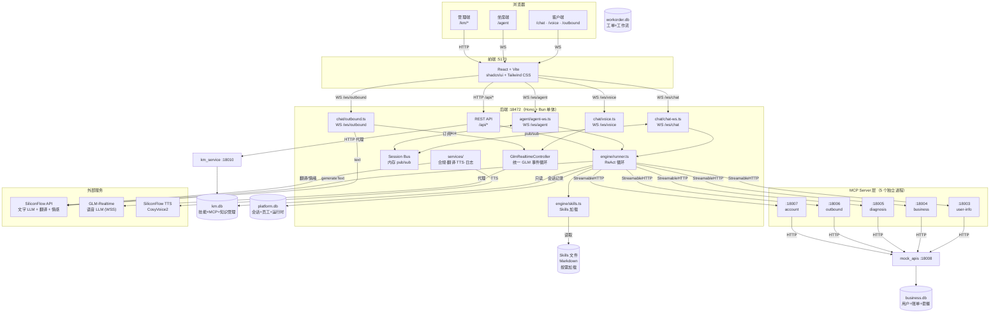
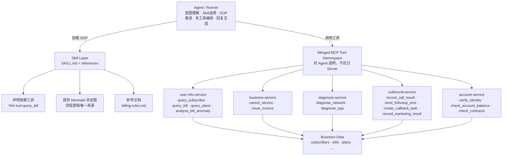

# 实现方案：智能电信客服系统（基线）

**功能分支**: `000-baseline` | **日期**: 2026-03-19 | **规格说明**: [spec.md](spec.md)

## 概要

基于 Vercel AI SDK 的智能电信客服全栈系统，采用 Skills（知识层）+ MCP Tools（执行层）双层架构，支持文字/语音/坐席工作台三种交互模式。

---

## 1. 架构风格

**前后端分离单体 + 事件驱动混合 + MCP 微服务化工具层**

| 维度 | 定性 | 说明 |
|------|------|------|
| 整体架构 | 前后端分离单体 | 一个 Hono 后端进程承载所有业务逻辑，前端独立 Vite 进程 |
| 工具层 | MCP 微服务化 | 5 个独立 MCP Server 进程，按业务域隔离，StreamableHTTP stateless 通信 |
| 实时通信 | 事件驱动 | Session Bus（内存 pub/sub）解耦客户侧与坐席侧；4 条 WebSocket 持久连接 |
| AI 编排 | ReAct Agent | Vercel AI SDK generateText + 工具调用，最多 10 步循环 |
| 知识层 | 静态文件驱动 | Skills 以 Markdown 文件存储，按需懒加载，热更新无需重启 |
| 数据层 | 域隔离嵌入式数据库 | SQLite WAL 模式，4 个 DB 文件按域隔离（km/platform/business/workorder），每个 DB 最多一个进程写入 |

> **不是微服务**：后端是单进程单体，没有服务注册/发现、网关、熔断器。
> **不是 BFF**：后端直接服务前端和 MCP，没有聚合多个下游微服务的 BFF 层。
> MCP Server 虽然是独立进程，但本质上是"工具执行器"而非业务微服务，无独立状态，通过 HTTP 调用 mock_apis。

---

## 2. 架构图



> 完整功能清单详见 [feature-map.md](feature-map.md)。源码文件树及每个文件的职责详见 [codebase-map.md](codebase-map.md)。

### 2.1 Agent / Skill / MCP 分层关系



**核心设计原则：**

| 角色 | 职责 | 不负责 |
|------|------|--------|
| **Agent（编排层）** | 用户意图理解、Skill 选择、SOP 流程推进、多工具编排、何时追问/转人工、最终回复生成 | 不执行数据查询、不实现业务规则 |
| **Skill（知识层）** | 定义领域 SOP（Mermaid 状态图）、声明依赖工具（`%% tool:xxx`）、提供参考文档 | 不执行操作、不包含代码逻辑 |
| **MCP（执行层）** | 数据聚合与归一化、领域规则（欠费分层/PTP 校验等）、固定决策树、参数校验 | 不理解对话上下文、不选择下一步行动 |

**关键约束：**

- **Tool 是运行时一等公民，Server 对 Agent 透明。** Agent 调用 `query_bill`，不关心它在哪个 Server 上。Runner 从 `mcp_servers` 表读取所有启用 Server，merge 全部 tools 到一个扁平 namespace。
- **Skill 不绑定 Server。** Skill 只声明"我需要 `query_subscriber` 和 `query_bill`"，不声明"它们在 user-info-service 上"。
- **Agent 与 MCP 之间无中间编排层。** 不存在 Skill 脚本拦截或代理 MCP 调用的机制。

### 2.2 控制面 / 执行面分离

```
frontend → /api/mcp/* → backend（Control Plane）→ platform schema
                              ↓ discover / healthcheck
                        mcp_servers（Data Plane）→ business schema
```

| 面 | 职责 | 数据 |
|---|------|------|
| **Backend（控制面）** | MCP server/tool/resource 配置 CRUD、discover、mock 管理、tools overview、RBAC/审计 | platform 表（mcp_servers、skill_registry、sessions 等） |
| **MCP Servers（执行面）** | 真实工具执行、参数校验、领域规则、业务数据聚合 | business 表（subscribers、bills、plans 等） |

前端只访问 backend 的 `/api/mcp/*` 管理接口，不直接连接 MCP Server。

### 2.3 Workspace 结构

| Workspace | 包名 | 职责 | DB |
|-----------|------|------|-----|
| `backend/` | telecom-support-backend | Agent runtime（LLM 编排、对话、语音）+ 管理 API 代理 | `platform.db`（独占） |
| `km_service/` | @ai-bot/km-service | 知识与技能运营平台（见下方管辖范围） | `km.db`（独占） |
| `mock_apis/` | — | 电信业务模拟后端 | `business.db`（独占） |
| `work_order_service/` | — | 工单/工作流管理 | `workorder.db`（独占） |
| `frontend/` | — | 客服 React UI | — |
| `cdp_service/` | @ai-bot/cdp-service | 客户数据平台（16 张表，party-centric 语义层） | `cdp.db`（独占） |
| `mcp_servers/` | @ai-bot/mcp-servers | MCP 内部服务（已合并为 internal_service，端口 :18003） | — |
| `packages/shared-db/` | @ai-bot/shared-db | 共享 Drizzle schema（5 域） | — |

#### km_service 管辖范围

| 域 | 内容 | 对应资源 |
|----|------|---------|
| **知识管理** | 公司政策、QA 知识库、知识审批工作流 | kmAssets, kmDocuments, kmCandidates 等 km_* 表 |
| **技能管理** | 业务 SOP 的沉淀、版本控制、发布审批、灰度、沙盒测试 | `km_service/skills/` 目录 + skillRegistry, skillVersions, skillWorkflowSpecs 表 |
| **工具管理** | 技能/知识驱动时所需 MCP 工具的注册、绑定、发现、Mock 规则 | mcpServers, mcpTools, toolImplementations, connectors 表 |

Backend 通过 `km-client.ts`（HTTP + TTL 缓存）访问以上数据，不直接读写 km.db。

### 2.4 已知边界违反（待清理）

| 文件 | 违反 | 状态 |
|------|------|------|
| `backend/src/chat/voice.ts` | 直接读 subscribers/plans | ✅ 已改为读 `businessDb`（只读连接） |
| `backend/src/chat/chat-ws.ts` | 直接读 subscribers/plans | ✅ 已改为读 `businessDb`（只读连接） |

### 2.5 数据库域隔离架构

系统采用 4 个 SQLite 文件按业务域隔离，每个 DB 最多一个进程写入，消除多进程并发写竞争。

```
┌──────────────┐  ┌──────────────┐  ┌───────────────┐  ┌──────────────┐  ┌──────────────┐
│ MCP Servers   │  │  mock_apis   │  │ work_order    │  │  km_service  │  │   backend    │
│   :18003      │  │   :18008     │  │   :18009      │  │   :18010     │  │   :18472     │
│  (无 DB)      │  │              │  │               │  │              │  │              │
│               │  │ business.db  │  │ workorder.db  │  │   km.db      │  │ platform.db  │
│               │  │   (独占)     │  │   (独占)      │  │  (独占写入)  │  │   (独占)     │
└───────────────┘  └──────────────┘  └───────────────┘  └──────┬───────┘  └──────┬───────┘
                                                               │                 │
                                                               │◄── 只读连接 ──►│
                                                               │◄── HTTP 代理 ──►│
```

| DB 文件 | Owner 进程 | 表域 | 其他进程访问 |
|---------|-----------|------|-------------|
| **km.db** | km_service（独占写入） | platform 表（skill_registry, mcp_servers, mcp_tools 等）+ km_* 表 | backend（只读，用于技能缓存和 tool registry） |
| **platform.db** | backend（独占） | sessions, messages, staff_accounts, staff_sessions, users, outbound_tasks, skill_instances | 无 |
| **business.db** | mock_apis（独占） | subscribers, bills, plans, contracts 等 24 张电信业务表 | cdp_service seed（只读导入） |
| **workorder.db** | work_order_service（独占） | work_items, work_orders, appointments, tickets, workflows 等 16 张工单表 | backend（通过 HTTP work-order-proxy 代理） |
| **cdp.db** | cdp_service（独占） | party, identity, contact_point, account, subscription 等 16 张 CDP 表 | backend（通过 HTTP cdp-client 代理） |

**关键设计决策：**

- **写入隔离**：每个 DB 文件最多一个进程写入，彻底消除 SQLite 多进程写入竞争（`disk I/O error`）
- **只读连接**：backend 对 km.db 和 business.db 保持只读连接（`readonly: true`），WAL 模式下多进程并发读完全安全
- **HTTP 代理**：backend 的 `/api/skills/`, `/api/mcp/`, `/api/km/` 等管理路由通过 `km-proxy.ts` 代理到 km_service
- **busy_timeout**：所有 DB 连接启用 `PRAGMA busy_timeout = 5000`，即使偶发竞争也不会立即失败
- **Drizzle 配置**：每个域有独立的 `drizzle.config.ts`，`start.sh` 按序 push schema + seed
- **共享 Schema 包**：`packages/shared-db/` 按域分文件（`business.ts`, `platform.ts`, `workorder.ts`, `km.ts`, `cdp.ts`），各服务只导入所需域
- **CDP 客户语义层**：backend 不再直接读 business.db 获取客户信息，改为通过 `cdp-client.ts` 调用 CDP Service API

---

## 3. 关键调用链路

### 3.1 文字查话费（Skill + MCP 并行）

```
用户发送 "查话费"
  → WS /ws/chat → chat-ws.ts
    → runAgent(message, history, phone)
      → generateText(maxSteps=10)
        → 步骤 1（并行）:
          ├─ get_skill_instructions("bill-inquiry") → 读取 SKILL.md
          └─ query_bill(phone) → MCP :18003 → SQLite → 返回账单 JSON
        → 步骤 2: LLM 综合知识+数据 → 生成回复 + 提取 bill_card
      → onStepFinish: 记录日志 + 推送 skill_diagram_update
    → WS 发送: text_delta（流式）→ response（最终，含 card）
    → sessionBus.publish(phone, events) → agent-ws 转发给坐席
```

### 3.2 语音转人工（双路径触发 + 异步分析）

```
用户说 "转人工" 或情绪激烈
  → WS /ws/voice → voice.ts
    → GLM-Realtime 生成 response
    → 路径 ①: function_call transfer_to_human → triggerHandoff()
    → 路径 ②: transcript 匹配 TRANSFER_PHRASE_RE → triggerHandoff()
    → triggerHandoff():
      ├─ 回复 GLM 工具结果 → GLM 说告别语
      └─ 后台异步 analyzeHandoff(turns, toolCalls)
           → 单次 LLM 调用 → HandoffAnalysis JSON + session_summary
           → WS 推送 { type: 'transfer_to_human', context }
    → 前端展示 Handoff 卡片
```

### 3.3 坐席实时监控（Session Bus 事件驱动）

```
客户发消息
  → chat-ws.ts 处理完成
    → sessionBus.publish(phone, user_message/text_delta/response)
      → agent-ws.ts 订阅回调
        ├─ 转发事件给坐席前端
        ├─ user_message → 异步 analyzeEmotion(text) → emotion_update
        └─ transfer_data → runHandoffAnalysis() → handoff_card
```

### 3.4 技能版本发布

```
管理员在编辑器中操作
  → POST /api/skill-versions/create-from → 复制已有版本到 .versions/v{N}/
  → PUT /api/files/content → 编辑 .versions/ 中的文件（draft 跟踪）
  → POST /api/skill-versions/test → runAgent(overrideSkillsDir, useMock=true)
  → POST /api/skill-versions/publish → 复制到 biz-skills/，状态 → published
  → refreshSkillsCache() → 下次请求自动加载新版本
```

### 3.5 外呼催收

```
坐席选择催收任务 C001
  → WS /ws/outbound?task=collection&id=C001&mode=voice（默认）
    → outbound.ts: 加载任务数据 → 构建 system prompt
    → GlmRealtimeController: 连接 GLM-Realtime + session.update
    → response.create → 机器人说开场白
    → 用户语音 → GLM → 工具调用 → MCP outbound-service 处理
    → record_call_result / send_followup_sms → 记录结果

  → WS /ws/outbound?task=collection&id=C001&mode=text（E2E 测试）
    → outbound.ts: 加载任务数据 → 构建 system prompt
    → OutboundTextSession: generateText → 机器人发送开场白
    → 用户文本 → generateText + maxSteps=10 工具循环
    → 工具执行走 MCP outbound-service（与 voice 相同管道）
```

### 3.6 知识审核发布（KMS 全流程）

```
文档上传
  → POST /km/documents → 创建文档 + 版本
  → POST /km/documents/versions/:vid/parse → 解析管线（parse→chunk→generate→validate）
  → 自动生成 QA 候选 → 三门验证（证据门 + 冲突门 + 归属门）
  → 打包审核包 → 提交 → 审核 → 批准
  → 动作执行 → publish → 创建资产 + 回滚点 + 7 天回归观察期
```

---

## 4. 技术上下文

**语言/版本**: TypeScript（Bun 后端 / Node.js MCP & 前端）

| 层次 | 技术 |
|------|------|
| 前端 | React 18 + TypeScript + Vite + shadcn/ui + Tailwind CSS |
| 后端 | Hono + Bun |
| AI SDK | Vercel AI SDK（generateText + tool） |
| 文字客服 LLM | SiliconFlow 托管模型（stepfun-ai/Step-3.5-Flash） |
| 语音客服 LLM | 智谱 GLM-Realtime（glm-realtime-air） |
| MCP 协议 | @modelcontextprotocol/sdk（StreamableHTTP） |
| 数据库 | SQLite + Drizzle ORM（WAL 模式，4 个 DB 文件按域隔离，共 ~80 张表） |
| 运行时 | Bun（后端）/ Node.js + npm（MCP Server、前端） |

### 外部依赖

| 依赖 | 用途 | 协议 | 必需？ | 配置 |
|------|------|------|--------|------|
| SiliconFlow API | 文字 LLM + 情感分析 + Handoff 分析 + 翻译 | HTTPS | 是 | `SILICONFLOW_API_KEY` |
| SiliconFlow TTS | 语音合成（CosyVoice2-0.5B） | HTTPS | 仅多语言 | 同上 |
| GLM-Realtime | 语音实时对话 | WSS | 仅语音 | `ZHIPU_API_KEY` |
| SQLite | 嵌入式数据库，无需独立部署 | 文件 I/O | 是 | `SQLITE_PATH` / `PLATFORM_DB_PATH` / `BUSINESS_DB_PATH` / `WORKORDER_DB_PATH` |

**不依赖**：无 Redis、无 MQ、无对象存储、无搜索引擎、无独立数据库服务器。

---

## 5. 非功能需求

> 从原 research.md 整合而来。详细指标阈值见 [团队标准](../../presets/telecom-team/templates/standards.md)。

### 5.1 性能

| 场景 | 目标 | 主要耗时来源 |
|------|------|------------|
| 账单查询（并行） | ≤ 5s | LLM 推理 2 步 |
| 套餐咨询（并行） | ≤ 5s | LLM 推理 2 步 |
| 业务退订（串行含确认） | ≤ 8s | LLM 推理 3 步 |
| 故障诊断（串行多步） | ≤ 8s | LLM 推理 + 诊断脚本 |
| 合规关键词匹配 | < 1ms | AC 自动机 O(n) |
| LLM TTFB | ≤ 1s | Step-3.5-Flash |

- Skills 按需懒加载，不在启动时全量注入 system prompt
- 同一步骤中 Skill 加载与 MCP 查询必须并行（Constitution III）
- Agent 执行总超时 180 秒，ReAct 最大步数 10 步
- 后端使用 Bun 运行，启动速度和 I/O 吞吐优于 Node.js

### 5.2 安全

- 凭证通过 `.env` 注入，不硬编码（Constitution VII）
- MCP Server 使用 Zod schema 校验所有工具入参
- 不可逆操作（退订）执行前必须用户确认（Constitution IV）
- 三层合规拦截：L1 AC 自动机（< 1ms）→ L2 Agent 输出拦截 → L3 坐席发言监控
- RBAC 5 级角色层级，`requireRole()` 中间件保护 API（详见 [data-model.md §13](data-model.md)）
- 版本变更自动创建快照，支持一键回滚（Constitution IX）

### 5.3 可靠性

| 错误场景 | 处理方式 |
|----------|---------|
| 手机号不存在 | `query_subscriber` 返回 `{"found": false}` |
| 查询月份无账单 | `query_bill` 返回 `{"found": false}` |
| 退订未订阅业务 | `cancel_service` 返回 `{"success": false}` |
| MCP Server 连接失败 | 后端捕获异常，返回 HTTP 500 |
| LLM 超时（>180s） | AbortSignal 中断，返回 HTTP 500 |

- 会话消息持久化在 SQLite（platform.db），进程重启后历史保留
- 4 个 DB 文件按域隔离，每个 DB 最多一个进程写入，消除写入竞争
- 所有 DB 连接启用 `busy_timeout = 5000`，WAL 模式支持并发读
- 生产建议：替换为 PostgreSQL 以支持多实例横向扩展

### 5.4 可观测性

| 维度 | 当前实现 | 生产建议 |
|------|----------|---------|
| 结构化日志 | JSON → logs/ 目录 | ELK / CloudWatch |
| 请求级指标 | db_session_ms / agent_ms / total_ms | Prometheus + Grafana |
| LLM 追踪 | onStepFinish 记录每步 | LangSmith / Langfuse |
| 语音指标 | 首包时延 / 打断 / 冷场 / 时长 | 实时仪表盘 |
| 合规告警 | compliance_alert 推送坐席 | 质检系统 |
| 错误告警 | 无 | Sentry |

---

## 6. 原则检查（Constitution Check）

| # | 原则 | 状态 | 说明 |
|---|------|------|------|
| I | 知行分离与职责边界 | ✅ 通过 | Skills 与 MCP Tools 严格分层；Agent 负责意图/编排/回复，MCP 负责数据聚合/领域规则/诊断逻辑；禁止中间编排层 |
| II | 状态图驱动 | ✅ 通过 | 所有 Skill 使用 Mermaid 状态图 |
| III | 并行优先 | ✅ 通过 | system-prompt 约束并行调用 |
| IV | 安全操作确认 | ✅ 通过 | 退订等不可逆操作有确认流程 |
| V | 热更新 | ✅ 通过 | Skills 修改无需重启 |
| VI | 渠道路由 | ✅ 通过 | getSkillsByChannel() 按渠道标识过滤加载 |
| VII | 密钥零硬编码 | ✅ 通过 | 所有凭证通过 .env 注入 |
| VIII | 公共接口向后兼容 | ⚠️ 缺口 | WebSocket/REST/MCP 接口无版本策略 |
| IX | 数据变更可回滚 | ⚠️ 缺口 | 当前使用 drizzle-kit push（不可逆） |
| X | 关键路径审计留痕 | ✅ 通过 | km_audit_logs 只读表 + skill_versions 完整快照 |
| XI | 复杂度必须论证 | ✅ 通过 | 见下方复杂度追踪表 |

---

## 7. 复杂度追踪（Complexity Tracking）

| 复杂设计 | 为什么需要 | 被否决的更简单方案 |
|---------|-----------|-----------------|
| 5 个独立 MCP Server | 按业务域隔离，独立部署/扩展/故障隔离 | 单一 Server 含 15 个工具 — 耦合过高，单点故障影响全局 |
| KMS 13 张 km_ 表 | 端到端知识生命周期需要完整工作流状态 | 3 张表 — 无法支持三门验证和审核包工作流 |
| 版本完整目录快照 | 确保回滚时 SKILL.md + references + scripts 一致性 | Git-based — 业务人员不熟悉 Git，且需要 Web UI 在线编辑 |
| 双通道语音架构 | GLM-Realtime 英文输出不可靠，必须翻译替换 | 强制英文 prompt — GLM 仍高频回退中文 |
| GlmRealtimeController 提取 | voice.ts 与 outbound.ts 共享 ~60% GLM 代码，改动需双写 | 各自内联 — fork/join 等新特性需改两处，容易遗漏 |
| outbound mode=text | E2E 测试无法稳定模拟 GLM 语音流，需文本通道覆盖外呼 SOP | 仅 voice 测试 — 外呼流程无自动化回归 |
| AC 自动机合规引擎 | O(n) 多模式匹配，18+ 关键词 <1ms | 正则逐条匹配 — O(n×m) 随词库增长退化 |

---

## 8. 文档导航

| 文档 | 职责 | 何时查阅 |
|------|------|---------|
| [spec.md](spec.md) | 用户故事、功能需求、成功标准 | 需求评审、验收测试 |
| **本文件** | 架构定性、调用链路、技术决策、非功能需求 | 技术方案评审、架构决策 |
| [feature-map.md](feature-map.md) | 功能特性树（7 大模块 ~120 个叶子节点） | 功能全景、测试覆盖规划 |
| [codebase-map.md](codebase-map.md) | 源码文件树 + 职责 + 变更影响指南 + 位置索引 | 改代码前查文件、新人 onboarding |
| [quickstart.md](quickstart.md) | 部署、调试、测试、验证、FAQ | 环境搭建、日常开发 |
| [data-model.md](data-model.md) | 实体定义、Schema、关系 | 数据库变更、接口开发 |
| [contracts/apis.md](contracts/apis.md) | REST / WS / MCP 接口规范 | 接口开发、联调 |
| [contracts/components.md](contracts/components.md) | 组件实现详解（28 个组件） | 深入理解实现细节 |
| [tasks.md](tasks.md) | 212 tasks / 11 phases | 任务跟踪、进度回顾 |
| checklists/ | 5 份需求质量检查（171 项） | 需求评审、合规审查 |
