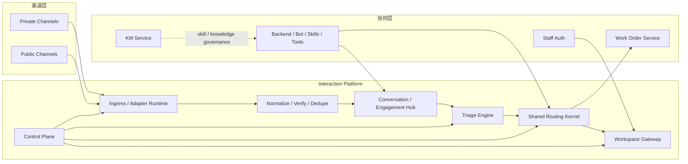

# 实现方案：ACD / Interaction Platform 架构设计

**功能分支**: `002-acd-interaction-platform` | **日期**: 2026-03-31 | **规格说明**: [spec.md](spec.md)

> 本文档是本线程所有讨论、当前仓库实际代码边界、未来 omnichannel 需求以及 plugin 治理思路的综合定稿稿。  
> 它不以“做一个排队服务”为目标，而以“重新定义项目的实时互动中枢”为目标。  
> 文档面向架构师、后端负责人、工作台负责人、产品/运营平台负责人共同使用，目标是给出一个能撑住 3 年以上演进的 Interaction Platform 方案。

---

## 目录

- [0. 执行摘要](#0-执行摘要)
- [1. 背景、现状与问题定义](#1-背景现状与问题定义)
- [2. 设计目标与非目标](#2-设计目标与非目标)
- [3. 架构设计总原则](#3-架构设计总原则)
- [4. 基于现有代码的现实边界分析](#4-基于现有代码的现实边界分析)
- [5. 最终定位：Interaction Platform，而非孤立 ACD](#5-最终定位interaction-platform而非孤立-acd)
- [6. 顶层架构总览](#6-顶层架构总览)
- [7. 双领域模型：Private Interaction Domain 与 Public Engagement Domain](#7-双领域模型private-interaction-domain-与-public-engagement-domain)
- [8. Shared Routing Kernel：统一路由内核设计](#8-shared-routing-kernel统一路由内核设计)
- [9. Interaction 的 materialization 规则](#9-interaction-的-materialization-规则)
- [10. Agent Workspace 设计](#10-agent-workspace-设计)
- [11. 插件化边界：策略可插拔，状态机不可外包](#11-插件化边界策略可插拔状态机不可外包)
- [12. 数据所有权与数据库边界](#12-数据所有权与数据库边界)
- [13. 服务边界与物理部署建议](#13-服务边界与物理部署建议)
- [14. API、事件与 WebSocket 契约总纲](#14-api事件与-websocket-契约总纲)
- [15. 私域域详细设计](#15-私域域详细设计)
- [16. 非私域域详细设计](#16-非私域域详细设计)
- [17. Routing Kernel 详细设计](#17-routing-kernel-详细设计)
- [18. Presence / Capacity / Workload / SLA 设计](#18-presence--capacity--workload--sla-设计)
- [19. Triage、Moderation 与 Public-to-Private Bridge](#19-triagemoderation-与-public-to-private-bridge)
- [20. 安全、审计、租户隔离与治理](#20-安全审计租户隔离与治理)
- [21. 可靠性、可观测性与可回放设计](#21-可靠性可观测性与可回放设计)
- [22. 迁移路径：从当前代码平滑演进](#22-迁移路径从当前代码平滑演进)
- [23. 风险、取舍与被否决方案](#23-风险取舍与被否决方案)
- [24. 长期扩展路线](#24-长期扩展路线)
- [25. 最终定稿的架构决策清单](#25-最终定稿的架构决策清单)

---

## 0. 执行摘要

### 0.1 一句话定义

本项目中的 ACD 不应被定义为一个“独立分配服务”，而应被定义为：

> **Interaction Platform**
> = **Interaction Gateway** + **Conversation / Engagement Hub** + **Shared Routing Kernel** + **Agent Workspace Gateway** + **Control Plane**

其中：

- **Interaction Gateway** 负责渠道接入、归一化、身份映射、出站分发
- **Conversation / Engagement Hub** 负责统一对象模型
- **Shared Routing Kernel** 负责 interaction 的创建、排队、分配、转接、SLA、wrap-up
- **Agent Workspace Gateway** 负责坐席实时工作台
- **Control Plane** 负责队列、插件、灰度、审计、回放、治理

### 0.2 核心观念变化

过去的系统思维是：

- backend 接客户
- sessionBus 中转消息
- agent-ws 盯手机号
- work_order_service 管后续任务

未来的系统思维应变成：

- **先分域，再分工作模型，最后才分 provider**
- **客服工作的对象不再是 `phone`，而是 `interaction`**
- **连续性对象不再是 session，而是 `conversation`**
- **公开评论/提及不是私聊线程，必须进入独立的 Public Engagement Domain**
- **插件化的是路由决策策略，不是路由状态机和数据库真值**

### 0.3 最关键的架构判断

1. 顶层必须按域划分：
   - `Private Interaction Domain`
   - `Public Engagement Domain`
2. 两个域共享：
   - `identity`
   - `routing queue`
   - `agent presence / capacity`
   - `shared interaction`
   - `offer / assignment / event`
   - `workspace skeleton`
3. 共享的 ACD 工作对象只有一套：`interaction`
4. 私域与非私域都不是“所有消息都自动等于 interaction”
5. `Public Engagement` 的核心不是 routing，而是 **triage before routing**
6. `work_order_service` 与 `staff-auth` 的边界必须保留
7. 第一阶段的物理部署不宜拆太散，最务实的是：
   - 新增一个 `interaction-platform` 服务
   - 内部模块化承载 gateway、hub、triage、acd、workspace-gateway

---

## 1. 背景、现状与问题定义

### 1.1 当前项目已经具备的能力

从代码与 baseline spec 看，当前项目已经拥有以下能力基础：

1. **多种实时入口**
   - `/api/chat`
   - `/ws/chat`
   - `/ws/voice`
   - `/ws/outbound`
   - `/ws/agent`
   这些入口集中在 [backend/src/index.ts](/Users/chenjun/Documents/obsidian/workspace/ai-bot/backend/src/index.ts)。

2. **成熟的 bot/skill/tool runtime**
   - `backend/src/engine/*`
   - `backend/src/tool-runtime/*`
   - `km_service` 负责技能和知识管理

3. **独立的工单服务**
   - `work_order_service` 已拥有 `ticket / work_order / appointment / task / workflow / intake / draft` 等能力
   - 核心实现入口见 [work_order_service/src/server.ts](/Users/chenjun/Documents/obsidian/workspace/ai-bot/work_order_service/src/server.ts)

4. **员工身份认证**
   - `staff-auth` 已能支撑坐席登录与平台角色
   - 实现见 [backend/src/services/staff-auth.ts](/Users/chenjun/Documents/obsidian/workspace/ai-bot/backend/src/services/staff-auth.ts)

5. **多库分域的工程习惯**
   - `platform.db`
   - `business.db`
   - `workorder.db`
   - `km.db`
   数据边界基础已经存在，见 [backend/src/db/index.ts](/Users/chenjun/Documents/obsidian/workspace/ai-bot/backend/src/db/index.ts)

### 1.2 当前架构的关键局限

尽管基础较多，但现状仍然明显停留在“单渠道 + 单客户跟随工作台”的架构阶段。

#### 局限 A：实时工作对象错误地依赖 `phone`

最明显的例子是 `sessionBus`：

- key 是 `phone`
- active session 也是 `phone -> sessionId`
- chat 侧与 agent 侧用同一个手机号共享事件

这意味着当前系统里“客服正在处理谁”的核心标识实际上是手机号，而不是 interaction。

相关代码见：
- [backend/src/services/session-bus.ts](/Users/chenjun/Documents/obsidian/workspace/ai-bot/backend/src/services/session-bus.ts)
- [backend/src/chat/chat-ws.ts](/Users/chenjun/Documents/obsidian/workspace/ai-bot/backend/src/chat/chat-ws.ts)
- [backend/src/agent/chat/agent-ws.ts](/Users/chenjun/Documents/obsidian/workspace/ai-bot/backend/src/agent/chat/agent-ws.ts)

这在以下场景中会立即失效：

- 一个坐席同时处理多个不同客户
- 同一客户有多个并行问题
- 同一客户跨渠道持续跟进
- Voice 独占与文本并发共存
- Public engagement 并不天然有 phone

#### 局限 B：Backend 承担了过多不属于自己的职责

当前 `backend` 同时承担：

- 客户接入
- Bot runtime
- agent ws
- session bus
- work order proxy
- km proxy
- staff auth

这在基线阶段可行，但在 omnichannel 时代会让 backend 成为过载中心。

#### 局限 C：坐席工作台本质上不是 Inbox 模型

当前坐席模型更接近“盯某个手机号的镜像视图”，而不是：

- 队列
- offer
- assigned
- focus
- unread
- SLA 风险

也就是说，它是“会话镜像台”，不是“坐席收件箱”。

#### 局限 D：工单域与实时域边界还未完全清晰

`work_order_service` 已经很丰富，但其 `queue_code`、`work_queues` 并不应成为实时 interaction 的路由真值。

工单域强调的是：

- 生命周期
- 模板
- category
- workflow
- 跟进

实时域强调的是：

- assignability
- capacity
- offer
- requeue
- response SLA

两者不能混。

#### 局限 E：目前架构无法自然承接 Public Engagement

如果把 Facebook/Instagram/YouTube/X 的评论、提及、回复强行塞进 `chat-ws` + `phone` 模型里，系统很快会在以下方面崩坏：

- 没有 `content asset`
- 没有 comment tree
- 没有 moderation action
- 没有 public-to-private conversion
- 没有 triage before routing

### 1.3 问题定义

因此，本设计要解决的不是“如何做个排队系统”，而是：

> 如何把当前偏单渠道、偏 bot 中心、偏手机号主键的实时客服体系，升级成一个可承载私域沟通与公开互动、可路由、可治理、可扩展的 Interaction Platform。

---

## 2. 设计目标与非目标

### 2.1 设计目标

本设计的核心目标有 10 个：

1. **建立清晰的新边界**
   - 让实时客服能力从 backend 中抽离成独立的 Interaction Platform 边界

2. **统一工作对象**
   - 用 `conversation` 表示连续性
   - 用 `interaction` 表示可路由工作对象

3. **支持双领域**
   - `Private Interaction Domain`
   - `Public Engagement Domain`

4. **共享路由内核**
   - 两个域都能把工作对象 materialize 成共享的 interaction，由同一 Routing Kernel 处理

5. **建立真正的 Inbox 模型**
   - 坐席围绕 inbox / offer / assigned / focus 工作，而不是围绕手机号

6. **保留并强化 bot 协同**
   - 私域域中 bot 仍是一等公民
   - public 域中 bot 主要做分类、建议和 moderation assist

7. **清晰拆分工单域**
   - `work_order_service` 只做后续与长期处理

8. **支持策略扩展**
   - Routing policy 可插件化
   - Core 状态机不可插件化

9. **确保治理能力**
   - config、plugin、rollout、audit、replay、metrics、trace 都有位置

10. **支持未来渠道增长**
   - 加 provider 时主要新增 adapter / triage rule / policy，不重写内核

### 2.2 非目标

本设计明确不把以下内容作为第一阶段目标：

1. 不在第一阶段重写所有现有 bot/skill/tool runtime
2. 不在第一阶段就接入全部社媒平台
3. 不在第一阶段就拆成过多物理微服务
4. 不在第一阶段就提供完全不受信插件运行环境
5. 不在第一阶段就统一工单域与实时域数据库

---

## 3. 架构设计总原则

### 原则 1：先按域分，再按工作模型分，最后按 provider 分

错误的建模方式是：

- WhatsApp 一套
- Email 一套
- YouTube 一套

正确的建模顺序是：

1. `domain_scope`
   - `private_interaction`
   - `public_engagement`
2. `work_model`
   - `live_chat`
   - `live_voice`
   - `async_thread`
   - `async_case`
   - `async_public_engagement`
3. `provider`
   - `whatsapp`
   - `messenger_dm`
   - `email`
   - `facebook_comment`
   - `youtube_comment`
   - 等等

### 原则 2：ACD 只认识 interaction，不认识原始渠道对象

无论是：

- 私域 `conversation`
- 邮件 thread
- 公开 comment / mention

都不应该直接让 Routing Kernel 操作。

Routing Kernel 的输入永远应该是：

- 统一的 `interaction snapshot`
- 统一的 `queue / candidate / policy`

也就是说：

- 原始对象负责“事实”
- interaction 负责“工作”

### 原则 3：并非所有消息/互动都自动等于 interaction

这是本线程讨论中最关键的结论之一。

#### 私域域中

不是所有 message 都要 materialize 成 interaction。

典型只在以下情况创建 interaction：

- 需要人工介入
- 需要进入队列
- 需要 SLA
- 需要坐席 owner
- 需要 wrap-up / follow-up

#### 公共域中

更不是每个 engagement item 都要变成 interaction。

必须先经过 triage，再决定：

- ignore
- moderate only
- suggest bot reply
- convert to private
- materialize to interaction

### 原则 4：插件化的是策略，不是状态机

系统允许插件影响：

- queue selection
- candidate filtering
- scoring
- offer strategy
- overflow strategy
- SLA escalation strategy

系统不允许插件接管：

- interaction 状态迁移
- offer / assignment 真相表
- presence / workload 真值
- timers / timeout
- audit event
- transactional commit

### 原则 5：Inbox 是一等公民，不是 UI 细节

Inbox 不是“前端拼一下列表”。

它需要平台级语义：

- assigned
- offer
- focus
- unread
- priority
- SLA risk
- presence
- queue ownership

### 原则 6：控制面必须从第一天就是一级能力

如果没有控制面，后期一定出现：

- routing policy 配置散落
- plugin 版本不可追
- queue 语义失控
- rollout 无法回滚
- 为什么分给某个坐席解释不清

---

## 4. 基于现有代码的现实边界分析

本节的目的不是复述代码，而是解释：为什么 Interaction Platform 必须按本文这样设计，而不能空想。

### 4.1 Backend 当前的真实边界

`backend` 当前是一个超级服务，承担：

- Hono HTTP API
- chat ws
- voice ws
- outbound ws
- agent ws
- bot runtime
- skill runtime
- staff auth
- proxy to km/work-order

入口见：
- [backend/src/index.ts](/Users/chenjun/Documents/obsidian/workspace/ai-bot/backend/src/index.ts)

这意味着如果不新建 Interaction Platform 边界，所有“实时中枢化”能力都会继续压在 backend 上，最后 backend 会既像 gateway、又像 bot、又像 ws hub、又像 ACD。

### 4.2 SessionBus 当前的真实含义

`sessionBus` 的意义是：

- 在 chat 侧和 agent 侧之间转发事件
- 以手机号隔离事件流
- 维持 `phone -> sessionId`

这在 demo 阶段很巧妙，但它的语义说明当前系统还停留在：

- 一个 phone 对应一个当前被处理的“对象”

而未来 Interaction Platform 必须支持：

- 一个 customer party 多 conversation
- 一个 conversation 多 message
- 一个 conversation 多次 materialize 成不同 interaction
- 一个 agent 同时拥有多个 interaction

因此 sessionBus 的理念必须被新的 `conversation + interaction + workspace event model` 取代。

### 4.3 Staff Auth 当前能复用什么

当前 `staff-auth` 已经提供：

- 登录
- cookie session
- staff roles
- team_code
- seat_code
- default_queue_code

它完全可以继续担任：

- `agent identity source`
- `rbac source`

但不应承担：

- presence
- capacity
- queue membership
- routing eligibility

这些应属于 Routing Kernel 的运行时真值。

### 4.4 Work Order Service 当前能复用什么

工单服务已经具备：

- `work_items`
- `work_orders`
- `tickets`
- `appointments`
- `tasks`
- `workflow_runs`
- `intakes`
- `drafts`
- `issue_threads`

它是一个成熟的 follow-up / long-running workflow 域。

所以正确方向不是“把 ACD 并进工单服务”，而是：

- ACD 关闭 interaction 后
- 通过 source link 调用 work_order_service
- 让 follow-up 进入其生命周期

### 4.5 Tool Runtime 与 Interaction Platform 的关系

`backend/src/tool-runtime/*` 已经在把“工具执行内核”从 runner 中抽出来。

这个思路与 Interaction Platform 极其一致：

- shared kernel
- explicit contracts
- adapters
- policy and governance

也就是说，Interaction Platform 在系统整体演进上，不是逆向新概念，而是与 Tool Runtime 一致的“内核化、治理化、解耦化”延伸。

---

## 5. 最终定位：Interaction Platform，而非孤立 ACD

### 5.1 为什么不能只是 `acd_service`

如果只做一个 `acd_service`，系统最终只能变成：

- backend 接消息
- backend 管 conversation
- acd_service 只选 agent
- agent ws 继续在 backend

这会导致：

- routing object 和 message object 分离不彻底
- inbox 与 route 之间跨服务频繁耦合
- public engagement 无处安放
- gateway 无法统一

### 5.2 Interaction Platform 的边界定义

Interaction Platform 负责：

1. 接入所有实时或异步互动入口
2. 统一 identity / party / actor / content asset / conversation / engagement 模型
3. 在合适时机 materialize interaction
4. 通过共享 Routing Kernel 路由 interaction
5. 向坐席工作台提供统一 Inbox 和实时推送
6. 将需要长期处理的问题转给 Work Order

它不负责：

1. 业务知识与 SOP 编排
2. Skill 管理
3. 工单模板与 workflow 深度编排
4. 员工身份主数据维护

### 5.3 最终定义

> **Interaction Platform 是一个跨双域工作的互动中枢。**
> 它以统一接入和统一路由为核心，以 `interaction` 为共享工作对象，以 `conversation` 或 `engagement` 作为上游连续性与事实容器，以 Inbox 作为坐席操作载体，以 Control Plane 作为治理基础。

---

## 6. 顶层架构总览

### 6.1 总图

### 6.2 分层

Interaction Platform 内部分为 5 大逻辑层：

1. **Ingress Layer**
2. **Canonical Hub**
3. **Triage Layer**
4. **Routing Kernel**
5. **Workspace Gateway**

Control Plane 贯穿所有层。

---

## 7. 双领域模型：Private Interaction Domain 与 Public Engagement Domain

### 7.1 为什么必须分域

这个线程最终得到的一个关键结论是：

> 架构差异的根本来源，不是 provider 名字，而是交互发生在私域还是非私域。

#### Private Interaction Domain

特点：

- 一对一或受限可见
- 目标是问题解决、闭环服务、后续跟进
- 典型渠道：DM、SMS、Web Chat、Voice、Email

#### Public Engagement Domain

特点：

- 公开或半公开可见
- 目标是品牌互动、审核、舆情控制、导入私域
- 典型渠道：comments、mentions、replies

### 7.2 分域后的共享与分叉

共享：

- external identity / party registry
- shared interaction
- routing queue
- offer / assignment / event
- agent profile / presence / capacity
- control plane

分叉：

- 原始对象模型
- triage 链路
- workspace view
- 路由策略
- moderation 能力

---

## 8. Shared Routing Kernel：统一路由内核设计

### 8.1 为什么要共享

如果私域和非私域各建一套 ACD：

- 队列体系会分裂
- agent presence/capacity 会分裂
- plugin system 会分裂
- inbox 会分裂
- 审计与治理会分裂

因此必须共享一套 Routing Kernel。

### 8.2 为什么共享也不能粗暴统一

共享的是：

- interaction state machine
- assignment semantics
- offer semantics
- presence/capacity model
- audit/event model

不共享的是：

- interaction 上游来源对象
- triage 逻辑
- public moderation action
- email-specific case semantics

### 8.3 共享 interaction 的关键字段

建议 interaction 具备以下抽象字段：

- `interaction_id`
- `tenant_id`
- `domain_scope`
  - `private_interaction`
  - `public_engagement`
- `work_model`
  - `live_chat`
  - `live_voice`
  - `async_thread`
  - `async_case`
  - `async_public_engagement`
- `source_object_type`
  - `conversation`
  - `email_thread`
  - `engagement_item`
  - `engagement_thread`
- `source_object_id`
- `customer_party_id?`
- `external_actor_identity_id?`
- `provider`
- `queue_code`
- `routing_mode`
- `priority`
- `state`
- `assigned_agent_id`
- `handoff_summary`
- `first_response_due_at`
- `next_response_due_at`

这意味着：

- 私域域创建 interaction 时，通常会带 `customer_party_id`
- 非私域域在尚未识别为客户前，也可以只有 `external_actor_identity_id`

---

## 9. Interaction 的 materialization 规则

### 9.1 为什么 materialization 是核心概念

如果不引入 materialization：

- 所有 message 都变 interaction，系统会被 interaction 爆炸淹没
- 所有 comment 都变 interaction，Public 域会产生大量噪音对象

因此必须明确：

> **原始事实对象进入系统后，不一定立刻成为 ACD 工作对象；只有当它满足人工工作与 SLA 管理需要时，才 materialize 成 interaction。**

### 9.2 私域域中的 materialization 规则

私域中，以下事件通常会触发 interaction materialization：

1. bot 明确触发 handoff
2. customer 主动要求人工
3. rule/skill 判断需要人工执行高风险操作
4. 坐席主动 claim 某条会话
5. 会话进入某种人工协作模式

以下情况通常不强制 materialize：

1. bot-only FAQ
2. 纯查询且无需人工
3. 系统通知型出站消息

### 9.3 公共域中的 materialization 规则

公开域中，典型规则应是：

1. 先进入 `engagement_item`
2. triage 进行分类与风险评估
3. 根据 policy 决定：
   - ignore
   - moderate only
   - suggest reply
   - convert to private
   - materialize interaction

这里 Public 域比 Private 域更强调：

- `triage_result`
- `policy outcome`
- `public-to-private bridge`

### 9.4 materialization 的系统价值

它让 Interaction Platform 具备三个好处：

1. Interaction 数量受控
2. Routing Kernel 只处理真正需要工作的对象
3. Private/Public 两个域可以共用一套 ACD，而不丢失各自事实模型

---

## 10. Agent Workspace 设计

### 10.1 Workspace 不是一个聊天窗

当前项目中的 agent 页面本质还是“跟随 phone 的消息镜像”。  
未来 Workspace 必须上升为平台能力，而不是前端实现细节。

### 10.2 Unified Inbox 的核心职责

Inbox 需要承载：

- `offers`
- `assigned interactions`
- `focused interaction`
- `unread counts`
- `priority`
- `SLA risk`
- `presence`

### 10.3 视图分叉

Workspace 统一外壳下，至少存在三种视图：

1. **Thread View**
   - DM / SMS / Web Chat
2. **Case View**
   - Email
3. **Engagement View**
   - 评论树 / mention / moderation

Voice 则更像在 Thread View 旁的 `Voice Context View`。

### 10.4 为什么不能把一切都做成消息气泡流

因为：

- Email 有 subject、to/cc、附件、quoted reply
- 评论有 content asset、comment tree、moderation
- Voice 有话务状态、摘要、情绪、实时 transcript

所以 Workspace 应共享：

- Inbox
- focus
- actions
- audit

但不共享具体视图细节。

---

## 11. 插件化边界：策略可插拔，状态机不可外包

### 11.1 本线程关于插件机制的最终结论

多轮讨论后，关于插件化边界已经可以明确：

> **ACD 要做成稳定的 Routing Kernel，而不是可任意篡改状态的脚本平台。**

### 11.2 可以插件化的部分

只允许策略插件扩展：

- `queueSelector`
- `eligibilityFilter`
- `candidateScorer`
- `offerStrategy`
- `overflowPolicy`
- `slaEscalationPolicy`（可后置）

### 11.3 不允许插件化的部分

必须固定在 core：

- interaction 状态机
- offer / assignment / event 真值
- lock / timer / requeue scheduler
- presence / workload snapshot
- inbox ownership
- outbox / audit commit

### 11.4 插件设计原则

1. manifest-first
2. slot-based
3. config schema 必须声明
4. timeout / fallback 必须声明
5. 只读上下文，不能直写主表
6. 所有执行结果进入 execution log

### 11.5 信任模型

第一阶段应明确：

> **只支持受信内部插件，不假装提供强隔离沙箱。**

后续如需扩展到更广泛插件生态，再引入真正的受限运行时。

---

## 12. 数据所有权与数据库边界

### 12.1 为什么必须新建实时域数据边界

当前项目已形成 4 个 DB 文件的域分离习惯，这很好。  
ACD / Interaction Platform 不应强塞回：

- `platform.db`
- `workorder.db`

而应拥有自己的实时域数据边界。

### 12.2 推荐的数据归属

#### `interaction-platform` 数据域

建议新增独立数据域，承载：

- conversation / customer identity / actor identity
- content asset / engagement thread / engagement item
- interaction / offer / assignment / event
- agent presence / capacity policy
- routing queue
- plugin catalog / binding / rollout / execution logs
- outbox / delivery / audit trail

#### `platform.db`

继续承载：

- sessions
- messages（迁移前的旧会话）
- staff accounts / sessions
- 其他 backend 运行时数据

#### `workorder.db`

继续承载：

- work items
- work orders
- appointments
- tasks
- workflows

### 12.3 数据库技术选型

当前项目广泛使用 SQLite，这是合理的基线选择。  
但对 Interaction Platform 而言，目标数据库应是 **PostgreSQL**，原因包括：

1. 路由事务更复杂
2. 需要更可靠的并发锁
3. 需要 outbox、replay、cursor、rollout、execution logs
4. 未来 public engagement、email、更多 provider 会扩大吞吐

结论：

- **短期迁移期**：可保留现有 SQLite 服务不动
- **新 Interaction Platform**：直接按 PostgreSQL 语义设计

这样最稳，不会被旧库限制新边界。

---

## 13. 服务边界与物理部署建议

### 13.1 逻辑边界

逻辑上建议存在 4 个主要边界：

1. `interaction-platform`
2. `backend`
3. `work_order_service`
4. `staff-auth source`（可暂时仍在 backend 内）

### 13.2 为什么第一阶段不建议拆成太多服务

如果一开始把以下逻辑都拆开部署：

- gateway
- acd
- inbox
- control-plane

那么你会很快碰到：

- unread 更新与 ws 推送一致性
- assignment 提交与 offer 过期一致性
- message 写入与 interaction 状态更新顺序
- public-to-private bridge 跨服务事务

所以第一阶段最务实的物理部署是：

> **一个新的 `interaction-platform` 服务，内部模块化分层。**

### 13.3 interaction-platform 的内部模块

建议内部模块如下：

1. `gateway`
2. `hub`
3. `triage`
4. `routing-kernel`
5. `workspace-gateway`
6. `control-plane`

这样：

- 逻辑清晰
- 事务边界可控
- 后续仍可逐步拆分

---

## 14. API、事件与 WebSocket 契约总纲

### 14.1 命令与事件必须分离

Interaction Platform 中最重要的契约规则是：

- **Command** 表示“请求执行”
- **Event** 表示“事实发生”

不能混。

### 14.2 建议的同步命令面

核心同步 API 可以概括为：

#### Gateway / Hub

- `resolve conversation`
- `store inbound message`
- `store/send outbound message`
- `get conversation`
- `list conversation messages`

#### Routing / ACD

- `create interaction`
- `route interaction`
- `accept/reject offer`
- `claim interaction`
- `transfer interaction`
- `close interaction`
- `update presence`
- `query inbox`

#### Workspace

- `focus interaction`
- `reply`
- `ack`

#### Backend 协同

- `summarize handoff`

#### Work Order 协同

- `create work-order from interaction`

### 14.3 建议的异步事件面

至少包括：

- `message.created`
- `delivery.updated`
- `conversation.resolved_or_created`
- `interaction.created`
- `interaction.queued`
- `offer.created`
- `offer.accepted`
- `interaction.assigned`
- `interaction.active`
- `interaction.transferred`
- `interaction.closed`
- `agent.presence.updated`
- `work_order.created`
- `work_order.updated`

### 14.4 Agent WS 的定位

WebSocket 不应承担完整业务命令面。  
建议：

- **业务命令走 HTTP**
- **WS 主要负责订阅**

这样：

- 命令更易做鉴权、幂等、审计
- WS 更专注于 snapshot 与 push

---

## 15. 私域域详细设计

### 15.1 私域域的目标

私域域解决的是：

> 客户与企业在受限可见场景下如何持续沟通、何时引入人工、如何完成服务闭环、如何在必要时进入 follow-up。

### 15.2 私域域包含的 provider

可以归入私域域的主要 provider 包括：

- WhatsApp
- Messenger DM
- Telegram
- X DM
- SMS
- Web Chat
- Voice
- Email

注意：

- Email 虽然不是典型“聊天”，但本质上仍是受限可见的一对一/有限收件人沟通，因此应归入 private domain。

### 15.3 私域域对象模型

私域域的关键对象为：

1. `customer_party`
2. `customer_identity`
3. `conversation`
4. `private_message`
5. `email_message`
6. `attachment / media`
7. `interaction`
8. `work_order_link`

### 15.4 为什么 Conversation 是私域域的一等对象

私域中，conversation 承载的是：

- 连续性
- 上下文
- sticky owner 倾向
- 历史摘要

客户完全可能：

- 先 Web Chat
- 再 Email
- 再 Voice

这三个入口不应被理解为三个完全无关的 case。

### 15.5 为什么 Email 是私域域的“子模型”，不是单独域

Email 与 DM/SMS 的共同点：

- 受限可见
- 问题导向
- 经常与工单 follow-up 强耦合

不同点：

- subject
- reply all / forward
- to/cc/bcc
- quote chain
- attachment

因此 Email 应该是：

- 同属 private domain
- 但单独拥有 `async_case` work model 和 `Case View`

### 15.6 私域中的 bot 角色

私域域里，bot 是高度一等公民。

bot 可负责：

- 首轮欢迎与意图识别
- 信息采集
- SOP 执行
- 工具调用
- 建议回复
- handoff summary

这与 public domain 很不同。Public 域里 bot 更多扮演 classifier / suggestor，而不是强交互代理。

### 15.7 私域 interaction 的创建规则

建议 interaction 的创建不要与 message 一一对应，而采用以下规则：

1. customer 明确要求人工
2. bot 命中某个 `human-required` skill branch
3. tool result 触发高风险人工确认
4. 当前会话被坐席 claim
5. 某个 SLA policy 需要人工托管

### 15.8 私域中的 work order 耦合

私域与 follow-up 的耦合比 public 强很多。

典型场景：

- Email 线程需要后续回访
- DM 里提出复杂售后问题
- Voice 结束后需要预约回电

因此 interaction 关闭时应支持：

- `create callback`
- `create appointment`
- `create follow-up task`
- `create ticket`

但这些对象由 `work_order_service` 持有，不由 Interaction Platform 持有。

---

## 16. 非私域域详细设计

### 16.1 非私域域的目标

非私域域解决的是：

> 品牌如何在公开场域管理互动、控制风险、完成适当回复，并在需要深入处理时把问题导入私域域。

### 16.2 典型 provider

- Facebook 帖子评论
- Instagram 评论与回复
- YouTube 评论与评论线程
- X mentions / replies / public post engagement

未来可扩：

- TikTok
- LinkedIn
- Reddit
- 小红书（若合规）

### 16.3 非私域域为什么不能复用 Conversation 作为主对象

公开互动的事实链条不是：

- 客户 -> 会话 -> 消息

而更接近：

- 内容资产 -> 互动线程 -> 互动项

例如：

- 一个视频下有很多评论
- 一个帖子下有嵌套回复
- 一个 tweet 下有 mention/reply chain

因此 public domain 必须拥有：

1. `content_asset`
2. `engagement_thread`
3. `engagement_item`

### 16.4 Public 域的 actor 模型

Public 域不应默认将外部用户视作 `customer_party`。

更稳的建模是：

- `external_actor_identity`
- 必要时再映射/升级为 `customer_party`

这样可以避免：

- 评论用户被过早并入 CRM 客户主体
- 误把 troll/spam 当客户

### 16.5 为什么 public domain 需要 `triage_result`

public 场景里，最常见问题不是“分给谁”，而是：

- 要不要回
- 要不要隐藏
- 要不要删除
- 要不要升级公关
- 要不要导流私信
- 要不要建 interaction

所以 public domain 中必须引入：

- `risk tags`
- `classification`
- `moderation recommendation`
- `materialization decision`

### 16.6 engagement_item 与 interaction 的关系

建议关系是：

- `engagement_item`：平台事实
- `interaction`：工作抽象

可能出现三种关系：

1. 一个 engagement item 不生成 interaction
2. 一个 engagement item 生成一个 interaction
3. 多个 engagement item 聚合生成一个 interaction

这也是为什么 public domain 不能把 message 直接等同于 interaction。

### 16.7 public-to-private bridge

这是 omnichannel 中最有价值的一条桥：

- 公开互动识别出需要深处理
- 引导私信 / email / callback
- 建立 private conversation
- 将后续交给 private domain 处理

这条桥意味着：

- public interaction 不一定自己闭环
- 它常常只是入口或风险暴露点

---

## 17. Routing Kernel 详细设计

### 17.1 内核职责

Routing Kernel 负责：

- queue selection
- candidate filtering
- scoring
- offer / assign
- claim
- transfer
- requeue
- overflow
- wrap-up
- SLA timers
- abandoned / timeout
- assignment history

### 17.2 路由流水线

统一建议的路由流水线为：

1. 获取 interaction snapshot
2. queue selection
3. 拉候选 agent snapshot
4. eligibility filter
5. scoring
6. offer / assign strategy
7. overflow / retry / escalate
8. core commit assignment/offer
9. write events and execution logs

### 17.3 为什么 queue 选择不能绑定工单队列

工单队列关注的是：

- owner team
- lifecycle stage
- workflow routing

实时路由队列关注的是：

- skills
- language
- modality
- current capacity
- engagement specialization

因此必须：

- `routing_queue_code`
- `work_queue_code`

语义分离，可映射不可混用。

### 17.4 routing mode

建议 interaction 具备 routing mode：

- `push_offer`
- `direct_assign`
- `pull_claim`
- `sticky_reopen`

不同 work model 默认模式不同：

- `live_voice`：通常 `push_offer`
- `live_chat`：`push_offer` 或 `direct_assign`
- `async_thread`：`sticky_reopen` 或 `pull_claim`
- `async_case`：`pull_claim` 或 `direct_assign`
- `async_public_engagement`：通常先经 triage，再 `pull_claim`、`direct_assign` 或 `specialized queue`

### 17.5 Private 与 Public 的 routing 差异

Private 更强调：

- sticky owner
- language
- current workload
- skill continuity

Public 更强调：

- risk level
- moderation skill
- brand / social care specialization
- backlog heat
- public response SLA

因此 shared kernel 的算法骨架统一，但默认策略必须按域分。

---

## 18. Presence / Capacity / Workload / SLA 设计

### 18.1 不能把“人状态”和“负载状态”混成一个字段

必须拆成：

1. `presence`
   - `offline`
   - `online`
   - `away`
   - `dnd`
2. `capacity policy`
3. `workload snapshot`
4. `routing eligibility`（运行时计算结果）

### 18.2 默认容量模型

建议第一版默认：

#### live_chat

- `max_active = 3`

#### live_voice

- `max_active = 1`
- 严格独占
- 有 active voice 时不可接文本

#### async_thread

- 以 `owned thread count` 为主，例如 20/50

#### async_case

- 更接近 case queue，可按较低并发但更高处理时长建模

#### async_public_engagement

- 更像 backlog/workbasket，而不是会话独占

### 18.3 SLA 模型

不同行为模型的 SLA 不应混用。

#### Private live

- 首响秒级或分钟级

#### Private async

- 小时级

#### Public engagement

- 依据风险和热度动态调整
- 高风险 mention 可能比普通私聊更紧急

### 18.4 unread 与 SLA risk

Inbox 不只显示 unread，还应显示：

- unread count
- overdue risk
- approaching SLA
- idle time
- priority

---

## 19. Triage、Moderation 与 Public-to-Private Bridge

### 19.1 为什么 public domain 必须先 triage

在 public 场景中，如果所有 comment/mention 都先 route，再由坐席决定是否值得处理，系统会非常昂贵且低效。

更合理的顺序是：

1. classify
2. tag risk
3. moderate recommendation
4. decide whether to route
5. route only meaningful interactions

### 19.2 triage 的输出

建议 triage 输出至少包含：

- classification
  - complaint / praise / spam / abuse / support / sales / unknown
- risk level
- moderation recommendation
  - ignore / hide / delete / escalate / reply / convert-to-private
- materialize decision
- suggested queue
- suggested reply template

### 19.3 Public-to-Private Bridge 的职责

桥接模块负责：

- 创建 private conversation
- 建立 public source link
- 延续上下文摘要
- 交给 private domain 继续处理

### 19.4 为什么桥接不是简单“发一条私信”

它实际上需要同时处理：

- 身份映射
- 渠道切换
- conversation continuity
- policy compliance
- audit trace

---

## 20. 安全、审计、租户隔离与治理

### 20.1 身份与鉴权

Interaction Platform 至少存在三类调用者：

1. 渠道适配器 / 内部系统
2. agent workspace
3. backend / work-order / timer jobs

因此鉴权应区分：

- internal service token
- agent token
- webhook signature / provider token

### 20.2 staff-auth 的集成方式

当前 `staff-auth` 在 backend 内部用 cookie session。  
对新平台而言，需要在实现阶段冻结以下方案之一：

1. backend 继续作为 auth issuer，向 interaction-platform 签发可验证 token
2. 共享 session store
3. 提前抽出统一 auth service

第一阶段最务实的是：**backend 签发可验证 token**，而不是要求新平台直接读 backend 的 cookie session。

### 20.3 租户隔离

租户隔离需要贯彻：

- queue
- plugin binding
- agent profile
- routing events
- content asset
- customer/actor identity
- work-order link

tenant id 必须贯穿所有对象与事件 envelope。

### 20.4 审计要求

Interaction Platform 应记录：

- interaction created / routed / assigned / transferred / closed
- offer accepted / rejected / timeout
- plugin execution trail
- moderation action
- public-to-private conversion
- work-order handoff

### 20.5 治理要求

Control Plane 应支持：

- queue config
- capacity config
- plugin catalog
- plugin binding
- rollout / shadow
- audit trail
- replay
- policy versioning

---

## 21. 可靠性、可观测性与可回放设计

### 21.1 为什么 Interaction Platform 必须天然带 observability

因为未来最常见的问题不是“服务挂了”，而是：

- 为什么这单没分出去？
- 为什么分给了 A 没分给 B？
- 为什么这条评论没被处理？
- 为什么这条 interaction 重复创建了？
- 为什么 public item 没有导入 private？

这些都需要强解释性。

### 21.2 最小可观测清单

至少需要：

- trace id
- interaction lifecycle events
- message / delivery events
- plugin execution logs
- queue backlog metrics
- agent capacity metrics
- SLA risk metrics
- public triage metrics

### 21.3 outbox / event bus

考虑到当前项目并没有通用 MQ，本设计建议：

- 先以 `db outbox` 作为事件真值
- 服务内 publish
- 后续再接真实 event bus

这比假设“系统已经有消息总线”更贴近现状。

### 21.4 replay

系统应能回放：

- 某个 interaction 的 route decision
- 某个 plugin chain 的执行结果
- 某个 public item 的 triage decision

没有 replay，公共域和插件化会很难调试。

---

## 22. 迁移路径：从当前代码平滑演进

本项目不适合一次性大爆炸重构。  
建议分 5 阶段。

### Phase 0：抽象先行，不改外部行为

目标：

- 在设计和类型层面明确：
  - `conversation`
  - `interaction`
  - `offer`
  - `assignment`
  - `workspace inbox`

此阶段主要是统一语言，不急于把所有入口迁走。

### Phase 1：先落 Private Interaction Domain

目标：

- 新建 `interaction-platform`
- 先承接 private domain
- 把当前 Web Chat / Voice 转人工路径 materialize 为 interaction
- 坐席工作台改造成 Inbox 模型

不做：

- public domain provider 接入

### Phase 2：把 phone 主键退回为普通 identity

目标：

- 从 `phone` 驱动变成 `conversation + interaction` 驱动
- `sessionBus` 退役或只作为迁移桥

### Phase 3：接通 work-order source link

目标：

- interaction close -> follow-up object
- work order 与 interaction 双向可追溯

### Phase 4：引入 Public Engagement Domain

目标：

- content asset
- engagement item
- triage engine
- moderation actions
- public-to-private bridge

### Phase 5：插件系统、灰度与高级运营能力

目标：

- routing plugin binding
- shadow mode
- replay
- advanced analytics

---

## 23. 风险、取舍与被否决方案

### 23.1 被否决方案 A：只做一个小型 `acd_service`

否决原因：

- 不能解决 gateway 统一问题
- 不能解决 public domain
- 不能解决 inbox 根问题

### 23.2 被否决方案 B：继续围绕 `phone` 做增强

否决原因：

- 无法承载多客户并发
- 无法承载非手机号来源
- 无法承载 public engagement

### 23.3 被否决方案 C：私域与非私域各做一套 ACD

否决原因：

- queue/presence/plugin/inbox 全部重复
- 后续治理成本过高

### 23.4 被否决方案 D：让插件直接操作状态机

否决原因：

- 无法保证一致性
- fallback 难做
- 事务不可控
- 排障困难

### 23.5 当前方案的主要风险

1. Interaction Platform 是新边界，前期系统集成成本高
2. staff-auth 令牌集成方式需尽快定
3. 数据库从 SQLite 迁到 PG 的新域需要运维投入
4. Inbox 工作台改造会影响前端结构较大

### 23.6 为什么仍然值得

因为如果不在这个时间点做边界升级，未来每新增一个渠道、每扩一个客服场景，都会继续往 backend 和 sessionBus 里堆逻辑，最后重构成本只会更高。

---

## 24. 长期扩展路线

### 24.1 渠道扩展

未来新增渠道时的判断规则：

1. 先判断属于 `private` 还是 `public`
2. 再判断属于哪个 `work_model`
3. 最后补 provider adapter 与必要 triage/policy

这样新增：

- TikTok
- LinkedIn
- Reddit
- App 内私信
- WeChat 私聊

都不会要求改写核心架构。

### 24.2 组织扩展

未来可支持：

- 多租户
- 多品牌
- 多 region
- 多业务线
- 多工作台角色（agent / moderation / supervisor / qa / operations）

### 24.3 运营扩展

未来可加：

- supervisor live monitor
- WFM / staffing forecast
- QA / sampling
- coaching
- macro / reply suggestion
- public crisis playbook

### 24.4 技术扩展

未来可加：

- stronger sandbox plugin runtime
- event bus / stream processing
- advanced replay simulator
- policy testing harness
- routing model experimentation

---

## 25. 最终定稿的架构决策清单

以下决策建议直接作为本次设计冻结的结论：

### 定位与边界

1. **系统新增边界名为 `interaction-platform`，而不是简单 `acd_service`。**
2. **Interaction Platform 内部承载 gateway、hub、triage、acd、workspace-gateway、control-plane。**
3. **`backend` 继续负责 bot、skills、tools、handoff，不负责分配真值。**
4. **`work_order_service` 只负责长期处理对象，不参与实时分配。**
5. **`staff-auth` 继续作为员工身份源，不复制第二套员工主数据。**

### 领域模型

6. **顶层按域划分：`Private Interaction Domain` 与 `Public Engagement Domain`。**
7. **顶层按工作模型补充分类：`live_chat / live_voice / async_thread / async_case / async_public_engagement`。**
8. **ACD 统一共享一套 `interaction` 工作对象，不为 public/private 各自造一套不同的 ACD 真值表。**
9. **`conversation` 是连续性容器，`interaction` 是可路由工作对象。**
10. **`engagement_item` 是公共域事实对象，不等于 interaction。**

### 路由与工作台

11. **Routing Kernel 只认识 interaction snapshot，不直接操作 message/comment 原始对象。**
12. **坐席工作台以 Inbox / Offer / Assigned / Focused Interaction 为中心，不再围绕手机号。**
13. **Workspace 统一外壳下分 `Thread View`、`Case View`、`Engagement View`。**
14. **Voice 归 private domain，但作为独立 work model 处理容量与视图。**

### 插件与治理

15. **插件化的是策略点，不是状态机。**
16. **第一阶段只支持受信内部插件。**
17. **控制面从第一天就是一级能力，必须覆盖 queue、plugin、rollout、audit、replay。**

### 数据与部署

18. **Interaction Platform 采用新的实时域数据库边界，目标数据库为 PostgreSQL。**
19. **第一阶段物理部署不拆太散，以一个新服务 `interaction-platform` 为主。**
20. **现有 SQLite 多库结构继续保留，采用渐进迁移，而不是大爆炸替换。**

### 演进顺序

21. **先实现 Private Domain，再实现 Public Domain。**
22. **先把 `phone` 主键退回 identity，再把 Inbox 模型立起来。**
23. **Public Domain 的关键不是先接平台，而是先把 `triage before routing` 设计落稳。**
24. **Public-to-Private Bridge 是 omnichannel 的关键能力，必须被设计成一级路径，而不是临时技巧。**

---

## 结语

本次设计的真正目标，不是“为当前客服系统加一个排队层”，而是：

> **把项目从“以 bot 和 phone 为中心的单渠道实时系统”，升级成“以 interaction 为共享工作对象、以域为建模边界、以 workspace 为操作入口、以 control plane 为治理基础的 Interaction Platform”。**

这套设计最核心的价值不在于短期多做了多少模块，而在于它让未来的系统扩展遵循稳定的秩序：

- 增长的是 provider，不是混乱
- 增长的是 policy，不是状态漂移
- 增长的是视图，不是耦合
- 增长的是治理，不是补丁

如果这份设计被接受，后续任何一个实现阶段都不再需要重新争论“大方向是什么”，而只需要在既定边界内推进：

- 先做哪个域
- 先接哪个入口
- 先开哪些 slot
- 先落哪些契约

这就是本设计作为“架构定盘星”的目标。
