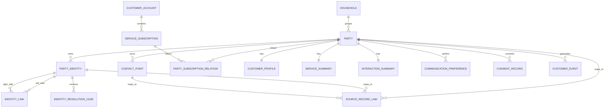

# 数据模型：CDP 16 个核心实体草案

**功能分支**: `003-cdp-service` | **日期**: 2026-03-31 | **关联设计**: [plan.md](plan.md)

> 本文档专门承接 `cdp_service` 的领域模型与逻辑表结构设计。  
> 它不直接锁死到具体 ORM，而是先站在领域和数据库逻辑层给出：
> - 16 个核心实体
> - 关系图
> - 关键字段
> - 主键 / 唯一约束 / 索引建议
> - 真相表与投影表划分
> - 与当前代码和源数据的映射建议

---

## 目录

- [1. 设计原则与边界](#1-设计原则与边界)
- [2. 16 个核心实体总览](#2-16-个核心实体总览)
- [3. 关系图](#3-关系图)
- [4. 16 个实体逐个展开](#4-16-个实体逐个展开)
- [5. 主键 / 外键 / 索引建议](#5-主键--外键--索引建议)
- [6. 主真相表 vs 摘要/投影表](#6-主真相表-vs-摘要投影表)
- [7. 与现有代码和源表的映射建议](#7-与现有代码和源表的映射建议)
- [8. 第一阶段最推荐的落地顺序](#8-第一阶段最推荐的落地顺序)

---

## 1. 设计原则与边界

### 1.1 这不是营销 CDP 的全量事务仓

这套数据模型的目标是：

- 主体统一
- 身份统一
- 联系方式统一
- 关系与归属统一
- 客户事实沉淀
- 面向 Interaction Platform 的统一上下文供给

因此以下对象不应被原样复制成 CDP 主真相表：

- 账单明细
- 支付流水
- 订单行项目
- 工单工作流步骤
- interaction 运行态对象

CDP 只应保留它们的：

- 索引
- 摘要
- 投影
- 标签
- 事实事件

### 1.2 顶层主实体是 `party`

不是 `customer_party`。

原因：

- 未来需要容纳 customer
- anonymous visitor
- external actor（公开评论用户）
- household
- business

因此主实体统一命名为：

- `party`

通过 `party_type` 区分语义。

### 1.3 `phone / email / social id` 都不是客户主键

它们最多是：

- `party_identity`
- `contact_point`

系统主关联应逐步切换到：

- `party_id`
- `customer_account_id`
- `service_subscription_id`

### 1.4 Profile / Summary 必须是消费视图

`customer_profile`、`service_summary`、`interaction_summary` 都是：

- 派生视图
- 消费视图
- 可重建视图

而不是主真相表。

---

## 2. 16 个核心实体总览

### A. 主体与身份层

1. `party`
2. `party_identity`
3. `contact_point`
4. `identity_link`
5. `source_record_link`
6. `identity_resolution_case`

### B. 关系与归属层

7. `household`
8. `customer_account`
9. `service_subscription`
10. `party_subscription_relation`

### C. 画像与摘要层

11. `customer_profile`
12. `service_summary`
13. `interaction_summary`

### D. 偏好与同意层

14. `communication_preference`
15. `consent_record`

### E. 事实事件层

16. `customer_event`

> 说明：`party_account_relation`、`party_relationship`、`feature_score`、`segment_definition`、`profile_snapshot` 都是很重要的下一批对象，但为了控制 V1 范围，本方案暂不把它们纳入 16 个核心实体中。

---

## 3. 关系图

这张图表达的是：

- `party` 是主根
- `party_identity / contact_point` 构成 identity 与 contact 语义层
- `customer_account / service_subscription / party_subscription_relation` 构成归属层
- `profile / summary` 构成消费视图层
- `customer_event` 构成事实骨架层

---

## 4. 16 个实体逐个展开

下面每个实体都按以下维度展开：

- 业务含义
- 关键字段
- 建议约束
- 与其他实体关系
- 设计注意点

---

### 4.1 `party`

#### 业务含义

统一客户主体根，可表示：

- customer
- anonymous
- business
- household
- external_actor

#### 关键字段

| 字段 | 类型建议 | 说明 |
|---|---|---|
| `party_id` | uuid | 主键 |
| `tenant_id` | varchar(64) | 租户 |
| `party_type` | varchar(32) | customer / anonymous / business / household / external_actor |
| `display_name` | varchar(256) | 展示名 |
| `canonical_name` | varchar(256) | 标准化名称 |
| `status` | varchar(32) | active / inactive / merged / deleted |
| `primary_household_id` | uuid nullable | 主 household |
| `primary_account_id` | uuid nullable | 主账户 |
| `primary_subscription_id` | uuid nullable | 主订阅 |
| `merged_into_party_id` | uuid nullable | 合并目标 |
| `created_at` | timestamptz | 创建时间 |
| `updated_at` | timestamptz | 更新时间 |

#### 约束建议

- PK: `party_id`
- Index: `(tenant_id, party_type, status)`

#### 注意点

- `party` 不应堆砌大量业务字段
- 它是语义主体，不是画像表

---

### 4.2 `party_identity`

#### 业务含义

记录外部标识与 party 的归属关系。

identity 示例：

- phone
- email
- crm_contact_id
- subscriber_id
- wa_id
- psid
- telegram_id
- x_user_id
- device_id

#### 关键字段

| 字段 | 类型建议 | 说明 |
|---|---|---|
| `party_identity_id` | uuid | 主键 |
| `tenant_id` | varchar(64) | 租户 |
| `party_id` | uuid | 所属主体 |
| `identity_type` | varchar(64) | phone / email / subscriber_id / wa_id ... |
| `identity_value` | varchar(512) | 原始值 |
| `identity_value_norm` | varchar(512) | 规范化值 |
| `source_system` | varchar(64) | 来源系统 |
| `verified_flag` | boolean | 是否已验证 |
| `primary_flag` | boolean | 是否主 identity |
| `status` | varchar(32) | active / inactive / revoked |
| `confidence_score` | numeric(5,2) nullable | 置信度 |
| `valid_from` | timestamptz nullable | 生效时间 |
| `valid_to` | timestamptz nullable | 失效时间 |
| `created_at` | timestamptz | 创建时间 |
| `updated_at` | timestamptz | 更新时间 |

#### 约束建议

- PK: `party_identity_id`
- Unique: `(tenant_id, identity_type, identity_value_norm, source_system)`
- Index: `(tenant_id, party_id)`
- Index: `(tenant_id, identity_type, identity_value_norm)`

#### 注意点

- `identity_value_norm` 必须规范化
- `phone` 和 `email` 在这里是身份，不等于客户主键

---

### 4.3 `contact_point`

#### 业务含义

表达客户的可联系地址。

典型 contact point：

- phone
- email
- whatsapp
- messenger
- telegram
- x_dm
- push_token

#### 关键字段

| 字段 | 类型建议 | 说明 |
|---|---|---|
| `contact_point_id` | uuid | 主键 |
| `tenant_id` | varchar(64) | 租户 |
| `party_id` | uuid | 所属主体 |
| `contact_type` | varchar(64) | phone / email / whatsapp / messenger ... |
| `contact_value` | varchar(512) | 联系地址 |
| `contact_value_norm` | varchar(512) | 规范化值 |
| `label` | varchar(64) | home / work / personal / billing |
| `preferred_flag` | boolean | 是否首选 |
| `reachable_flag` | boolean | 粗粒度可达性 |
| `verified_flag` | boolean | 是否已验证 |
| `status` | varchar(32) | active / inactive / blocked |
| `valid_from` | timestamptz nullable | 生效时间 |
| `valid_to` | timestamptz nullable | 失效时间 |
| `created_at` | timestamptz | 创建时间 |
| `updated_at` | timestamptz | 更新时间 |

#### 约束建议

- PK: `contact_point_id`
- Unique: `(tenant_id, contact_type, contact_value_norm, party_id)`
- Index: `(tenant_id, party_id, preferred_flag)`

#### 注意点

- 不要把 consent/preference 直接塞到 contact_point
- `reachable_flag` 只是粗状态，不等于最终可联系判断

---

### 4.4 `identity_link`

#### 业务含义

解释两个 identity 为什么被认为相关。

#### 关键字段

| 字段 | 类型建议 | 说明 |
|---|---|---|
| `identity_link_id` | uuid | 主键 |
| `tenant_id` | varchar(64) | 租户 |
| `left_party_identity_id` | uuid | 左侧 identity |
| `right_party_identity_id` | uuid | 右侧 identity |
| `link_type` | varchar(32) | match / alias / migrated / merged |
| `match_method` | varchar(64) | exact_phone / exact_email / manual_review ... |
| `match_score` | numeric(5,2) | 匹配分 |
| `link_status` | varchar(32) | proposed / confirmed / rejected / expired |
| `evidence_json` | jsonb | 证据链 |
| `approved_by` | varchar(64) nullable | 审批人 |
| `approved_at` | timestamptz nullable | 审批时间 |
| `created_at` | timestamptz | 创建时间 |

#### 注意点

- 这张表是 explainability 的核心
- 不要只靠 `party_identity.party_id` 隐式表达身份关系

---

### 4.5 `source_record_link`

#### 业务含义

记录 CDP 实体与源系统记录的映射。

#### 关键字段

| 字段 | 类型建议 | 说明 |
|---|---|---|
| `source_record_link_id` | uuid | 主键 |
| `tenant_id` | varchar(64) | 租户 |
| `source_system` | varchar(64) | crm / billing / app / order / workorder / interaction |
| `source_entity_type` | varchar(64) | contact / subscriber / account / order / case ... |
| `source_entity_id` | varchar(128) | 源记录 id |
| `target_entity_type` | varchar(64) | party / party_identity / contact_point / service_subscription |
| `target_entity_id` | uuid | 目标实体 id |
| `link_type` | varchar(32) | asserted / mirrored / projected / imported |
| `active_flag` | boolean | 是否有效 |
| `created_at` | timestamptz | 创建时间 |
| `updated_at` | timestamptz | 更新时间 |

#### 约束建议

- Unique: `(tenant_id, source_system, source_entity_type, source_entity_id, target_entity_type)`

#### 注意点

- 它是 lineage、修数、回放和追溯的生命线

---

### 4.6 `identity_resolution_case`

#### 业务含义

人工审核 identity merge/split/relink 的工作对象。

#### 关键字段

| 字段 | 类型建议 | 说明 |
|---|---|---|
| `resolution_case_id` | uuid | 主键 |
| `tenant_id` | varchar(64) | 租户 |
| `left_entity_type` | varchar(32) | party_identity / party |
| `left_entity_id` | uuid | 左对象 |
| `right_entity_type` | varchar(32) | party_identity / party |
| `right_entity_id` | uuid | 右对象 |
| `suggested_action` | varchar(32) | merge / split / relink / reject |
| `match_score` | numeric(5,2) | 建议分 |
| `status` | varchar(32) | open / approved / rejected / executed / cancelled |
| `review_reason` | text | 审核意见 |
| `evidence_json` | jsonb | 证据 |
| `reviewed_by` | varchar(64) nullable | 审核人 |
| `reviewed_at` | timestamptz nullable | 审核时间 |
| `created_at` | timestamptz | 创建时间 |

#### 注意点

- 企业级 identity graph 一定要有人工闭环

---

### 4.7 `household`

#### 业务含义

家庭或共享关系容器。

#### 关键字段

| 字段 | 类型建议 | 说明 |
|---|---|---|
| `household_id` | uuid | 主键 |
| `tenant_id` | varchar(64) | 租户 |
| `household_name` | varchar(256) | 家庭名称 |
| `status` | varchar(32) | active / inactive |
| `primary_party_id` | uuid nullable | 主联系人 |
| `address_json` | jsonb nullable | 地址摘要 |
| `created_at` | timestamptz | 创建时间 |
| `updated_at` | timestamptz | 更新时间 |

#### 注意点

- V1 可以保持轻量
- 未来也可与 `party_type=household` 的主体模型协作

---

### 4.8 `customer_account`

#### 业务含义

账户/账务/主账户镜像摘要。

#### 关键字段

| 字段 | 类型建议 | 说明 |
|---|---|---|
| `customer_account_id` | uuid | 主键 |
| `tenant_id` | varchar(64) | 租户 |
| `account_no` | varchar(128) | 账户号 |
| `account_type` | varchar(32) | personal / family / business |
| `account_status` | varchar(32) | active / suspended / closed / delinquent |
| `billing_status` | varchar(32) | normal / overdue / disputed |
| `currency_code` | varchar(8) | 币种 |
| `risk_level` | varchar(32) nullable | 风险等级 |
| `source_system` | varchar(64) | 来源系统 |
| `snapshot_json` | jsonb | 摘要快照 |
| `updated_at` | timestamptz | 更新时间 |

#### 约束建议

- Unique: `(tenant_id, account_no, source_system)`

#### 注意点

- 这是 canonical mirror，不等于账务系统全部真值

---

### 4.9 `service_subscription`

#### 业务含义

客户持有的服务订阅、号码、套餐、产品线摘要。

#### 关键字段

| 字段 | 类型建议 | 说明 |
|---|---|---|
| `service_subscription_id` | uuid | 主键 |
| `tenant_id` | varchar(64) | 租户 |
| `customer_account_id` | uuid | 所属 account |
| `subscription_no` | varchar(128) | 订阅号 |
| `subscription_type` | varchar(32) | mobile / broadband / tv / app / wallet |
| `service_identifier` | varchar(128) nullable | 例如手机号、线路 id |
| `plan_code` | varchar(64) nullable | 套餐编码 |
| `service_status` | varchar(32) | active / suspended / terminated / pending |
| `start_at` | timestamptz nullable | 开始时间 |
| `end_at` | timestamptz nullable | 结束时间 |
| `source_system` | varchar(64) | 来源系统 |
| `snapshot_json` | jsonb | 订阅摘要 |
| `updated_at` | timestamptz | 更新时间 |

#### 约束建议

- Unique: `(tenant_id, subscription_no, source_system)`
- Index: `(tenant_id, service_identifier)`

#### 注意点

- `service_identifier` 例如 phone，是订阅标识，不是客户主键

---

### 4.10 `party_subscription_relation`

#### 业务含义

表达 party 与 subscription 的关系。

#### 关键字段

| 字段 | 类型建议 | 说明 |
|---|---|---|
| `party_subscription_relation_id` | uuid | 主键 |
| `tenant_id` | varchar(64) | 租户 |
| `party_id` | uuid | 主体 |
| `service_subscription_id` | uuid | 订阅 |
| `relation_type` | varchar(32) | owner / payer / user / authorized_contact / beneficiary |
| `primary_flag` | boolean | 是否主要关系 |
| `effective_from` | timestamptz nullable | 生效时间 |
| `effective_to` | timestamptz nullable | 失效时间 |
| `status` | varchar(32) | active / inactive |
| `created_at` | timestamptz | 创建时间 |

#### 约束建议

- Unique: `(tenant_id, party_id, service_subscription_id, relation_type, effective_from)`
- Index: `(tenant_id, party_id, status)`
- Index: `(tenant_id, service_subscription_id, status)`

#### 注意点

- 这是从 `phone = customer` 升级到 `party + subscription` 的关键桥梁

---

### 4.11 `customer_profile`

#### 业务含义

统一客户画像消费视图，供 Agent / Bot / Interaction Platform 查询。

#### 关键字段

| 字段 | 类型建议 | 说明 |
|---|---|---|
| `customer_profile_id` | uuid | 主键 |
| `tenant_id` | varchar(64) | 租户 |
| `party_id` | uuid | 对应 party |
| `profile_version` | bigint | 版本 |
| `profile_status` | varchar(32) | active / stale / rebuilding |
| `basic_profile_json` | jsonb | 基础信息 |
| `contact_profile_json` | jsonb | 联系摘要 |
| `preference_profile_json` | jsonb | 偏好摘要 |
| `risk_profile_json` | jsonb | 风险摘要 |
| `value_profile_json` | jsonb | 价值摘要 |
| `service_profile_json` | jsonb | 服务摘要引用或内嵌 |
| `computed_at` | timestamptz | 计算时间 |
| `updated_at` | timestamptz | 更新时间 |

#### 约束建议

- Unique: `(tenant_id, party_id)`

#### 注意点

- 这是消费视图，不是主真相
- 不建议一次性扁平化成大宽表

---

### 4.12 `service_summary`

#### 业务含义

面向客服/机器人/路由的服务摘要。

#### 关键字段

| 字段 | 类型建议 | 说明 |
|---|---|---|
| `service_summary_id` | uuid | 主键 |
| `tenant_id` | varchar(64) | 租户 |
| `party_id` | uuid | 对应主体 |
| `primary_account_id` | uuid nullable | 主账户 |
| `active_subscription_count` | int | 有效订阅数 |
| `primary_subscription_id` | uuid nullable | 主订阅 |
| `service_status` | varchar(32) | normal / partially_suspended / suspended |
| `billing_status` | varchar(32) | normal / overdue / disputed |
| `delinquent_flag` | boolean | 是否欠费 |
| `contract_summary_json` | jsonb | 合约摘要 |
| `device_summary_json` | jsonb | 设备摘要 |
| `balance_summary_json` | jsonb | 账单/余额摘要 |
| `updated_at` | timestamptz | 更新时间 |

#### 约束建议

- Unique: `(tenant_id, party_id)`

#### 注意点

- 它是服务上下文，不等于 billing/account 交易真值

---

### 4.13 `interaction_summary`

#### 业务含义

专门面向 Interaction Platform 的客户交互摘要。

#### 关键字段

| 字段 | 类型建议 | 说明 |
|---|---|---|
| `interaction_summary_id` | uuid | 主键 |
| `tenant_id` | varchar(64) | 租户 |
| `party_id` | uuid | 对应主体 |
| `last_contact_at` | timestamptz nullable | 最近联系时间 |
| `last_channel` | varchar(32) nullable | 最近渠道 |
| `contact_count_7d` | int | 近 7 天联系次数 |
| `contact_count_30d` | int | 近 30 天联系次数 |
| `open_work_order_count` | int | 未闭环工单数 |
| `open_interaction_count` | int | 活跃 interaction 数 |
| `last_sentiment` | varchar(32) nullable | 最近情绪 |
| `last_escalation_at` | timestamptz nullable | 最近升级时间 |
| `priority_hint` | int nullable | 路由优先级建议 |
| `preferred_channel` | varchar(32) nullable | 偏好渠道 |
| `summary_json` | jsonb | 详细摘要 |
| `updated_at` | timestamptz | 更新时间 |

#### 约束建议

- Unique: `(tenant_id, party_id)`

#### 注意点

- 它会被 ACD、Bot、Inbox 频繁消费

---

### 4.14 `communication_preference`

#### 业务含义

客户沟通偏好。

#### 关键字段

| 字段 | 类型建议 | 说明 |
|---|---|---|
| `communication_preference_id` | uuid | 主键 |
| `tenant_id` | varchar(64) | 租户 |
| `party_id` | uuid | 对应主体 |
| `preference_type` | varchar(64) | channel_preference / language / contact_time / contact_frequency |
| `channel_type` | varchar(32) nullable | sms / email / phone / whatsapp / messenger |
| `preference_value` | varchar(256) | 偏好值 |
| `priority_order` | int nullable | 顺序 |
| `source_system` | varchar(64) | 来源 |
| `effective_from` | timestamptz nullable | 生效时间 |
| `effective_to` | timestamptz nullable | 失效时间 |
| `created_at` | timestamptz | 创建时间 |
| `updated_at` | timestamptz | 更新时间 |

#### 注意点

- preference 只表达客户意愿，不直接表达合规能否联系

---

### 4.15 `consent_record`

#### 业务含义

客户同意/授权记录。

#### 关键字段

| 字段 | 类型建议 | 说明 |
|---|---|---|
| `consent_record_id` | uuid | 主键 |
| `tenant_id` | varchar(64) | 租户 |
| `party_id` | uuid | 对应主体 |
| `contact_point_id` | uuid nullable | 作用于某个 contact point |
| `channel_type` | varchar(32) | sms / email / phone / whatsapp / messenger / analytics |
| `purpose_type` | varchar(32) | service / marketing / notification / analytics |
| `consent_status` | varchar(32) | granted / revoked / expired / pending |
| `jurisdiction` | varchar(32) nullable | 合规辖区 |
| `captured_at` | timestamptz | 获取时间 |
| `effective_from` | timestamptz nullable | 生效时间 |
| `expires_at` | timestamptz nullable | 失效时间 |
| `evidence_ref` | varchar(512) nullable | 证据引用 |
| `source_system` | varchar(64) | 来源系统 |
| `updated_at` | timestamptz | 更新时间 |

#### 约束建议

- Index: `(tenant_id, party_id, channel_type, purpose_type, consent_status)`
- Index: `(tenant_id, contact_point_id)`

#### 注意点

- 这是联系能力、合规与 outbound 的核心支撑

---

### 4.16 `customer_event`

#### 业务含义

客户事实事件总线落地表。

事件示例：

- identity_verified
- login
- otp_success
- subscription_created
- bill_overdue
- payment_failed
- interaction_closed
- work_order_created
- complaint_tagged
- public_engagement_negative

#### 关键字段

| 字段 | 类型建议 | 说明 |
|---|---|---|
| `customer_event_id` | uuid | 主键 |
| `tenant_id` | varchar(64) | 租户 |
| `party_id` | uuid nullable | 已解析主体则填 |
| `event_type` | varchar(64) | 事件类型 |
| `event_category` | varchar(32) | identity / service / billing / interaction / work_order / engagement |
| `event_time` | timestamptz | 事件时间 |
| `source_system` | varchar(64) | 来源 |
| `source_event_id` | varchar(128) nullable | 上游事件 id |
| `channel_type` | varchar(32) nullable | 渠道 |
| `subscription_id` | uuid nullable | 关联订阅 |
| `account_id` | uuid nullable | 关联账户 |
| `severity` | varchar(16) nullable | low / medium / high |
| `event_payload_json` | jsonb | 事件载荷 |
| `identity_refs_json` | jsonb | 原始 identity 引用 |
| `created_at` | timestamptz | 入库时间 |

#### 约束建议

- PK: `customer_event_id`
- Index: `(tenant_id, party_id, event_time desc)`
- Index: `(tenant_id, event_type, event_time desc)`
- Index / optional unique: `(tenant_id, source_system, source_event_id)`

#### 注意点

- 这是 append-only 客户事实骨架
- `interaction_summary` 和未来的 traits/feature 很大程度依赖它

---

## 5. 主键 / 外键 / 索引建议

### 5.1 主键策略

建议所有核心实体统一使用：

- `uuid`

原因：

- 跨服务引用更稳
- 合并/拆分/回流/重放更方便
- 避免来源系统 id 冲突

### 5.2 必须有的唯一约束

#### `party_identity`

`(tenant_id, identity_type, identity_value_norm, source_system)`

#### `customer_account`

`(tenant_id, account_no, source_system)`

#### `service_subscription`

`(tenant_id, subscription_no, source_system)`

#### `customer_profile`

`(tenant_id, party_id)`

#### `service_summary`

`(tenant_id, party_id)`

#### `interaction_summary`

`(tenant_id, party_id)`

### 5.3 建议重点索引

#### 按主体查询

- `party(tenant_id, party_type, status)`
- `party_identity(tenant_id, party_id)`
- `contact_point(tenant_id, party_id)`

#### 按 identity resolve 查询

- `party_identity(tenant_id, identity_type, identity_value_norm)`
- `contact_point(tenant_id, contact_type, contact_value_norm)`

#### 按归属关系查询

- `party_subscription_relation(tenant_id, party_id, status)`
- `party_subscription_relation(tenant_id, service_subscription_id, status)`

#### 按时间线查询

- `customer_event(tenant_id, party_id, event_time desc)`

#### 按 consent 查询

- `consent_record(tenant_id, party_id, channel_type, purpose_type, consent_status)`

---

## 6. 主真相表 vs 摘要/投影表

### 6.1 主真相表

这些对象由 CDP 自身承担主要生命周期与语义真值：

- `party`
- `party_identity`
- `contact_point`
- `identity_link`
- `source_record_link`
- `identity_resolution_case`
- `communication_preference`
- `consent_record`
- `customer_event`

### 6.2 canonical mirror / snapshot

这些对象在 CDP 中是规范化镜像，但源事实可能仍来自上游系统：

- `household`
- `customer_account`
- `service_subscription`
- `party_subscription_relation`

### 6.3 摘要 / 投影 / 消费视图

这些对象应被视为可重建的派生视图：

- `customer_profile`
- `service_summary`
- `interaction_summary`

这些表强烈建议保留：

- 版本号
- 计算时间
- 更新时间

---

## 7. 与现有代码和源表的映射建议

### 7.1 `business.ts` 的主要映射

[`packages/shared-db/src/schema/business.ts`](../../../packages/shared-db/src/schema/business.ts) 可作为第一批重要来源：

| 现有来源表 | 建议映射到 |
|---|---|
| `subscribers` | `service_subscription` 上游来源 |
| `customer_households` | `household` 上游来源 |
| `customer_preferences` | `communication_preference` |
| `contracts` | 进入 `service_summary.contract_summary_json` 或 future contract mirror |
| `device_contexts` | 进入 `customer_profile` / `service_summary` 摘要 |
| `identity_otp_requests` | `customer_event(identity category)` |
| `identity_login_events` | `customer_event(identity category)` |

### 7.2 `backend` 的当前 customer context 拼接

[`backend/src/chat/chat-ws.ts`](../../../backend/src/chat/chat-ws.ts) 和 [`backend/src/chat/voice.ts`](../../../backend/src/chat/voice.ts) 当前直接从业务表拿订阅信息。

未来建议迁移为：

- `backend` 调 CDP context API
- CDP 负责从统一模型返回客户上下文

### 7.3 `work_order_service` 的客户字段

[`packages/shared-db/src/schema/workorder.ts`](../../../packages/shared-db/src/schema/workorder.ts) 中的：

- `customer_phone`
- `customer_name`
- `customer_id`

建议未来逐步退化为：

- 输入 identity
- 冗余显示字段

主关联应逐步转向：

- `party_id`
- `service_subscription_id`

---

## 8. 第一阶段最推荐的落地顺序

### Phase 1：先完成“去手机号主键化”

优先落地 6 张：

1. `party`
2. `party_identity`
3. `contact_point`
4. `customer_account`
5. `service_subscription`
6. `party_subscription_relation`

目标：

- 建立 `party + subscription` 双核心模型
- 让系统脱离 `phone = customer`

### Phase 2：把 identity graph 做到可治理

继续落地 3 张：

7. `identity_link`
8. `source_record_link`
9. `identity_resolution_case`

目标：

- 支撑自动匹配 + 人工审核 + 可解释合并

### Phase 3：补齐联系治理

继续落地 2 张：

10. `communication_preference`
11. `consent_record`

目标：

- 支撑 Email / SMS / DM / Outbound / Public-to-private 的联系能力判断

### Phase 4：形成统一消费视图

继续落地 3 张：

12. `customer_profile`
13. `service_summary`
14. `interaction_summary`

目标：

- 给 Interaction Platform / Bot / Workspace / Work Order 提供统一上下文

### Phase 5：补齐家庭与客户事实骨架

最后落地 2 张：

15. `household`
16. `customer_event`

目标：

- household 场景建模
- timeline / traits / future features 的统一事实源

> 说明：`customer_event` 从理论上也可以提前，但从工程节奏看，很多团队会先把主实体定住，再引入大规模事实回流，这样更稳。

---

## 结语

这 16 个核心实体的模型，可以作为 `cdp_service` V1 领域设计的正式底稿。

如果把它压缩成一句话，它表达的是：

> **CDP 先把主体、身份、联系点、服务归属、偏好同意、客户事实统一起来，再向下游提供 profile / service summary / interaction summary 这样的统一消费视图。**

也就是：

- **真相层**：party / identity / contact / subscription / consent / event
- **消费层**：profile / service_summary / interaction_summary

这套分层是稳的，也足够支持后续与 Interaction Platform 的深度联动。
