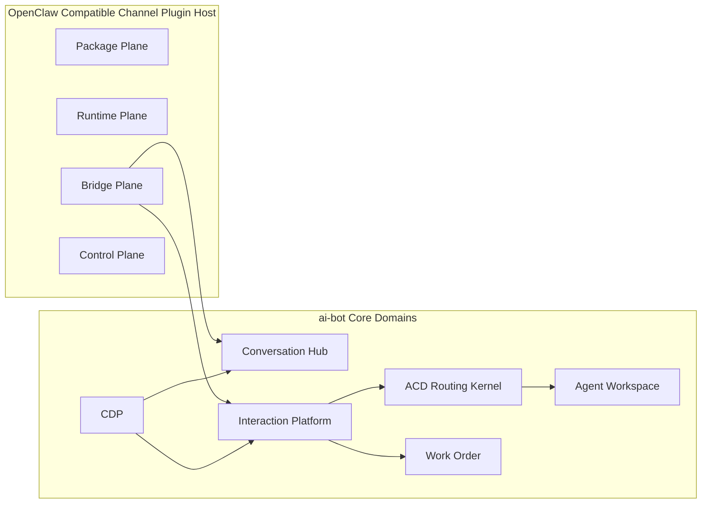
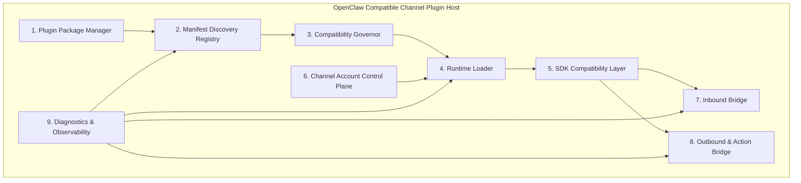
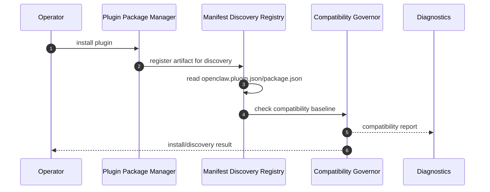
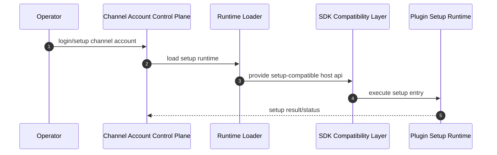
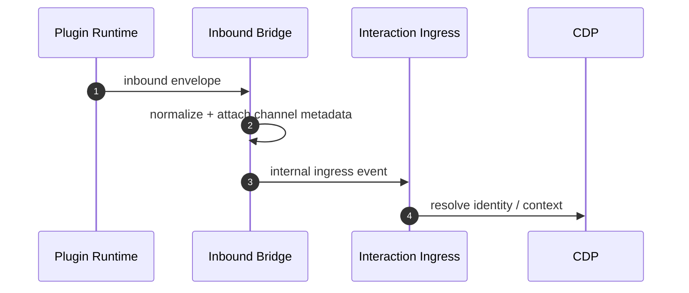
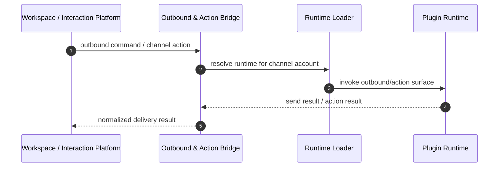

# 模块 Ownership 与内部子模块拆分：OpenClaw Compatible Channel Plugin Host

**功能分支**: `004-openclaw-compatible-channel-plugin-host`  
**日期**: 2026-04-01  
**关联文档**:
- [spec.md](spec.md)
- [plan.md](plan.md)
- [compatibility-matrix.md](compatibility-matrix.md)

> 本文档的目标不是重复宿主总体架构，而是把宿主进一步细化成可落地的内部子模块，并明确每个模块的 ownership 边界。  
> 它回答的问题是：
>
> 1. 宿主内部应该拆成哪些逻辑模块  
> 2. 每个模块具体负责什么、绝对不负责什么  
> 3. 哪些状态由宿主拥有，哪些状态必须交给 `CDP / Interaction Platform / ACD / Workspace`  
> 4. 后续如果开始研发，应怎样按模块拆分实现和治理

---

## 0. 执行摘要

如果把宿主方案进一步压缩成一句工程语言，我建议这样定义：

> **OpenClaw Compatible Channel Plugin Host 是一个由 `Package Plane + Runtime Plane + Bridge Plane + Control Plane` 组成的渠道接入宿主层。**

其中：

- `Package Plane` 负责安装、发现、兼容性判定与静态注册
- `Runtime Plane` 负责插件加载、运行时注册和 `plugin-sdk/*` 兼容
- `Bridge Plane` 负责把插件入站/出站桥接到 ai-bot 内部统一对象模型
- `Control Plane` 负责 setup、账号管理、诊断、健康度与治理

最关键的 ownership 原则只有两条：

1. **宿主拥有渠道接入层的真相，不拥有平台核心业务真相**
2. **插件只拥有渠道语义，不拥有客户、会话、interaction、assignment 真相**

---

## 1. Ownership 设计原则

### 1.1 单一职责原则

每个子模块必须只拥有一类稳定变化的职责，不要把：

- 插件包管理
- 运行时加载
- 入站桥接
- 控制面

混成一个“大而全 plugin service”。

### 1.2 真相归属优先于调用便利

设计时必须先问“谁拥有这个状态”，再问“谁调用谁”。

这点尤其重要，因为渠道插件宿主很容易滑向：

- 插件直接写 conversation
- 控制面顺手写 customer
- runtime 顺手持有 assignment

这些都是必须避免的。

### 1.3 宿主只拥有渠道层真相

宿主应拥有：

- 插件安装记录
- manifest registry
- 兼容诊断
- channel account config / secret 引用
- runtime instance state
- webhook binding / callback endpoint mapping
- channel capability snapshot

宿主不应拥有：

- `party`
- `customer_profile`
- `conversation`
- `interaction`
- `assignment`
- `queue`
- `agent presence`

### 1.4 Bridge 是显式边界，不是隐式 helper

插件和核心域之间必须通过桥接层交互。  
不能让插件运行时代码“顺手 import 一些内部 service”去写平台真相。

### 1.5 控制面和数据面分离

宿主必须区分：

- setup/login/status/diagnostics 这类控制面
- inbound/outbound/action 这类数据面

OpenClaw 的 `setupEntry` / `extensions` 双入口之所以有价值，就是因为它天然在鼓励这种分离。

---

## 2. 宿主在 ai-bot 全局架构中的位置

这张图表达的是：

- 宿主不是独立业务平台，而是 `interaction-platform` 的渠道接入子系统
- 宿主真正与核心域交互的地方是 `Bridge Plane`
- `Package Plane / Runtime Plane / Control Plane` 不应直接跨界操作核心业务对象

---

## 3. 内部子模块总图

我建议宿主内部拆成 8 个逻辑子模块。

说明：

- `Package Manager / Discovery Registry / Compatibility Governor` 共同组成 `Package Plane`
- `Runtime Loader / SDK Compatibility Layer` 共同组成 `Runtime Plane`
- `Inbound Bridge / Outbound & Action Bridge` 组成 `Bridge Plane`
- `Channel Account Control Plane / Diagnostics & Observability` 组成 `Control Plane`

---

## 4. 模块逐个展开

### 4.1 Plugin Package Manager

#### 负责

- 插件安装
- 插件卸载
- 插件来源记录
- 包校验与最小元数据抽取
- install-time diagnostics

#### 拥有的状态

- `plugin_install_record`
- `plugin_source_metadata`
- `plugin_artifact_ref`
- `plugin_install_status`

#### 不负责

- 不负责执行 runtime import
- 不负责 channel account setup
- 不负责 inbound/outbound 数据流
- 不负责兼容矩阵判定的最终决策

#### 对外接口

- `installPlugin(...)`
- `uninstallPlugin(...)`
- `listInstalledPlugins(...)`

#### 为什么独立

因为安装来源、供应链安全、artifact 元数据与运行时桥接并不是同一种变化频率，混在一起会让宿主不可治理。

---

### 4.2 Manifest Discovery Registry

#### 负责

- 扫描插件目录
- 读取 `openclaw.plugin.json`
- 读取 `package.json.openclaw.*`
- 形成静态 registry
- 维护 enable/disable 状态

#### 拥有的状态

- `plugin_manifest_cache`
- `plugin_catalog_item`
- `plugin_enablement_state`
- `channel_catalog_item`

#### 不负责

- 不负责真正加载插件代码
- 不负责 setup/login 状态
- 不负责 runtime instance 生命周期

#### 对外接口

- `discoverPlugins(...)`
- `getPluginManifest(...)`
- `listChannels(...)`
- `setPluginEnabled(...)`

#### 为什么独立

因为 `manifest-first discovery` 是路线 B 的核心边界。  
如果 discovery 和 runtime import 混在一起，就失去了显式治理和 diagnostics 的基础。

---

### 4.3 Compatibility Governor

#### 负责

- 版本线校验
- 插件类别校验
- `plugin-sdk/*` surface 覆盖检查
- 兼容性分级
- compatibility diagnostics

#### 拥有的状态

- `compatibility_report`
- `missing_surface_report`
- `host_compatibility_baseline`

#### 不负责

- 不负责实际执行 bridge
- 不负责维护 channel account config
- 不负责真正安装插件包

#### 对外接口

- `checkPluginCompatibility(...)`
- `getCompatibilityReport(...)`

#### 为什么独立

路线 B 的成败不在“能不能装上”，而在“是否明确知道能否运行、缺什么”。  
所以兼容治理必须是一等模块，而不是 loader 里顺手打几条日志。

---

### 4.4 Runtime Loader

#### 负责

- `setup-only / setup-runtime / full` 三种模式加载
- 模块 import
- 运行时实例管理
- runtime 注册入口管理

#### 拥有的状态

- `runtime_instance`
- `runtime_mode`
- `runtime_load_state`
- `registered_channel_runtime`

#### 不负责

- 不负责包扫描
- 不负责 compatibility policy 本身
- 不负责 inbound/outbound 业务桥接

#### 对外接口

- `loadSetupRuntime(...)`
- `loadFullRuntime(...)`
- `unloadRuntime(...)`
- `getRuntimeStatus(...)`

#### 为什么独立

loader 的变化点是：

- 加载模式
- 生命周期
- import 机制
- registry 注入

这和 manifest 管理、桥接逻辑、诊断逻辑都不是一回事。

---

### 4.5 SDK Compatibility Layer

#### 负责

- 提供 `openclaw/plugin-sdk/*` 兼容面
- 对外暴露 `defineChannelPluginEntry(...)`
- 提供精选 helper/runtime 适配
- 把 OpenClaw 风格 runtime contract 映射到宿主 contract

#### 拥有的状态

- 原则上不拥有业务态真相
- 只拥有极少量运行时适配上下文

#### 不负责

- 不负责安装、发现、enable/disable
- 不负责 ai-bot 核心业务决策
- 不负责客户与 interaction 真相

#### 对外接口

- `openclaw/plugin-sdk/core`
- `openclaw/plugin-sdk/setup`
- 以及兼容矩阵规定的各个 `plugin-sdk/*` 子路径

#### 为什么独立

这是路线 B 的“长期资产”。  
它不是宿主内部私有 helper，而是我们对社区插件提供的稳定 ABI 层。

---

### 4.6 Channel Account Control Plane

#### 负责

- channel setup
- login / logout
- status / health
- channel account inventory
- account secret 引用
- account-scoped config 管理

#### 拥有的状态

- `channel_account`
- `channel_account_secret_ref`
- `channel_account_status`
- `channel_setup_session`
- `channel_capability_snapshot`

#### 不负责

- 不负责 conversation / interaction 真相
- 不负责 outbound 数据平面
- 不负责兼容矩阵本身

#### 对外接口

- `createChannelAccount(...)`
- `loginChannelAccount(...)`
- `logoutChannelAccount(...)`
- `getChannelAccountStatus(...)`
- `listChannelAccounts(...)`

#### 为什么独立

控制面状态比 runtime state 更稳定，也更适合单独治理。  
例如：

- 账号配置
- 密钥引用
- 登录状态
- 可用能力

这些都是宿主应该正式拥有的渠道层真相。

---

### 4.7 Inbound Bridge

#### 负责

- 接收插件 runtime 产出的 inbound envelope
- 规范化成 ai-bot 内部 ingress event
- 注入 channel metadata / account metadata
- 调用 `Conversation / Interaction` ingress

#### 拥有的状态

- 不应拥有长期业务真相
- 可拥有短期 dedupe / dispatch trace

#### 不负责

- 不负责 identity resolve 本体
- 不负责 conversation materialization 决策本体
- 不负责 ACD 路由

#### 对外接口

- `handlePluginInbound(...)`
- `normalizeInboundEvent(...)`
- `dispatchInboundToCore(...)`

#### 为什么独立

入站桥接是宿主与核心域之间最重要的边界之一。  
如果它和 runtime loader 混在一起，就很容易让插件直接侵入核心域。

---

### 4.8 Outbound & Action Bridge

#### 负责

- 接收内部 outbound command
- 选择对应 channel runtime
- 调用插件 outbound/runtime surface
- 执行 channel-specific action
- 规范化 send result / action result

#### 拥有的状态

- 仅拥有短期 dispatch trace / action trace

#### 不负责

- 不负责决定是否发送
- 不负责生成回复内容
- 不负责 workspace ownership

#### 对外接口

- `sendOutboundViaPlugin(...)`
- `executeChannelAction(...)`
- `normalizeSendResult(...)`

#### 为什么独立

出站桥接的职责是“把内部动作投射到渠道”，而不是“定义内部动作”。  
这和 `Workspace`、`Interaction Platform` 的职责必须严格分开。

---

### 4.9 Diagnostics & Observability

#### 负责

- 插件安装诊断
- manifest 诊断
- compatibility 诊断
- runtime 健康度
- inbound/outbound trace
- 错误聚合与可观测性

#### 拥有的状态

- `plugin_diagnostic_event`
- `runtime_health_snapshot`
- `bridge_trace`
- `compatibility_diagnostic_cache`

#### 不负责

- 不负责实际业务决策
- 不负责持久化核心业务对象

#### 对外接口

- `getPluginDiagnostics(...)`
- `getRuntimeHealth(...)`
- `listMissingCompatSurfaces(...)`

#### 为什么独立

在路线 B 中，diagnostics 不是辅助功能，而是产品能力。  
因为我们必须持续回答：

- 这个插件为什么没跑起来
- 缺的是哪个 surface
- 是版本不兼容还是 bridge 失败

---

## 5. 模块 ownership 矩阵

| 模块 | 明确拥有 | 明确不拥有 | 上游依赖 | 下游依赖 |
|---|---|---|---|---|
| `Plugin Package Manager` | 安装记录、来源元数据、artifact 引用 | runtime state、channel account、conversation | package source | `Manifest Discovery Registry` |
| `Manifest Discovery Registry` | manifest cache、catalog、enablement | runtime instance、customer/interactions | plugin artifact | `Compatibility Governor`, `Runtime Loader`, control plane |
| `Compatibility Governor` | compatibility report、missing surfaces | plugin install、channel account、business truth | manifest registry、compat matrix | control plane、diagnostics |
| `Runtime Loader` | runtime instance、load state、runtime mode | install metadata、customer/context truth | manifest registry、sdk compat layer | runtime registry、bridges |
| `SDK Compatibility Layer` | OpenClaw ABI/adapter semantics | ai-bot core truth、install records | runtime loader | plugins, bridges |
| `Channel Account Control Plane` | channel accounts、secret refs、setup sessions、account status | conversation、interaction、assignment | manifest registry、runtime loader | operators, bridges |
| `Inbound Bridge` | inbound normalization trace | customer, conversation, interaction truth | plugin runtime | `Conversation Hub`, `Interaction Platform` |
| `Outbound & Action Bridge` | outbound/action dispatch trace | reply decision、assignment、workspace truth | `Workspace`, `Interaction Platform` | plugin runtime |
| `Diagnostics & Observability` | diagnostic events、health snapshots、trace index | any business truth | all host modules | operators, governance |

---

## 6. 宿主内部应该拥有的持久化对象

为了避免后续实现时把状态乱塞到别的模块，我建议宿主明确拥有下面这些逻辑对象：

### 6.1 包与发现层

- `plugin_install_record`
- `plugin_artifact_ref`
- `plugin_manifest_cache`
- `plugin_enablement_state`
- `channel_catalog_item`

### 6.2 控制面

- `channel_account`
- `channel_account_secret_ref`
- `channel_account_status`
- `channel_setup_session`
- `channel_capability_snapshot`
- `webhook_binding`

### 6.3 运行态与诊断

- `runtime_instance_state`
- `runtime_load_audit`
- `compatibility_report`
- `plugin_diagnostic_event`
- `bridge_trace`

这些对象都属于“渠道接入层真相”，因此合理归宿是宿主，而不是 `CDP` 或 `Interaction Platform`。

---

## 7. 宿主绝不应该拥有的对象

下面这些对象必须继续由核心域拥有：

### 7.1 CDP 拥有

- `party`
- `party_identity`
- `contact_point`
- `customer_profile`
- `service_summary`
- `interaction_summary`

### 7.2 Interaction Platform 拥有

- `conversation`
- `message`
- `delivery`
- `interaction`

### 7.3 ACD 拥有

- `routing_queue`
- `offer`
- `assignment`
- `presence`
- `capacity`

### 7.4 Workspace 拥有

- `inbox snapshot`
- `focus state`
- `agent unread view`

### 7.5 Work Order 拥有

- `ticket`
- `work_order`
- `callback`
- `appointment`

这条边界一旦模糊，宿主就会迅速膨胀成“第二个平台内核”。

---

## 8. 关键协作流程拆解

### 8.1 安装与发现流程

### 8.2 Setup 控制面流程

### 8.3 入站数据面流程

### 8.4 出站数据面流程

---

## 9. 推荐的代码与包边界

虽然当前还不开始开发，但为了后续不把代码写散，我建议逻辑上按下面的包边界思考：

### 9.1 `host-package`

包含：

- `Plugin Package Manager`
- `Manifest Discovery Registry`
- `Compatibility Governor`

### 9.2 `host-runtime`

包含：

- `Runtime Loader`
- `SDK Compatibility Layer`
- runtime registry

### 9.3 `host-bridge`

包含：

- `Inbound Bridge`
- `Outbound & Action Bridge`

### 9.4 `host-control-plane`

包含：

- `Channel Account Control Plane`
- `Diagnostics & Observability`

### 9.5 为什么这样拆

因为这 4 组的变化节奏不同：

- 包与发现层偏静态治理
- 运行层偏 ABI/生命周期
- bridge 偏业务协议适配
- 控制面偏运营与诊断

---

## 10. 建议的团队或代码 ownership

如果未来要按责任拆人或拆 code owner，我建议这样分：

### A. Extensibility / Plugin Infrastructure Owner

负责：

- `Plugin Package Manager`
- `Manifest Discovery Registry`
- `Compatibility Governor`
- `Runtime Loader`
- `SDK Compatibility Layer`

原因：

- 这些模块共同组成“兼容宿主基础设施”

### B. Interaction Platform Owner

负责：

- `Inbound Bridge`
- `Outbound & Action Bridge`
- 与 `Conversation / Interaction` ingress/outbound 契约

原因：

- bridge 的正确性本质上取决于内部对象模型契约

### C. Platform Ops / Admin Plane Owner

负责：

- `Channel Account Control Plane`
- `Diagnostics & Observability`

原因：

- 这些能力面向运营、部署、排障、平台管理

这里说的是逻辑 ownership，不等于一定拆成多个服务。

---

## 11. 最终定稿建议

如果把这份 ownership 文档再压成几条可执行规则，我建议最终冻结这 8 条：

1. 宿主内部必须至少拆成 8 个逻辑子模块，而不是做成一个大而全 plugin service。
2. `Package Plane`、`Runtime Plane`、`Bridge Plane`、`Control Plane` 是宿主内部的四个顶层 plane。
3. `Compatibility Governor` 必须独立存在，因为路线 B 的关键是“边界可见”，不是“能跑就跑”。
4. `SDK Compatibility Layer` 必须被视为正式模块，不是零散 helper。
5. `Inbound Bridge` 与 `Outbound & Action Bridge` 必须独立，避免控制面与数据面混杂。
6. `Channel Account Control Plane` 必须正式拥有渠道账号与 secret 引用语义。
7. 宿主拥有渠道接入层真相，不拥有客户、conversation、interaction、assignment 真相。
8. `Telegram` 由于依赖面最宽，其专项兼容实现应建立在共享底座和前三个目标插件闭环之后。

---

## 12. 一句话总结

> **宿主不是一个“插件工具箱”，而是一个边界清晰的渠道接入子平台。**

它内部的正确拆分方式应该是：

> **包管理与发现负责“知道有哪些插件”，运行时负责“让插件跑起来”，bridge 负责“把插件接到平台内核”，控制面负责“让人能管它、看它、诊断它”。**

只有这样，路线 B 才不会在工程实现阶段退化成一堆难以维护的兼容胶水。
