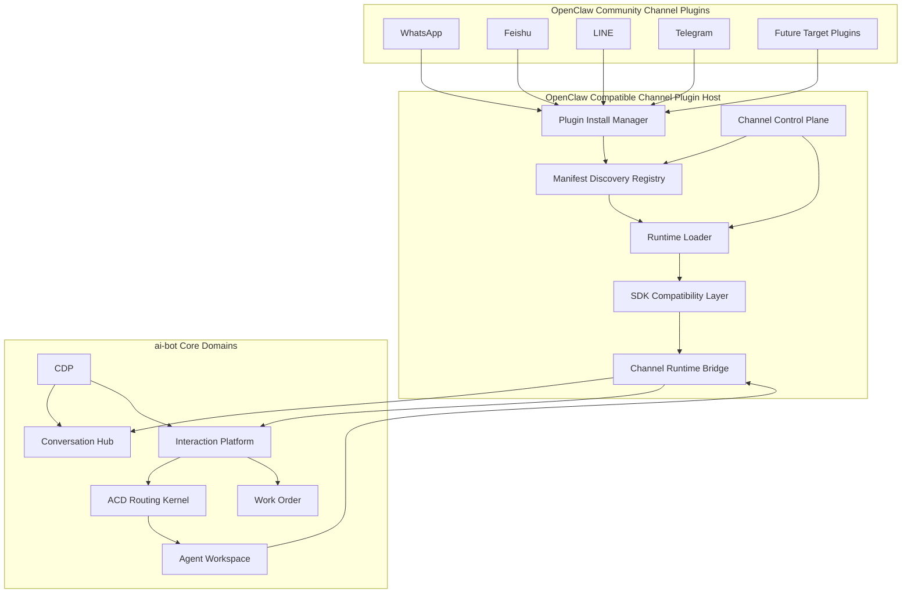

# 实现方案：OpenClaw Compatible Channel Plugin Host

**功能分支**: `004-openclaw-compatible-channel-plugin-host` | **日期**: 2026-04-01 | **规格说明**: [spec.md](spec.md)

> **配套文档**：
> - 兼容矩阵见 [compatibility-matrix.md](compatibility-matrix.md)
> - 模块 ownership 与内部子模块拆分见 [module-ownership.md](module-ownership.md)

> 本文档是本线程关于 OpenClaw 渠道插件机制研究、ai-bot 渠道接入演进目标、社区插件复用策略与精选兼容路线的综合定稿稿。  
> 它不以“新增一个插件系统”为目标，而以“在 ai-bot 内部建立一个有边界的 OpenClaw 兼容渠道宿主层”为目标。  
> 该宿主层未来将作为 `interaction-platform` 的渠道接入子系统存在，为 `CDP + Conversation + Interaction + ACD + Workspace` 提供可复用的 IM 接入能力。

---

## 目录

- [0. 执行摘要](#0-执行摘要)
- [1. 背景、现状与问题定义](#1-背景现状与问题定义)
- [2. 设计目标与非目标](#2-设计目标与非目标)
- [3. 路线选择：为什么是精选兼容](#3-路线选择为什么是精选兼容)
- [4. OpenClaw 机制研究结论](#4-openclaw-机制研究结论)
- [5. 最终定位：OpenClaw Compatible Channel Plugin Host](#5-最终定位openclaw-compatible-channel-plugin-host)
- [6. 顶层架构总览](#6-顶层架构总览)
- [7. Package / Manifest 兼容层设计](#7-package--manifest-兼容层设计)
- [8. 插件生命周期：安装、发现、启用、加载、注册、运行](#8-插件生命周期安装发现启用加载注册运行)
- [9. Runtime Registry 与 Channel Contract 设计](#9-runtime-registry-与-channel-contract-设计)
- [10. SDK Compatibility Layer 设计](#10-sdk-compatibility-layer-设计)
- [11. Channel Runtime Bridge 设计](#11-channel-runtime-bridge-设计)
- [12. 与 CDP / Interaction Platform / ACD / Workspace 的衔接](#12-与-cdp--interaction-platform--acd--workspace-的衔接)
- [13. 控制面与运维面设计](#13-控制面与运维面设计)
- [14. 安全、隔离与供应链治理](#14-安全隔离与供应链治理)
- [15. 可靠性、可观测性与诊断](#15-可靠性可观测性与诊断)
- [16. 兼容范围治理：版本线、插件类别、目标插件](#16-兼容范围治理版本线插件类别目标插件)
- [17. 分阶段实施路线](#17-分阶段实施路线)
- [18. 风险、取舍与被否决方案](#18-风险取舍与被否决方案)
- [19. 最终定稿的架构决策清单](#19-最终定稿的架构决策清单)

---

## 0. 执行摘要

### 0.1 一句话定义

`OpenClaw Compatible Channel Plugin Host` 应被定义为：

> **一个位于 `interaction-platform` 渠道接入边界上的 OpenClaw 兼容宿主层**
> = **Package Compatibility** + **Manifest Discovery** + **Setup/Full Dual Runtime Loader** + **Runtime Registry** + **SDK Compatibility Layer** + **Channel Runtime Bridge**

它的职责是：

- 吞入 OpenClaw 风格 channel plugin 包
- 承担安装、发现、启用、加载、注册与诊断
- 提供精选 `plugin-sdk/*` 兼容面
- 让插件负责渠道接入与 channel-specific 行为
- 通过 bridge 将渠道入站/出站接到 ai-bot 自己的内核域

它**不**负责：

- 客户主数据真相
- conversation / interaction / assignment 真相
- ACD 路由状态机
- Agent Workspace 所有权语义

### 0.2 最关键的架构判断

1. 我们不是“参考 OpenClaw”，而是“兼容 OpenClaw `channel plugin` 生态”
2. 兼容对象只限 `channel plugin`，不兼容 `provider / memory / context-engine`
3. 第一阶段采用 **路线 B：精选兼容**
4. 兼容版本线锁定 `OpenClaw 2026.4.x`
5. 首批验收插件固定为：
   - `WhatsApp`
   - `Feishu`
   - `LINE`
   - `Telegram`
6. 插件只能拥有渠道接入层职责，所有平台核心真相必须经过 host bridge
7. `plugin-sdk/*` 兼容层是长期成本，不是一次性脚手架

### 0.3 为什么现在就要做

当前 ai-bot 的主战场已经明确是：

- `CDP`
- `Interaction Platform`
- `ACD`
- `Workspace`
- `Work Order`

渠道接入不应再用“每个 IM 各写一套”的方式吃掉平台研发预算。  
而 OpenClaw 在 IM 插件宿主这一层已经积累出一套成熟的机制，恰好可以成为我们渠道层的复用基底。

---

## 1. 背景、现状与问题定义

### 1.1 当前 ai-bot 在渠道接入层的现实问题

从当前代码现实看，渠道与实时互动仍然主要绑定在 `backend` 中：

- [backend/src/index.ts](/Users/chenjun/Documents/obsidian/workspace/ai-bot/backend/src/index.ts)
- [backend/src/chat/chat.ts](/Users/chenjun/Documents/obsidian/workspace/ai-bot/backend/src/chat/chat.ts)
- [backend/src/chat/chat-ws.ts](/Users/chenjun/Documents/obsidian/workspace/ai-bot/backend/src/chat/chat-ws.ts)
- [backend/src/chat/voice.ts](/Users/chenjun/Documents/obsidian/workspace/ai-bot/backend/src/chat/voice.ts)
- [backend/src/agent/chat/agent-ws.ts](/Users/chenjun/Documents/obsidian/workspace/ai-bot/backend/src/agent/chat/agent-ws.ts)

这导致：

- 渠道接入和 bot/runtime 紧耦合
- 新增渠道需要侵入 backend 主流程
- 渠道能力没有独立的 setup / login / status / diagnostics 控制面
- 渠道差异无法在插件层被边界化

### 1.2 当前平台真正该投入的方向

基于前面 ACD 与 CDP 的定稿结论，ai-bot 未来的核心内核应是：

- `CDP`：客户语义层
- `Conversation / Interaction Hub`
- `ACD Routing Kernel`
- `Agent Workspace`
- `Work Order orchestration`

因此渠道插件层更适合作为一个相对独立、可替换、可兼容、受控的接入层子系统存在。

### 1.3 问题定义

我们要解决的不是“怎么支持插件”，而是：

> **如何在不让 OpenClaw 的 session/chat 主模型侵入 ai-bot 核心域的前提下，最大化复用其 channel plugin 生态。**

---

## 2. 设计目标与非目标

### 2.1 设计目标

本设计有 8 个核心目标：

1. **复用 OpenClaw 社区 IM 插件**
2. **不重写 ai-bot 核心互动模型**
3. **把渠道差异隔离在插件层与 bridge 层**
4. **支持 setup-only / full runtime 双阶段加载**
5. **建立清晰的兼容边界与 diagnostics**
6. **让目标插件可逐步纳入，而不是一口气全兼容**
7. **让渠道控制面成为正式能力，而不是零散脚本**
8. **让未来 Interaction Platform 能通过同一宿主吸收更多 IM 渠道**

### 2.2 非目标

本设计明确不追求以下目标：

1. 不兼容 OpenClaw 的所有插件类型
2. 不兼容 OpenClaw 所有版本线
3. 不把 ai-bot 变成 OpenClaw 的替身
4. 不在第一阶段支持所有社区 IM 插件
5. 不允许插件直接触碰平台核心真相
6. 不在第一阶段解决整个供应链沙箱问题

---

## 3. 路线选择：为什么是精选兼容

### 3.1 三条路线回顾

#### 路线 A：接口形似

- 只模仿 manifest、registry、plugin contract
- 不承诺运行现成社区插件

优点：
- 工程量小
- 自控性高

缺点：
- 不能复用社区插件
- 不满足业务目标

#### 路线 B：精选兼容

- 只兼容 `channel plugin`
- 只兼容明确版本线
- 只承诺一小批目标插件
- 尽量不改源码运行社区插件

优点：
- 复用价值高
- 风险可控
- 边界清晰

缺点：
- 需要维护 `plugin-sdk/*` 兼容层

#### 路线 C：广义兼容宿主

- 尽可能兼容大多数 OpenClaw 社区插件与更广插件生态

优点：
- 理论复用最大

缺点：
- 工程范围过大
- 长期锁定 OpenClaw 内核语义

### 3.2 选择结论

最终选择 **路线 B：精选兼容**。  
这是线程内已经确认的正式结论。

---

## 4. OpenClaw 机制研究结论

对 [openclaw-code](/Users/chenjun/Documents/obsidian/workspace/ai-bot/openclaw-code) 的研究表明，OpenClaw 的渠道插件机制建立在以下稳定设计之上：

1. **安装是标准化插件安装**
   - `plugins install`
   - npm/path/archive/marketplace
2. **发现是 `manifest-first`**
   - `openclaw.plugin.json`
   - `package.json.openclaw.*`
3. **运行时有双入口**
   - `setupEntry`
   - `extensions`
4. **加载有双阶段**
   - `setup-only`
   - `setup-runtime`
   - `full`
5. **注册统一进 central registry**
   - `defineChannelPluginEntry(...)`
   - `api.registerChannel(...)`
6. **ChannelPlugin contract 很完整**
   - setup
   - config
   - pairing
   - policy
   - outbound
   - status
   - threading
   - messaging
   - actions

这些结论直接决定了我们的宿主架构不能只抄 manifest；如果要真正兼容社区插件，必须把 `plugin-sdk/*` 与 runtime semantics 作为正式设计对象。

---

## 5. 最终定位：OpenClaw Compatible Channel Plugin Host

### 5.1 模块定位

该模块建议以逻辑子系统形式挂在未来 `interaction-platform` 内部，承担渠道接入边界职责：

- 插件安装与发现
- setup / login / status / logout
- inbound ingress
- outbound dispatch
- channel-specific action
- diagnostics / compatibility governance

### 5.2 与核心域的关系

它与核心域的关系应是：

- 向上承接 OpenClaw 风格插件
- 向下桥接到 ai-bot 内核域

而不是：

- 让插件直接进入 `CDP`
- 让插件直接进入 `Conversation`
- 让插件直接进入 `ACD`

---

## 6. 顶层架构总览

这张图表达的是：

- 社区插件只进入宿主，不进入核心域
- 宿主通过 `SDK Compatibility Layer` 让插件运行
- `Channel Runtime Bridge` 把插件能力映射到 ai-bot 的内部对象模型

---

## 7. Package / Manifest 兼容层设计

### 7.1 要兼容的包结构

必须兼容以下外部契约：

- `openclaw.plugin.json`
- `package.json.openclaw.extensions`
- `package.json.openclaw.setupEntry`
- `package.json.openclaw.channel`
- `package.json.openclaw.install`

### 7.2 为什么这层必须单独设计

因为路线 B 的目标是“尽量不改源码运行社区插件”。  
如果包结构不兼容，就只能退化成路线 A。

### 7.3 发现原则

- 先做静态扫描
- 先验证 manifest
- 再决定是否加载 runtime
- 不在 discovery 阶段执行插件代码

---

## 8. 插件生命周期：安装、发现、启用、加载、注册、运行

插件生命周期建议明确分 6 步：

1. **Install**
   - npm/path/archive 安装
   - install metadata
   - 版本线校验
2. **Discover**
   - 扫描插件目录
   - 读取 manifest / package metadata
   - 生成静态 registry
3. **Enable**
   - allow / deny / disable / diagnostics
   - channel config 决议
4. **Load**
   - `setup-only`
   - `setup-runtime`
   - `full`
5. **Register**
   - `defineChannelPluginEntry(...)`
   - `registerChannel(...)`
6. **Run**
   - 控制面：setup/login/status
   - 数据面：inbound/outbound/actions

---

## 9. Runtime Registry 与 Channel Contract 设计

### 9.1 Registry 必须持有的对象

第一阶段至少要有：

- `plugins`
- `channels`
- `channelSetups`
- `diagnostics`
- `installRecords`

### 9.2 为什么 registry 是核心，而不是附属工具

因为：

- 控制面依赖它列出可用渠道
- 运行时依赖它查找 channel runtime
- diagnostics 依赖它输出 compatibility status

### 9.3 ChannelPlugin contract 的采用方式

我们不需要逐字复刻 OpenClaw 的所有内部实现，但应尽量兼容其 `ChannelPlugin` 的主要 surface：

- `setup`
- `setupWizard`
- `config`
- `security`
- `pairing`
- `status`
- `outbound`
- `threading`
- `messaging`
- `actions`
- `directory`

这会成为 `SDK Compatibility Layer` 对外暴露的核心合同。

---

## 10. SDK Compatibility Layer 设计

### 10.1 这是路线 B 成败的关键

如果只兼容 manifest 和 registry，而不兼容 `openclaw/plugin-sdk/*`，就不能真正吃社区插件。

### 10.2 兼容层的正式定位

它不是“工具函数集合”，而是：

> **OpenClaw channel plugin 在 ai-bot 宿主中运行时所依赖的稳定 API/ABI 适配层**

### 10.3 兼容层的分层

兼容矩阵应按 4 层治理：

- `L0 Package/Host`
- `L1 Common SDK`
- `L2 Target Plugin SDK`
- `L3 Optional/Test/Long-tail`

详细矩阵见 [compatibility-matrix.md](compatibility-matrix.md)。

### 10.4 为什么 Telegram 要后置

根据对四个目标插件真实 import 的复核：

- `WhatsApp / Feishu / LINE` 共享底座更集中
- `Telegram` 依赖面最广，涉及：
  - `infra-runtime`
  - `diagnostic-runtime`
  - `error-runtime`
  - `retry-runtime`
  - `provider-auth`
  - `interactive-runtime`
  - `acp-runtime`
  - `webhook-*`
  - `json-store`
  等更多专项 surface

因此 Telegram 应作为路线 B 的最后一个阶段目标，而不是与前三者完全并行。

---

## 11. Channel Runtime Bridge 设计

### 11.1 入站桥接

插件负责：

- 渠道级 webhook / ws / poller 收包
- channel-specific 验签
- thread / sender / action 语义解析

宿主 bridge 负责：

- 规范化为 ai-bot 内部 ingress event
- 注入 channel metadata
- 交给 `Conversation / Interaction` ingress

### 11.2 出站桥接

核心域负责：

- 生成内部 outbound command
- 由 Workspace / Interaction Platform 决定业务动作

宿主 bridge 负责：

- 调用插件 outbound/runtime surface
- 处理 channel-specific send result
- 回写 delivery / diagnostics

### 11.3 最重要的边界规则

插件可以：

- setup/login/logout
- inbound parse
- outbound send
- thread/session grammar
- channel-specific actions

插件不能：

- 直写 `party`
- 直写 `conversation`
- 直写 `interaction`
- 直写 `assignment`
- 直写 `acd event`

---

## 12. 与 CDP / Interaction Platform / ACD / Workspace 的衔接

### 12.1 与 CDP

插件宿主不拥有客户真相。  
入站事件进入平台后，由 `CDP` 负责：

- identity resolve
- customer context
- consent / preference / contactability

### 12.2 与 Conversation / Interaction Hub

插件宿主只负责把渠道事实变成内部 ingress event。  
真正的对象 materialization 由 `Conversation / Interaction Hub` 完成。

### 12.3 与 ACD

渠道插件不参与：

- queue selection
- eligibility
- scoring
- assignment

它只提供渠道级 metadata，供 ACD 使用。

### 12.4 与 Agent Workspace

Workspace 不应理解所有渠道细节。  
它只通过内部统一 outbound API / action API 与宿主 bridge 交互。

---

## 13. 控制面与运维面设计

控制面建议至少提供：

- install / uninstall
- list plugins / list channels
- enable / disable
- setup / login / logout
- status / health
- diagnostics / compatibility report
- channel account inventory

运维面建议至少提供：

- runtime health
- plugin load mode
- setup/runtime/full 状态
- missing surface diagnostics
- outbound failure diagnostics

---

## 14. 安全、隔离与供应链治理

### 14.1 第一阶段不承诺强沙箱

这点应与前面 ACD 插件治理思路保持一致：

- 第一阶段可以明确为“受信插件为主”
- 不承诺从第一天起提供完全隔离执行环境

### 14.2 但必须做的安全项

- install source 校验
- 版本线兼容校验
- manifest/package metadata 校验
- 明确 diagnostics
- channel secret 不落在插件任意自由写路径中
- webhook/request guard 走宿主控制

### 14.3 长期方向

后续可再演进：

- 更强沙箱
- 更细的 FS/network 权限
- 插件签名 / provenance

---

## 15. 可靠性、可观测性与诊断

路线 B 的核心不是“能跑一次”，而是“能定位为什么跑不了”。

因此 diagnostics 是一等能力，至少要覆盖：

- 插件安装失败
- manifest 校验失败
- 版本线不兼容
- 缺失 `plugin-sdk/*` surface
- setupEntry 缺失
- runtime register 失败
- inbound bridge 失败
- outbound send 失败

同时应保留：

- plugin load trail
- registry snapshot
- channel account status
- runtime mode snapshot

---

## 16. 兼容范围治理：版本线、插件类别、目标插件

### 16.1 版本线

- 只承诺 `OpenClaw 2026.4.x`

### 16.2 插件类别

- 只承诺 `channel plugin`

### 16.3 目标插件

第一阶段固定：

1. `WhatsApp`
2. `Feishu`
3. `LINE`
4. `Telegram`

### 16.4 为什么要强边界

如果不锁这三条，路线 B 会迅速滑向路线 C。

---

## 17. 分阶段实施路线

### Phase B1：Host 底座

目标：

- `L0 Package/Host`
- 静态发现
- setup/full 双入口
- registry
- diagnostics

### Phase B2：Common SDK 底座

目标：

- `L1 Common SDK`
- 建立最小可运行兼容层

### Phase B3：三插件先行

目标：

- `WhatsApp`
- `Feishu`
- `LINE`

原因：

- 共享底座多
- 相比 Telegram 风险更可控

### Phase B4：Telegram 兼容

目标：

- 补齐 Telegram 专项 surface
- 完成四插件验收闭环

### Phase B5：未来扩展

目标：

- 新渠道插件纳入兼容矩阵治理
- 不改变核心域模型

---

## 18. 风险、取舍与被否决方案

### 风险 1：SDK surface 很大

这是路线 B 最大的真实成本。  
兼容难点在 runtime semantics，不在 manifest。

### 风险 2：OpenClaw helper 带宿主假设

有些 `plugin-sdk/*` helper 带着 OpenClaw 自己的运行时前提，需要 carefully bridge。

### 风险 3：长期维护成本存在

兼容层一旦建立，就成为长期资产与长期成本。

### 被否决方案

#### 被否决 A：只抄 manifest

因为这不是真兼容。

#### 被否决 B：让插件直接写 ai-bot 核心表

因为这会摧毁核心域边界。

#### 被否决 C：一步到位做全生态兼容

因为这会把范围拉爆。

---

## 19. 最终定稿的架构决策清单

1. `ai-bot` 将新增一个 `OpenClaw Compatible Channel Plugin Host` 作为未来 `interaction-platform` 的渠道接入子系统。
2. 该宿主只兼容 `OpenClaw channel plugin`，不兼容其他插件类别。
3. 兼容版本线锁定为 `OpenClaw 2026.4.x`。
4. 首批验收插件固定为 `WhatsApp / Feishu / LINE / Telegram`。
5. 路线选择为 **精选兼容**，不是接口形似，也不是全生态兼容。
6. 插件只能拥有渠道接入层职责，不得直接拥有核心领域真相。
7. 入站与出站都必须经由 `Channel Runtime Bridge` 进入或离开 ai-bot 核心域。
8. `plugin-sdk/*` 兼容层是正式模块，不是临时胶水。
9. diagnostics 与 compatibility report 是一等能力。
10. Telegram 因依赖面最宽，将在实施阶段后置于 `WhatsApp / Feishu / LINE` 之后。
