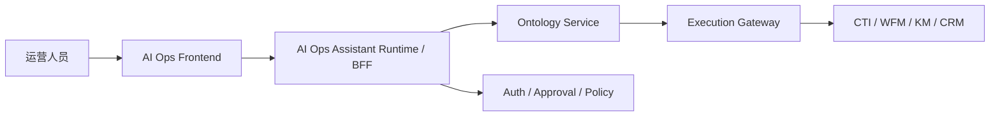

# 应用层专题：AI 运营智能助理 API 与 TypeScript 类型草案

**功能分支**: `006-ontology-service` | **日期**: 2026-04-04 | **规格说明**: [spec.md](spec.md)

> 本文档把 `AI 运营智能助理` 继续下沉为应用层 API 与前后端共享类型草案。  
> 目标是为后续 `BFF / Copilot Runtime / React UI` 提供一套可实现的契约。

---

## 1. 定位

这里定义的不是 `ontology_service` 自身 API，而是建立在其上的：

> **AI Ops Assistant Runtime / BFF API**

职责：

- 接收用户会话 turn
- 解析意图与场景
- 调用 `ontology_service`
- 生成 `UIActionPlan`
- 返回可直接渲染的消息载荷

边界：

- 不接管本体真值
- 不替代执行网关
- 不绕过 `ActionDraft -> Validate -> Approve -> Execute`

---

## 2. 推荐架构



---

## 3. API 分组

### 3.1 Assistant Turn API

主入口。前端每次用户输入都通过它进入。

```http
POST /v1/assistant/turns
GET  /v1/assistant/sessions/{session_id}
GET  /v1/assistant/sessions/{session_id}/turns
```

### 3.2 Intent / Context API

用于意图预解析、上下文解析和页面恢复。

```http
POST /v1/assistant/intents/resolve
POST /v1/assistant/context/resolve
GET  /v1/assistant/catalog/pages
GET  /v1/assistant/catalog/intents
```

### 3.3 Workspace API

用于页面与标签页状态管理。

```http
POST /v1/workspace/tabs/open
POST /v1/workspace/tabs/focus
POST /v1/workspace/context/pin
GET  /v1/workspace/state/{session_id}
```

### 3.4 Draft / Execution Shortcut API

用于应用层把常见动作串起来，但底层仍走 `ontology_service`。

```http
POST /v1/assistant/drafts/from-option
POST /v1/assistant/drafts/{draft_id}/validate
POST /v1/assistant/drafts/{draft_id}/approve
POST /v1/assistant/drafts/{draft_id}/execute
GET  /v1/assistant/executions/{execution_id}/watch
```

---

## 4. 核心 API 草案

### 4.1 `POST /v1/assistant/turns`

**请求**

```json
{
  "tenant_id": "telco-cn",
  "actor_id": "ops_supervisor_01",
  "trace_id": "trace_001",
  "session_id": "sess_001",
  "message": "账单异常会不会把 SLA 打穿？给我方案",
  "current_context": {
    "active_tab": "ops_overview",
    "event_id": "evt-1015"
  }
}
```

**响应**

```json
{
  "session_id": "sess_001",
  "turn_id": "turn_001",
  "resolved_intent": {
    "intent": "generate_plan",
    "scenario_code": "contact_center_emergency",
    "confidence": 0.93
  },
  "ui_actions": [
    {
      "type": "OPEN_TAB",
      "tab_code": "emergency_war_room"
    },
    {
      "type": "PIN_CONTEXT",
      "context": {
        "event_id": "evt-1015"
      }
    }
  ],
  "messages": [
    {
      "type": "kpi_cards",
      "payload": {
        "items": []
      }
    },
    {
      "type": "table",
      "payload": {
        "columns": [],
        "rows": []
      }
    }
  ],
  "follow_up_actions": [
    {
      "type": "SUGGEST",
      "label": "生成动作草案"
    }
  ]
}
```

### 4.2 `POST /v1/assistant/intents/resolve`

用于前端在发送完整 turn 前做轻量预览。

```json
{
  "tenant_id": "telco-cn",
  "actor_id": "ops_supervisor_01",
  "message": "哪些座席可以临时支援 billing voice？"
}
```

### 4.3 `POST /v1/workspace/tabs/open`

```json
{
  "session_id": "sess_001",
  "tab_code": "support_orchestration",
  "context": {
    "queue_code": "voice_billing_vip"
  }
}
```

### 4.4 `POST /v1/assistant/drafts/from-option`

```json
{
  "tenant_id": "telco-cn",
  "actor_id": "ops_supervisor_01",
  "trace_id": "trace_001",
  "plan_session_id": "ps_001",
  "option_id": "plan_a"
}
```

---

## 5. TypeScript 类型草案

### 5.1 基础类型

```ts
export type ScenarioCode =
  | "contact_center_emergency"
  | "support_orchestration"
  | "vip_protection";

export type IntentCode =
  | "open_workspace"
  | "show_impact_graph"
  | "generate_plan"
  | "compare_options"
  | "explain_plan"
  | "create_action_draft"
  | "validate_draft"
  | "request_approval"
  | "track_execution"
  | "replay_execution"
  | "show_customer_risk"
  | "find_support_candidates";

export type TabCode =
  | "ops_overview"
  | "emergency_war_room"
  | "support_orchestration"
  | "vip_protection"
  | "relation_graph"
  | "option_compare"
  | "action_center"
  | "audit_replay";
```

### 5.2 Turn 请求/响应

```ts
export interface AssistantTurnRequest {
  tenant_id: string;
  actor_id: string;
  trace_id: string;
  session_id: string;
  message: string;
  current_context?: ContextEnvelope;
}

export interface AssistantTurnResponse {
  session_id: string;
  turn_id: string;
  resolved_intent: ResolvedIntent;
  ui_actions: UIAction[];
  messages: RenderMessage[];
  follow_up_actions?: FollowUpAction[];
}
```

### 5.3 上下文

```ts
export interface ContextEnvelope {
  active_tab?: TabCode;
  event_id?: string;
  queue_code?: string;
  plan_session_id?: string;
  option_id?: string;
  draft_id?: string;
  execution_id?: string;
  customer_id?: string;
}

export interface ResolvedIntent {
  intent: IntentCode;
  scenario_code?: ScenarioCode;
  confidence: number;
  required_context?: string[];
  resolved_context?: ContextEnvelope;
}
```

### 5.4 UI 动作

```ts
export type UIAction =
  | { type: "OPEN_TAB"; tab_code: TabCode; context?: ContextEnvelope }
  | { type: "FOCUS_TAB"; tab_code: TabCode }
  | { type: "PIN_CONTEXT"; context: ContextEnvelope }
  | { type: "RUN_API"; api_code: string; request_ref?: string }
  | { type: "SHOW_COMPONENT"; component_id: string; payload_ref: string }
  | { type: "HIGHLIGHT_GRAPH"; node_ids: string[]; edge_ids?: string[] }
  | { type: "SELECT_OPTION"; option_id: string }
  | { type: "CREATE_DRAFT"; option_id: string }
  | { type: "RUN_VALIDATE"; draft_id: string }
  | { type: "OPEN_APPROVAL"; draft_id: string }
  | { type: "SHOW_TIMELINE"; execution_id: string };
```

### 5.5 渲染消息

```ts
export type RenderMessage =
  | TextMessage
  | KpiCardsMessage
  | TableMessage
  | ChartMessage
  | GraphMessage
  | ActionCardsMessage
  | ApprovalCardMessage
  | TimelineMessage
  | WarningMessage;

export interface BaseMessage {
  type: string;
  title?: string;
  source_refs?: SourceRef[];
}

export interface SourceRef {
  api: string;
  ref_id?: string;
  entity_type?: string;
  entity_id?: string;
}
```

```ts
export interface TextMessage extends BaseMessage {
  type: "text";
  payload: { markdown: string };
}

export interface KpiCardsMessage extends BaseMessage {
  type: "kpi_cards";
  payload: {
    items: Array<{ label: string; value: string; trend?: string }>;
  };
}

export interface TableMessage extends BaseMessage {
  type: "table";
  payload: {
    columns: string[];
    rows: Array<Array<string | number>>;
  };
}

export interface ChartMessage extends BaseMessage {
  type: "chart";
  payload: {
    engine: "echarts";
    chart_type: "line" | "bar" | "area";
    series: unknown[];
  };
}

export interface GraphMessage extends BaseMessage {
  type: "graph";
  payload: {
    mode: "tbox" | "abox" | "overlay" | "scenario";
    nodes: unknown[];
    edges: unknown[];
  };
}

export interface ActionCardsMessage extends BaseMessage {
  type: "action_cards";
  payload: {
    draft_id?: string;
    steps: Array<{
      target_system: string;
      action_type: string;
      risk_level?: string;
    }>;
  };
}

export interface ApprovalCardMessage extends BaseMessage {
  type: "approval_card";
  payload: {
    draft_id: string;
    approval_level: "L1" | "L2" | "L3";
    required_roles: string[];
    rollback_ready: boolean;
  };
}

export interface TimelineMessage extends BaseMessage {
  type: "timeline";
  payload: {
    execution_id: string;
    steps: Array<{
      name: string;
      status: string;
      at?: string;
    }>;
  };
}

export interface WarningMessage extends BaseMessage {
  type: "warning";
  payload: {
    code: string;
    message: string;
    severity: "info" | "warning" | "error";
  };
}
```

### 5.6 跟进动作

```ts
export type FollowUpAction =
  | { type: "SUGGEST"; label: string; action?: UIAction }
  | { type: "REQUIRE_CONFIRM"; label: string; draft_id?: string };
```

---

## 6. 前端状态模型建议

```ts
export interface AssistantSessionState {
  session_id: string;
  active_tab?: TabCode;
  pinned_context?: ContextEnvelope;
  open_tabs: WorkspaceTabState[];
  messages: RenderMessage[];
}

export interface WorkspaceTabState {
  tab_id: string;
  tab_code: TabCode;
  title: string;
  context?: ContextEnvelope;
  dirty?: boolean;
}
```

---

## 7. 错误码建议

| 错误码 | 含义 |
|---|---|
| `INTENT_NOT_RESOLVED` | 无法稳定识别用户意图 |
| `CONTEXT_MISSING` | 缺少事件、队列、方案等必要上下文 |
| `PAGE_NOT_SUPPORTED` | 请求打开的页面不在 UI 模型白名单中 |
| `RENDER_TYPE_NOT_ALLOWED` | 请求渲染的消息类型不在协议白名单中 |
| `ACTION_NOT_ALLOWED` | 该动作不在协议白名单中 |
| `DRAFT_REQUIRED` | 需要先生成 `ActionDraft` |
| `APPROVAL_REQUIRED` | 需要先完成审批 |
| `EXECUTION_BLOCKED` | freshness、规则或权限检查阻断执行 |

---

## 8. 决策清单

1. AI 助理需要独立的应用层 BFF / Runtime API
2. 前端与 BFF 之间用 `AssistantTurnRequest / Response` 作为主契约
3. 页面与标签页联动必须经由 `UIAction` 明确表达
4. 消息渲染必须使用白名单消息类型，不允许随意拼装
5. 执行相关动作仍必须回到 `ontology_service + execution-gateway` 治理链
