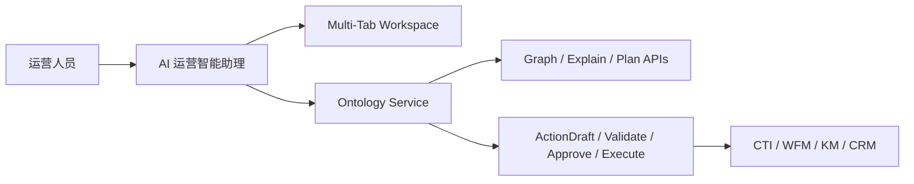

# 应用层专题：AI 运营智能助理

**功能分支**: `006-ontology-service` | **日期**: 2026-04-04 | **规格说明**: [spec.md](spec.md)

> 本文档专门定义建立在 `ontology_service` 之上的“AI 运营智能助理”应用层。  
> 它参考 `本体模型-AI原生应用UI建模规范与原型实践总结` 中的三栏式布局、AI 作为第二入口、`OPEN_TAB` 指令联动与多态输出思路，但场景收敛到客服运营与运营调度，而不是通用 ERP 录入。

> **配套文档**：
> - UI 元数据草案见 [ai-ops-ui-model.md](ai-ops-ui-model.md)
> - 交互协议与消息 schema 见 [ai-ops-protocol.md](ai-ops-protocol.md)
> - 应用层 API 与 TypeScript 类型见 [ai-ops-api-types.md](ai-ops-api-types.md)
> - 三张核心工作台低保真见 [ai-ops-lowfi.md](ai-ops-lowfi.md)

---

## 1. 助理定位

### 1.1 正式定义

`AI 运营智能助理` 应被定义为：

> **建立在 Ontology Service 之上的 AI-Native 运营协同工作台**
> = **右侧 Copilot 交互入口**
> + **中间多标签运营工作区**
> + **对 `ontology_service` 的分析、规划、解释与受控执行调用**

它不是：

- `ontology_service` 本身
- 独立的数据真值系统
- 绕过治理层直接写下游系统的执行机器人

它是：

- 运营人员的“第二入口”
- 把自然语言意图转成页面联动、语义查询、方案生成和 `ActionDraft` 草案的应用层
- 承接 `Hybrid UI + AI Copilot + Multi-Tab Workspace` 的具体产品形态

### 1.2 能力边界

`AI 运营智能助理` 可以：

- 理解用户意图并识别当前运营场景
- 自动打开或激活中间区域的业务标签页
- 调用 `ontology_service` 做影响分析、关系浏览、方案规划和解释
- 把选定方案转成 `ActionDraft`
- 跟踪审批、执行、回滚和审计状态

`AI 运营智能助理` 不可以：

- 直接修改核心本体模型
- 直接绕过 `ActionDraft -> Validate -> Approve -> Execute` 写回下游
- 直接读取未授权敏感字段
- 把 UI 运行状态当成业务真相源

### 1.3 产品形态

建议采用参考材料中的 `Triple-column / Multi-Tab / AI Copilot` 结构：

- 左侧：运营导航与场景入口
- 中间：多标签业务工作区
- 右侧：AI 运营智能助理

右侧 AI 区是：

- 信息解释入口
- 页面触发入口
- 方案协同入口
- 执行链路入口

而不是单纯聊天框。

---

## 2. 三个具体运营场景

### 2.1 场景 A：客服中心运营应急调度

**用户表达**：

> “账单异常会不会把未来 30 分钟 SLA 打穿？给我一套可执行方案。”

**助理动作**：

1. 识别为 `contact_center_emergency` 场景
2. 打开或激活 `应急指挥台` 标签页
3. 调用事件影响分析与方案生成
4. 展示 `KPI 卡片 + 趋势图 + 方案对比表`
5. 在用户选择方案后生成 `ActionDraft`

**主要依赖对象**：

- `Event`
- `Queue`
- `Channel`
- `Skill`
- `Agent`
- `Customer`
- `Ticket`

**主要依赖接口**：

- `POST /v1/analysis/impact`
- `POST /v1/plans/generate`
- `GET /v1/plans/{plan_session_id}/options/{option_id}/explain`
- `POST /v1/action-drafts`

**典型输出**：

- 当前影响面摘要
- 未来 30 分钟 SLA / 放弃率 / AHT 风险
- 方案 A / B / C 对比表
- `ActionDraft` 执行卡片

---

### 2.2 场景 B：技能支援编排助理

**用户表达**：

> “现在谁能临时支援 billing voice，且对其他队列影响最小？”

**助理动作**：

1. 打开 `技能支援台`
2. 调用 `Queue / Skill / Agent / Shift / Certification` 相关分析
3. 输出可支援座席清单与影响评估
4. 生成“临时支援草案”

**主要依赖对象**：

- `Queue`
- `Skill`
- `Agent`
- `Shift`
- `Certification`
- `StaffingRequirement`

**主要依赖接口**：

- `GET /v1/objects/{object_id}/relations`
- `POST /v1/analysis/impact`
- `POST /v1/plans/generate`
- `POST /v1/action-drafts`

**典型输出**：

- 候选座席表
- 支援前后覆盖缺口对比
- 规则命中说明
- 支援有效期与回滚说明

---

### 2.3 场景 C：VIP 投诉压降助理

**用户表达**：

> “把这次事件影响到的 VIP 和高风险投诉单整理出来，并给我回呼与工单处置建议。”

**助理动作**：

1. 打开 `VIP 保护台`
2. 聚合 `Customer / Ticket / Event / Knowledge / Callback` 语义
3. 识别高风险 VIP、已升级工单和建议动作
4. 生成回呼、知识下发、工单归因等草案

**主要依赖对象**：

- `Customer`
- `RiskTag`
- `Ticket`
- `IncidentEvent`
- `KnowledgeItem`
- `CallbackPolicy`

**主要依赖接口**：

- `GET /v1/events/{event_id}/impact`
- `POST /v1/analysis/impact`
- `POST /v1/plans/generate`
- `POST /v1/action-drafts`

**典型输出**：

- 高风险 VIP 清单
- 工单升级表
- 回呼优先级卡片
- 知识条目与统一口径建议

---

## 3. 页面与标签页

### 3.1 页面结构

建议采用以下产品结构：

```text
运营管理 / AI 运营智能助理
├─ 今日运营总览
├─ 应急指挥台
├─ 技能支援台
├─ VIP 保护台
├─ 关系图谱
├─ 方案对比
├─ 动作执行中心
└─ 审计与回放
```

### 3.2 三栏布局

```text
┌────────────────────────────────────────────────────────────────────────────────────────────────────┐
│ 运营管理 / AI 运营智能助理                                                                        │
├──────────────────┬──────────────────────────────────────────────────────────────┬───────────────────┤
│ 场景导航           │ 多标签运营工作区                                                │ AI 智能助理         │
│                  │                                                              │                   │
│ - 今日运营总览     │ [应急指挥台] [方案对比] [执行中心]                               │ 对话                │
│ - 应急调度         │                                                              │ KPI 卡片            │
│ - 技能支援         │ 事件态势 / 表格 / 图表 / 图谱 / 表单                               │ 表格 / 图表 / 图谱   │
│ - VIP 保护         │                                                              │ 推荐动作            │
│ - 执行审计         │                                                              │ 审批与执行入口       │
└──────────────────┴──────────────────────────────────────────────────────────────┴───────────────────┘
```

### 3.3 推荐标签页定义

| 标签页 | 用途 | 主要内容 |
|---|---|---|
| `今日运营总览` | 进入工作台后的默认页 | KPI 卡片、异常摘要、待办事项 |
| `应急指挥台` | 客服中心异常处置 | 事件态势、影响对象、预测指标 |
| `关系图谱` | 查看影响链和对象关系 | `TBox / ABox / 场景` 子图 |
| `方案对比` | 比较候选方案 | 方案卡、对比表、命中规则 |
| `技能支援台` | 临时支援编排 | 候选座席、覆盖缺口、支援草案 |
| `VIP 保护台` | 高价值客户保护 | 高风险客户、投诉单、回呼建议 |
| `动作执行中心` | 草案校验与审批执行 | `ActionDraft`、校验结果、审批状态 |
| `审计与回放` | 复盘和追踪 | 版本、执行 timeline、回放入口 |

### 3.4 标签页打开原则

- AI 只能打开已有受支持页面，不允许凭空创建未知页面
- 新页面通过 `OPEN_TAB` 打开
- 已存在页面通过 `FOCUS_TAB` 激活
- 涉及执行的页面优先带 `context_id`、`event_id`、`plan_session_id`

---

## 4. AI Interaction Protocol

### 4.1 目标

`AI Interaction Protocol` 的职责是把：

- 用户自然语言意图

映射为：

- UI 动作
- Ontology API 调用
- 渲染协议
- 安全与治理约束

### 4.2 协议链路

建议采用以下链路：

`User Intent`
-> `Scenario Resolve`
-> `Context Assemble`
-> `UI Action Plan`
-> `Ontology API Calls`
-> `Render Payload`
-> `Optional ActionDraft`

### 4.3 支持的 AI 意图

| 意图 | 含义 | 默认 UI 动作 |
|---|---|---|
| `open_workspace` | 打开某个运营工作页 | `OPEN_TAB` |
| `show_impact_graph` | 查看影响关系图 | `OPEN_TAB + HIGHLIGHT_GRAPH` |
| `generate_plan` | 生成方案 | `OPEN_TAB + RUN_ANALYSIS` |
| `explain_plan` | 解释方案 | `FOCUS_TAB + SHOW_EXPLAIN` |
| `compare_options` | 比较方案 | `OPEN_TAB + SHOW_COMPARE_TABLE` |
| `create_action_draft` | 生成动作草案 | `OPEN_TAB + CREATE_DRAFT` |
| `validate_draft` | 触发校验 | `RUN_VALIDATE` |
| `request_approval` | 发起审批 | `OPEN_APPROVAL_CARD` |
| `track_execution` | 跟踪执行态 | `OPEN_TAB + SHOW_TIMELINE` |
| `replay_execution` | 复盘执行过程 | `OPEN_TAB + LOAD_REPLAY` |

### 4.4 UI 动作集合

| 动作 | 说明 |
|---|---|
| `OPEN_TAB` | 新建标签页 |
| `FOCUS_TAB` | 激活已有标签页 |
| `PIN_CONTEXT` | 把事件、方案、对象上下文钉在页面顶部 |
| `RUN_ANALYSIS` | 调用分析接口 |
| `SHOW_GRAPH` | 渲染图谱组件 |
| `SHOW_TABLE` | 渲染表格组件 |
| `SHOW_CHART` | 渲染图表组件 |
| `SHOW_KPI_CARDS` | 渲染指标卡片 |
| `CREATE_DRAFT` | 创建动作草案 |
| `RUN_VALIDATE` | 执行草案校验 |
| `OPEN_APPROVAL_CARD` | 显示审批卡片 |
| `SHOW_EXECUTION_TIMELINE` | 展示执行状态时间轴 |

### 4.5 协议约束

1. AI 只能触发受支持的 UI 动作集合
2. AI 只能通过 `ontology_service` 或明确授权的执行网关接口完成业务协同
3. AI 不得直接组装下游写回请求绕过治理层
4. 任何执行型意图都必须先转成 `ActionDraft`
5. 所有协议执行都必须带 `tenant_id / actor_id / trace_id`

### 4.6 协议示例

```json
{
  "intent": "generate_plan",
  "scenario_code": "contact_center_emergency",
  "ui_actions": [
    {
      "type": "OPEN_TAB",
      "tab_code": "emergency_war_room"
    },
    {
      "type": "PIN_CONTEXT",
      "context": {
        "event_id": "evt-1015"
      }
    },
    {
      "type": "RUN_ANALYSIS",
      "api": "POST /v1/plans/generate"
    }
  ]
}
```

---

## 5. 消息渲染协议

### 5.1 设计原则

参考材料中的“多态输出”经验，运营智能助理的消息不应只支持文本。  
建议把消息渲染协议定义为受控组件集合。

### 5.2 支持的消息类型

| 类型 | 用途 | 典型场景 |
|---|---|---|
| `text` | 富文本解释 | 说明原因、总结结论 |
| `kpi_cards` | 指标卡片组 | SLA、AHT、放弃率、成本变化 |
| `table` | 结构化表格 | 候选座席、高风险 VIP、方案对比 |
| `chart` | 图表 | 排队走势、趋势分析、容量变化 |
| `graph` | 图谱片段 | 影响面、关系链、命中链路 |
| `action_cards` | 动作卡片 | 方案动作、草案步骤、风险提示 |
| `timeline` | 时间轴 | 执行状态、回放路径 |
| `approval_card` | 审批卡片 | 审批人、风险、回滚说明 |
| `warning` | 风险提醒 | freshness 不足、规则冲突、权限不足 |

### 5.3 建议的数据载荷

```json
{
  "type": "table",
  "title": "可支援座席清单",
  "columns": [
    "座席",
    "当前技能",
    "可支援队列",
    "风险等级"
  ],
  "rows": [
    [
      "Agent A1029",
      "BillingCertified",
      "VoiceBillingVIP",
      "Low"
    ]
  ]
}
```

### 5.4 图表约束

- 图表引擎建议采用 `ECharts`
- 图表必须支持右侧 AI 面板宽度变化后的自动 `resize`
- 图表必须可降级为表格或 KPI 卡片

### 5.5 行动型消息约束

若消息类型为 `action_cards` 或 `approval_card`：

- 必须携带 `draft_id` 或 `plan_option_id`
- 必须显示规则命中与风险说明
- 必须显示 `validate / approve / execute` 入口状态

---

## 6. 与 ontology_service 的接口关系

### 6.1 关系定位

`AI 运营智能助理` 与 `ontology_service` 的关系应定义为：

> **上层应用消费者**
> 通过受控 API 消费本体语义、分析结果、方案解释与执行网关能力

它不拥有：

- 本体模型真值
- 实例投影真值
- 执行治理真值

### 6.2 主要依赖接口

#### 只读/分析接口

- `POST /v1/analysis/impact`
- `POST /v1/plans/generate`
- `GET /v1/plans/{plan_session_id}`
- `GET /v1/plans/{plan_session_id}/options/{option_id}`
- `GET /v1/plans/{plan_session_id}/options/{option_id}/explain`
- `GET /v1/events/{event_id}/impact`
- `GET /v1/objects/{object_id}`
- `GET /v1/objects/{object_id}/relations`

#### 图谱接口

- `GET /v1/graph/view`
- `GET /v1/graph/nodes/{node_id}/neighbors`
- `POST /v1/graph/path`
- `POST /v1/graph/impact`

#### 执行接口

- `POST /v1/action-drafts`
- `POST /v1/action-drafts/{draft_id}/validate`
- `POST /v1/action-drafts/{draft_id}/approve`
- `POST /v1/action-drafts/{draft_id}/execute`
- `POST /v1/executions/{execution_id}/rollback`
- `GET /v1/executions/{execution_id}`

### 6.3 推荐集成结构



### 6.4 关键边界

1. AI 助理通过接口调用 `ontology_service`
2. `ontology_service` 负责语义、规划和执行治理
3. 下游写回必须仍经过执行网关
4. AI 助理只承担交互组织、页面联动和渲染编排

---

## 7. 架构决策清单

1. `AI 运营智能助理` 是 `ontology_service` 之上的应用层，不与本体核心混层
2. 助理采用 `Triple-column + Multi-Tab + Copilot` 的 AI-Native 工作台形态
3. 助理优先支持 `应急调度 / 技能支援 / VIP 保护` 三个运营场景
4. AI 交互必须显式建模为 `AI Interaction Protocol`
5. 消息渲染必须支持 `text / table / chart / graph / action_cards / timeline`
6. AI 只能生成分析结果和草案，不得直接绕过治理层执行
7. 助理与 `ontology_service` 之间应保持清晰的“应用层消费者”关系
