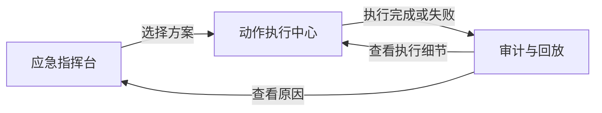

# 低保真：AI 运营智能助理核心工作台

**功能分支**: `006-ontology-service` | **日期**: 2026-04-04 | **规格说明**: [spec.md](spec.md)

> 本文档把 `AI 运营智能助理` 收敛到三张核心工作页低保真：  
> `应急指挥台`、`动作执行中心`、`审计与回放`。  
> 它们对应“听得懂、做得出、可复盘”三段关键链路。

---

## 1. 应急指挥台

### 1.1 页面目标

让运营主管在一个页面里同时看到：

- 当前事件上下文
- 关键 KPI 风险
- 影响对象与关系链
- 方案对比
- 进入草案生成入口

### 1.2 低保真

```text
┌────────────────────────────────────────────────────────────────────────────────────────────────────┐
│ 运营管理 / AI 运营智能助理 / 应急指挥台                                           事件: evt-1015  │
├──────────────────┬──────────────────────────────────────────────────────────────┬───────────────────┤
│ 场景导航           │ 主工作区                                                         │ AI 智能助理         │
│                  │                                                              │                   │
│ - 今日运营总览     │ [事件上下文] 账单异常 / 上海 / SEV1 / 10:15                    │ 用户：给我方案       │
│ - 应急指挥台       │                                                              │                   │
│ - 技能支援台       │ [KPI] SLA 30m 86% | 放弃率 7% | AHT +12% | 成本 +12%           │ AI：已识别为        │
│ - VIP 保护台       │                                                              │ 联系中心应急场景     │
│ - 动作执行中心     │ [趋势图] 未来 30 分钟排队走势                                    │                   │
│ - 审计与回放       │                                                              │ [KPI卡片]          │
│                  │ [影响对象] Queue / Channel / Skill / Agent / Ticket            │ [方案对比表]        │
│                  │                                                              │                   │
│                  │ [关系子图] Event -> Queue -> Skill -> Agent                    │ [按钮] 生成草案      │
│                  │                                                              │                   │
│                  │ [方案对比]                                                     │                   │
│                  │ 方案A 先保 SLA | SLA 86% | 放弃率 7% | 成本 +12%               │                   │
│                  │ 方案B 先控成本 | SLA 74% | 放弃率 12% | 成本 +4%               │                   │
│                  │                                                              │                   │
│                  │ [选择方案A] [查看解释] [生成ActionDraft]                         │                   │
└──────────────────┴──────────────────────────────────────────────────────────────┴───────────────────┘
```

### 1.3 页面组件

- `event_context_bar`
- `emergency_kpis`
- `queue_forecast_chart`
- `emergency_impact_graph`
- `emergency_option_table`
- `copilot_messages`
- `copilot_suggested_actions`

### 1.4 关键交互

1. AI 输入问题后自动打开本页
2. 事件上下文钉在顶部
3. 方案选择后直接联动 `动作执行中心`

---

## 2. 动作执行中心

### 2.1 页面目标

把方案真正收敛到：

- 草案
- 校验
- 审批
- 执行
- 回滚

### 2.2 低保真

```text
┌────────────────────────────────────────────────────────────────────────────────────────────────────┐
│ 运营管理 / AI 运营智能助理 / 动作执行中心                                     Draft: draft_001   │
├──────────────────┬──────────────────────────────────────────────────────────────┬───────────────────┤
│ 场景导航           │ 主工作区                                                         │ AI 智能助理         │
│                  │                                                              │                   │
│ - 应急指挥台       │ [草案摘要] 方案A / 事件 evt-1015 / 风险等级 L2                 │ AI：草案已生成       │
│ - 方案对比         │                                                              │                   │
│ - 动作执行中心     │ [步骤列表]                                                     │ [说明] 第2步需要    │
│ - 审计与回放       │ 1. 调整 CTI 队列优先级          READY                         │ 技能认证校验         │
│                  │ 2. 激活 WFM 临时支援            BLOCKED                       │                   │
│                  │ 3. 下发 KM 统一知识             READY                         │ [校验结果]         │
│                  │ 4. CRM 批量归因                 READY                         │ freshness=pass     │
│                  │                                                              │ rules=pass         │
│                  │ [校验面板]                                                     │ approval=required  │
│                  │ freshness: pass                                                │                   │
│                  │ rules: pass                                                    │ [按钮] 发起审批      │
│                  │ permissions: pass                                              │ [按钮] 执行草案      │
│                  │ rollback-ready: partial                                        │                   │
│                  │                                                              │ [时间轴]           │
│                  │ [审批卡] L2 / 主管审批 / 风险说明 / 回滚说明                     │                   │
│                  │                                                              │                   │
│                  │ [执行时间轴] validate -> approve -> execute -> verify          │                   │
│                  │                                                              │                   │
│                  │ [重新校验] [发起审批] [执行] [回滚]                              │                   │
└──────────────────┴──────────────────────────────────────────────────────────────┴───────────────────┘
```

### 2.3 页面组件

- `action_draft_summary`
- `action_step_list`
- `validation_result_panel`
- `approval_panel`
- `execution_timeline`
- `rollback_panel`

### 2.4 关键交互

1. 只有合法 `draft_id` 才能打开
2. 执行前必须再次 `validate`
3. 任一失败都要落到时间轴并给出人工接管入口

---

## 3. 审计与回放

### 3.1 页面目标

让业务负责人和审计角色能复盘：

- 当时发生了什么
- 为什么生成该方案
- 哪些规则/函数命中
- 哪一步执行失败
- 是否补偿和回滚

### 3.2 低保真

```text
┌────────────────────────────────────────────────────────────────────────────────────────────────────┐
│ 运营管理 / AI 运营智能助理 / 审计与回放                                        Exec: exec_001    │
├──────────────────┬──────────────────────────────────────────────────────────────┬───────────────────┤
│ 过滤与选择         │ 主工作区                                                         │ AI 智能助理         │
│                  │                                                              │                   │
│ 类型              │ [回放选择] execution / planning / semantic                    │ AI：本次执行使用     │
│ - execution      │                                                              │ model v0.8         │
│ - planning       │ [版本信息] model v0.8 / rules v3 / functions v2               │                   │
│ - semantic       │                                                              │ [解释] 第3步失败因  │
│                  │ [输入快照]                                                      │ KM 超时，已触发补偿  │
│ 时间范围          │ event evt-1015 / queue snapshot / source watermark            │                   │
│ 角色              │                                                              │ [按钮] 打开关系图谱  │
│ 状态              │ [回放时间轴]                                                   │ [按钮] 打开执行中心  │
│                  │ 10:15 event ingested                                           │                   │
│                  │ 10:17 impact analyzed                                          │                   │
│                  │ 10:19 plan generated                                           │                   │
│                  │ 10:23 draft created                                            │                   │
│                  │ 10:24 validate passed                                           │                   │
│                  │ 10:25 step3 failed / compensation started                      │                   │
│                  │                                                              │                   │
│                  │ [证据面板]                                                      │                   │
│                  │ rule hits / function outputs / execution logs / approvals      │                   │
│                  │                                                              │                   │
│                  │ [打开语义回放] [打开规划回放] [打开执行回放]                    │                   │
└──────────────────┴──────────────────────────────────────────────────────────────┴───────────────────┘
```

### 3.3 页面组件

- `replay_selector`
- `version_info_panel`
- `input_snapshot_panel`
- `replay_timeline`
- `evidence_panel`
- `cross_navigation_actions`

### 3.4 关键交互

1. 支持 `semantic / planning / execution` 三种回放
2. 能直接跳回 `关系图谱` 和 `动作执行中心`
3. 所有证据都必须带版本与来源

---

## 4. 三页之间的联动



---

## 5. 决策清单

1. `应急指挥台` 负责“听得懂 + 算得清”
2. `动作执行中心` 负责“做得出”
3. `审计与回放` 负责“可解释 + 可追责 + 可复盘”
4. 三页必须由 AI 助理和标签页系统联动，而不是孤立页面
5. 三页都必须接受 `event_id / plan_session_id / draft_id / execution_id` 作为上下文输入
