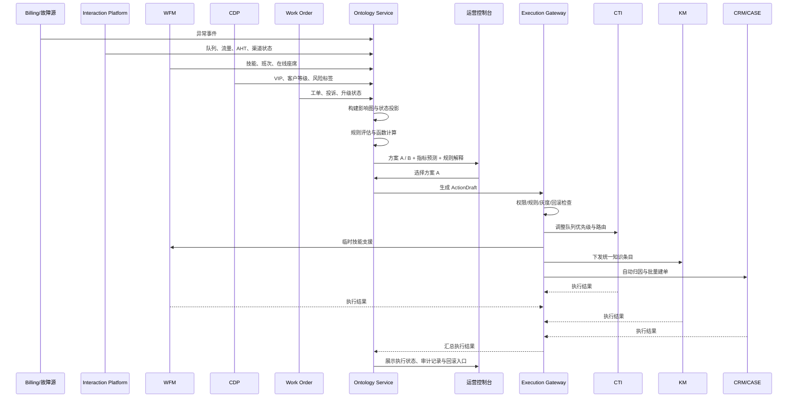

# 契约设计：Ontology Service API、事件与时序

**功能分支**: `006-ontology-service` | **日期**: 2026-04-04 | **规格说明**: [spec.md](spec.md)

> 本文档归纳 `ontology_service` 的对外契约，重点覆盖：  
> HTTP API、异步事件、命令边界以及客服中心应急场景的端到端时序。

---

## 1. 契约原则

### 1.1 命令边界

任何可能导致写回的动作，都必须经过以下链路：

> `PlanOption -> ActionDraft -> Validate -> Approve -> Execute`

### 1.2 跨接口公共字段

所有写接口建议统一带：

- `tenant_id`
- `actor_id`
- `trace_id`
- `idempotency_key`

所有响应建议统一带：

- `version_id`
- `generated_at`
- `trace_id`

---

## 2. HTTP API 分组

### 2.1 模型管理 API

用于导入、校验、发布和激活本体模型。

```http
POST /v1/model/import
POST /v1/model/validate
POST /v1/model/publish
POST /v1/model/activate
GET  /v1/model/versions
GET  /v1/model/versions/{version_id}
```

### 2.2 事件与投影 API

用于接收事件、快照和查询投影结果。

```http
POST /v1/ingest/events
POST /v1/ingest/object-snapshots
POST /v1/projections/rebuild
GET  /v1/objects/{object_id}
GET  /v1/objects/{object_id}/relations
GET  /v1/events/{event_id}/impact
```

### 2.3 分析与规划 API

用于影响分析、多方案比较和解释输出。

```http
POST /v1/analysis/impact
POST /v1/plans/generate
GET  /v1/plans/{plan_session_id}
GET  /v1/plans/{plan_session_id}/options/{option_id}
GET  /v1/plans/{plan_session_id}/options/{option_id}/explain
```

### 2.4 执行与审计 API

用于动作草案、执行检查、审批、执行、回滚和审计。

```http
POST /v1/action-drafts
POST /v1/action-drafts/{draft_id}/validate
POST /v1/action-drafts/{draft_id}/approve
POST /v1/action-drafts/{draft_id}/execute
POST /v1/executions/{execution_id}/rollback
GET  /v1/executions/{execution_id}
GET  /v1/audit/{entity_type}/{entity_id}
```

---

## 3. 核心请求示例

### 3.1 接入事件

```json
{
  "tenant_id": "telco-cn",
  "source_system": "billing",
  "event_type": "billing_charge_anomaly_detected",
  "occurred_at": "2026-04-04T10:15:00+08:00",
  "correlation_id": "evt-1015",
  "payload": {
    "region": "shanghai",
    "severity": "sev1",
    "affected_accounts": 18234
  }
}
```

### 3.2 生成方案

```json
{
  "tenant_id": "telco-cn",
  "scenario_code": "contact_center_emergency",
  "trigger_event_id": "evt-1015",
  "goal": "protect_sla",
  "constraints": {
    "vip_must_protect": true,
    "cross_skill_cert_required": true,
    "max_cost_increase_pct": 15
  }
}
```

### 3.3 生成方案响应

```json
{
  "plan_session_id": "ps_001",
  "options": [
    {
      "option_id": "plan_a",
      "title": "先保 SLA",
      "predictions": {
        "sla_30m": 0.86,
        "abandon_rate_30m": 0.07,
        "complaint_risk_vip": "low",
        "cost_delta_pct": 12
      },
      "triggered_rules": [
        "vip_protection_v3",
        "voice_emergency_priority_v2"
      ]
    }
  ]
}
```

---

## 4. 异步事件主题

建议至少暴露以下 topic：

- `ontology.event.ingested`
- `ontology.object.projected`
- `ontology.impact.analyzed`
- `ontology.plan.generated`
- `ontology.action_draft.validated`
- `ontology.execution.completed`
- `ontology.execution.failed`

---

## 5. 客服中心运营应急端到端时序



---

## 6. API 设计决策清单

1. 所有写回必须先转成 `ActionDraft`
2. 事件接入与快照接入同时存在
3. 对外接口优先以 HTTP JSON 为主，事件总线为辅
4. 解释接口是第一等接口，而不是日志副产物
5. 审计与回滚必须具备独立查询入口
