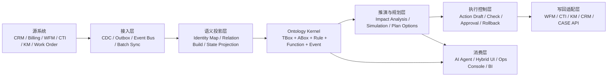
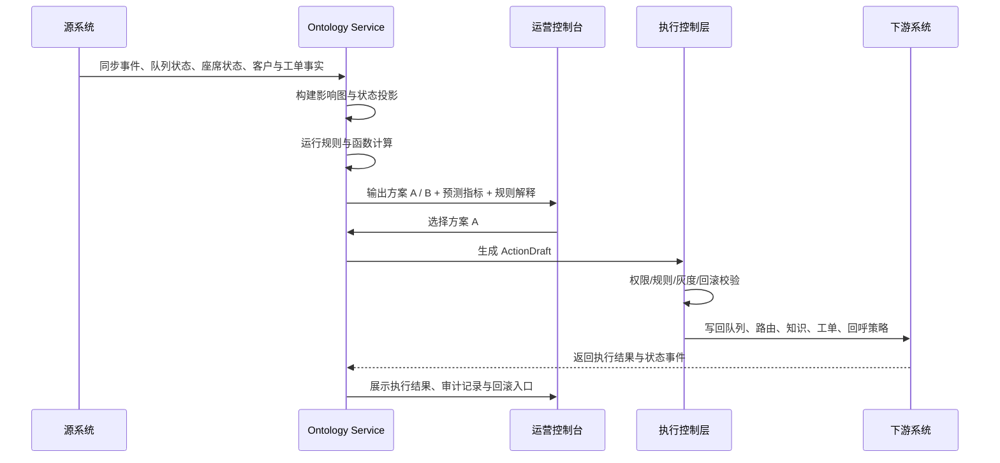

# 实现方案：Ontology Service / 企业运行时语义内核

**功能分支**: `006-ontology-service` | **日期**: 2026-04-04 | **规格说明**: [spec.md](spec.md)

> 本文档是基于 Palantir 相关本体论材料、AI 原生应用 UI 材料、客服运营应急例子，以及当前 `ai-bot` 正在形成的 `CDP + Interaction Platform + Work Order` 架构边界，对 `ontology_service` 的整体定稿方案。  
> 它不以“做一个知识图谱库”为目标，而以“建立企业运行时语义内核”为目标。

> **专题文档导航**：
> - 服务边界、模块划分、现有代码落位见 [service-design.md](service-design.md)
> - 核心数据模型与实体关系见 [data-model.md](data-model.md)
> - API 契约与时序见 [api-contract.md](api-contract.md)
> - 本体建模治理与 OWL 语义文件见 [ontology-modeling.md](ontology-modeling.md)
> - 运营管理低保真界面与图谱交互见 [ui-lowfi.md](ui-lowfi.md)

---

## 目录

- [0. 执行摘要](#0-执行摘要)
- [1. 背景、问题与目标](#1-背景问题与目标)
- [2. 设计原则](#2-设计原则)
- [3. Ontology Service 的正式定义](#3-ontology-service-的正式定义)
- [4. 全局架构位置](#4-全局架构位置)
- [5. 六层架构设计](#5-六层架构设计)
- [6. 核心模型体系](#6-核心模型体系)
- [7. 运行时数据流与闭环](#7-运行时数据流与闭环)
- [8. 存储路线与技术取舍](#8-存储路线与技术取舍)
- [9. 服务模块拆分](#9-服务模块拆分)
- [10. 客服中心运营应急闭环](#10-客服中心运营应急闭环)
- [11. 与现有模块的关系](#11-与现有模块的关系)
- [12. 治理、审计与安全边界](#12-治理审计与安全边界)
- [13. 分阶段落地路线](#13-分阶段落地路线)
- [14. 关键架构决策](#14-关键架构决策)

---

## 0. 执行摘要

### 0.1 一句话定义

`ontology_service` 应被定义为：

> **企业运行时语义内核**
> = **统一业务对象模型** + **规则与约束层** + **事件与状态投影层** + **函数与推演层** + **受控执行编排层**

它的任务不是替代微服务事务库，而是把分散在多个业务系统中的对象、关系、事件、规则和动作，组织成一个可计算、可解释、可执行、可审计的语义闭环。

### 0.2 最关键的架构判断

1. `ontology_service` 不是“又一个数据库”，而是跨系统的运行时语义层。
2. 源系统仍然拥有交易真值，Ontology 负责语义投影、推演、规划和受控执行。
3. 本体建模不能只覆盖静态对象关系，必须同时覆盖行为、规则、事件和动作。
4. `TBox` 与 `ABox` 必须严格分层，模型定义与运行时实例不能混成一团。
5. LLM 只能生成 `ActionDraft`，不能直接写生产；执行必须经过治理与校验层。
6. V1 应采用 `RDBMS + Event Stream + Graph Projection` 的混合架构，而不是一开始就押注纯 RDF 平台。

---

## 1. 背景、问题与目标

### 1.1 背景

当前 `ai-bot` 正在向多个基础能力演进：

- `CDP` 负责客户语义层与客户事实底座
- `Interaction Platform` 负责统一互动与路由
- `Work Order` 负责长生命周期后续处理
- `Agent Workspace` 负责坐席执行面

这些模块分别解决一部分问题，但还缺少一个更高层的统一语义骨架，用来回答：

- 系统里到底有哪些业务对象？
- 它们之间是什么关系？
- 哪些规则约束这些关系与动作？
- 某个事件发生后会影响哪些对象和资源？
- 在目标指标与约束条件下，系统应如何生成、比较并执行方案？

### 1.2 当前结构性问题

1. 数据分散在多个微服务、多个数据库和多套字段口径中
2. 行为与规则往往存在于代码分支、脚本、文档和人工经验里
3. 报表层只能解释“发生了什么”，难以支撑“为什么这样决策”和“接下来怎么执行”
4. LLM 如果直接消费散乱字段，很容易产生不可解释、不可审计的建议
5. 下游系统如果各自拼接语义，会很快长出多个“伪本体层”

### 1.3 目标

`ontology_service` 的目标不是让企业“更聪明”，而是把企业的决策与执行机制改造成：

- 可计算
- 可治理
- 可解释
- 可复用
- 可回放
- 可控执行

---

## 2. 设计原则

### 2.1 语义优先，而非字段优先

Ontology 的建模单位必须是业务对象与业务关系，而不是源表字段的镜像聚合。同步层应服务于语义投影，而不是反过来让模型退化为表映射清单。

### 2.2 静态与动态统一

对象、属性、关系是静态语义；状态、行为、规则、事件、动作是动态语义。V1 必须同时覆盖两类语义，否则平台只能“知道结构”，不能“驱动运行”。

### 2.3 源系统保留所有权

`ontology_service` 不是第二套业务系统。`Billing`、`CRM`、`WFM`、`CTI`、`Work Order` 等仍保有各自事务真值。Ontology 只承接：

- 语义投影
- 派生事实
- 规划结果
- 动作草案
- 审计记录

### 2.4 先草案，后执行

任何 AI 生成的动作都必须先成为 `ActionDraft`。执行只有在权限、规则、灰度、审批和回滚检查通过后才允许发生。

### 2.5 界面模型与业务本体分层

`Hybrid UI`、`m9-ui-model` 可以复用业务本体，但不能反向污染核心对象、关系和规则模型。UI 是消费层，不是业务真值层。

---

## 3. Ontology Service 的正式定义

### 3.1 正式定义

建议将 `ontology_service` 定义为：

> **面向企业运行时的语义内核服务，负责统一业务对象与关系、沉淀事件与状态投影、管理规则与函数、生成可解释方案，并在治理约束下把动作写回到下游系统。**

### 3.2 作用范围

`ontology_service` 必须负责：

- 对象、关系、规则、函数、动作的统一建模
- 多微服务数据与事件的语义投影
- 运行时实例图、影响图和派生事实构建
- 规则评估、函数计算、多方案规划
- 受控动作草案生成与执行校验
- 审计、重放、版本与治理

`ontology_service` 明确不负责：

- 替代业务系统的原始事务处理
- 直接承担渠道消息处理、工单流程运行或客户真值管理
- 把 LLM 变成生产系统的直接管理员

---

## 4. 全局架构位置

### 4.1 与其他模块的关系

- `CDP` 负责客户主体与客户事实
- `Interaction Platform` 负责互动、路由与坐席工作流
- `Work Order` 负责后续任务与长生命周期流程
- `Ontology Service` 负责把这些模块中的对象与运行语义提升到统一层，并在跨系统场景中完成推演与动作编排

---

## 5. 六层架构设计

### 5.1 第一层：Model Registry

负责定义并版本化各类模型：

- 对象类型
- 关系类型
- 状态机
- 规则
- 函数
- 动作模板
- 场景模型

推荐使用 `YAML/JSON` 作为声明格式，Git 管理版本，服务启动时编译入元数据仓。

### 5.2 第二层：Sync & Projection

负责把来自多个微服务的表与事件同步成统一实例层：

- 标准化字段
- 对齐业务键
- 构建 identity map
- 聚合实例
- 生成关系边
- 投影状态与派生属性

### 5.3 第三层：Ontology Kernel

负责保存：

- `TBox` 元模型
- `ABox` 实例图
- 规则与函数定义
- 事件事实
- 派生事实
- 索引与检索视图

这是整个服务的语义核心。

### 5.4 第四层：Reasoning & Planning

负责：

- 影响面分析
- 图遍历与关系查询
- 规则评估
- 目标函数计算
- 场景模拟
- 多方案比较
- 可解释输出

### 5.5 第五层：Execution Control

负责把方案转换为 `ActionDraft`，并执行：

- 权限校验
- 规则校验
- 合规检查
- 灰度检查
- 审批流
- 回滚策略装配

### 5.6 第六层：Writeback Adapters

负责把通过校验的动作写回源系统，例如：

- `WFM` 调整班次或临时支援
- `CTI` 调整队列优先级或路由规则
- `KM` 下发统一口径知识条目
- `CRM / CASE` 自动归因与批量建单
- `Outbound` 触发回呼策略

---

## 6. 核心模型体系

### 6.1 V1 推荐模型族

建议将模型体系组织为以下几类：

| 模型族 | 作用 |
|---|---|
| `M1 Object Model` | 定义业务对象、属性、关系与聚合根 |
| `M2 Behavior Model` | 定义状态机、动作前后条件与行为转换 |
| `M3 Rule Model` | 定义约束、优先级、阈值与合规规则 |
| `M4 Scenario Model` | 定义场景模板，如客服应急、投诉升级、容量告警 |
| `M5 Actor Model` | 定义角色、权限、责任边界与审批主体 |
| `M6 Compensation Model` | 定义失败补偿、人工接管、回滚与超时策略 |
| `M7 Quality Model` | 定义 SLA、AHT、放弃率、投诉率、时效等指标 |
| `ME Event Model` | 定义领域事件、订阅关系与触发链 |
| `MF Function Model` | 定义预测、评分、成本质量权衡等函数 |
| `MA Action Model` | 定义动作模板、写回适配与参数约束 |

### 6.2 TBox 与 ABox

`TBox` 负责“类型与约束”：

- `Event` 是什么
- `Queue` 能与哪些对象关联
- `Agent` 拥有哪些技能
- 哪些规则限制跨技能支援

`ABox` 负责“实例与事实”：

- `event#billing-spike-20260404-1015`
- `queue#voice-billing-vip`
- `agent#A1029`
- `agent#A1029 hasSkill skill#billing-certified`

这一分层必须严格保留，否则运行时事实与模型定义会互相污染。

---

## 7. 运行时数据流与闭环

### 7.1 核心流程

1. 源系统表变更和领域事件进入接入层
2. 投影层构建或更新语义实例
3. Ontology Kernel 更新对象、关系、状态与事件图
4. 推演层根据场景与规则生成方案集
5. 用户或 Agent 选择方案
6. 执行控制层生成 `ActionDraft`
7. 校验通过后写回目标系统
8. 写回结果再次以事件形式回流，形成闭环

### 7.2 闭环要点

- 每一步都必须可重放
- 每一步都必须可解释
- 每一步都必须有审计痕迹
- 写回必须受控，不允许从“洞察”直接跳到“裸执行”

---

## 8. 存储路线与技术取舍

### 8.1 V1 推荐路线

V1 推荐采用：

> **PostgreSQL + Event Stream + Graph Projection**

其中：

- `PostgreSQL` 保存元模型、实例主表、规则、函数、动作草案、审计记录
- `Event Stream` 保存 append-only 事件事实，用于重放和投影重建
- `Graph Projection` 保存高频关系查询所需的节点边视图与索引

### 8.2 为什么不建议 V1 直接采用纯 RDF / Triple Store

纯 RDF / OWL / Triple Store 在语义表达上很强，但对 V1 有三个现实问题：

1. 事务语义、规则执行、动作编排与审计往往仍需另起一套运行时体系
2. 团队学习成本和工程集成成本较高
3. 当前目标首先是“跨系统语义闭环”，而不是“学术型本体推理完备性”

因此更务实的路线是：

- 先用关系库承载元数据与运行时对象
- 用事件流承接变化与重建
- 用图投影服务多跳关系分析
- 当多跳图查询和复杂图算法成为瓶颈时，再引入 `Neo4j / NebulaGraph / JanusGraph` 等专门图引擎作为加速层

### 8.3 与 Graph DB 的关系

Graph DB 在这个方案里更适合作为：

- 查询加速层
- 影响分析层
- 多跳路径探索层

而不是一开始就承担全部业务语义、规则和动作真值。

---

## 9. 服务模块拆分

建议将 `ontology_service` 拆成以下子模块：

1. `model-registry`
   - 负责模型定义、版本、发布和回滚
2. `projection-engine`
   - 负责同步、标准化、投影与实例关系构建
3. `ontology-runtime`
   - 负责实例图、状态图、事件事实和索引视图
4. `rule-engine`
   - 负责规则评估与约束解释
5. `function-engine`
   - 负责预测、评分、模拟和指标计算
6. `planner`
   - 负责多方案生成、比较与解释
7. `execution-gateway`
   - 负责动作草案、审批、校验和回滚编排
8. `adapter-hub`
   - 负责向 `WFM / CTI / KM / CRM / CASE` 写回
9. `governance-center`
   - 负责权限、审计、血缘、重放与可观测性

---

## 10. 客服中心运营应急闭环

### 10.1 场景目标

以“上午 10:15 网络故障或账单扣费异常，导致来电与线上消息暴涨”为例，系统需要完整走通：

- 听得懂
- 算得清
- 做得出

### 10.2 关键对象

- `Event`
- `Channel`
- `Queue`
- `Skill`
- `Agent`
- `Shift`
- `Customer`
- `Ticket`
- `Policy`
- `PlanOption`
- `ActionDraft`

### 10.3 端到端时序

### 10.4 方案生成示例

方案 A，先保 SLA：

- 提升事件相关队列优先级
- 从低优先级业务队列抽调具备技能的座席支援
- 调整机器人转人工阈值
- 对 VIP 客户触发回呼或专席策略

方案 B，先控成本：

- 优先做知识推送与机器人引导
- 只做有限技能合并
- 不做大规模人力调度

Ontology 的价值不在于输出一段建议文本，而在于：

- 每个方案都能量化预估结果
- 每个方案都能指出命中的规则与风险
- 每个动作都能生成受控草案并执行审计

---

## 11. 与现有模块的关系

### 11.1 与 `CDP` 的关系

`CDP` 提供客户主体、身份、关系和客户事实；`ontology_service` 在其上继续构造跨域语义关系与运行时规划。

### 11.2 与 `Interaction Platform` 的关系

`Interaction Platform` 管理 conversation、interaction、routing、workspace；`ontology_service` 不接管这些事务，但会把它们投影为全局对象并参与方案推演。

### 11.3 与 `Work Order` 的关系

`Work Order` 负责长期处理流程；`ontology_service` 负责把工单与事件、知识、客户和动作计划关联起来，并在需要时触发自动归因或批量建单。

### 11.4 与 `Hybrid UI` 的关系

`Hybrid UI` 应作为本体消费层存在。UI schema 可以引用本体对象、关系和动作能力，但不应替代业务本体本身。

---

## 12. 治理、审计与安全边界

V1 至少需要具备以下治理能力：

- 模型版本管理
- 规则版本管理
- 动作模板版本管理
- 来源血缘与投影来源说明
- 动作审批记录
- 写回审计与回滚记录
- 事件重放与方案重算
- 角色权限与最小授权

核心安全原则只有一句：

> **AI 可以提议，但不能绕过治理直接执行。**

---

## 13. 分阶段落地路线

### 13.1 Phase 1

目标：跑通客服中心运营应急闭环。

范围：

- 建立核心模型族
- 打通 `Event / Queue / Skill / Agent / Ticket / Customer` 投影
- 建立规则与函数运行框架
- 输出多方案评估与 `ActionDraft`
- 接入有限写回目标，如 `CTI / KM / CASE`

### 13.2 Phase 2

目标：扩展到更多运营与服务场景。

范围：

- 投诉升级
- 外呼回访
- 营销触达约束
- 公私域联动
- 复杂跨域依赖分析

### 13.3 Phase 3

目标：形成可复用的企业语义操作系统。

范围：

- 图查询加速层
- 更成熟的场景建模与动作编排
- 更丰富的 Hybrid UI 支撑
- 更强的可视化模型管理与调试工具

---

## 14. 关键架构决策

1. `ontology_service` 定位为运行时语义内核，而不是知识图谱展示服务。
2. 采用 `TBox + ABox` 分层，严格区分模型与实例。
3. 同时建模对象、关系、状态、事件、规则、函数和动作。
4. V1 采用 `PostgreSQL + Event Stream + Graph Projection` 混合路线。
5. Graph DB 可作为加速层引入，但不作为第一阶段唯一真值。
6. LLM 只生成草案，执行必须经过治理层。
7. UI 模型与业务本体分层治理，不在核心运行时内混存。
8. 第一阶段以“客服中心运营应急”作为验收场景，而不是追求抽象完备先行。
