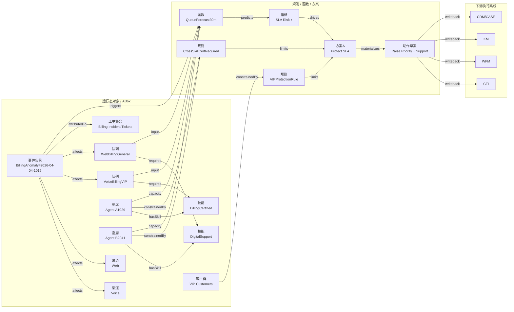

# 低保真：运营管理中的本体建模工作台与关系图谱页

**功能分支**: `006-ontology-service` | **日期**: 2026-04-04 | **规格说明**: [spec.md](spec.md)

> 本文档归纳最近讨论中的界面部分，重点覆盖：  
> 运营管理里的本体建模工作台、对象关系图谱页、节点与边的定义、交互动作，以及客服中心应急场景样稿。

---

## 1. 界面设计原则

参考资料中的 UI 与编辑器经验，界面设计应遵循以下原则：

1. 采用 `Hybrid UI` 三栏布局
2. 左侧承载模型树与导航
3. 中间承载结构化编辑或图谱画布
4. 右侧承载 AI 解释、影响分析和源视图
5. UI 只管理模型资产，不成为模型真相源

---

## 2. 运营管理菜单建议

```text
运营管理
├─ 本体建模
│  ├─ 模型工作台
│  ├─ 关系图谱
│  ├─ 场景模拟
│  ├─ 版本发布
│  └─ 运行态实例
├─ 规则中心
├─ 动作模板中心
├─ 审批与回滚
└─ 审计追踪
```

---

## 3. 本体模型工作台低保真

```text
┌─────────────────────────────────────────────────────────────────────────────┐
│ Ontology Studio                                            [校验] [保存] [发布] │
├───────────────┬───────────────────────────────────────┬──────────────────────┤
│ 模型树         │ 编辑区                                  │ AI / 解释 / 影响分析   │
│               │                                       │                      │
│ ▾ M1 对象模型  │ 名称: Queue                            │ 说明摘要              │
│   ▸ Event     │ 编码: queue                            │ 这个对象用于表示...     │
│   ▸ Queue     │ 标签: 队列                              │                      │
│   ▸ Skill     │ 聚合根: 是                              │ 引用分析              │
│   ▸ Agent     │                                       │ - 被 4 个规则引用      │
│               │ 属性定义                               │ - 被 2 个场景使用      │
│ ▾ M2 行为模型  │ - priority: Integer                    │                      │
│   ▸ 调整优先级 │ - slaThreshold: Duration               │ AI建议                │
│   ▸ 跨技能支援 │ - channelType: Enum                    │ “建议补充 overflow…”   │
│               │                                       │                      │
│ ▾ M3 规则模型  │ 关系定义                               │ 变更影响              │
│   ▸ VIP保护    │ - requiresSkill -> Skill               │ 修改该属性会影响：     │
│   ▸ 认证校验   │ - belongsToChannel -> Channel          │ Plan A / Plan B        │
│               │                                       │                      │
│ ▾ ME 事件模型  │ [新增属性] [新增关系]                   │ [生成说明] [生成校验]  │
└───────────────┴───────────────────────────────────────┴──────────────────────┘
```

---

## 4. 对象关系图谱页低保真

```text
┌────────────────────────────────────────────────────────────────────────────────────────────────────┐
│ 运营管理 / 本体建模 / 对象关系图谱                                  版本 v0.8   [TBox] [ABox] [叠加] [场景] │
├────────────────────────────────────────────────────────────────────────────────────────────────────┤
│ 搜索对象/规则/事件 [____________________]   视角 [全局] [聚合根] [选中邻域]   深度 [1] [2] [3]   [刷新] │
├──────────────────┬──────────────────────────────────────────────────────────────┬───────────────────┤
│ 模型与过滤器       │ 图谱画布                                                       │ 详情与解释            │
│                  │                                                              │                   │
│ 范围              │                      [缩略图]                                 │ 选中节点: Queue     │
│ - Ontology版本    │                                                              │ 类型: ObjectType    │
│ - 租户            │        Event ──affects──> Queue ──requires──> Skill          │ 编码: queue         │
│ - 场景            │          │                   ▲                ▲               │ 聚合根: ContactCenter│
│ - 时间窗口        │          ├─triggers──> Rule ─┘                │               │ 状态: Active        │
│                  │          └─triggers──> Function ──> Plan ──> ActionDraft      │                   │
│ 层级开关          │                                              │               │ 属性                │
│ ☑ M1 对象模型     │                        Agent ──hasSkill──────┘               │ - priority         │
│ ☑ M2 行为模型     │                                                              │ - slaThreshold     │
│ ☑ M3 规则模型     │ [适配画布] [聚焦选中] [仅显示邻居] [最短路径] [查看影响] [导出] │                   │
│ ☑ M4 场景模型     │                                                              │ 关系                │
│ ☑ M5 主体模型     │                                                              │ - requiresSkill    │
│ ☑ M6 补偿模型     │                                                              │ - affectedByEvent  │
│ ☑ M7 质量模型     │                                                              │                   │
│ ☑ ME 事件模型     │                                                              │ 引用/影响           │
│                  │                                                              │ - 被 4 条规则引用    │
│ 图例              │                                                              │ - 被 2 个场景使用    │
│ ● 对象  ◆ 规则     │                                                              │                   │
│ ⬢ 事件  ▭ 行为     │                                                              │ [查看YAML] [查看OWL]│
│ ⬡ 方案  ◌ 实例     │                                                              │ [查看实例] [模拟路径]│
├──────────────────┴──────────────────────────────────────────────────────────────┴───────────────────┤
│ 时间轴 / 场景播放: 10:15 Event → 10:17 Forecast → 10:19 Rule Hit → 10:21 Plan A → 10:23 Draft      │
│ [播放] [暂停] [下一步] [回到上一步] [仅高亮命中链路]                                                    │
└────────────────────────────────────────────────────────────────────────────────────────────────────┘
```

---

## 5. 节点定义

| 节点类型 | 形状 | 颜色 | 含义 |
|---|---|---|---|
| 对象类型 | 圆角矩形 | 蓝色 | `M1` 里的业务对象 |
| 行为定义 | 胶囊形 | 绿色 | `M2` 里的行为 |
| 规则定义 | 菱形 | 红色 | `M3` 里的规则 |
| 场景定义 | 六边形 | 紫色 | `M4` 里的场景 |
| 主体/角色 | 人形矩形 | 橙色 | `M5` 里的主体与权限 |
| 补偿/回滚 | 双边框矩形 | 棕色 | `M6` 里的补偿与回滚 |
| 质量指标 | 小矩形 | 灰蓝色 | `M7` 里的质量指标 |
| 事件定义 | 六角形 | 黄色 | `ME` 里的事件类型 |
| 实例节点 | 圆形 | 浅色 | `ABox` 实例 |
| 方案/动作 | 文档矩形 | 紫灰色 | 规划结果和动作草案 |

---

## 6. 边定义

| 边类型 | 线型 | 含义 |
|---|---|---|
| 语义关系 | 实线 | 对象间静态业务关系 |
| 触发关系 | 虚线 | 事件触发行为、规则、函数 |
| 约束关系 | 红色实线 | 规则约束对象或行为 |
| 产出关系 | 绿色虚线 | 行为或函数产出事件、指标、方案 |
| 依赖关系 | 点线 | 场景、规则、行为之间的引用 |
| 实例归属 | 灰色细虚线 | 实例映射到类型 |
| 写回关系 | 粗实线 | 动作草案写回目标系统 |

---

## 7. 图例与状态编码

| 编码 | 含义 |
|---|---|
| 节点浅色填充 | `TBox` 抽象模型 |
| 节点深色填充 | `ABox` 运行时实例 |
| 节点外圈高亮 | 当前选中 |
| 节点外圈虚线 | Draft 未发布 |
| 节点右上角 `!` | 有校验错误或规则冲突 |
| 节点右上角 `Δ` | 与当前激活版本存在差异 |

---

## 8. 交互动作

| 动作 | 结果 |
|---|---|
| 单击节点 | 打开详情、属性、引用与影响范围 |
| 双击节点 | 展开一跳邻居 |
| `Shift + 单击` | 多选节点 |
| 悬停节点 | 预览摘要、版本、来源 |
| 悬停边 | 显示谓词、方向、来源模型文件 |
| `仅显示邻居` | 聚焦当前节点上下游 |
| `最短路径` | 展示两个节点间最短语义路径 |
| `查看影响` | 展示该节点修改后的影响范围 |
| `查看YAML` | 跳到原始模型定义 |
| `查看OWL` | 跳到导出的 OWL 片段 |
| `查看实例` | 从 `TBox` 跳到对应 `ABox` 实例 |
| `模拟路径` | 以时间轴方式高亮命中链路 |

---

## 9. 客服中心应急场景 Mermaid 样稿



---

## 10. 界面决策清单

1. 采用三栏 Hybrid UI
2. 左侧模型树按 `M1-M7 + Event` 组织
3. 中间图谱画布支持 `TBox / ABox / 叠加 / 场景`
4. 右侧面板同时支持详情、影响分析、YAML / OWL / Runtime 三视图
5. 底部时间轴专门服务场景模拟
6. 默认打开方式优先展示“客服中心运营应急”场景视角，而不是全量宇宙图谱
