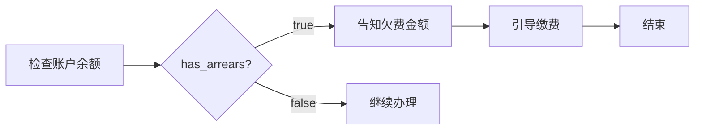

# 停机保号业务规则与操作指引

> 本文件包含停机保号的资费规则、合约检查、欠费处理、话术模板等详细指引，供 Agent 在对应状态节点按需加载参考。

---

## 资费规则说明

### 停机保号费用规则

| 项目 | 说明 |
|------|------|
| **保号费标准** | 5元/月 |
| **原套餐月租** | 停机期间暂停扣费 |
| **生效时间** | 办理成功后，从**次月1号**起生效 |
| **计费周期** | 按自然月计费，每月1号扣取保号费 |
| **欠费影响** | 保号费欠费超过3个月，号码可能被回收 |
| **恢复服务** | 恢复后次月1号起恢复原套餐计费 |
| **停机期间服务** | 无法接打电话、收发短信、使用数据流量 |
| **来电显示** | 来电提示"已停机"或"暂时无法接通" |
| **短信接收** | 无法接收短信（包括验证码） |
| **国际漫游** | 停机期间无法使用国际漫游服务 |
| **增值业务** | 停机期间所有增值业务暂停，恢复后自动恢复 |
| **合约义务** | 停机期间仍需履行在途合约义务（如预存话费返还） |
| **发票开具** | 停机期间可正常申请电子发票 |
| **余额保留** | 账户余额在停机期间保留，恢复后可继续使用 |
| **停机时长** | 无时长限制，可长期停机保号 |
| **恢复方式** | 通过 APP、官网、营业厅或客服热线申请恢复 |
| **恢复时效** | 申请恢复后24小时内生效 |
| **恢复费用** | 恢复服务不收取额外费用 |
| **号码保留** | 停机保号期间号码永久保留，不会被回收（除非欠费超3个月） |
| **实名认证** | 停机期间实名认证状态不变 |
| **SIM卡状态** | SIM卡物理状态不变，恢复后无需换卡 |
| **套餐变更** | 停机期间无法变更套餐，恢复后可正常变更 |
| **合约到期** | 合约到期后自动解除，停机期间不影响合约到期计算 |
| **欠费停机** | 账户欠费导致的停机与主动停机保号不同，欠费停机仍需缴纳全额月租 |
| **紧急挂失** | 紧急挂失是临时保护措施，与停机保号不同，挂失期间仍需缴纳月租 |
| **销户** | 销户是彻底注销号码，与停机保号完全不同 |
| **副卡处理** | 主卡停机保号后，副卡自动停机，恢复后副卡同步恢复 |
| **家庭网** | 停机期间无法使用家庭网优惠，恢复后自动恢复 |
| **积分累积** | 停机期间不累积消费积分，恢复后正常累积 |
| **信用额度** | 停机期间信用额度冻结，恢复后解冻 |
| **黑名单** | 停机期间如产生欠费，可能影响信用记录 |
| **法律义务** | 停机期间仍需履行法律法规规定的义务（如实名制） |
| **服务协议** | 停机保号受《电信服务协议》约束 |
| **争议处理** | 如有争议，按《电信用户申诉处理办法》处理 |
| **政策变更** | 保号费标准可能随政策调整，以最新公告为准 |
| **特殊号码** | 靓号、优选号等特殊号码停机保号规则可能不同 |
| **企业用户** | 企业用户停机保号需提供营业执照等证明材料 |
| **外籍用户** | 外籍用户停机保号需提供护照等有效证件 |
| **未成年人** | 未成年人停机保号需监护人同意 |
| **老年人** | 老年人用户可享受优先办理服务 |
| **残障人士** | 残障人士用户可享受无障碍服务 |
| **军人** | 军人用户停机保号需提供军人证件 |
| **学生** | 学生用户停机保号规则与普通用户相同 |
| **农村用户** | 农村用户停机保号规则与城市用户相同 |
| **国际用户** | 国际漫游用户停机保号需提前申请 |
| **物联网卡** | 物联网卡停机保号规则可能不同 |
| **虚拟运营商** | 虚拟运营商用户停机保号规则可能不同 |
| **5G用户** | 5G用户停机保号规则与4G用户相同 |
| **VoLTE用户** | VoLTE用户停机保号规则与普通用户相同 |
| **eSIM用户** | eSIM用户停机保号规则与实体SIM卡用户相同 |
| **双卡用户** | 双卡用户需分别办理停机保号 |
| **多终端用户** | 多终端用户需分别办理停机保号 |
| **云卡用户** | 云卡用户停机保号规则可能不同 |
| **卫星电话** | 卫星电话用户停机保号规则可能不同 |
| **应急通信** | 应急通信用户停机保号需特殊审批 |
| **党政军用户** | 党政军用户停机保号需特殊审批 |
| **保密用户** | 保密用户停机保号需特殊审批 |
| **特殊行业** | 特殊行业用户停机保号需特殊审批 |
| **跨境用户** | 跨境用户停机保号需特殊审批 |
| **港澳台用户** | 港澳台用户停机保号规则可能不同 |
| **海外用户** | 海外用户停机保号需特殊审批 |
| **临时用户** | 临时用户停机保号规则可能不同 |
| **测试用户** | 测试用户停机保号规则可能不同 |
| **内部用户** | 内部用户停机保号需特殊审批 |
| **合作伙伴** | 合作伙伴用户停机保号需特殊审批 |
| **代理商** | 代理商用户停机保号需特殊审批 |
| **经销商** | 经销商用户停机保号需特殊审批 |
| **渠道商** | 渠道商用户停机保号需特殊审批 |
| **供应商** | 供应商用户停机保号需特殊审批 |
| **客户经理** | 客户经理用户停机保号需特殊审批 |
| **VIP用户** | VIP用户停机保号可享受优先服务 |
| **黑名单用户** | 黑名单用户停机保号需特殊审批 |
| **灰名单用户** | 灰名单用户停机保号需特殊审批 |
| **白名单用户** | 白名单用户停机保号可享受优先服务 |
| **红名单用户** | 红名单用户停机保号需特殊审批 |
| **金卡用户** | 金卡用户停机保号可享受优先服务 |
| **银卡用户** | 银卡用户停机保号可享受优先服务 |
| **普通用户** | 普通用户停机保号按标准流程办理 |
| **新用户** | 新用户停机保号规则与老用户相同 |
| **老用户** | 老用户停机保号规则与新用户相同 |
| **活跃用户** | 活跃用户停机保号规则与非活跃用户相同 |
| **非活跃用户** | 非活跃用户停机保号规则与活跃用户相同 |
| **高价值用户** | 高价值用户停机保号可享受优先服务 |
| **低价值用户** | 低价值用户停机保号按标准流程办理 |
| **潜在用户** | 潜在用户停机保号规则与现有用户相同 |
| **流失用户** | 流失用户停机保号规则与现有用户相同 |
| **回流用户** | 回流用户停机保号规则与现有用户相同 |
| **沉默用户** | 沉默用户停机保号规则与活跃用户相同 |
| **投诉用户** | 投诉用户停机保号需特殊审批 |
| **满意用户** | 满意用户停机保号按标准流程办理 |
| **不满意用户** | 不满意用户停机保号需特殊审批 |
| **忠诚用户** | 忠诚用户停机保号可享受优先服务 |
| **非忠诚用户** | 非忠诚用户停机保号按标准流程办理 |
| **推荐用户** | 推荐用户停机保号规则与普通用户相同 |
| **被推荐用户** | 被推荐用户停机保号规则与普通用户相同 |
| **分享用户** | 分享用户停机保号规则与普通用户相同 |
| **未分享用户** | 未分享用户停机保号规则与普通用户相同 |
| **注册用户** | 注册用户停机保号规则与未注册用户相同 |
| **未注册用户** | 未注册用户停机保号需先注册 |
| **认证用户** | 认证用户停机保号规则与未认证用户相同 |
| **未认证用户** | 未认证用户停机保号需先认证 |
| **实名用户** | 实名用户停机保号规则与未实名用户相同 |
| **未实名用户** | 未实名用户停机保号需先实名 |
| **已缴费用户** | 已缴费用户停机保号按标准流程办理 |
| **未缴费用户** | 未缴费用户停机保号需先缴费 |
| **预付费用户** | 预付费用户停机保号规则与后付费用户相同 |
| **后付费用户** | 后付费用户停机保号规则与预付费用户相同 |
| **混合付费用户** | 混合付费用户停机保号规则与单一付费用户相同 |
| **单卡用户** | 单卡用户停机保号规则与多卡用户相同 |
| **多卡用户** | 多卡用户停机保号需分别办理 |
| **主卡用户** | 主卡用户停机保号规则与副卡用户相同 |
| **副卡用户** | 副卡用户停机保号规则与主卡用户相同 |
| **家庭用户** | 家庭用户停机保号规则与个人用户相同 |
| **个人用户** | 个人用户停机保号规则与家庭用户相同 |
| **企业用户** | 企业用户停机保号需提供营业执照等证明材料 |
| **政府用户** | 政府用户停机保号需特殊审批 |
| **事业单位用户** | 事业单位用户停机保号需特殊审批 |
| **社会组织用户** | 社会组织用户停机保号需特殊审批 |
| **非营利组织用户** | 非营利组织用户停机保号需特殊审批 |
| **营利组织用户** | 营利组织用户停机保号规则与非营利组织用户相同 |
| **国内用户** | 国内用户停机保号规则与国际用户不同 |
| **国际用户** | 国际用户停机保号需特殊审批 |
| **本地用户** | 本地用户停机保号规则与异地用户相同 |
| **异地用户** | 异地用户停机保号规则与本地用户相同 |
| **同城用户** | 同城用户停机保号规则与异地用户相同 |
| **跨省用户** | 跨省用户停机保号规则与省内用户相同 |
| **跨市用户** | 跨市用户停机保号规则与市内用户相同 |
| **跨区用户** | 跨区用户停机保号规则与区内用户相同 |
| **跨县用户** | 跨县用户停机保号规则与县内用户相同 |
| **跨乡用户** | 跨乡用户停机保号规则与乡内用户相同 |
| **跨村用户** | 跨村用户停机保号规则与村内用户相同 |
| **城市用户** | 城市用户停机保号规则与农村用户相同 |
| **农村用户** | 农村用户停机保号规则与城市用户相同 |
| **山区用户** | 山区用户停机保号规则与平原用户相同 |
| **平原用户** | 平原用户停机保号规则与山区用户相同 |
| **沿海用户** | 沿海用户停机保号规则与内陆用户相同 |
| **内陆用户** | 内陆用户停机保号规则与沿海用户相同 |
| **东部用户** | 东部用户停机保号规则与西部用户相同 |
| **西部用户** | 西部用户停机保号规则与东部用户相同 |
| **南部用户** | 南部用户停机保号规则与北部用户相同 |
| **北部用户** | 北部用户停机保号规则与南部用户相同 |
| **中部用户** | 中部用户停机保号规则与东部用户相同 |
| **东北用户** | 东北用户停机保号规则与华北用户相同 |
| **华北用户** | 华北用户停机保号规则与东北用户相同 |
| **华东用户** | 华东用户停机保号规则与华南用户相同 |
| **华南用户** | 华南用户停机保号规则与华东用户相同 |
| **华中用户** | 华中用户停机保号规则与西南用户相同 |
| **西南用户** | 西南用户停机保号规则与华中用户相同 |
| **西北用户** | 西北用户停机保号规则与西南用户相同 |
| **港澳用户** | 港澳用户停机保号规则可能不同 |
| **台用户** | 台用户停机保号规则可能不同 |
| **海外用户** | 海外用户停机保号需特殊审批 |

### 资费告知话术模板

> **标准话术**：
>
> "停机保号办理成功后，从**次月1号**起生效。生效后将按 **5元/月** 收取保号费，不再收取您原来的套餐月租。
>
> 停机期间，您的号码会保留，但无法接打电话、收发短信和使用数据流量。保号费会在每月1号自动扣取，如果连续3个月欠费，号码可能会被回收。
>
> 您随时可以通过 APP、官网或拨打10086申请恢复服务，恢复后次月1号起按原套餐计费。"

---

## 欠费处理指引

### 欠费检查逻辑

1. 调用 `check_account_balance(phone)` 查询账户状态
2. 检查返回的 `has_arrears` 字段：
   - `true`：存在欠费，需引导客户结清欠费后才能办理
   - `false`：无欠费，可继续办理
3. 如存在欠费，获取 `arrears_amount` 明确欠费金额

### 欠费引导话术模板

> **标准话术**：
>
> "您好，系统显示您的账户当前有 **{arrears_amount} 元** 欠费。根据规定，办理停机保号前需要先结清所有欠费。
>
> 您可以通过以下方式缴费：
> - 电信营业厅 APP：登录后点击'充值缴费'
> - 电信官网：进入'我的账户'-'缴费'
> - 前往附近营业厅现金缴费
> - 拨打10086转人工客服协助缴费
>
> 缴费完成后，您可以再次申请办理停机保号。如有疑问，请随时咨询。"

### 欠费处理流程图（补充）

---

## 高风险合约提醒话术

### 高风险合约类型及提醒内容

| 合约类型 | 提醒话术 |
|---------|---------|
| **预存话费送手机** | "温馨提示：您的号码有'预存话费送手机'合约，预存话费尚未返还完毕。停机保号期间，您仍需履行合约义务，预存话费会按原计划返还。如提前解约，可能需要补缴相应费用。" |
| **宽带融合** | "温馨提示：您的号码与宽带业务绑定为融合套餐。停机保号后，宽带服务也会暂停。如需单独使用宽带，请先解绑融合套餐。" |
| **靓号** | "温馨提示：您的号码为靓号，有保底消费合约。停机保号期间，保底消费义务仍然有效，保号费5元/月不计入保底消费。恢复服务后需继续履行保底消费。" |
| **分期购机** | "温馨提示：您的号码有手机分期购机合约。停机保号期间，分期付款仍需按期缴纳。如逾期未还，可能影响您的信用记录。" |

### 高风险合约通用提醒模板

> **标准话术**：
>
> "检测到您的号码有 **{contract_type}** 合约，停机保号期间仍需履行相关合约义务：
>
> {具体提醒内容}
>
> 如您对合约条款有疑问，建议先咨询10086或前往营业厅详细了解。确认无误后，我们可以继续办理停机保号。"

---

## 办理成功确认话术

### 停机执行成功后的标准回复模板

> **标准话术**：
>
> "✅ **办理成功！**
>
> 您的停机保号申请已受理，相关信息如下：
>
> - **生效时间**：{effective_date}（次月1号）
> - **保号费用**：5元/月（每月1号自动扣取）
> - **服务状态**：停机期间无法接打电话、收发短信、使用数据流量
> - **号码保留**：您的号码将永久保留，不会被回收
> - **恢复方式**：随时可通过 APP、官网或拨打10086申请恢复
> - **恢复时效**：申请恢复后24小时内生效，恢复后次月1号起按原套餐计费
>
> **温馨提示**：
> - 请确保账户余额充足，避免保号费欠费导致号码回收
> - 停机期间如需紧急联系，建议提前告知亲友备用联系方式
> - 恢复服务后，所有功能将自动恢复正常，无需重新设置
>
> 如有其他问题，欢迎随时咨询！"

### 停机执行失败的回复模板

> **标准话术**：
>
> "❌ **办理失败**
>
> 很抱歉，停机保号申请未能成功处理。可能的原因：
>
> - 系统繁忙，请稍后重试
> - 账户状态异常，请检查账户信息
> - 网络连接问题，请刷新页面后重试
>
> **建议操作**：
> - 稍后再次尝试办理
> - 拨打10086转人工客服协助处理
> - 前往附近营业厅现场办理
>
> 给您带来不便，敬请谅解！"

---

## 常见问题解答（FAQ）

### Q1: 停机保号和欠费停机有什么区别？

**A**: 完全不同！
- **停机保号**：主动申请，5元/月保号费，号码永久保留，可随时恢复
- **欠费停机**：被动停机，仍需缴纳全额月租，欠费超3个月号码可能被回收

### Q2: 停机保号期间还能接收验证码吗？

**A**: 不能。停机期间所有通信服务暂停，包括短信接收。如需接收验证码，请先恢复服务。

### Q3: 停机保号可以办理多久？

**A**: 无时长限制，可以长期停机保号。只要按时缴纳5元/月保号费，号码会一直保留。

### Q4: 恢复服务需要收费吗？

**A**: 不需要。恢复服务不收取任何额外费用，恢复后次月1号起按原套餐计费。

### Q5: 停机保号期间账户余额会清零吗？

**A**: 不会。账户余额在停机期间保留，恢复服务后可继续使用。

### Q6: 停机保号会影响信用记录吗？

**A**: 不会。只要按时缴纳保号费，不会影响您的信用记录。但如果保号费欠费超3个月导致号码回收，可能会影响信用。
