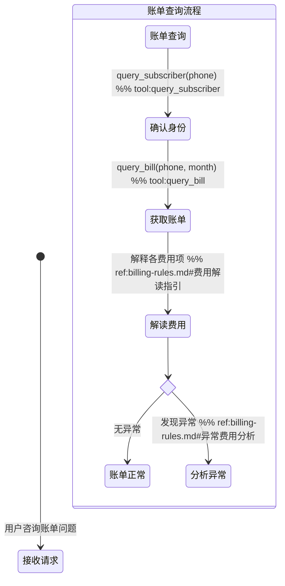

# 业务 Skill 编写规范

> 版本：2.0.0 | 日期：2026-03-17 | 作者：Chenjun
>
> 本规范适用于 `backend/skills/biz-skills/` 下所有业务技能的新建与维护。
> 技术技能（`tech-skills/`）不在本规范范围内。

---

## 1. 设计原则

**状态图驱动**：客户引导状态图是流程逻辑的**唯一权威定义**，文本章节只补充状态图无法表达的信息。

| 信息类型 | 放在哪里 |
|---------|---------|
| 流程分支、步骤顺序、工具调用序列 | **状态图**（节点 + 箭头 + `%% tool:` 注释） |
| 各分支的详细操作指引、话术、数据表 | **references/** 参考文档（通过 `%% ref:` 注释按需引用） |
| 用户意图关键词、issue_type 映射表、工具参数 | **工具与分类**章节 |
| 升级路径分类、触发条件、处理方式 | **升级处理**章节 |
| 合规禁令、操作确认、隐私保护 | **合规规则**章节 |
| 语气、节奏、格式、长度要求 | **回复规范**章节 |

---

## 2. 目录结构

```
{skill-name}/
├── SKILL.md              # 必须 — Skill 主定义文件
├── references/            # 必须 — 参考文档（知识库），至少包含一个 .md
│   └── *.md
└── scripts/               # 可选 — 诊断/业务逻辑脚本
    ├── types.ts           #   类型定义（必须）
    ├── run_*.ts           #   编排入口
    ├── check_*.ts         #   检查子模块
    └── *.test.ts          #   单元测试
```

### 命名规则

| 项目 | 规则 | 示例 |
|------|------|------|
| 目录名 | 小写 kebab-case，2-3 个英文单词 | `fault-diagnosis`、`bill-inquiry` |
| SKILL.md | 固定文件名，全大写 | `SKILL.md` |
| 参考文档 | 小写 kebab-case，语义明确 | `troubleshoot-guide.md`、`billing-rules.md` |
| 脚本文件 | 小写 snake_case（TypeScript） | `run_diagnosis.ts`、`check_account.ts` |

---

## 3. SKILL.md 标准结构

### 3.1 YAML Frontmatter

```yaml
---
name: {skill-name}           # 必须 — 与目录名一致
description: {一句话中文描述}   # 必须 — 概括 Skill 的职责范围
metadata:
  version: "x.y.z"           # 必须 — 语义化版本号
  tags: [...]                 # 必须 — 用于技能路由和检索的关键词
  mode: inbound | outbound    # 必须 — 交互模式
  trigger: user_intent | task_dispatch  # 必须 — 触发方式
  channels: [...]             # 必须 — 绑定到哪些机器人渠道
---
```

| 字段 | 说明 |
|------|------|
| `mode: inbound` | 呼入场景：用户主动发起咨询，Agent 被动响应 |
| `mode: outbound` | 外呼场景：系统主动发起通话，Agent 主动开场 |
| `trigger: user_intent` | 由用户意图触发，Agent 根据用户消息路由到此 Skill |
| `trigger: task_dispatch` | 由任务系统下发，通话开始前已注入任务数据 |
| `channels: ["online"]` | 绑定到在线文字客服 |
| `channels: ["voice"]` | 绑定到语音客服（呼入） |
| `channels: ["outbound-collection"]` | 绑定到外呼催收 |
| `channels: ["outbound-marketing"]` | 绑定到外呼营销 |

**channels 可多选**，如 `["online", "voice"]` 表示同时绑定到在线和语音客服。未配置时默认为 `["online"]`。

**标准 channel 值：**

| channel | 机器人 | 技能加载方式 |
|---------|-------|------------|
| `online` | 在线文字客服 | 动态发现，通过 `get_skill_instructions` tool 按需加载 |
| `voice` | 语音客服（呼入） | 技能描述注入 system prompt，工具直接调用 |
| `outbound-collection` | 外呼催收 | 技能完整内容注入 system prompt |
| `outbound-marketing` | 外呼营销 | 技能完整内容注入 system prompt |

### 3.2 章节顺序

```markdown
# {Skill 中文名称}

{1-2 句角色定义}

## 触发条件

## 工具与分类

## 客户引导状态图

## 升级处理

## 合规规则

## 回复规范
```

**不可自造章节名，不可改变章节顺序。**

---

### § 触发条件

**inbound 模式**：列出用户可能的表述和意图关键词。

```markdown
## 触发条件

- 用户询问本月/上月话费金额
- 用户对账单某项费用有疑问
- 用户账号欠费停机，需要了解原因
```

**outbound 模式**：说明由什么系统下发，列出注入的任务数据字段表格。

```markdown
## 触发条件

本 Skill 由催收任务平台下发，通话开始前以下数据已注入指令上下文：

| 字段 | 说明 |
|------|------|
| `customer_name` | 客户姓名 |
| `overdue_amount` | 逾期金额（元） |
```

---

### § 工具与分类

**统一章节名**：`## 工具与分类`

此章节存放**状态图无法表达的结构化信息**：

1. **分类映射表**：用户表述 → issue_type / intent 枚举值的对照表
2. **工具说明**：该 Skill 涉及的 MCP 工具及其参数说明
3. **诊断工具的返回结构**：诊断结果字段说明（如有）

```markdown
## 工具与分类

### 问题分类

| 客户描述 | issue_type |
|---|---|
| "App 打不开"、"闪退" | `app_crash` |
| "登不进去"、"OTP 收不到" | `login_issue` |

### 工具说明

- `diagnose_app(phone, issue_type)` — 执行 App 安全诊断
  - 返回：`diagnostic_steps[]`、`conclusion`、`escalation_path`、`customer_actions[]`
- `query_subscriber(phone)` — 查询用户身份和账号状态
```

---

### § 客户引导状态图

**统一章节名**：`## 客户引导状态图`

**这是 SKILL.md 的核心章节**，定义完整的流程分支和步骤序列。

使用 Mermaid `stateDiagram-v2` 语法，遵守以下注释约定：

| 注释类型 | 语法 | 说明 | 示例 |
|---------|------|------|------|
| 工具调用 | `%% tool:xxx` | 标注该步骤调用的 MCP 工具 | `%% tool:query_bill` |
| 参考文档引用 | `%% ref:filename#section` | 到达该节点时加载参考文档对应章节 | `%% ref:billing-rules.md#费用解读指引` |
| 分支标识 | `%% branch:xxx` | 标注分支条件标识符 | `%% branch:account_error` |

**`%% ref:` 注释的运行时语义**：当 Agent 流程执行到带有 `%% ref:` 注释的节点时，应调用 `get_skill_reference("{skill-name}", "{filename}")` 加载对应参考文档，并参考其中 `#{section}` 章节的详细指引来引导客户。

**示例：**



**其他约定：**

| 约定 | 说明 |
|------|------|
| 分支节点 | 使用 `<<choice>>` 状态类型 |
| 子状态 | 复杂流程用嵌套 `state` 块 |
| 起止点 | `[*]` 表示开始和结束 |
| 多个注释 | 同一行可叠加，如 `%% tool:query_bill %% ref:billing-rules.md#费用项` |

### 分支完备性要求

状态图必须**尽量覆盖所有可能的分支**，确保 Agent 在任何场景下都有明确的路径可循，不出现"无定义行为"。编写和审查状态图时，须逐一检查以下 5 类分支是否已覆盖：

#### ① 工具调用失败分支

每个 `%% tool:` 节点后必须跟一个 `<<choice>>`，至少包含"成功"和"系统异常"两条出路。系统异常路径应引导用户稍后重试或拨打客服热线。

```mermaid
确认身份 --> 工具结果 <<choice>>
工具结果 --> 获取账单: 成功
工具结果 --> 系统异常提示: 系统异常，提示稍后重试或拨打10086 → [*]
```

**原因**：工具调用可能因网络超时、服务不可用等原因失败。若无失败分支，Agent 会陷入无定义状态，可能凭空捏造数据（违反合规规则）。

#### ② 操作后确认反馈环

对用户执行了操作指引（如重启手机、清除缓存、充值）后，应有一个确认节点询问"问题是否解决"，根据用户反馈决定结束或升级。

```mermaid
执行操作 --> 确认恢复: 请问问题解决了吗？
state 确认结果 <<choice>>
确认恢复 --> 确认结果
确认结果 --> [*]: 用户确认已恢复
确认结果 --> 升级处理: 用户确认仍未恢复
```

**原因**：无确认环会导致 Agent 在问题未解决时就关闭会话，降低解决率和用户满意度。多个终态可共用一个确认节点，避免图过于膨胀。

#### ③ 全局升级出口

状态图必须包含一个**独立的顶层状态节点**，表示用户随时可以要求转人工。使用独立状态节点（而非 note），确保其在图中可见。

```mermaid
用户要求转人工 --> 转接人工: 转接人工客服或引导拨打10086
转接人工 --> [*]
```

**原因**：用户在任何交互阶段都可能要求转人工，若只在特定分支设转人工出口，其他分支的用户会被困住。

#### ④ 外呼场景：接通前门控与呼叫结果分支

外呼 Skill（`mode: outbound`）的状态图必须包含：

**接通前合规门控**：在拨号前检查时段合规（`allowed_hours`）和重试次数（`max_retry`），不合规则任务延后。

```mermaid
任务下发 --> 合规检查
state 合规结果 <<choice>>
合规检查 --> 合规结果
合规结果 --> 呼叫中: 时段合规且未超最大重试
合规结果 --> 任务延后: 不合规，入队等待 → [*]
```

**呼叫结果多路分支**：接通后至少区分"客户接听"、"未接通"、"忙线"、"关机/停机"，未接通的路径须调用 `record_call_result` 记录结果。

**身份核验**（催收场景必须）：在披露敏感信息前核验客户身份，核验失败或非本人接听须有独立终态。

#### ⑤ 合规关键路径

以下场景必须作为**独立状态节点**建模，不可仅依赖 Agent 隐式判断：

| 场景 | 适用模式 | 建模方式 |
|------|---------|---------|
| **DND 请求**（用户要求不再来电） | outbound | 独立 `DND请求处理` 状态，从拒绝/任意节点可达 |
| **情绪升级**（情绪激烈、威胁自伤、法律威胁） | outbound | 独立 `紧急转人工` 状态，标注"任意节点均可触发" |
| **用户确认**（执行变更操作前） | 全部 | 操作前必须有 `<<choice>>` 确认节点：用户确认→执行 / 用户取消→终止 |
| **身份核验**（查询或披露敏感数据前） | outbound（必须）, inbound（建议） | 核验通过→继续 / 核验失败→终止并记录 |

---

### § 升级处理

使用统一的三列表格。每个 Skill 必须有独立的升级处理节。

```markdown
## 升级处理

| 升级路径 | 触发条件 | 处理方式 |
|---------|---------|---------|
| `self_service` | {场景} | {操作} |
| `frontline` | {场景} | {操作} |
```

**标准升级路径枚举（按需选用）：**

| 路径 | 含义 |
|------|------|
| `self_service` | 客户可自助完成 |
| `frontline` | 转一线客服（截图审查、人工解锁、工单提交） |
| `security_team` | 转安全团队（账号被盗、高风险操作、反诈） |
| `store_visit` | 引导至营业厅（SIM 卡损坏、销户、需证件操作） |
| `hotline` | 引导拨打客服热线 10086 |

---

### § 合规规则

分为"禁止"和"必须"两类，使用 **加粗** 标注。

**各 Skill 必须包含的通用合规项：**

1. 数据来源：工具获取的数据不可凭空捏造
2. 操作确认：涉及变更操作须用户明确同意
3. 隐私保护：不得索要完整身份证号、银行卡号、密码、OTP 验证码

---

### § 回复规范

内容涵盖：语气、节奏、格式、长度等要求。

---

## 4. 参考文档规范（references/）

### 4.1 定位

参考文档是 Skill 的**详细操作知识库**，存放状态图无法内联的信息：

- **流程处理指引**：各分支节点的详细操作步骤、平台差异（Android/iOS）、数值阈值
- **业务政策**：退订规则、计费规则、合约条款
- **话术手册**：开场白模板、各场景应答话术、禁用语
- **产品数据**：套餐列表、增值业务列表、价格表

### 4.2 原则

1. **按分支组织**：参考文档的章节应与状态图的分支/节点对应，便于 `%% ref:filename#section` 精准引用
2. **按需加载**：通过 `get_skill_reference("{skill-name}", "{filename}")` 在需要时加载
3. **单一职责**：每个参考文档聚焦一个主题

### 4.3 参考文档结构

```markdown
# {文档标题}

> {一句话说明用途}

---

## {分支/场景名称}

### {子场景}

{详细操作步骤、数据表、话术等}
```

**章节标题应与状态图中的 `%% ref:` 注释的 `#section` 部分对应。**

---

## 5. 脚本规范（scripts/）

### 5.1 何时需要 scripts/

当 Skill 包含**可执行的诊断逻辑**时需要 scripts/ 目录。纯知识类 Skill 不需要。

### 5.2 types.ts 标准

公共基础接口位于 `biz-skills/_shared/types.ts`，各 Skill 可继承扩展。

### 5.3 脚本命名

| 命名模式 | 职责 | 示例 |
|---------|------|------|
| `types.ts` | 类型定义 | — |
| `run_*.ts` | 编排入口 | `run_diagnosis.ts` |
| `check_*.ts` | 单项检查（纯函数） | `check_account.ts` |
| `*.test.ts` | 单元测试 | `run_diagnosis.test.ts` |

---

## 6. Inbound vs Outbound 差异

| 章节 | Inbound（呼入） | Outbound（外呼） |
|------|-----------------|------------------|
| **触发条件** | 列出用户意图关键词 | 列出任务系统注入的数据字段 |
| **工具与分类** | issue_type 映射表 + 查询工具 | intent 映射表 + 记录/发送工具 |
| **状态图起点** | `[*] --> 接收问题` | `[*] --> 任务下发` |
| **状态图分支** | 按问题类型分支 | 按客户意向分支 |
| **升级处理** | self_service / frontline / store_visit | transfer（转人工坐席） |
| **合规侧重** | 数据真实性、操作确认 | 禁止施压、通话时段、录音告知 |

---

## 7. 新建 Skill 检查清单

### 目录与文件

- [ ] 目录名符合 kebab-case 命名
- [ ] `SKILL.md` 文件存在
- [ ] `references/` 目录存在，至少包含一个 `.md` 参考文档
- [ ] 参考文档按分支/场景组织章节，与状态图 `%% ref:` 对应

### SKILL.md Frontmatter

- [ ] `name` 与目录名一致
- [ ] `description` 为一句话中文描述
- [ ] `metadata.version` 为语义化版本号
- [ ] `metadata.tags` 包含 3-8 个路由关键词
- [ ] `metadata.mode` 为 `inbound` 或 `outbound`
- [ ] `metadata.trigger` 为 `user_intent` 或 `task_dispatch`
- [ ] `metadata.channels` 已配置，至少包含一个有效 channel（online/voice/outbound-collection/outbound-marketing）

### SKILL.md 章节

- [ ] 开头 1-2 句角色定义
- [ ] `## 触发条件` — 存在且内容完整
- [ ] `## 工具与分类` — 包含分类映射表和工具说明
- [ ] `## 客户引导状态图` — Mermaid stateDiagram-v2，包含 `%% tool:` 和 `%% ref:` 注释
- [ ] 状态图分支完备性（逐项确认以下 5 项）：
  - [ ] 每个 `%% tool:` 节点后有成功/失败 `<<choice>>` 分支
  - [ ] 操作指引后有"问题是否解决"确认反馈环
  - [ ] 包含"用户要求转人工"全局升级出口（独立状态节点）
  - [ ] outbound 模式：包含接通前合规门控 + 呼叫结果多路分支 + 身份核验
  - [ ] 合规关键路径已建模：DND（outbound）、情绪升级（outbound）、操作前用户确认（全部）
- [ ] `## 升级处理` — 独立成节，使用三列表格
- [ ] `## 合规规则` — 包含通用合规项 + Skill 专属合规项
- [ ] `## 回复规范` — 包含语气、节奏、格式要求

### 参考文档

- [ ] 参考文档章节与状态图 `%% ref:` 注释对应
- [ ] SKILL.md 中不内联参考文档的完整内容

### 合规

- [ ] 包含数据来源合规项
- [ ] 包含操作确认合规项
- [ ] 包含隐私保护合规项
- [ ] outbound 模式包含通话录音告知和拨打时段限制

---

## 8. 完整示例：bill-inquiry

```markdown
---
name: bill-inquiry
description: 电信账单查询技能，处理月账单查询、费用明细解读、欠费催缴、发票申请等问题
metadata:
  version: "2.0.0"
  tags: ["bill", "billing", "invoice", "fee", "arrears"]
  mode: inbound
  trigger: user_intent
---
# 账单查询 Skill

你是一名电信账单专家。帮助用户查询和解读话费账单，解答计费疑问。

## 触发条件

- 用户询问本月/上月话费金额
- 用户对账单某项费用有疑问（为什么多了这笔钱？）
- 用户账号欠费停机，需要了解欠费原因
- 用户申请电子发票
- 用户感觉话费异常偏高，需要排查原因

## 工具与分类

### 问题分类

| 用户描述 | 问题类型 |
|---------|---------|
| 查话费、本月多少钱、费用明细 | 账单查询 |
| 欠费、停机、充值、余额不足 | 欠费处理 |
| 发票、报销、开票 | 发票申请 |
| 话费突然变高、多扣钱了 | 异常费用分析 |

### 工具说明

- `query_subscriber(phone)` — 确认用户身份和账号状态
- `query_bill(phone, month)` — 获取指定月份账单明细
- `get_skill_reference("bill-inquiry", "billing-rules.md")` — 加载计费规则和处理指引

## 客户引导状态图

​```mermaid
stateDiagram-v2
    [*] --> 接收请求: 用户咨询账单、欠费、发票相关问题

    state 问题分类 <<choice>>
    接收请求 --> 问题分类
    问题分类 --> 账单查询: 查话费、费用疑问 %% branch:bill_query
    问题分类 --> 欠费处理: 欠费停机、需要充值 %% branch:arrears
    问题分类 --> 发票申请: 申请电子发票 %% branch:invoice
    问题分类 --> 异常分析: 话费突然变高 %% branch:anomaly

    state 账单查询流程 {
        账单查询 --> 确认身份: query_subscriber(phone) %% tool:query_subscriber
        确认身份 --> 获取账单: query_bill(phone, month) %% tool:query_bill
        获取账单 --> 解读费用: 逐项解释费用 %% ref:billing-rules.md#费用解读指引
        解读费用 --> [*]: 解答完毕
    }

    state 欠费处理流程 {
        欠费处理 --> 查询状态: query_subscriber(phone) %% tool:query_subscriber
        查询状态 --> 说明欠费: 告知欠费金额和月份 %% ref:billing-rules.md#欠费处理指引
        说明欠费 --> 引导充值: 告知充值方式（APP/官网/营业厅）
        引导充值 --> [*]: 说明充值后30分钟内自动恢复
    }

    state 发票申请流程 {
        发票申请 --> 确认缴清: 确认已缴清账单 %% ref:billing-rules.md#发票申请指引
        state 是否缴清 <<choice>>
        确认缴清 --> 是否缴清
        是否缴清 --> 引导开票: 已缴清
        是否缴清 --> 引导先缴费: 未缴清
        引导先缴费 --> 引导开票: 缴费完成
        引导开票 --> [*]: 说明发票类型和开具时效
    }

    state 异常费用分析流程 {
        异常分析 --> 拉取账单: query_bill(phone, month) %% tool:query_bill
        拉取账单 --> 对比分析: 与上月对比，定位差异项 %% ref:billing-rules.md#异常费用分析
        state 异常原因 <<choice>>
        对比分析 --> 异常原因
        异常原因 --> 解释超额: 流量/通话超出套餐
        异常原因 --> 定位增值扣费: 增值业务产生费用
        异常原因 --> 无法定位: 原因不明
        解释超额 --> [*]: 建议升级套餐或购买加油包
        定位增值扣费 --> [*]: 引导退订或说明业务来源
        无法定位 --> [*]: 升级 hotline（拨打10086投诉）
    }
​```

## 升级处理

| 升级路径 | 触发条件 | 处理方式 |
|---------|---------|---------|
| `self_service` | 账单查询、发票申请、常规欠费充值 | 引导用户在 APP 自助操作 |
| `hotline` | 费用异议无法当场解决、异常原因不明 | 引导拨打 10086 投诉 |
| `store_visit` | 需要纸质发票或现场核验 | 引导携带身份证前往营业厅 |

## 合规规则

- **禁止**：凭空捏造账单数据，所有数据必须通过 `query_bill` 工具获取
- **禁止**：未经核实即断言费用异常或正常
- **必须**：计费规则以参考文档为准
- **必须**：发票申请告知用户通过 APP 自助操作，客服无法代为开具

## 回复规范

- 每项费用给出具体金额，避免含糊
- 发现账单异常时主动分析并告知用户如何避免
- 欠费停机场景优先说明充值方式，再解释费用明细
- 回复结尾可主动推荐用户订阅账单提醒
- 回复控制在 3 个自然段以内
```
