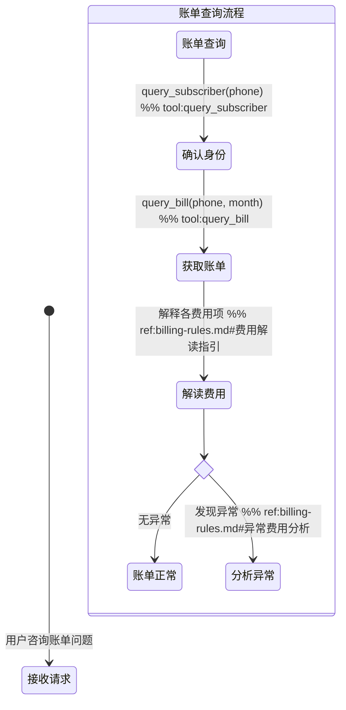

# 业务 Skill 编写规范 — 各章节详细编写指引

> 本文件在 draft 阶段注入，包含 SKILL.md 各章节和配套文件的详细编写规则。

---

### § 触发条件

**inbound 模式**：列出用户可能的表述和意图关键词。

```markdown
## 触发条件

- 用户询问本月/上月话费金额
- 用户对账单某项费用有疑问
- 用户账号欠费停机，需要了解原因
```

**outbound 模式**：说明由什么系统下发，列出注入的任务数据字段表格。

```markdown
## 触发条件

本 Skill 由催收任务平台下发，通话开始前以下数据已注入指令上下文：

| 字段 | 说明 |
|------|------|
| `customer_name` | 客户姓名 |
| `overdue_amount` | 逾期金额（元） |
```

---

### § 工具与分类

**统一章节名**：`## 工具与分类`

此章节存放**状态图无法表达的结构化信息**：

1. **分类映射表**：用户表述 → issue_type / intent 枚举值的对照表
2. **工具说明**：该 Skill 涉及的 MCP 工具及其参数说明
3. **诊断工具的返回结构**：诊断结果字段说明（如有）

```markdown
## 工具与分类

### 问题分类

| 客户描述 | issue_type |
|---|---|
| "App 打不开"、"闪退" | `app_crash` |
| "登不进去"、"OTP 收不到" | `login_issue` |

### 工具说明

- `diagnose_app(phone, issue_type)` — 执行 App 安全诊断
  - 返回：`diagnostic_steps[]`、`conclusion`、`escalation_path`、`customer_actions[]`
- `query_subscriber(phone)` — 查询用户身份和账号状态
```

---

### § 客户引导状态图

**统一章节名**：`## 客户引导状态图`

**这是 SKILL.md 的核心章节**，定义完整的流程分支和步骤序列。

使用 Mermaid `stateDiagram-v2` 语法，遵守以下注释约定：

| 注释类型 | 语法 | 说明 | 示例 |
|---------|------|------|------|
| 工具调用 | `%% tool:xxx` | 标注该步骤调用的 MCP 工具 | `%% tool:query_bill` |
| 参考文档引用 | `%% ref:filename#section` | 到达该节点时加载参考文档对应章节 | `%% ref:billing-rules.md#费用解读指引` |
| 分支标识 | `%% branch:xxx` | 标注分支条件标识符 | `%% branch:account_error` |

**`%% ref:` 注释的运行时语义**：当 Agent 流程执行到带有 `%% ref:` 注释的节点时，应调用 `get_skill_reference("{skill-name}", "{filename}")` 加载对应参考文档，并参考其中 `#{section}` 章节的详细指引来引导客户。

**示例：**



**其他约定：**

| 约定 | 说明 |
|------|------|
| 分支节点 | 使用 `<<choice>>` 状态类型 |
| 子状态 | 复杂流程用嵌套 `state` 块 |
| 起止点 | `[*]` 表示开始和结束 |
| 多个注释 | 同一行可叠加，如 `%% tool:query_bill %% ref:billing-rules.md#费用项` |

### 分支完备性要求

状态图必须**尽量覆盖所有可能的分支**，确保 Agent 在任何场景下都有明确的路径可循，不出现"无定义行为"。编写和审查状态图时，须逐一检查以下 5 类分支是否已覆盖：

#### ① 工具调用失败分支

每个 `%% tool:` 节点后必须跟一个 `<<choice>>`，至少包含"成功"和"系统异常"两条出路。系统异常路径应引导用户稍后重试或拨打客服热线。

```mermaid
确认身份 --> 工具结果 <<choice>>
工具结果 --> 获取账单: 成功
工具结果 --> 系统异常提示: 系统异常，提示稍后重试或拨打10086 → [*]
```

**原因**：工具调用可能因网络超时、服务不可用等原因失败。若无失败分支，Agent 会陷入无定义状态，可能凭空捏造数据（违反合规规则）。

#### ② 操作后确认反馈环

对用户执行了操作指引（如重启手机、清除缓存、充值）后，应有一个确认节点询问"问题是否解决"，根据用户反馈决定结束或升级。

```mermaid
执行操作 --> 确认恢复: 请问问题解决了吗？
state 确认结果 <<choice>>
确认恢复 --> 确认结果
确认结果 --> [*]: 用户确认已恢复
确认结果 --> 升级处理: 用户确认仍未恢复
```

**原因**：无确认环会导致 Agent 在问题未解决时就关闭会话，降低解决率和用户满意度。多个终态可共用一个确认节点，避免图过于膨胀。

#### ③ 全局升级出口

状态图必须包含一个**独立的顶层状态节点**，表示用户随时可以要求转人工。使用独立状态节点（而非 note），确保其在图中可见。

```mermaid
用户要求转人工 --> 转接人工: 转接人工客服或引导拨打10086
转接人工 --> [*]
```

**原因**：用户在任何交互阶段都可能要求转人工，若只在特定分支设转人工出口，其他分支的用户会被困住。

#### ④ 外呼场景：接通前门控与呼叫结果分支

外呼 Skill（`mode: outbound`）的状态图必须包含：

**接通前合规门控**：在拨号前检查时段合规（`allowed_hours`）和重试次数（`max_retry`），不合规则任务延后。

```mermaid
任务下发 --> 合规检查
state 合规结果 <<choice>>
合规检查 --> 合规结果
合规结果 --> 呼叫中: 时段合规且未超最大重试
合规结果 --> 任务延后: 不合规，入队等待 → [*]
```

**呼叫结果多路分支**：接通后至少区分"客户接听"、"未接通"、"忙线"、"关机/停机"，未接通的路径须调用 `record_call_result` 记录结果。

**身份核验**（催收场景必须）：在披露敏感信息前核验客户身份，核验失败或非本人接听须有独立终态。

#### ⑤ 合规关键路径

以下场景必须作为**独立状态节点**建模，不可仅依赖 Agent 隐式判断：

| 场景 | 适用模式 | 建模方式 |
|------|---------|---------|
| **DND 请求**（用户要求不再来电） | outbound | 独立 `DND请求处理` 状态，从拒绝/任意节点可达 |
| **情绪升级**（情绪激烈、威胁自伤、法律威胁） | outbound | 独立 `紧急转人工` 状态，标注"任意节点均可触发" |
| **用户确认**（执行变更操作前） | 全部 | 操作前必须有 `<<choice>>` 确认节点：用户确认→执行 / 用户取消→终止 |
| **身份核验**（查询或披露敏感数据前） | outbound（必须）, inbound（建议） | 核验通过→继续 / 核验失败→终止并记录 |

---

### § 升级处理

使用统一的三列表格。每个 Skill 必须有独立的升级处理节。

**严格限制**：升级处理表**最多 10-15 行**，只列出真实会发生的场景。不要穷举假设性场景，不要重复近似条目。常见模式（如"客户要求 X 期间不计入 Y"）只需一行兜底："其他非标需求 → 转人工客服评估"。

```markdown
## 升级处理

| 升级路径 | 触发条件 | 处理方式 |
|---------|---------|---------|
| `self_service` | {场景} | {操作} |
| `frontline` | {场景} | {操作} |
```

**标准升级路径枚举（按需选用）：**

| 路径 | 含义 |
|------|------|
| `self_service` | 客户可自助完成 |
| `frontline` | 转一线客服（截图审查、人工解锁、工单提交） |
| `security_team` | 转安全团队（账号被盗、高风险操作、反诈） |
| `store_visit` | 引导至营业厅（SIM 卡损坏、销户、需证件操作） |
| `hotline` | 引导拨打客服热线 10086 |

---

### § 合规规则

分为"禁止"和"必须"两类，使用 **加粗** 标注。

**各 Skill 必须包含的通用合规项：**

1. 数据来源：工具获取的数据不可凭空捏造
2. 操作确认：涉及变更操作须用户明确同意
3. 隐私保护：不得索要完整身份证号、银行卡号、密码、OTP 验证码

---

### § 回复规范

内容涵盖：语气、节奏、格式、长度等要求。

**关于节奏的重要规则**：只有需要用户输入的步骤（如输入验证码、确认是否继续办理）才停下来等用户回应。**连续的自动查询步骤（如查欠费 → 查合约 → 查余额）应在同一轮内连续调用工具并汇总结果告知用户**，不要每查一项就停下来等用户说"好的"再继续。

**关于禁止跳步的重要规则**：生成的回复规范中必须包含一条"严禁跳步"约束，明确列出状态图中**所有查询类工具的必须调用顺序**。例如：如果状态图中身份验证后依次有"查欠费→查合约→告知资费"三个节点，回复规范中必须写明"身份验证通过后，必须先调用 check_account_balance、再调用 check_contracts，两个都完成后才能进入告知资费。即使用户说'直接办理'也不能跳过"。

---

### § 回复模板（assets/）

**何时需要 assets/**：当技能包含**可能被连续多次调用的操作类工具**（如 `cancel_service`、`apply_service_suspension` 等不可逆操作）时，必须创建回复模板。

**为什么需要**：LLM 在同一轮中连续调用同一操作工具时，可能退化为将第二次工具调用以纯文本输出（tool_call_leaked_as_text），导致操作实际未执行但用户看到了执行成功的文案。回复模板通过约束"每次只执行一个操作 → 回复结果 → 等用户确认再执行下一个"的节奏，从 SOP 层面避免触发此问题。

**模板结构**：

```markdown
# {场景}回复模板

## 单次操作成功

适用条件：
- {工具}返回成功

推荐话术骨架：
&#96;&#96;&#96;text
{结果描述，使用工具返回的字段}
&#96;&#96;&#96;

## 还有待处理项时（追加）

适用条件：
- 上一个操作已完成
- 用户仍有其他待处理项

推荐话术骨架：
&#96;&#96;&#96;text
{上一个操作结果}

您还有以下待处理项：
- {项目列表，来自查询工具返回}

请问需要继续处理哪个？
&#96;&#96;&#96;

约束：
- 禁止在同一轮回复中连续调用{工具名}两次
- 必须等工具返回后再回复，禁止预判结果
```

**引用方式**：在状态图中使用 `%% ref:assets/{filename}` 标注，SKILL.md 正文中使用 `assets/{filename}` 引用。

---

## 参考文档规范（references/）

### 定位

参考文档是 Skill 的**详细操作知识库**，存放状态图无法内联的信息：

- **流程处理指引**：各分支节点的详细操作步骤、平台差异（Android/iOS）、数值阈值
- **业务政策**：退订规则、计费规则、合约条款
- **话术手册**：开场白模板、各场景应答话术、禁用语
- **产品数据**：套餐列表、增值业务列表、价格表

### 原则

1. **按分支组织**：参考文档的章节应与状态图的分支/节点对应，便于 `%% ref:filename#section` 精准引用
2. **按需加载**：通过 `get_skill_reference("{skill-name}", "{filename}")` 在需要时加载
3. **单一职责**：每个参考文档聚焦一个主题

### 参考文档结构

```markdown
# {文档标题}

> {一句话说明用途}

---

## {分支/场景名称}

### {子场景}

{详细操作步骤、数据表、话术等}
```

**章节标题应与状态图中的 `%% ref:` 注释的 `#section` 部分对应。**

---

## 脚本规范（scripts/）

### 何时需要 scripts/

当 Skill 包含**可执行的诊断逻辑**时需要 scripts/ 目录。纯知识类 Skill 不需要。

### types.ts 标准

公共基础接口位于 `biz-skills/_shared/types.ts`，各 Skill 可继承扩展。

### 脚本命名

| 命名模式 | 职责 | 示例 |
|---------|------|------|
| `types.ts` | 类型定义 | — |
| `run_*.ts` | 编排入口 | `run_diagnosis.ts` |
| `check_*.ts` | 单项检查（纯函数） | `check_account.ts` |
| `*.test.ts` | 单元测试 | `run_diagnosis.test.ts` |

---

## Inbound vs Outbound 差异

| 章节 | Inbound（呼入） | Outbound（外呼） |
|------|-----------------|------------------|
| **触发条件** | 列出用户意图关键词 | 列出任务系统注入的数据字段 |
| **工具与分类** | issue_type 映射表 + 查询工具 | intent 映射表 + 记录/发送工具 |
| **状态图起点** | `[*] --> 接收问题` | `[*] --> 任务下发` |
| **状态图分支** | 按问题类型分支 | 按客户意向分支 |
| **升级处理** | self_service / frontline / store_visit | transfer（转人工坐席） |
| **合规侧重** | 数据真实性、操作确认 | 禁止施压、通话时段、录音告知 |
