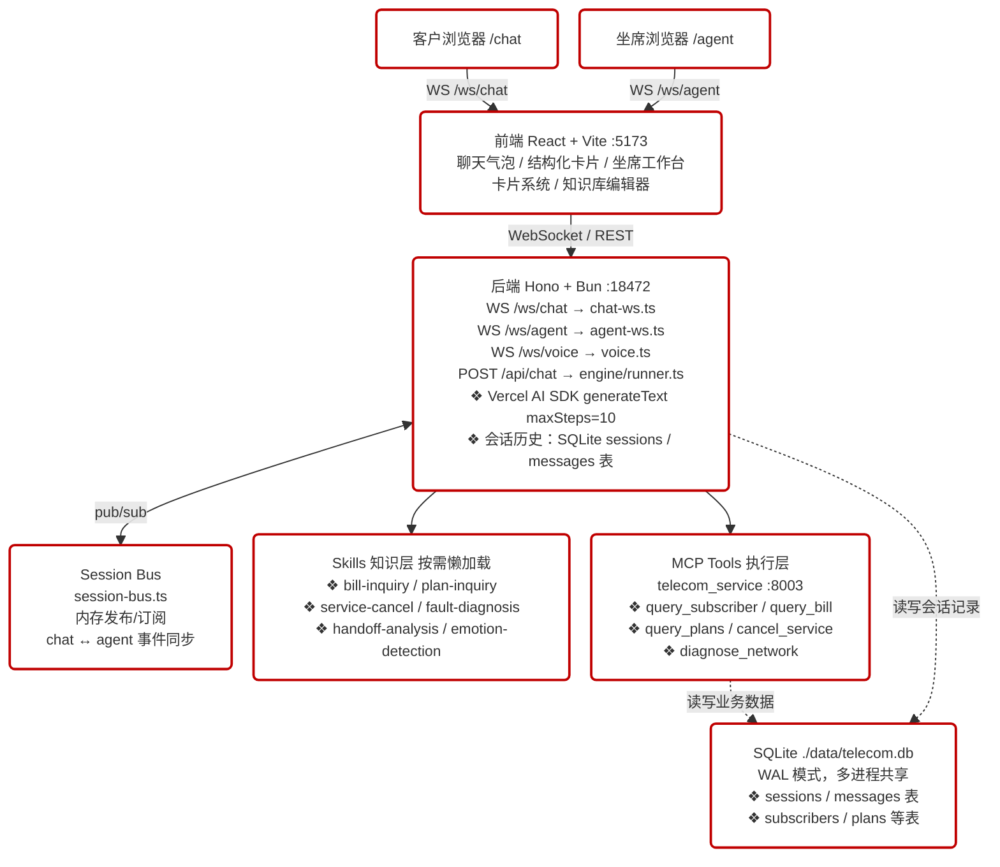
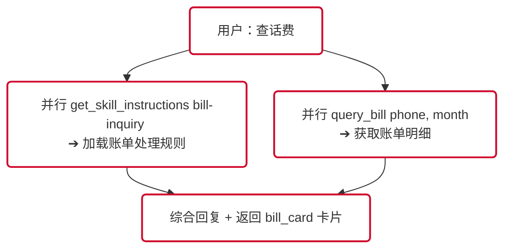
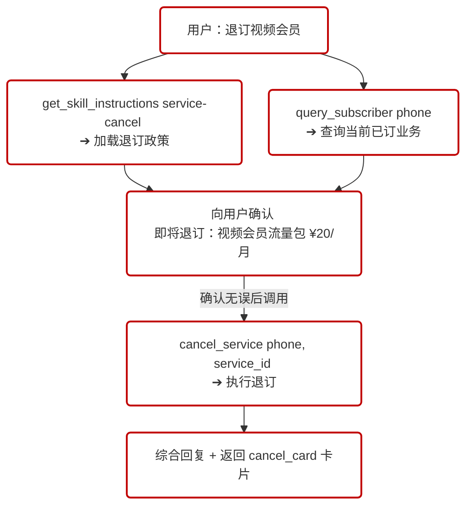
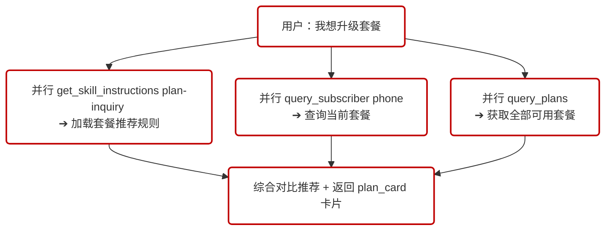
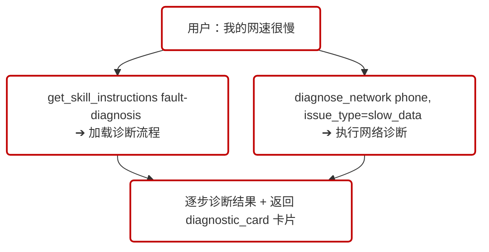

# 01 - 产品架构说明（总览）

## 1. 系统定位

旨在解决传统客服 Agent 的核心痛点：**只懂政策、不能办事**。

系统通过将"领域知识（Skills）"与"执行能力（MCP Tools）"分层设计，让 Agent 实现从理解问题到解决问题的完整闭环：

> **员工培训手册（Skills）** + **员工使用的业务系统（MCP Tools）** = 真正可落地的智能客服

**核心协作模式**：Agent 先从 Skill 加载"应该怎么做"的知识，再通过 MCP 工具"实际去做"。

---

## 2. 两层能力对比

| 维度 | Skills（知识层） | MCP Tools（执行层） |
|------|-----------------|-------------------|
| **核心职责** | 提供领域知识和决策指南 | 执行外部系统操作 |
| **加载方式** | Agent 按需懒加载 | Agent 启动时连接 |
| **内容类型** | 指令文档、参考资料、诊断脚本 | 可调用函数/API |
| **典型用途** | 计费规则、退订政策、套餐详情、故障排查流程 | 查询账单、退订业务、套餐查询、网络诊断 |
| **状态** | 静态知识（定期更新） | 实时数据（每次调用获取最新） |
| **类比** | 员工培训手册 | 员工使用的业务系统 |

---

## 3. 整体架构



---

## 4. Agent 决策流程

针对每一个用户请求，Agent 遵循以下五步决策框架（ReAct 循环，最多 10 步）：

```
1. 理解：加载相关 Skill，明确业务知识与处理流程
      ↓
2. 调查：通过 MCP 工具查询用户实际业务数据
      ↓
3. 决策：结合知识与数据，分析用户情况
      ↓
4. 行动：如有必要，调用 MCP 工具执行实际操作
      ↓
5. 回复：综合所有信息，生成友好的自然语言回答
```

> **并行优化**：同一步骤中，Skill 加载与 MCP 查询可并行调用。例如查话费时，`get_skill_instructions` 与 `query_bill` 在同一轮并行触发，减少一次 LLM round-trip。

---

## 5. 四大核心场景

### 场景一：账单查询（Skill + MCP 并行）



### 场景二：业务退订（Skill + MCP 串行）



### 场景三：套餐咨询（Skill + MCP 并行）



### 场景四：网络故障诊断（Skill + MCP 串行）




---

## 5b. 语音客服架构

### 整体链路

```
用户麦克风
  → AudioContext(16kHz PCM) → base64
  → WebSocket /ws/voice（前端 ↔ 后端代理）
  → NodeWebSocket → GLM-Realtime wss://open.bigmodel.cn
  ← MP3 音频流（base64）← GLM-Realtime
  → MediaSource API → <audio> → 扬声器
```

### 后端代理职责（chat/voice.ts）

GLM-Realtime 不直接暴露给浏览器，后端充当有状态代理：

1. **会话初始化**：建立 GLM 连接后发送 `session.update`，注入 `voice-system-prompt.md`、工具列表（`VOICE_TOOLS`）、音频格式配置
2. **音频透传**：前端 PCM → GLM；GLM MP3 → 前端（大多数事件直接透传）
3. **工具拦截**：`response.function_call_arguments.done` 事件不透传，由后端处理：
   - **MCP 工具**（query_subscriber 等 5 个）：调用 MCP Server，将结果作为 `function_call_output` 回注 GLM
   - **transfer_to_human**：立即回复 GLM（让其说告别语），后台异步调用 `analyzeHandoff()`，完成后推送 `{type: 'transfer_to_human', context}` 给前端
4. **会话状态跟踪**（`VoiceSessionState`）：记录对话轮次、工具调用历史、已收集槽位

### 工具两类分层（重要）

| 分类 | 定义位置 | 谁能看到 | 用途 |
|------|---------|---------|------|
| **GLM 工具**（`VOICE_TOOLS`） | `chat/voice.ts` | GLM-Realtime 模型 | 用户可触发的业务操作 |
| **内部技能**（`handoff-analyzer.ts`） | `agent/card/` | 后端代码（仅转人工时调用） | 分析会话生成 Handoff Context，GLM 不可见 |

### 转人工触发路径

转人工支持两条触发路径，共享同一个 `triggerHandoff(ws, reason, toolArgs)` 辅助函数：

1. **工具调用路径**：GLM 显式调用 `transfer_to_human` 工具
2. **语音检测路径**：`response.audio_transcript.done` 事件中，`TRANSFER_PHRASE_RE` 正则匹配到告别/转接短语时自动触发

`VoiceSessionState` 新增 `transferTriggered` 布尔标志，防止两条路径重复触发。

```
GLM 调用 transfer_to_human 工具（路径①）
  │                                  ─ 或 ─
  │  语音字幕含转接短语（路径②，TRANSFER_PHRASE_RE 匹配）
  │
  └─ triggerHandoff(ws, reason, toolArgs)
       │
       ├─ 后端立即回复 GLM 工具结果（路径①）→ GLM 说告别语
       │
       └─ 后台 analyzeHandoff(turns, toolCalls)
            └─ 单次 LLM 调用，产出 HandoffAnalysis
                 ├─ customer_intent / main_issue
                 ├─ business_object[] / confirmed_information[]
                 ├─ actions_taken[] / current_status
                 ├─ handoff_reason / next_action
                 ├─ priority / risk_flags[]
                 └─ session_summary（自然语言摘要，80-150字）
              ↓
            ws.send { type: 'transfer_to_human', context: HandoffContext }
              ↓
            前端展示 Handoff 卡片（含全部分析结果）
```

WebSocket 关闭时等待 `pendingHandoff`（最长 20 秒超时）后再关闭前端连接，确保分析结果送达。

### GLM-Realtime 关键配置

| 参数 | 值 | 说明 |
|------|----|------|
| `beta_fields.chat_mode` | `'audio'` | 必填，否则连接立即断开 |
| `output_audio_format` | `'mp3'` | base64 MP3 流，前端 MediaSource 播放 |
| `input_audio_format` | `'pcm'` | 16kHz Int16 PCM，前端 AudioContext 采集 |
| `turn_detection` | `{type: 'server_vad', silence_duration_ms: 1500}` | 服务端 VAD，全程免唤醒；1500ms 静音阈值减少误打断 |
| `tools` | 扁平格式 `{type, name, description, parameters}` | 嵌套格式或带 `tool_choice` 均返回 400 |
| `temperature` | `0.2` | 降低随机性，提升业务准确性 |

### 情绪检测（emotion-analyzer.ts）

每当用户语音转写完成（`conversation.item.input_audio_transcription.completed`），后端异步触发情绪分析，结果以 `emotion_update` 事件推送给前端：

```
用户语音转写完成
  │
  └─ 异步 analyzeEmotion(transcript)
       └─ 单次 LLM 调用，5 类情绪分类
            └─ { label, emoji, color }
              → ws.send { type: 'emotion_update', ... }
```

**5 类情绪体系：**

| label | emoji | 说明 |
|-------|-------|------|
| 平静 | 😌 | 正常对话 |
| 礼貌 | 😊 | 积极友好 |
| 焦虑 | 😟 | 着急、担忧 |
| 不满 | 😤 | 有抱怨情绪 |
| 愤怒 | 😠 | 激烈投诉 |

### 日期注入

`engine/*-system-prompt.md` 系统提示词文件均包含 `{{CURRENT_DATE}}` 占位符。`buildVoicePrompt()` 在构建系统提示词时将其替换为今日日期（zh-CN 格式，如 `2026年3月11日`），确保 Agent 的时间认知始终准确。

### 多语言语音方案

#### 问题背景

GLM-Realtime 是中文优先的语音模型（底层 GLM-4-Voice 为中英双语，但英文输出不可靠）。可用语音选项（tongtong、xiaochen 等 7 种）均为中文音色，无专用英文语音。即使在 system prompt 中注入英文强制指令，GLM 仍会频繁回退为中文回复。API 层面不提供 `language` 参数。

#### 架构决策：按语言分流

采用双通道策略，中文走 speech-to-speech 实时流，非中文走 speech-to-text-to-speech 翻译流：

```
lang = 'zh'（默认）
  前端麦克风 → GLM-Realtime → 中文音频直接透传 → 前端播放
  延迟：≈ 实时（首包 < 500ms）

lang ≠ 'zh'（如 'en'）
  前端麦克风 → GLM-Realtime → 中文音频被拦截（不发给前端）
                            → 中文 transcript delta 按句累积
                            → 每句完成 → translateText() → textToSpeech()
                            → { type: 'tts_override', text, audio } → 前端播放
  延迟：≈ 每句 1-2s（翻译 + TTS）
```

#### 实现要点

**后端拦截层**（`chat/voice.ts` / `chat/outbound.ts`，`ttsOverride = lang !== 'zh'` 时生效）：

| GLM 事件 | 中文模式 | 非中文模式 |
|----------|---------|-----------|
| `response.audio.delta` | 透传音频 | **拦截**，丢弃中文音频 |
| `response.audio_transcript.delta` | 透传字幕 | **拦截**，累积文本并按句切分（按 `。？！；\n` 分句） |
| `response.audio_transcript.done` | 透传 | 发送剩余尾句，**不透传** |

**分句流式处理**：不等完整回复，每完成一句即异步翻译 + TTS → 发 `tts_override` 消息。通过 Promise 队列（`ttsQueue`）保证分句按顺序到达前端。

**前端处理**（`chat/VoiceChatPage.tsx` / `chat/OutboundVoicePage.tsx`）：
- 新增 `tts_override` 消息类型处理
- 增量拼接翻译后文本到当前 bot 气泡
- 播放翻译后的目标语言音频

**工具结果翻译**：当 `lang='en'` 时，MCP 工具返回的中文 JSON 结果在回注 GLM 前经 `translateText()` 翻译为英文，降低 GLM 回退中文的概率。

**前端语言切换重连**：用户在通话中切换语言时，语音 WebSocket 自动断开并以新 `lang` 参数重连，确保 GLM session 使用正确的 system prompt。

#### 相关文件

| 文件 | 职责 |
|------|------|
| `backend/src/chat/voice.ts` | 入呼 TTS override 拦截 + 分句翻译 |
| `backend/src/chat/outbound.ts` | 外呼 TTS override（同上逻辑） |
| `backend/src/services/tts.ts` | SiliconFlow CosyVoice2 TTS，支持 zh/en 双语音色 |
| `backend/src/services/translate-lang.ts` | LLM 翻译服务 |
| `backend/src/engine/inbound-voice-system-prompt.md` | 日期处理规则 + 语言指令 |
| `frontend/src/chat/VoiceChatPage.tsx` | `tts_override` 前端处理 |
| `frontend/src/chat/OutboundVoicePage.tsx` | 同上 |

---

## 5c. 坐席工作台架构（AgentWorkstation）

### 整体链路

```
客户浏览器 /chat
  → WS /ws/chat → chat-ws.ts
    → runAgent() → 产生 user_message / text_delta / response / skill_diagram_update 事件
    → sessionBus.publish(phone, event)          ← 广播给同一 phone 的所有订阅者
      ↓
    agent-ws.ts（坐席订阅了同一 phone）
      → ws.send(event)                          → 坐席浏览器 /agent 实时展示
      → 收到 user_message → 异步 analyzeEmotion() → ws.send({ type: 'emotion_update' })
      → 收到 transfer_data → runHandoffAnalysis() → ws.send({ type: 'handoff_card' })
```

### Session Bus（services/session-bus.ts）

服务端内存发布/订阅模块，解耦 chat-ws 与 agent-ws：

```typescript
sessionBus.publish(phone, event)         // chat-ws 发布
sessionBus.subscribe(phone, handler)     // agent-ws 订阅，返回 unsubscribe 函数
sessionBus.getSession(phone)             // 获取当前 sessionId
sessionBus.setSession(phone, sessionId) // 设置当前 sessionId
```

每个 phone 对应一个独立的订阅列表。agent-ws 断开时调用 `unsubscribe()` 自动清理。

### 情感分析与 Handoff 分析（坐席侧）

两个分析技能**只在 agent-ws.ts 中触发，不在客户侧触发**：

| 事件触发 | 分析技能 | 输出事件 |
|---------|---------|---------|
| `user_message`（来自客户） | `analyzeEmotion(text)` | `emotion_update` |
| `transfer_data`（runner 返回转人工） | `runHandoffAnalysis(turns, tools)` | `handoff_card` |

`handoff_card` 作为**独立 WS 事件**发送（不嵌套在 `response.card` 中），前端卡片系统通过注册表路由处理。

### 用户切换同步（BroadcastChannel）

客户侧（`/chat`）切换用户时，通过 `BroadcastChannel('ai-bot-user-sync')` 广播 `{ type: 'user_switch', phone }`，坐席侧（`/agent`）监听并自动同步到同一用户，重建 WS 连接。

---

## 6. 技术栈

| 层次 | 技术 |
|------|------|
| **前端** | React 18 + TypeScript + Vite + Tailwind CSS |
| **后端** | [Hono](https://hono.dev/) + [Bun](https://bun.sh/) |
| **AI SDK** | [Vercel AI SDK](https://sdk.vercel.ai/)（`generateText` + `tool`） |
| **文字客服 LLM** | SiliconFlow 托管模型（兼容 OpenAI Chat API） |
| **语音客服 LLM** | 智谱 GLM-Realtime（`glm-realtime-air`），WebSocket 实时语音 |
| **语音分析 LLM** | SiliconFlow `stepfun-ai/Step-3.5-Flash`（handoff-analyzer、emotion-analyzer 内部调用） |
| **MCP 协议** | `@modelcontextprotocol/sdk`（StreamableHTTP 传输） |
| **数据库** | SQLite + [Drizzle ORM](https://orm.drizzle.team/)（WAL 模式，后端与 MCP Server 共享同一文件） |
| **Skills 加载** | 自定义 `get_skill_instructions` / `get_skill_reference` 工具 |
| **运行时** | Bun（后端）/ Node.js + npm（MCP Server、前端） |
| **音频播放** | MediaSource API，流式 MP3 播放 |
