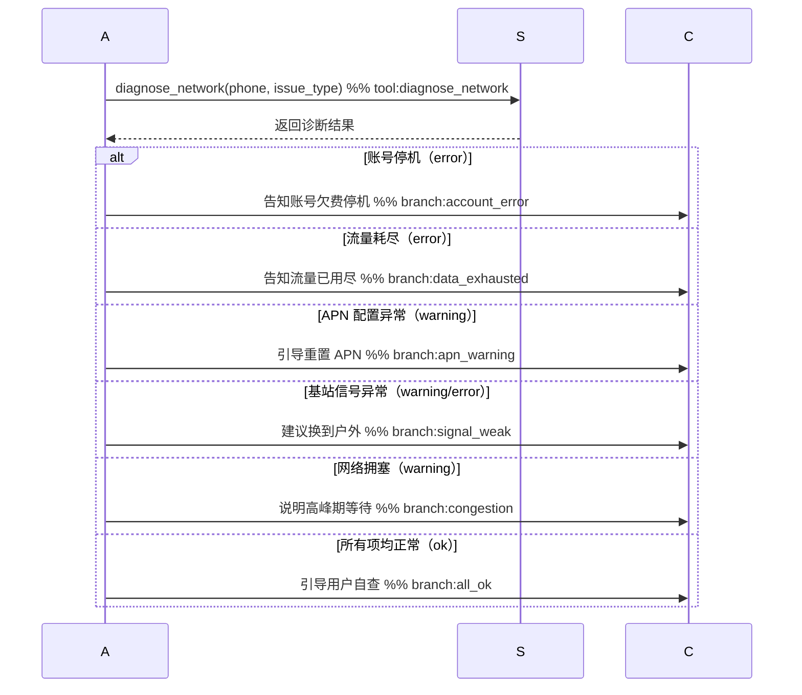

# 02 - 组件详解

## 1. Agent 执行器（backend/src/agent/runner.ts）

### 1.1 职责

- 初始化 MCP 连接，获取 telecom_service 工具列表
- 从数据库加载会话历史
- 调用 Vercel AI SDK `generateText` 驱动 ReAct 循环
- 提取结构化卡片数据返回前端

### 1.2 关键配置

```typescript
const result = await generateText({
  model: chatModel,           // SiliconFlow 模型（通过 createOpenAI 适配）
  system: systemPrompt,       // system-prompt.md 渲染后的内容（含用户手机号）
  messages: history,          // 从 SQLite 加载的历史消息
  tools: {
    ...mcpTools,              // telecom_service 的 5 个工具
    ...skillsTools,           // get_skill_instructions / get_skill_reference
  },
  maxSteps: 10,               // ReAct 循环最大步数
  onStepFinish: logStep,      // 每步完成后记录日志
});
```

### 1.3 系统提示词（system-prompt.md）

Agent 身份定义与行为规范，包含动态占位符：

```markdown
你是"小通"，电信智能客服。用户手机号：{{PHONE}}，无需询问。

工具调用规则：
1. 同一步骤并行调用技能工具和 MCP 工具，禁止拆分为多步
2. 查话费必须调用 query_bill 工具
3. 退订前须向用户确认业务名称和费用影响
4. 超出范围时引导拨打 10086 或前往营业厅

技能映射：
  账单/费用 → bill-inquiry
  退订增值业务 → service-cancel
  套餐/升级 → plan-inquiry
  故障/网速/信号 → fault-diagnosis
```

### 1.4 超时与错误处理

| 项目 | 配置 |
|------|------|
| Agent 执行超时 | 180 秒 |
| ReAct 最大步数 | 10 步 |
| MCP 连接失败 | 抛出异常，返回 HTTP 500 |
| LLM 无响应 | 由 AbortSignal 超时控制 |

### 1.5 结构化卡片提取

Agent 执行完成后，从工具调用结果中识别并提取 4 种卡片数据返回前端：

| 卡片类型 | 触发工具 | 前端渲染 |
|---------|---------|---------|
| `bill_card` | `query_bill` | 账单明细表格 |
| `cancel_card` | `cancel_service` | 退订确认信息 |
| `plan_card` | `query_plans` | 套餐对比卡片 |
| `diagnostic_card` | `diagnose_network` | 诊断步骤列表 |

---

## 2. Skills 知识层（backend/skills/）

Skills 是 Agent 的领域知识模块，每个 Skill 目录结构如下：

```
skill-name/
├── SKILL.md              # 必须：YAML frontmatter + 角色定义 + 处理流程 + 回复规范
└── references/           # 可选：参考文档（政策、规则、套餐详情等）
    └── *.md
```

后端内部分析技能（不在 Agent 工具列表中，仅由后端代码调用）也遵循相同的 SKILL.md 约定：

| 目录 | 用途 |
|------|------|
| `handoff-analysis/SKILL.md` | 转人工分析提示词，产出 JSON 块 + 自然语言摘要 |
| `emotion-detection/SKILL.md` | 情绪分类提示词，5 类情绪体系 |

故障诊断 Skill 还包含可执行脚本：

```
fault-diagnosis/
├── SKILL.md
├── references/
│   └── troubleshoot-guide.md
└── scripts/
    ├── run_diagnosis.ts      # 诊断编排器（主入口）
    ├── check_account.ts      # 账号状态检查
    ├── check_signal.ts       # 信号/SIM 卡检查
    ├── check_data.ts         # 流量/APN 检查
    ├── check_call.ts         # 语音服务检查
    └── types.ts              # 共用类型定义
```

### 2.1 bill-inquiry（账单查询）

**触发条件：** 用户询问话费、账单、费用明细、发票

> 调用时序（Skill + MCP 并行）见 **[01-architecture.md § 5 场景一](01-architecture.md)**。

**参考文档：** `references/billing-rules.md`
- 月租费、流量费、语音费、增值业务费计算规则
- 账单周期说明
- 欠费处理流程

### 2.2 plan-inquiry（套餐咨询）

**触发条件：** 用户询问套餐内容、对比、升降级

> 调用时序（Skill + MCP 并行）见 **[01-architecture.md § 5 场景三](01-architecture.md)**。

**参考文档：** `references/plan-details.md`
- 四档套餐详情（基础 10G / 畅享 50G / 超值 100G / 无限流量）
- 各套餐价格、流量、语音分钟数、特色功能
- 升降级规则

### 2.3 service-cancel（业务退订）

**触发条件：** 用户要求退订增值业务（视频会员、短信包等）

> 调用时序（Skill + MCP 串行，含用户确认步骤）见 **[01-architecture.md § 5 场景二](01-architecture.md)**。

**参考文档：** `references/cancellation-policy.md`
- 退订生效时间规则（次月 1 日生效）
- 退订后当月是否继续可用说明
- 不可退订情形

### 2.4 fault-diagnosis（网络故障诊断）

**触发条件：** 用户反馈无信号、网速慢、通话中断、无网络

> 调用时序（Skill + MCP 串行）见 **[01-architecture.md § 5 场景四](01-architecture.md)**。

**诊断脚本编排（`scripts/run_diagnosis.ts`）：**

```
runDiagnosis(subscriber, issue_type)
    │
    ├─ checkAccount(subscriber)          → 账号状态（active / suspended）
    │
    ├─ issue_type = "no_signal"/"no_network" → checkSignal()
    │     ├─ 基站信号检测
    │     ├─ SIM 卡状态
    │     └─ APN 配置检查
    │
    ├─ issue_type = "slow_data"          → checkData(subscriber)
    │     ├─ 流量用量检查
    │     ├─ APN 配置
    │     └─ 网络拥塞检测
    │
    └─ issue_type = "call_drop"          → checkCall(subscriber)
          ├─ 通话服务状态
          ├─ 语音服务检查
          └─ 拥塞检测
```

**参考文档：** `references/troubleshoot-guide.md`
- 各类故障的用户自查步骤
- 何时建议联系人工 / 更换 SIM 卡 / 前往营业厅

---

## 3. MCP Server 执行层（backend/mcp_servers/ts/telecom_service.ts）

**端口：** `http://localhost:8003/mcp`
**传输：** StreamableHTTP（stateless，每请求独立）
**工具数：** 5 个

### 3.1 工具列表

| 工具 | 功能 | 关键参数 |
|------|------|----------|
| `query_subscriber` | 查询用户基本信息 | `phone: string` |
| `query_bill` | 查询账单明细 | `phone`, `month?: string`（YYYY-MM） |
| `query_plans` | 查询可用套餐 | `plan_id?: string` |
| `cancel_service` | 退订增值业务 | `phone`, `service_id: string` |
| `diagnose_network` | 网络故障诊断 | `phone`, `issue_type: enum` |

### 3.2 测试数据（SQLite）

MCP Server 与后端共享同一个 SQLite 文件（`backend/data/telecom.db`），数据由 `db:seed` 初始化，进程重启后持久保留。

测试用户、套餐、增值业务的完整数据见 **[04-data-model.md §§ 1、3、4](04-data-model.md)**。

---

## 4. 语音客服路由（backend/src/routes/voice.ts）

### 4.1 WebSocket 代理

提供 `GET /ws/voice` WebSocket 端点，作为浏览器与 GLM-Realtime 之间的有状态代理：

- 前端连接时，后端同时建立到 GLM-Realtime 的 NodeWebSocket 连接
- 大多数事件（音频流、VAD 事件、字幕事件）直接双向透传
- `response.function_call_arguments.done` 由后端拦截处理（不透传）

### 4.2 VoiceSessionState

每个 WebSocket 会话维护独立状态对象，跟踪：

```typescript
class VoiceSessionState {
  turns: TurnRecord[]           // 对话轮次（用户 + 助手）
  toolCalls: ToolRecord[]       // 工具调用历史
  consecutiveToolFails: number  // 连续工具失败次数
  collectedSlots: Record<string, unknown>  // 已收集槽位（手机号/业务ID等）
  transferTriggered: boolean    // 已触发转人工标志，防止双重触发
}
```

### 4.3 VOICE_TOOLS（GLM 工具列表）

GLM-Realtime 可调用的 6 个工具（扁平格式，不含 `tool_choice`）：

| 工具名 | 说明 |
|--------|------|
| `query_subscriber` | 查询账户信息 |
| `query_bill` | 查询账单明细 |
| `query_plans` | 查询套餐列表 |
| `cancel_service` | 退订增值业务 |
| `diagnose_network` | 网络故障诊断 |
| `transfer_to_human` | 转人工（后端拦截，不调 MCP） |

---

## 5. handoff-analyzer（backend/src/skills/handoff-analyzer.ts）

### 5.1 定位

**纯后端内部技能**，不在 `VOICE_TOOLS` 中定义，GLM 不可见、不可调用。
仅在 `voice.ts` 的 `triggerHandoff()` 中由后端代码主动调用。

### 5.2 分析方式（重构后）

原先的 5 个并行 LLM 调用已替换为**单次 LLM 调用**，通过 `backend/skills/handoff-analysis/SKILL.md` 统一提示词驱动。`parseOutput()` 将 LLM 响应拆分为 JSON 块与自然语言摘要两部分。

当工具调用历史为空时，降级策略通过工具调用历史推断意图，避免空分析。

### 5.3 HandoffAnalysis 结构

```typescript
interface HandoffAnalysis {
  customer_intent:        string;     // 客户诉求（简短）
  main_issue:             string;     // 核心问题描述
  business_object:        string[];   // 涉及的业务对象（套餐/账单/业务ID等）
  confirmed_information:  string[];   // 已核实信息（手机号、身份等）
  actions_taken:          string[];   // 已执行操作列表
  current_status:         string;     // 当前处理状态
  handoff_reason:         string;     // 转人工原因
  next_action:            string;     // 建议坐席下一步操作
  priority:               string;     // 优先级："高" | "中" | "低"
  risk_flags:             string[];   // 风险标签
  session_summary:        string;     // 自然语言会话摘要（80-150字）
}
```

风险标签枚举：`complaint` / `high_value` / `churn_risk` / `overdue` / `repeated_contact` / `angry` / `high_risk_op`

---

## 5b. emotion-analyzer（backend/src/skills/emotion-analyzer.ts）

### 5b.1 定位

**纯后端内部技能**，在每次用户语音转写完成后异步触发，不阻塞主音频流程。

### 5b.2 分析方式

单次 LLM 调用，通过 `backend/skills/emotion-detection/SKILL.md` 提示词驱动 5 类情绪分类，返回结构：

```typescript
interface EmotionResult {
  label: string;  // "平静" | "礼貌" | "焦虑" | "不满" | "愤怒"
  emoji: string;  // 对应表情符号
  color: string;  // 前端展示色（CSS 颜色值）
}
```

结果以 `emotion_update` WebSocket 事件推送给前端，供实时情绪状态展示。

---

## 6. 前端页面

### 6.1 文字客服（ChatPage.tsx）

| 依赖 | 用途 |
|------|------|
| React 18 + TypeScript | UI 框架 |
| Vite | 构建工具，开发代理 `/api` → `:18472` |
| Tailwind CSS | 样式 |
| react-markdown + remark-gfm | Markdown 渲染 |
| lucide-react | 图标库 |

**功能模块：**
- 聊天气泡（用户 / 小通）+ Markdown 渲染
- 4 种结构化卡片（账单 / 退订 / 套餐 / 诊断）
- 5 个快捷 FAQ 按钮
- 会话重置（`DELETE /api/sessions/:id`）
- 端到端耗时显示（`_ms` 字段）

**Editor 页面（知识库编辑器）：**
- 文件树展示所有 Skill `.md` 文件（`GET /api/files/tree`）
- 在线编辑并保存（`GET/PUT /api/files/content`）
- 无需重启即可更新 Skill 知识

### 6.2 语音客服（VoiceChatPage.tsx）

**状态机（`ConnState`）：**

```
disconnected → connecting → idle ⇄ listening ⇄ thinking ⇄ responding
                                                              ↓
                                                         transferred
```

**音频链路：**
- **输入**：`AudioContext(16kHz)` → `ScriptProcessorNode` → Int16 PCM → base64 → WS
- **输出**：base64 MP3 ← WS → `MediaSource API` → `<audio>` → 扬声器

**核心功能：**
- Server VAD 全程免唤醒，实时显示对话字幕；`silence_duration_ms: 1500` 减少误打断
- 打断机制：用户说话时自动停止当前播报
- 手动转人工按钮（连接状态下可用），向 GLM 注入用户消息触发转接
- 实时情绪展示：接收 `emotion_update` 事件，在界面展示当前用户情绪（label + emoji）
- Handoff 卡片（转人工后展示）：
  - 顶部：`session_summary` 自然语言摘要段落
  - 头部信息行：`customer_intent` + `priority` 优先级徽章 + `current_status` 状态徽章
  - 核心字段：`main_issue`、`next_action`、`risk_flags`、`business_object` 标签组
  - 可折叠块：`confirmed_information`（已核实信息）、`actions_taken`（已执行操作）
  - 已移除原有的 `recent_turns` 原文逐字列出区块

---

## 7b. 在线文字客服 WebSocket 路由（backend/src/routes/chat-ws.ts）

### 7b.1 端点

`GET /ws/chat`，持久 WebSocket 连接，每个标签页一条连接，跨多轮对话复用。

**查询参数：**

| 参数 | 说明 |
|------|------|
| `phone` | 用户手机号 |
| `lang` | 语言 `zh` / `en` |

### 7b.2 消息协议

| 方向 | type | 说明 |
|------|------|------|
| 客户端 → 后端 | `chat_message` | `{message, session_id, user_phone, lang}` |
| 后端 → 客户端 | `user_message` | `{text, msg_id}` — 回显给坐席侧（经 Session Bus 转发） |
| 后端 → 客户端 | `skill_diagram_update` | `{skill_name, mermaid, msg_id}` — 实时推送，可多次 |
| 后端 → 客户端 | `text_delta` | `{delta, msg_id}` — 流式文字增量 |
| 后端 → 客户端 | `response` | `{text, card, skill_diagram, msg_id}` — 最终答复 |
| 后端 → 客户端 | `error` | `{message}` — 处理异常 |

### 7b.3 Session Bus 集成

chat-ws 处理完每条消息后，把所有事件（`user_message`、`text_delta`、`skill_diagram_update`、`response`）通过 `sessionBus.publish(phone, event)` 广播，坐席侧 `/ws/agent` 订阅并实时接收。

`transfer_to_human` 工具调用结果通过独立的 `transfer_data` 总线事件传递给 agent-ws，由坐席侧发起 Handoff 分析，不在客户侧触发。

### 7b.4 与 HTTP `/api/chat` 的区别

| 特性 | HTTP POST `/api/chat` | WebSocket `/ws/chat` |
|------|----------------------|----------------------|
| 流程图高亮 | ✗（只有最终 `skill_diagram`） | ✓（`skill_diagram_update` 实时推送） |
| 连接复用 | ✗（每次新连接） | ✓（多轮对话复用同一 WS） |
| Session Bus 集成 | ✗ | ✓（坐席侧实时同步） |
| 推荐使用场景 | 历史/简单集成 | 在线对话（当前默认） |

---

## 7c. 坐席工作台 WebSocket 路由（backend/src/routes/agent-ws.ts）

### 7c.1 端点

`GET /ws/agent`，持久 WebSocket，坐席工作台页面专用。

**查询参数：**

| 参数 | 说明 |
|------|------|
| `phone` | 当前跟踪的用户手机号 |
| `lang` | 语言 `zh` / `en` |

### 7c.2 事件流

```
连接建立
  └─ sessionBus.subscribe(phone, handler)   ← 订阅该 phone 的所有事件

收到 Session Bus 事件：
  source=user, type=user_message
    → analyzeEmotion(text) async → ws.send({ type: 'emotion_update', ... })
    → ws.send(event)                       ← 转发给坐席

  source=user, type=transfer_data
    → runHandoffAnalysis(turns, tools)     ← 坐席侧异步分析
    → ws.send({ type: 'handoff_card', data })
    → return（不转发原始 transfer_data）

  其他 source=user 事件
    → ws.send(event)                       ← 直接转发

收到坐席消息（type=agent_message）：
  → sessionBus.publish(phone, { type: 'agent_message', text })  ← 推送给客户侧
  → runAgent(message, history, phone, lang) → 流式返回坐席
  → ws.send({ type: 'handoff_card', data }) 若坐席自己触发了转人工
```

### 7c.3 消息协议

**客户端 → 后端：**

| type | 说明 |
|------|------|
| `agent_message` | `{message}` — 坐席发送消息给 AI |

**后端 → 客户端：**

| type | 来源 | 说明 |
|------|------|------|
| `user_message` | Session Bus（客户侧） | 客户发的消息，`{text, msg_id}` |
| `text_delta` | Session Bus / Agent | 流式文字增量 |
| `skill_diagram_update` | Session Bus / Agent | 流程图更新 |
| `response` | Session Bus / Agent | 最终答复，含 `card`（非 handoff_card） |
| `emotion_update` | agent-ws 内部 | `{label, emoji, color}` 情感分析结果 |
| `handoff_card` | agent-ws 内部 | `{data: HandoffAnalysis}` 转人工摘要 |
| `agent_message` | Session Bus 回显 | 坐席自己发的消息（用于确认） |
| `error` | agent-ws | 错误信息 |

### 7c.4 消息去重

每条事件携带 `msg_id`（UUID），前端用 `Set<string>` 去重，防止 React StrictMode 双调用导致重复处理。

---

## 7d. Session Bus（backend/src/session-bus.ts）

### 7d.1 职责

服务端内存发布/订阅，解耦 `chat-ws`（生产者）与 `agent-ws`（消费者），无需持久化，进程内有效。

### 7d.2 接口

```typescript
sessionBus.publish(phone: string, event: object): void
sessionBus.subscribe(phone: string, handler: (event) => void): () => void
sessionBus.getSession(phone: string): string | undefined
sessionBus.setSession(phone: string, sessionId: string): void
```

### 7d.3 特殊总线事件

| type | 发布者 | 消费者 | 说明 |
|------|--------|--------|------|
| `transfer_data` | chat-ws（runner 返回 transferData 时） | agent-ws | 转人工所需的对话轮次、工具记录、意图参数 |

此事件不转发给前端，仅供 agent-ws 触发 Handoff 分析。

---

## 8. 实时流程图高亮（Mermaid Diagram Live Highlighting）

### 8.1 设计目标

Agent 执行每个业务步骤时，右侧 `DiagramPanel` 实时高亮 mermaid 时序图中**正在发生的节点**，让操作人员直观看到 Agent 正在走哪条处理路径。

两类高亮叠加在同一张图上：

| 颜色 | 标记类型 | 语义 |
|------|---------|------|
| 黄色 `rgba(255, 200, 0, 0.35)` | `%% tool:<name>` | Agent 正在调用该 MCP 工具 |
| 绿色 `rgba(100, 220, 120, 0.4)` | `%% branch:<name>` | 诊断结果走向该响应分支 |

---

### 8.2 第一层：SKILL.md 注解标记

在 mermaid 时序图的关键行末尾用 `%%` 注释打标记（mermaid 将 `%%` 后的内容视为注释，不影响渲染）：



同一 SKILL.md 可以包含中英文两个 mermaid 块（用 `<!-- lang:en -->` 分隔），两个块分别打标记。

---

### 8.3 第二层：runner.ts 高亮函数（backend/src/agent/runner.ts）

**`highlightMermaidTool(rawMermaid, toolName)`**

扫描每一行，找到含 `%% tool:<toolName>` 的行，用 mermaid `rect` 块包裹（黄色背景）：

```
原始行：    A->>S: diagnose_network(...) %% tool:diagnose_network
高亮后：    rect rgba(255, 200, 0, 0.35)
              A->>S: diagnose_network(...) %% tool:diagnose_network
            end
```

**`highlightMermaidBranch(rawMermaid, branchName)`**

同理，找到含 `%% branch:<branchName>` 的行，用绿色 `rect` 块包裹。

**`determineBranch(diagnosticSteps)`**

将 `diagnose_network` 返回的 `diagnostic_steps` 数组映射到分支名称：

| 优先级 | 步骤名（中/英） | 条件 | 分支名 |
|--------|--------------|------|-------|
| 1 | `账号状态检查` / `Account Status` | status=error | `account_error` |
| 2 | `流量余额检查` / `Data Balance` | status=error | `data_exhausted` |
| 3 | `APN 配置检查` / `APN Configuration` | status=warning/error | `apn_warning` |
| 4 | `基站信号检测` / `Base Station Signal` | status=warning/error | `signal_weak` |
| 5 | `网络拥塞检测` / `Network Congestion` | status=warning/error | `congestion` |
| 6 | （无任何 error/warning） | — | `all_ok` |

**`extractMermaidFromContent(markdown, lang)`**

从 SKILL.md 中提取对应语言的 mermaid 块：
- `lang='zh'`：取第一个 ` ```mermaid ``` ` 块
- `lang='en'`：优先取 `<!-- lang:en -->` 后的块，不存在则回退到第一块

---

### 8.4 第三层：onStepFinish 触发 + WebSocket 推送

Vercel AI SDK 每个步骤完成时调用 `onStepFinish`，此时 `toolCalls` 与 `toolResults` 均已就绪：

```
Step N 完成（onStepFinish 回调）
    │
    ├─ toolCalls 含 "get_skill_instructions"
    │       → 读 SKILL.md，extractMermaidFromContent()
    │       → onDiagramUpdate(skillName, rawMermaid)        ← 无高亮，面板提前出现
    │
    └─ toolCalls 含 SKILL_TOOL_MAP 中的工具（如 "diagnose_network"）
            → 在 toolResults 中找对应结果
            → 解析 diagnostic_steps → determineBranch()
            → highlightMermaidTool(raw, toolName)
            → highlightMermaidBranch(above, branchName)
            → onDiagramUpdate(skillName, 双重高亮图)
```

`onDiagramUpdate` 是 `runAgent()` 的可选回调参数，由 `chat-ws.ts` 注入：

```typescript
await runAgent(message, history, userPhone, lang,
  (skillName, mermaid) =>
    ws.send(JSON.stringify({ type: 'skill_diagram_update', skill_name: skillName, mermaid }))
);
```

前端收到 `skill_diagram_update` 事件后，通过卡片系统路由到 DiagramContent 卡片重新渲染（旧 DiagramPanel 已被卡片系统取代）。

最终 `response` 事件中的 `skill_diagram` 也使用高亮版（`diagnose_network` 完成后在后处理循环中覆盖），确保最终结果不降级回无高亮版本。

---

### 8.5 SKILL_TOOL_MAP（工具 → Skill 名称映射）

```typescript
const SKILL_TOOL_MAP: Record<string, string> = {
  diagnose_network: 'fault-diagnosis',
  diagnose_app:     'telecom-app',
};
```

扩展高亮支持：在 `SKILL_TOOL_MAP` 添加映射 + 在对应 SKILL.md 的 mermaid 中打 `%% tool:` 和 `%% branch:` 标记即可，无需改动 runner.ts 核心逻辑。

---

---

## 8b. 坐席工作台前端（AgentWorkstationPage.tsx）

### 8b.1 路由

`/agent` 页面，独立于客户侧 `/chat`。

### 8b.2 功能模块

| 模块 | 说明 |
|------|------|
| 用户选择器 | 下拉切换跟踪用户，触发 WS 重建 |
| BroadcastChannel 同步 | 监听 `ai-bot-user-sync` 频道，客户侧换用户时自动同步 |
| 持久 WS `/ws/agent` | 连接后订阅 Session Bus，实时接收所有事件 |
| 对话记录区 | 展示客户消息（user bubble）+ AI/坐席回复（bot bubble）|
| 卡片面板（CardPanel）| 右侧 2 列 Grid，展示流程图 / 情感分析 / 转人工摘要 |
| 坐席输入框 | 坐席可主动向 AI 发送消息 |
| 消息去重 | `processedMsgIds` Set，基于 `msg_id` 防止 StrictMode 重复处理 |

### 8b.3 WS 事件路由

```
ws.onmessage (msg.type)
  ├─ user_message    → 添加 user bubble + 空 bot bubble（等待 text_delta）
  ├─ text_delta      → 追加到 pending bot bubble
  ├─ response        → 更新 pending bot bubble（最终文本 + 非 handoff 卡片）
  ├─ agent_message   → skip（坐席自己发的，已在本地添加）
  ├─ error           → 替换 pending bot bubble 为错误提示
  └─ 其他（findCardByEvent）
      ├─ skill_diagram_update → DiagramContent 卡片
      ├─ emotion_update       → EmotionContent 卡片
      └─ handoff_card         → HandoffContent 卡片
```

---

## 9. 坐席卡片系统（frontend/src/components/cards/）

### 9.1 设计目标

可扩展的卡片框架：**添加新卡片 = 写内容组件 + 调用 `registerCard()`**，无需修改 `AgentWorkstationPage`。

### 9.2 核心类型（registry.ts）

```typescript
interface CardDef {
  id: string;
  title: Record<Lang, string>;
  Icon: LucideIcon;
  headerClass: string;          // Tailwind 渐变 header 样式
  colSpan: 1 | 2;               // 2 列 Grid 中占几列
  defaultOpen: boolean;
  defaultCollapsed: boolean;
  wsEvents: string[];           // 该卡片处理的 WS 事件类型列表
  dataExtractor: (msg) => unknown;   // 从原始 WS 消息提取卡片数据
  component: ComponentType<{ data: unknown; lang: Lang }>;
}

interface CardState {
  id: string;
  order: number;          // 排序（拖拽后改变）
  isOpen: boolean;        // 是否显示
  isCollapsed: boolean;   // 是否折叠（仅显示 header）
  data: unknown;          // 最新数据
}
```

### 9.3 注册函数

| 函数 | 说明 |
|------|------|
| `registerCard(def)` | 注册卡片定义 |
| `getCardDef(id)` | 按 id 获取定义 |
| `findCardByEvent(type)` | 按 WS 事件类型查找卡片 |
| `getAllCardDefs()` | 获取所有已注册定义 |
| `buildInitialCardStates()` | 构建初始运行时状态数组 |

### 9.4 内置卡片

注册顺序决定默认布局（col-span-1 先注册，col-span-2 最后，保证小卡片并排在顶部）：

| id | colSpan | wsEvents | 说明 |
|----|---------|----------|------|
| `emotion` | 1 | `emotion_update` | 情感横条（😊→😠 渐变轨道 + 指示器） |
| `handoff` | 1 | `handoff_card` | 转人工摘要（意图/问题/动作/风险） |
| `diagram` | 2 | `skill_diagram_update` | 流程图（Mermaid 渲染，可滚动） |

### 9.5 CardPanel 布局

```
┌───────────────────────────────────────┐  ← 460px 宽
│  [情感分析]  │  [转人工摘要]           │  ← row 1: 各占 col-span-1
├─────────────────────────────────────  │
│           [  流程图  ]                │  ← row 2: col-span-2
└───────────────────────────────────────┘
```

- CSS `grid grid-cols-2 gap-3 grid-flow-dense`：`dense` 填充拖拽后产生的空格，保证小卡片始终并排
- 拖拽排序：HTML5 drag-and-drop，`onDrop` 时交换两卡片的 `order` 值
- 关闭卡片：`isOpen: false`，底部显示恢复芯片（restore chip）

### 9.6 EmotionContent 情感横条

```
😊                        😠
 ══════════════●══════════
           焦虑
```

- 渐变轨道：`from-green-400 via-yellow-400 via-orange-400 to-red-500`
- 指示器位置由 `color` 字段映射：`green→12%` / `amber→42%` / `orange→68%` / `red→88%`
- 位置变化：CSS `transition: left 0.5s ease` 平滑滑动
- 空状态：无指示器，显示"等待客户发言…"

---

## 10. 数据库（SQLite + Drizzle ORM）

**位置：** `backend/data/telecom.db`（首次启动自动创建）
**并发：** WAL 模式，后端（Bun）与 MCP Server（Node.js）共享同一文件，无锁冲突
**Schema：** 共 7 张表（sessions、messages、plans、value_added_services、subscribers、subscriber_subscriptions、bills），完整定义见 **[04-data-model.md § 6](04-data-model.md)**。

**操作命令：**

```bash
# 初始化 / 更新 Schema
cd backend && bunx drizzle-kit push

# 写入测试数据（幂等，重复执行安全）
bun run db:seed

# 可视化管理
bunx drizzle-kit studio
```
