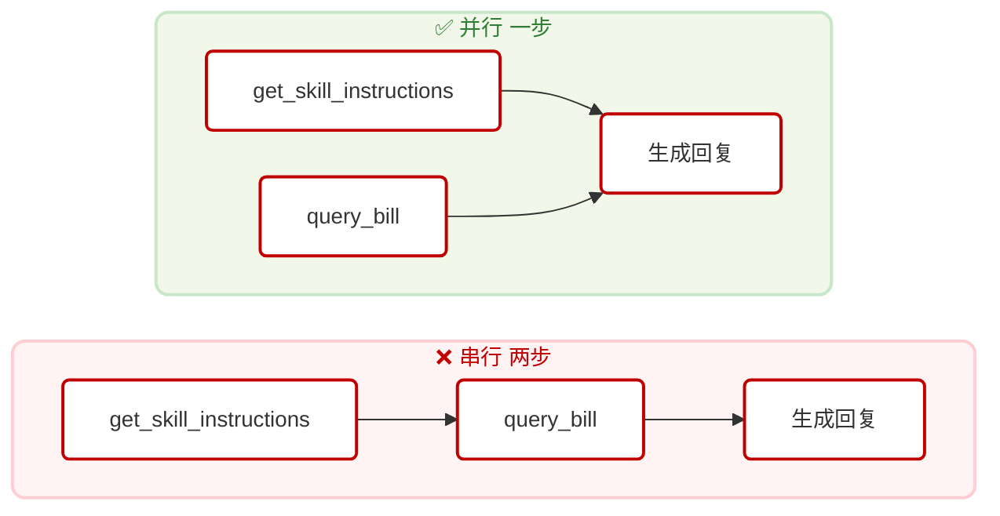

# 05 - 非功能需求（性能 / 安全 / 可靠性）

## 1. 性能

### 1.1 响应延迟

| 场景 | 主要耗时来源 | 典型耗时 |
|------|------------|---------|
| 账单查询（Skill + MCP 并行） | LLM 推理（2 步） | ~4s（Step-3.5-Flash） |
| 套餐咨询（多工具并行） | LLM 推理（2 步） | ~4-5s |
| 业务退订（串行含确认） | LLM 推理（3 步） | ~6-8s |
| 故障诊断（串行多步） | LLM 推理 + 诊断脚本 | ~5-7s |

> 实测数据基于 `stepfun-ai/Step-3.5-Flash` 模型，TTFB 约 0.5-1s，总耗时约 14s（旧模型）→ 4s（新模型）。

### 1.2 并行调用优化

Agent 在同一步骤中并行触发 Skill 加载和 MCP 查询，减少 LLM round-trip：



`system-prompt.md` 中明确约束：**同一步骤并行调用技能工具和 MCP 工具，禁止拆分为多步。**

### 1.3 Skills 懒加载

- Skills 文档在 Agent 处理请求时**按需加载**，不在启动时全量注入 system prompt
- 避免无关知识占用 LLM 上下文 token，降低推理延迟和成本

### 1.4 Agent 超时控制

| 控制项 | 值 |
|--------|-----|
| Agent 执行总超时 | 180 秒 |
| ReAct 最大步数 | 10 步（`maxSteps: 10`） |
| LLM 首 token 延迟（TTFB） | ~0.5-1s（Step-3.5-Flash） |

### 1.5 运行时

- 后端使用 **Bun** 运行，启动速度和 I/O 吞吐优于 Node.js
- Hono 框架轻量，路由性能接近原生

---

## 2. 安全

### 2.1 凭证管理

所有敏感配置（API Key、数据库连接串）通过 `.env` 文件注入，**不硬编码在源码中**：

```typescript
// 正确做法（当前实现）
const apiKey = process.env.SILICONFLOW_API_KEY;

// 禁止做法
const apiKey = "sk-xxxxxxxxxx";
```

`.env` 文件已加入 `.gitignore`。

### 2.2 输入校验

MCP Server 使用 **Zod schema** 对所有工具入参进行运行时校验：

```typescript
// telecom_service.ts
server.tool("query_bill", {
  phone: z.string().describe("用户手机号"),
  month: z.string().optional().describe("月份 YYYY-MM"),
}, async ({ phone, month }) => { ... });
```

非法参数将被 Zod 拦截，返回校验错误，不进入业务逻辑。

### 2.3 操作确认（Human-in-the-Loop）

退订增值业务属于**不可逆操作**，系统设计要求 Agent 在执行前向用户确认：

```
Agent → 用户："即将退订【视频会员流量包（20GB/月）】，月费 ¥20，
               次月 1 日生效。确认退订吗？"
用户 → 确认
Agent → 调用 cancel_service()
```

system-prompt.md 中已明确约束此行为。

### 2.4 数据隔离

- **会话隔离**：每个 session_id 独立存储，不同用户的对话历史互不可见
- **级联删除**：会话删除时，关联的 messages 记录级联删除（`onDelete: 'cascade'`）

### 2.5 MCP 通信

- 当前 MCP Server 使用 `http://`（localhost 内部通信）
- **生产建议：** 生产环境应使用反向代理 + HTTPS，或限制 MCP 端点仅内网可访问

### 2.6 Agent 行为约束

Agent 通过 `system-prompt.md` 实施安全边界，确保敏感操作（如退订）前必须获得用户确认，超出能力范围时引导至人工渠道，不承诺无法完成的操作。具体约束规则见 **[02-components.md § 1.3](02-components.md)**。

### 2.7 合规用语拦截

系统通过三层合规拦截架构保障对话安全：

| 层 | 实现 | 模式 |
|----|------|------|
| L1 | AC 自动机关键词匹配 | 同步，< 1ms |
| L2 | Agent 输出管道拦截 | 同步（文字）/ 异步（语音） |
| L3 | 坐席发言监控 | 同步拦截 |

关键词分三类：banned（硬拦截）、warning（软告警）、pii（脱敏）。内置 18 个默认敏感词（推诿、催收违规、过度承诺等），支持运行时热重载。

### 2.8 权限控制（RBAC）

5 级角色层级：admin > flow_manager > config_editor > reviewer > auditor。
通过 `requireRole()` 中间件保护关键 API，开发模式下无认证头时自动放行。

### 2.9 版本控制与回滚

所有 Skill 文件修改自动创建版本快照（SQLite skill_versions 表），支持 Diff 对比和一键回滚。回滚操作本身也会创建新版本记录，确保审计链完整。

---

## 3. 可靠性

### 3.1 MCP Server 可用性

- Telecom MCP Server（:8003）独立部署，启动失败时后端会在请求时抛出连接异常
- start.sh 启动后通过健康检查 `/health` 确认服务就绪后才返回

### 3.2 错误处理

| 错误场景 | 当前处理方式 |
|----------|------------|
| 用户手机号不存在 | `query_subscriber` 返回 `{"found": false}` |
| 查询月份无账单 | `query_bill` 返回 `{"found": false}` |
| 退订未订阅的业务 | `cancel_service` 返回 `{"success": false, "message": "..."}` |
| MCP Server 连接失败 | 后端捕获异常，返回 HTTP 500 |
| LLM 超时（>180s） | AbortSignal 中断，返回 HTTP 500 |

### 3.3 数据持久化

- **会话消息**：持久化存储在 SQLite（`sessions` / `messages` 表），进程重启后历史保留
- **业务数据**（套餐、用户、账单、增值业务）：同样持久化在 SQLite，MCP Server 与后端共享同一文件（WAL 模式），进程重启后数据保留
- **生产建议：** 将 SQLite 替换为托管 PostgreSQL（RDS / Supabase）以支持多实例横向扩展

### 3.4 并发

- **Hono + Bun**：基于 V8 事件循环，天然支持异步并发请求
- **数据库连接**：Drizzle ORM 使用连接池，支持并发读写
- **MCP Server**：StreamableHTTP stateless 模式，每请求独立，支持并发

### 3.5 进程管理

start.sh 中各服务通过 PID 文件管理，stop.sh 按端口强制回收。端口分配见 **[06-deployment.md § 3 端口说明](06-deployment.md)**。

---

## 4. 可观测性

| 维度 | 当前实现 | 生产建议 |
|------|----------|----------|
| **结构化日志** | JSON 格式写入 `logs/` 目录（backend.log / telecom-mcp.log / frontend.log） | 接入 ELK / CloudWatch |
| **关键指标** | 每请求记录 `db_session_ms`、`agent_ms`、`total_ms`、`llm_ms`、`step` | 接入 Prometheus + Grafana |
| **LLM 追踪** | `onStepFinish` 记录每步工具调用和耗时 | 接入 LangSmith / Langfuse |
| **MCP 监控** | telecom-mcp.log 记录每次工具调用耗时 | 添加 `/health` 端点 |
| **错误告警** | 无 | 接入 Sentry |
| **语音会话指标** | VoiceSessionState 扩展：首包时延（avg/p95）、打断次数、冷场次数、会话时长 | 接入实时仪表盘 |
| **文字会话指标** | chat-ws session_summary：消息数、工具成功率、转人工率、自动闭环率 | 接入 BI 分析 |
| **合规告警** | compliance_alert 事件推送至坐席工作台 ComplianceContent 卡片 | 接入质检系统 |

**日志示例：**

```json
{ "ts":"2026-03-01T09:33:17.252Z","level":"INFO","mod":"agent",
  "msg":"generate_done","steps":2,"mcp_init_ms":24,
  "llm_ms":4096,"total_ms":4120 }
```
