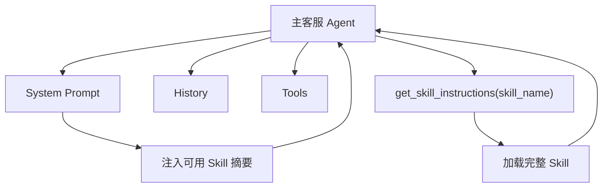
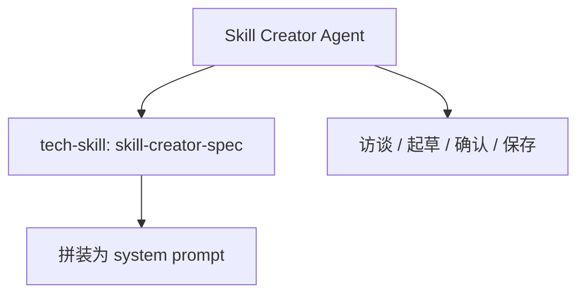

# Agent、System Prompt、Skill 关系说明

> 说明本项目中运行时 Agent、全局 System Prompt 与 Skill 资产之间的职责边界与协作关系

## 背景

在当前项目中，LLM 并不是“裸模型直接回复用户”，而是通过一层 Agent 运行时来执行。  
随着业务 Skill、内置工具、MCP 工具和技能创建能力逐步增多，如果不把 **Agent**、**System Prompt** 和 **Skill** 三者的关系讲清楚，会很容易出现以下误解：

1. 把 Skill 误认为是 system prompt 的一部分
2. 把 system prompt 误认为某个具体业务的 SOP
3. 把 Agent 误认为只是“选了一个模型”
4. 不清楚为什么主客服 Agent 和 skill-creator 这类系统内 Agent 都在使用 Skill，但方式不同

因此需要一份统一说明，明确三者在项目中的分层角色。

## 一、结论先行

在这个项目里，三者的关系可以概括为：

- **Agent**：运行时执行器，负责与用户对话、调用工具、推进流程
- **System Prompt**：Agent 的全局规则底座，定义身份、原则和硬约束
- **Skill**：可管理、可加载的业务操作指南或技术操作指南，按场景提供领域级 SOP

最短一句话：

> **Agent = 执行者，System Prompt = 全局宪法，Skill = 按需加载的领域作业指导书。**

## 二、三者各自负责什么

### 1. Agent：运行时执行单元

Agent 不是一个单纯的模型名，而是一套运行时组合：

- 一个 LLM 模型
- 一段 system prompt
- 一组对话历史
- 一组可用 tools
- 一套工具调用与结果处理逻辑

在主客服链路中，这个 Agent 的核心运行入口位于：

- [runner.ts](/Users/chenjun/Documents/obsidian/workspace/ai-bot/backend/src/engine/runner.ts)

它负责：

1. 接收用户输入
2. 拼装 system prompt 和历史消息
3. 决定是否匹配某个 Skill
4. 调用工具
5. 组织最终回复

因此，Agent 是“真正干活的执行者”。

### 2. System Prompt：全局规则底座

System Prompt 负责定义对某个 Agent 来说**始终成立**的规则，而不是某个具体业务的处理细节。

在主客服 Agent 中，system prompt 由两部分模板拼装：

- [inbound-base-system-prompt.md](/Users/chenjun/Documents/obsidian/workspace/ai-bot/backend/src/engine/inbound-base-system-prompt.md)
- [inbound-online-system-prompt.md](/Users/chenjun/Documents/obsidian/workspace/ai-bot/backend/src/engine/inbound-online-system-prompt.md)

在 [runner.ts](/Users/chenjun/Documents/obsidian/workspace/ai-bot/backend/src/engine/runner.ts#L47) 中，这两份模板会合并为 `SYSTEM_PROMPT_TEMPLATE`，再注入手机号、套餐名、当前日期、可用技能摘要等上下文。

System Prompt 主要定义的是：

- Agent 的身份：电信客服“小通”
- 哪些数据是可信的、哪些必须通过工具获取
- 多意图如何处理
- 高歧义场景何时先澄清
- 何时必须转人工
- 回复风格、长度和约束
- 必须先加载 Skill 再调用业务工具

因此，System Prompt 的定位是“全局治理规则”，而不是“具体业务 SOP”。

### 3. Skill：领域级操作指南

Skill 是平台自有的可管理 Prompt 资产，负责承载某个领域的业务知识和流程约束。

在业务客服场景下，一个 Skill 通常包含：

- 该技能处理的业务范围
- 典型触发语句
- Mermaid 状态图
- Tool Call Plan
- references 参考文档
- 回复规范
- 转人工边界

这些 Skill 主要来自：

- `backend/skills/biz-skills/*/SKILL.md`
- `backend/skills/biz-skills/*/references/*`

相关加载与索引逻辑在：

- [skills.ts](/Users/chenjun/Documents/obsidian/workspace/ai-bot/backend/src/engine/skills.ts)

因此，Skill 更像“某个业务域的 SOP 包”，例如：

- `bill-inquiry`
- `plan-inquiry`
- `service-cancel`
- `fault-diagnosis`

## 三、主客服 Agent 中三者如何协作

主客服 Agent 的协作关系如下：

### 1. System Prompt 先告诉 Agent“必须走 Skill 机制”

主客服 system prompt 中明确规定：

- 收到用户问题后，要先判断是否匹配某个已有 Skill
- 如果匹配，必须先调用 `get_skill_instructions`
- 加载 Skill 后，严格按照 Skill 中的状态图执行

这意味着：

- Skill 不是天然常驻在上下文里的
- Skill 是由 Agent 在运行时按需加载的
- System Prompt 负责要求 Agent 遵守这种工作方式

### 2. System Prompt 中只放 Skill 摘要，不放完整 Skill

当前实现中，主客服 Agent 不会把所有业务 Skill 的全文都直接塞进 system prompt。  
它只会把“当前可用 Skill 摘要”注入 system prompt，用于帮助 Agent 做意图匹配。

对应实现见：

- [runner.ts](/Users/chenjun/Documents/obsidian/workspace/ai-bot/backend/src/engine/runner.ts#L72)
- [skills.ts](/Users/chenjun/Documents/obsidian/workspace/ai-bot/backend/src/engine/skills.ts#L318)

这里注入的是：

- 技能名
- 描述
- 典型问法（触发关键词）

这样做的目的有两个：

1. 降低 prompt 长度，避免把所有业务细节都常驻注入
2. 让 Skill 在真正命中时再动态加载，提高上下文利用效率

### 3. 完整 Skill 通过工具动态加载

当 Agent 判断某个业务 Skill 命中后，会调用内置工具：

- `get_skill_instructions`

这个工具定义在：

- [skills.ts](/Users/chenjun/Documents/obsidian/workspace/ai-bot/backend/src/engine/skills.ts#L387)

它会读取对应 Skill 的完整 `SKILL.md`，并附加一段 SOP 强制执行后缀，要求模型：

- 按状态图顺序执行
- 不得跳步
- 操作类工具必须满足前置条件
- 查询类步骤应连续完成

也就是说，Skill 被真正加载进上下文之后，才成为这轮对话的具体操作指南。

### 4. Agent 负责执行，而不是 Skill 自己执行

Skill 本身不执行工具，也不“自动跑流程”。  
真正做决策和发起工具调用的仍然是 Agent。

因此运行时关系不是：

> 用户 -> Skill -> Tool

而是：

> 用户 -> Agent -> 加载 Skill -> Agent 按 Skill 调 Tool

这说明 Skill 是“被 Agent 消费的知识资产”，不是独立执行单元。

## 四、为什么 Skill 不等于 System Prompt

这是最容易混淆的点。

### 1. System Prompt 解决的是全局一致性问题

例如：

- 不能编造事实
- 多意图要逐一处理
- 高风险必须转人工
- 必须先加载 Skill 再调业务工具
- 回复风格要简洁

这些规则对所有业务都成立。

### 2. Skill 解决的是具体业务差异问题

例如：

- 查账单要先查什么、后查什么
- 停机保号要不要先查欠费和合约
- 故障诊断和套餐咨询如何分流
- 什么时候必须让用户确认

这些规则只对某个业务场景成立，不适合放进全局 system prompt。

因此：

- **System Prompt** 是全局规则
- **Skill** 是领域规则

二者是分层关系，而不是互相替代关系。

## 五、Skill 也是 Prompt 资产，但不是只有一种用法

在这个项目里，Skill 不是只服务主客服 Agent。  
Skill 还被用作“系统内 Agent 的 prompt 规范”。

### 1. 业务 Skill：给主客服 Agent 按需加载

这类 Skill 位于：

- `backend/skills/biz-skills/*`

它们服务的是客户业务处理，例如账单查询、退订、套餐咨询、停机保号等。

### 2. 技术 Skill：直接作为某个专用 Agent 的 prompt 来源

例如技能创建 Agent 使用的技术 Skill：

- [skill-creator-spec/SKILL.md](/Users/chenjun/Documents/obsidian/workspace/ai-bot/backend/skills/tech-skills/skill-creator-spec/SKILL.md)

在 [skill-creator.ts](/Users/chenjun/Documents/obsidian/workspace/ai-bot/backend/src/agent/km/skills/skill-creator.ts#L187) 中，系统会读取这份 `SKILL.md`，去掉 frontmatter，再注入运行时上下文、编写规范和已有技能索引，拼装成 `skill-creator` 这个 Agent 的 system prompt。

这说明在当前项目里：

- 业务 Skill 通常是“按需加载的领域指南”
- 技术 Skill 也可以直接作为“专用 Agent 的 prompt 模板”

因此，Skill 的本质不是“某一页 Markdown 文档”，而是“可管理的 Prompt 资产”。

## 六、以“停机保号”为例说明三者关系

假设用户输入：

> 我的卡暂时不用了，先帮我停一下，号码给我留着。

这时主客服 Agent 的运行关系如下：

### 1. System Prompt 先发挥作用

System Prompt 会约束 Agent：

- 这可能是某个业务 Skill 的场景
- 不能直接调用办理工具
- 必须先判断 Skill 命中情况

### 2. Agent 依据 Skill 摘要做匹配

Agent 根据当前 system prompt 中注入的 Skill 摘要，判断这句话应命中“停机保号”相关 Skill，例如 `suspend-service`。

### 3. Agent 调用 `get_skill_instructions`

命中后，Agent 会调用 `get_skill_instructions("suspend-service")`，把该 Skill 的完整操作指南加载到上下文中。

### 4. Skill 告诉 Agent 具体 SOP

Skill 会进一步约束 Agent：

1. 先确认用户要的是“停机保号”，不是销号
2. 调用 `verify_identity`
3. 调用 `check_account_balance`
4. 调用 `check_contracts`
5. 解释资费和生效规则
6. 用户确认后才允许 `apply_service_suspension`

### 5. Agent 负责真正执行

最终发起工具调用的仍然是 Agent，而不是 Skill。

因此在这个例子里：

- **System Prompt** 决定“必须先按 Skill 机制工作”
- **Skill** 决定“停机保号这个业务到底怎么处理”
- **Agent** 决定“当前这一轮具体怎么执行”

## 七、技能创建 Agent 是另一种关系

除了主客服 Agent，本项目里还有一个技能创建 Agent：

- [skill-creator.ts](/Users/chenjun/Documents/obsidian/workspace/ai-bot/backend/src/agent/km/skills/skill-creator.ts)

它的关系稍有不同：

这里：

- `skill-creator-spec/SKILL.md` 不是“被运行时按需加载的业务 Skill”
- 而是直接作为 `skill-creator` 这个 Agent 的 prompt 规范来源

所以不能简单说“Skill 只是一种业务插件”。  
更准确地说：

> Skill 是平台上的可管理 Prompt 资产，在不同 Agent 中可以作为“按需加载的业务 SOP”或“专用 Agent 的 prompt 模板”使用。

## 八、架构层面的正确理解

如果要用一句正式的话来概括本项目里的三者关系，可以写成：

> Agent 是运行时执行器，System Prompt 是全局治理规则，Skill 是按场景组织的可管理 Prompt 资产。对于主客服 Agent，System Prompt 负责要求 Agent 先匹配并加载 Skill，再按 Skill 的 SOP 调用工具；对于 skill-creator 这类专用 Agent，技术 Skill 则直接作为其 prompt 规范来源。

## 九、结论

在本项目中：

- Agent 负责执行
- System Prompt 负责治理
- Skill 负责承载领域知识与流程约束

三者不是相互替代关系，而是明确分层：

1. **Agent** 决定“这一轮怎么跑”
2. **System Prompt** 约束“哪些全局规则必须始终成立”
3. **Skill** 提供“某个具体领域应该怎么处理”

只有把这三层拆清楚，系统才能同时做到：

- 全局行为一致
- 业务流程可治理
- 技能内容可维护
- 新 Agent 类型可复用同一套 Skill 资产体系

