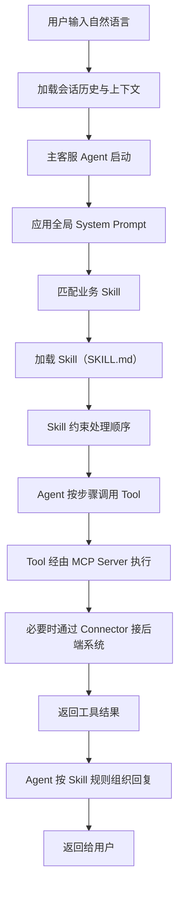
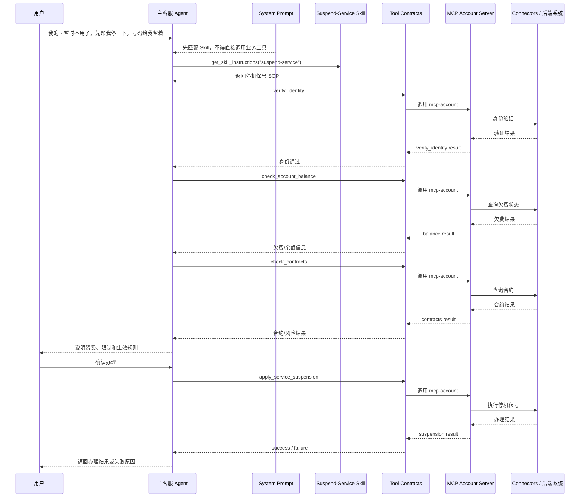

# 运行时视角：用户请求的完整执行链路

> 以“停机保号”业务场景为例，说明一条自然语言请求进入系统后，Agent、System Prompt、Skill、Tool 与 MCP 如何协同工作

## 背景

前面的架构说明已经分别解释了：

- Agent、System Prompt、Skill 之间的关系
- Skill、Tool Contract、MCP Server、Connector 之间的关系

但仅靠静态分层说明，还不足以让听众或读者真正理解系统“怎么跑起来”。  
在实际沟通中，最容易被理解的一种方式，是从**运行时视角**来讲述：当用户输入一句自然语言后，系统究竟按什么顺序一步一步执行。

本章节采用一条完整链路来说明这个问题。

示例请求：

> “我的卡暂时不用了，先帮我停一下，号码给我留着。”

这个请求适合用来说明：

- 自然语言意图是如何进入业务 Skill 的
- Skill 如何约束 Tool 调用顺序
- Tool 如何通过 MCP Server 接入后端能力
- 当规则冲突、工具失败、能力缺失时，系统如何兜底

## 一、运行时总览

从运行时角度看，请求链路如下：

这条链路说明了一件核心事实：

> 系统不是“用户一句话 -> 模型直接回答”，而是“用户一句话 -> Agent 在全局规则约束下选择并加载 Skill -> 再按 Skill 编排调用 Tool -> Tool 经由 MCP 获得真实能力 -> Agent 生成最终回复”。

## 二、分步骤执行过程

### 1. 用户请求进入系统

用户消息首先进入客服对话入口。

当前项目中的主要入口包括：

- [chat.ts](/Users/chenjun/Documents/obsidian/workspace/ai-bot/backend/src/chat/chat.ts)
- [chat-ws.ts](/Users/chenjun/Documents/obsidian/workspace/ai-bot/backend/src/chat/chat-ws.ts)

系统在这一层会准备以下运行时上下文：

- 当前用户输入
- 当前会话的历史消息
- 用户手机号等基础信息
- 当前渠道信息（如在线客服、语音等）
- 本轮可用工具

然后把这些数据交给主执行器：

- [runner.ts](/Users/chenjun/Documents/obsidian/workspace/ai-bot/backend/src/engine/runner.ts)

因此，Agent 启动时看到的不是一条孤立文本，而是一整套会话上下文。

### 2. Agent 带着全局规则启动

主客服 Agent 启动后，首先生效的是全局 System Prompt。

在当前实现中，主客服 Agent 的 system prompt 由两份模板拼装而成：

- [inbound-base-system-prompt.md](/Users/chenjun/Documents/obsidian/workspace/ai-bot/backend/src/engine/inbound-base-system-prompt.md)
- [inbound-online-system-prompt.md](/Users/chenjun/Documents/obsidian/workspace/ai-bot/backend/src/engine/inbound-online-system-prompt.md)

组装逻辑位于：

- [runner.ts](/Users/chenjun/Documents/obsidian/workspace/ai-bot/backend/src/engine/runner.ts#L47)

这层全局规则会告诉 Agent：

- 自己的身份是电信客服“小通”
- 哪些数据可直接使用，哪些必须通过工具获取
- 多意图如何处理
- 高歧义场景需要先澄清
- 何时必须转人工
- 业务工具不能在未加载 Skill 的情况下直接调用

因此，Agent 的起点不是“自由推理”，而是“受全局规则约束的业务执行”。

### 3. 先匹配业务 Skill

系统不会在用户输入后立即调用业务 Tool。  
它会先判断：当前请求属于哪个业务领域，应该进入哪一个 Skill。

为了完成这一步，system prompt 中会注入当前可用 Skill 的摘要信息，例如：

- 技能名称
- 技能描述
- 典型触发语句

这些摘要来自：

- [skills.ts](/Users/chenjun/Documents/obsidian/workspace/ai-bot/backend/src/engine/skills.ts#L318)

对于示例请求：

> “我的卡暂时不用了，先帮我停一下，号码给我留着。”

Agent 应判断这更接近“停机保号”业务，而不是账单查询、故障报修或退订增值业务。  
因此会进一步命中与停机保号对应的 Skill，例如 `suspend-service`。

这一阶段解决的是“业务归类”问题。

### 4. 加载对应 Skill

一旦匹配到某个 Skill，Agent 不会直接调业务 Tool，而是先调用内置工具：

- `get_skill_instructions(skill_name)`

该工具定义在：

- [skills.ts](/Users/chenjun/Documents/obsidian/workspace/ai-bot/backend/src/engine/skills.ts#L387)

它会读取对应 Skill 的完整 `SKILL.md`，并附加一段强制执行规则，要求模型：

- 按 Mermaid 状态图顺序推进
- 不得跳步
- 连续完成前置查询
- 只有在明确确认后才能执行操作类工具

也就是说：

- System Prompt 只负责告诉 Agent“必须先找 Skill”
- 真正的业务处理细节，是在这一阶段通过 Skill 动态注入上下文的

### 5. Skill 告诉 Agent 该怎么处理“停机保号”

加载了“停机保号” Skill 之后，Agent 才真正知道这一类请求应该如何处理。

一个典型的 `suspend-service` Skill 会约束以下步骤：

1. 确认用户要办理的是“停机保号”，而不是销号或简单停机
2. 先做身份校验
3. 再查询账户欠费状态
4. 再查询有效合约与风险限制
5. 再说明资费、生效时间、恢复方式等规则
6. 在用户明确确认后，才允许执行停机保号办理
7. 若存在欠费、合约限制、规则冲突或工具异常，则改走解释、引导或转人工分支

在这里，Skill 的作用不是直接执行，而是：

> **把“停机保号”这个业务的 SOP 交给 Agent。**

### 6. Agent 按 Skill 的顺序调用 Tool

在停机保号这个场景中，Agent 下一步会按 Skill 中定义的顺序调用相关 Tool。

典型包括：

- `verify_identity`
- `check_account_balance`
- `check_contracts`
- `apply_service_suspension`

在当前项目里，Agent 使用多步工具调用机制执行这些动作，相关逻辑位于：

- [runner.ts](/Users/chenjun/Documents/obsidian/workspace/ai-bot/backend/src/engine/runner.ts)

这里需要特别强调：

- Tool 不是 Skill 自己执行的
- 真正发起工具调用的是 Agent
- Skill 只负责告诉 Agent：
  - 该先调哪个工具
  - 哪些步骤必须连续完成
  - 哪一步需要停下来等用户确认
  - 哪个工具属于“查询”，哪个属于“操作”

因此，运行时的真实关系是：

> Agent 依据 Skill 约束来调用 Tool。

### 7. Tool 再通过 MCP 获得真实能力

当 Agent 调用某个 Tool 时，Tool 并不是最终后端系统本身。  
Tool 是标准化能力入口，实际执行还要继续下沉到 MCP 层。

以停机保号为例，这些 Tool 通常归属于：

- `mcp-account`

因此运行时链路会继续展开为：

1. Agent 调用 Tool
2. Tool 由 `mcp-account` 对应的 MCP Server 托管
3. MCP Server 决定底层采用哪种实现方式
4. 必要时再通过 Connector 接入真实 API、DB 或其他远程能力

也就是说，Tool 在运行时承担的是“标准能力入口”的角色，而不是“业务最终实现”的角色。

### 8. Agent 获取工具结果并继续推进流程

在停机保号场景中，Agent 可能依次拿到如下事实结果：

- `verify_identity`：身份是否通过验证
- `check_account_balance`：是否有欠费、欠费金额是多少
- `check_contracts`：是否存在有效合约、是否存在高风险限制
- `apply_service_suspension`：办理是否成功、生效时间、恢复截止时间、保号费是多少

这些结果返回之后，Agent 不能脱离 Skill 自由发挥，而必须继续按 Skill 的规则推进：

- 有欠费时不能继续办理
- 有高风险合约时不能跳过风险提示
- 需要确认的步骤不能跳过
- 办理成功后的回复要严格引用返回字段

这时可以这样理解：

- Tool 返回的是“事实”
- Skill 定义的是“如何使用这些事实”
- Agent 负责把事实和规则组合成回复

### 9. Agent 生成最终回复

当查询、校验和必要的操作都完成后，Agent 才会生成最终面向用户的回复。

这个回复同时受到三类约束：

1. **System Prompt 的约束**
   - 不得编造
   - 风格要简洁
   - 高风险要转人工

2. **Skill 的约束**
   - 按既定顺序处理
   - 操作前必须说明影响并取得确认
   - 异常走异常分支

3. **Tool Result 的约束**
   - 生效时间必须引用真实结果
   - 保号费必须引用真实字段
   - 合约和欠费结论必须来自查询结果

因此，最终回复不是模型凭空生成，而是“全局规则 + 业务 SOP + 工具事实”的组合结果。

## 三、异常与兜底路径

一个运行时架构是否可靠，关键不在成功链路，而在异常链路。

### 1. Skill 未命中或意图模糊

如果用户表达存在歧义，例如：

- “停机”
- “暂停服务”
- “这个号先别用了”

系统不能直接假定这一定等于“停机保号”。  
此时 Agent 应先澄清，确认用户到底是要：

- 停机保号
- 销号
- 暂停某个增值业务
- 还是别的业务场景

换句话说，**意图不清时先澄清，而不是先调工具。**

### 2. Tool 缺失或不可用

如果某个 Skill 所需 Tool 根本不存在，或者 Tool 只是：

- `planned`
- `disabled`
- 未配置完成

那么系统不能把该步骤包装成“系统已自动完成”。  
此时应该：

- 改成规则解释
- 改成引导用户到 App / 营业厅办理
- 或者直接转人工

也就是说：

> **没有可用 Tool，就不能把动作类步骤设计成自动执行。**

### 3. Tool 调用失败

如果运行时出现以下异常：

- MCP 服务不可达
- handler 执行报错
- 返回结构异常
- 同一工具连续失败

则 Agent 应优先按 Skill 中的异常路径处理；若无法继续，应调用：

- `transfer_to_human`

而不是继续编造“已为您办理成功”之类的结果。

### 4. 规则冲突

例如：

- 用户要求“别查了，直接给我办”
- 但 Skill 要求必须先查欠费、查合约并说明影响

此时优先级应为：

> Skill / SOP 约束 > 用户催促

也就是说，系统必须遵守流程约束，不能为了追求“对话顺滑”而跳步。

### 5. 高风险与超范围场景

以下情况应优先转人工：

- 高风险业务操作
- 用户情绪激烈或明确投诉
- 身份验证无法完成
- 模型连续两轮无法识别意图
- 工具能力无法覆盖当前问题

这类场景下，系统的目标不是勉强闭环，而是保证真实、合规和安全。

## 四、停机保号场景的时序图

下面用更完整的时序图把“停机保号”场景串起来：

## 五、结论

从运行时视角看，本项目的核心执行机制不是“模型直接回答”，而是：

1. 用户请求进入系统
2. Agent 在全局 System Prompt 约束下启动
3. 先匹配合适的业务 Skill
4. 动态加载 Skill 的完整操作指南
5. Agent 按 Skill 规定的顺序调用 Tool
6. Tool 再通过 MCP Server 和 Connector 获得真实能力
7. Agent 根据 Skill 规则与工具结果组织最终回复
8. 若中途出现失败、冲突或能力缺失，则走异常分支、引导或转人工

因此，系统真正的运行逻辑可以概括为：

> **Agent 负责执行，System Prompt 负责全局治理，Skill 负责业务 SOP，Tool/MCP 负责能力落地。**

只有这几层协同起来，系统才能既像一个“会对话的客服”，又像一个“受规则约束、能真实落地的业务执行系统”。

