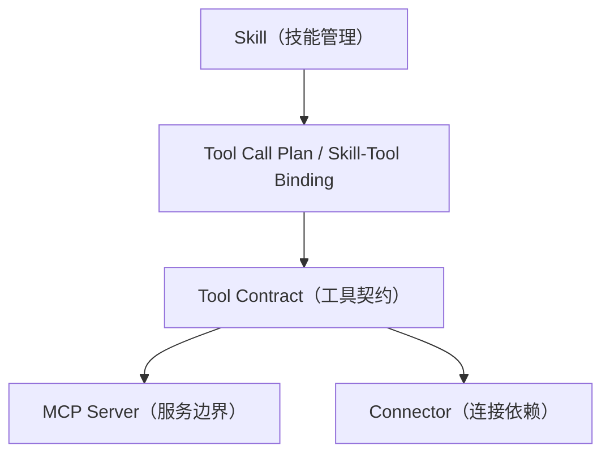
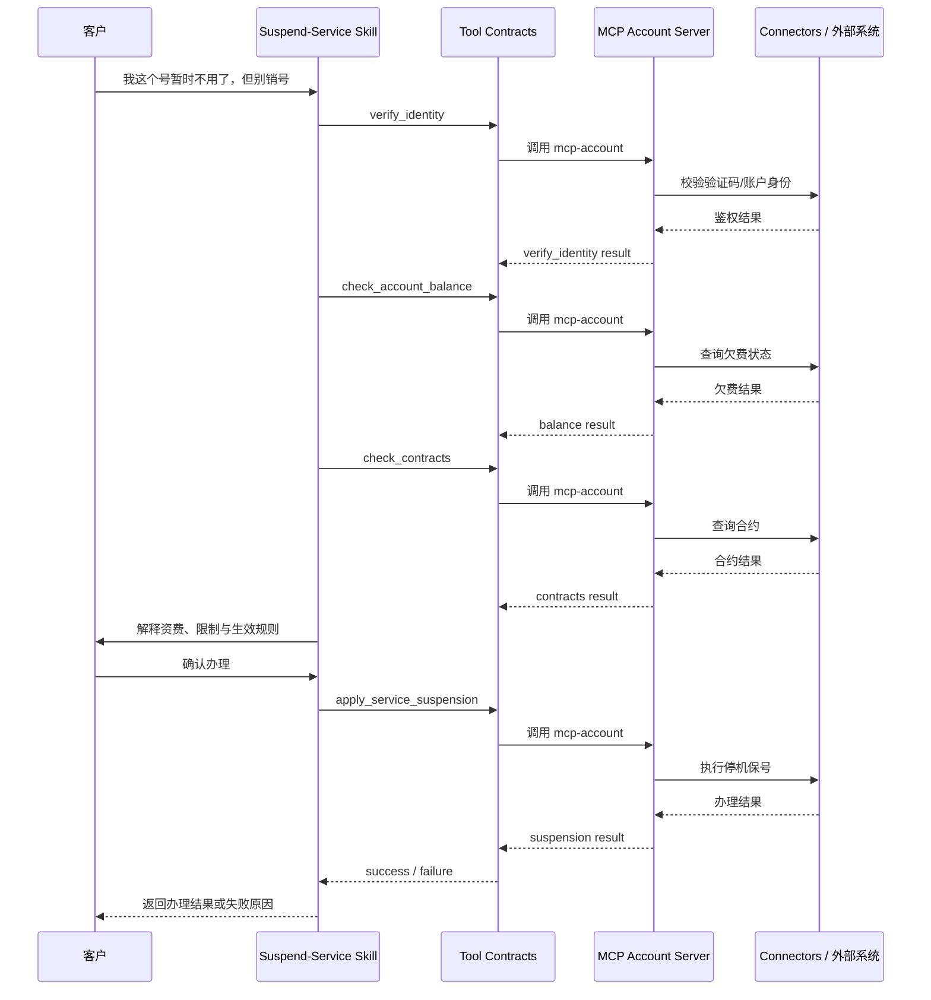

# Skill、Tool Contracts、MCP Servers、Connectors 架构说明

> 以“停机保号”业务技能为例，说明技能管理与 MCP 管理之间的分层关系

## 背景

当前项目同时提供了两类能力入口：

- **技能管理**：面向业务人员，定义业务意图、流程、规则和参考资料
- **MCP 管理**：面向平台/配置人员，定义工具契约、服务边界和底层连接依赖

随着业务技能数量增加，如果不把“业务流程”“工具契约”“服务边界”“外部依赖”拆开，系统会很快出现以下问题：

1. Skill 直接耦合 API 或脚本路径，业务一改就要改实现
2. 同一个工具能力在多个 Skill 中重复定义，难以复用
3. 无法判断一个 Skill 缺的是规则、工具，还是底层连接
4. 无法清晰区分“业务编排问题”和“系统接入问题”

因此，本项目采用四层分离的设计：



一句话概括：

- **Skill** 决定“业务怎么做”
- **Tool Contract** 决定“能力怎么被调用”
- **MCP Server** 决定“能力归谁负责”
- **Connector** 决定“能力怎么连到底层系统”

## 一、四类对象的职责边界

### 1. Skill（技能）

Skill 是业务编排层，面向业务人员和运营人员。

它主要定义：

- 识别什么用户意图
- 按什么 SOP 处理
- 要引用哪些参考文档
- 什么步骤调用什么 Tool
- 哪些步骤不能跳过
- 什么情况下必须转人工

Skill 的核心产物通常包括：

- `SKILL.md`
- `references/` 参考资料
- `Tool Call Plan`
- 测试用例

Skill **不应**包含以下内容：

- API URL
- 数据库表名
- handler 文件路径
- 连接器配置
- 真实系统鉴权信息

也就是说，Skill 只负责编排，不负责具体接入实现。

### 2. Tool Contract（工具契约）

Tool Contract 是能力契约层，面向平台治理和能力复用。

它主要定义：

- 工具名称
- 工具描述
- 输入参数 Schema
- 输出结果 Schema
- Mock 场景
- 响应示例
- Real / Mock 模式
- 工具的实现方式摘要

Tool Contract 的作用是把“业务调用接口”标准化。  
Skill 不直接依赖脚本、SQL、API，而是依赖 Tool Contract。

例如：

- `verify_identity`
- `check_account_balance`
- `check_contracts`
- `apply_service_suspension`

这些都属于 Tool Contract。

### 3. MCP Server

MCP Server 是能力归属边界层，面向服务拆分和运行时托管。

它主要定义：

- 某一类业务能力归哪个服务域负责
- 该服务域下有哪些工具
- 这些工具作为一个 MCP 协议端点对外暴露

在当前项目中，工具按领域归在不同 MCP Server 下，例如：

- `mcp-user-info`
- `mcp-business`
- `mcp-diagnosis`
- `mcp-outbound`
- `mcp-account`

MCP Server 的重点是“服务边界”，不是业务流程本身。

### 4. Connector

Connector 是底层连接依赖层，面向外部系统接入。

它主要定义：

- 连接什么类型的外部依赖
- 使用哪种连接方式
- 使用什么配置

当前项目中支持的 Connector 类型包括：

- `api`
- `db`
- `remote_mcp`

Connector 解决的问题是：

- 这个 Tool 最终接哪个 API
- 连哪个数据库
- 是否代理到另一个远程 MCP 服务

Connector 不是业务能力本身，只是业务能力的“底层依赖”。

## 二、它们之间的关系

这四层不是并列关系，而是逐层收敛的关系。

### 1. Skill -> Tool Contract

Skill 通过 `Tool Call Plan` 使用 Tool Contract。

在当前项目中，这层关系一部分存在于 `SKILL.md` 的 Mermaid 状态图注解里，例如：

```text
%% tool:verify_identity
%% tool:check_account_balance
%% tool:check_contracts
%% tool:apply_service_suspension
```

这些注解会被同步成显式的 `skill_tool_bindings`，形成 Skill 到 Tool 的绑定关系。

因此，Skill 与 Tool 的关系是：

- Skill 决定何时调用
- Tool 决定如何标准化调用

### 2. Tool Contract -> MCP Server

每个 Tool Contract 都应该归属于某个 MCP Server。

例如：

- `verify_identity` 归属 `mcp-account`
- `check_account_balance` 归属 `mcp-account`
- `check_contracts` 归属 `mcp-account`
- `apply_service_suspension` 归属 `mcp-account`

这样做的意义是：

- 工具能力按领域聚合
- 服务边界清楚
- 后续扩展时知道该把新工具放在哪个域里

### 3. Tool Contract -> Connector

Tool Contract 自身不等于底层连接方式，但它最终需要一种实现路径。

例如一个 Tool 可能：

- 由脚本 handler 实现
- 通过 API Proxy 调用后端服务
- 通过 DB 连接查询数据
- 或者调用 remote MCP

这些外部依赖由 Connector 负责承载。

因此关系不是：

> Skill -> Connector

而是：

> Skill -> Tool Contract -> Connector

这也是当前项目的一个核心原则：  
**Skill 只认识 Tool，不认识 Connector。**

## 三、以“停机保号”业务技能为例

下面用“停机保号”这个例子，把四层关系串起来。

### 1. 业务目标

我们希望机器人能处理如下用户意图：

- “我的卡暂时不用了，先帮我停一下，号码给我留着。”
- “我想暂停服务，但是不想销号。”
- “停机保号怎么收费？”

这意味着机器人不仅要识别意图，还要：

- 解释资费和规则
- 判断欠费与合约限制
- 在条件满足时执行办理

### 2. 在 Skill 层定义业务流程

在技能管理里创建 `suspend-service` Skill 时，业务上要定义的是：

1. 命中哪些表达属于“停机保号”
2. 先做身份校验
3. 再查欠费状态
4. 再查有效合约
5. 再解释资费、生效时间、恢复方式
6. 用户确认后才办理
7. 如果有欠费、合约限制或工具异常，则转人工或停止办理

这一层定义的是 SOP，而不是系统接入细节。

### 3. 在 Tool Contract 层定义所需能力

为了让这个 Skill 真正落地，系统需要至少以下 Tool：

- `verify_identity`
- `check_account_balance`
- `check_contracts`
- `apply_service_suspension`

这些 Tool 要在 Tool Contracts 中提前定义好：

- 输入 Schema 是否完整
- 输出 Schema 是否明确
- Mock 场景是否准备好
- 工具状态是否可用
- Real 实现是否已经配置

如果某个 Tool 不存在，或者只是 `planned` / `disabled` 状态，那么 Skill 就不应该被写成“可以自动办理成功”。

### 4. 在 MCP Server 层定义能力归属

上述 4 个 Tool 在当前项目中都归属 `mcp-account`，即 `account-service` 域。

这表明从架构上看：

- 身份校验属于账户域
- 欠费查询属于账户域
- 合约查询属于账户域
- 停机保号办理也属于账户域

这样的好处是：

- 同一业务域下的能力集中托管
- handler 与 mock 规则可集中管理
- 后续新增“复机”“保号费查询”等能力时可以自然落到同一域

### 5. 在 Connector 层接入底层系统

如果 `apply_service_suspension` 未来不只是 mock，而要接真实能力，那么通常有两种路：

**方案 A：脚本实现**

- Tool Contract 选择 `script`
- 由本地 handler 执行业务编排
- handler 内部自行组合多个系统调用

**方案 B：API / 其他连接器实现**

- Tool Contract 选择 `api_proxy` 等实现方式
- 通过 Connector 连接到账户系统 API
- 或通过 `remote_mcp` 转调别的能力域

这时 Skill 本身无需变化。  
Skill 仍然只调用 `apply_service_suspension`，至于这个 Tool 底层是脚本还是 API，是 Tool / Connector 层的事情。

## 四、运行时调用链路

以“停机保号”场景为例，运行时的真实链路如下：



这个链路说明了一件非常重要的事：

**Skill 负责决策与编排，Tool 负责标准化调用，MCP Server 负责能力域托管，Connector 负责接外部依赖。**

## 五、为什么必须这样分层

### 1. 业务与实现解耦

如果 Skill 直接写 API URL 或 handler 路径，那么业务一改，技术实现也必须同步修改。  
拆层之后，业务可以改流程，技术可以改实现，二者不必强耦合。

### 2. Tool 可复用

例如 `verify_identity` 不只服务“停机保号”，也可能服务“补卡”“销户”“业务退订”等其他 Skill。  
把它做成 Tool Contract，多个 Skill 就可以共用。

### 3. MCP Server 保持领域边界

把工具归到正确的 MCP Server 下，有助于保证能力域划分清晰。  
这对后续扩展、治理和排障都很重要。

### 4. Connector 让底层接入可替换

同一个 Tool Contract，今天可以先接 mock，明天接 API，后天改成 remote MCP。  
只要契约不变，Skill 层就不需要跟着改。

## 六、当前实现的过渡期说明

从数据模型上看，项目已经引入了更清晰的新三层模型：

- `mcp_tools`
- `tool_implementations`
- `connectors`

但当前实现仍处于过渡期，部分 Tool 的实现信息还保留在 `mcp_tools` 的 legacy 字段中，例如：

- `impl_type`
- `execution_config`
- `handler_key`

因此在阅读代码和 UI 时，需要注意两个事实：

1. **概念上**，我们已经采用“Skill -> Tool Contract -> Tool Implementation / Connector”的严格分层
2. **实现上**，当前部分页面仍在读取 `mcp_tools` 上的过渡字段

文档和后续重构应以严格分层模型为目标，避免继续扩大 legacy 字段的使用范围。

## 七、结论

在本项目中，技能管理和 MCP 管理不是两套互不相干的功能，而是同一套客服能力体系中的不同层次：

- 技能管理负责定义业务处理方式
- Tool Contracts 负责定义标准能力接口
- MCP Servers 负责托管和归属这些能力
- Connectors 负责把能力接到真实外部系统

以“停机保号”为例：

- Skill 决定是否命中、按什么顺序处理、何时转人工
- Tool Contract 决定需要哪些标准工具
- MCP Server 决定这些工具归属 `mcp-account`
- Connector 决定这些工具最终如何连接到真实账户系统

因此，正确的理解方式不是：

> “Skill 是一个大配置页，MCP 是另一套技术页”

而是：

> **Skill 是业务编排层，Tool Contract 是能力契约层，MCP Server 是服务边界层，Connector 是系统接入层。**

只有这四层关系清楚，新增业务技能时，系统才能做到：

- 业务逻辑清晰
- 工具能力可复用
- 实现方式可替换
- 运行链路可观测

