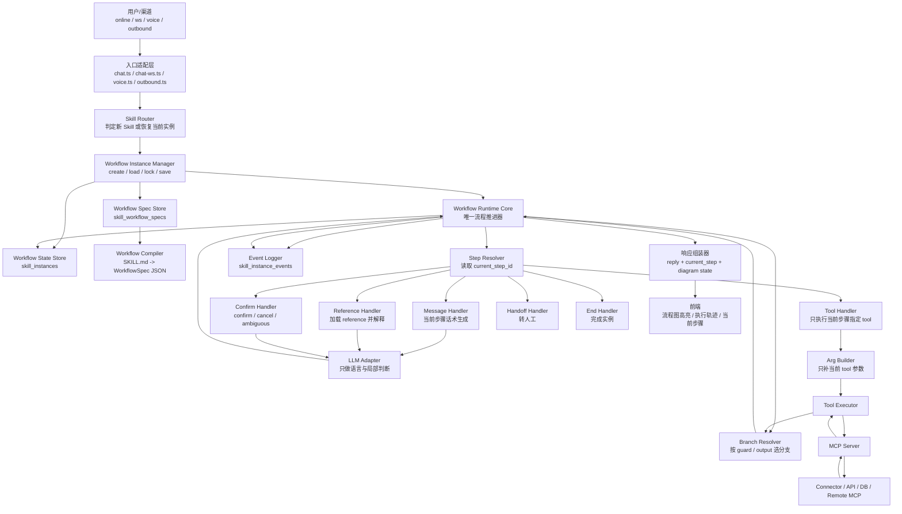
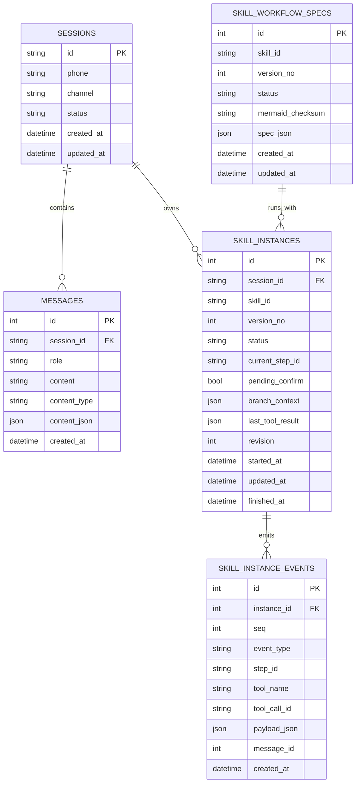
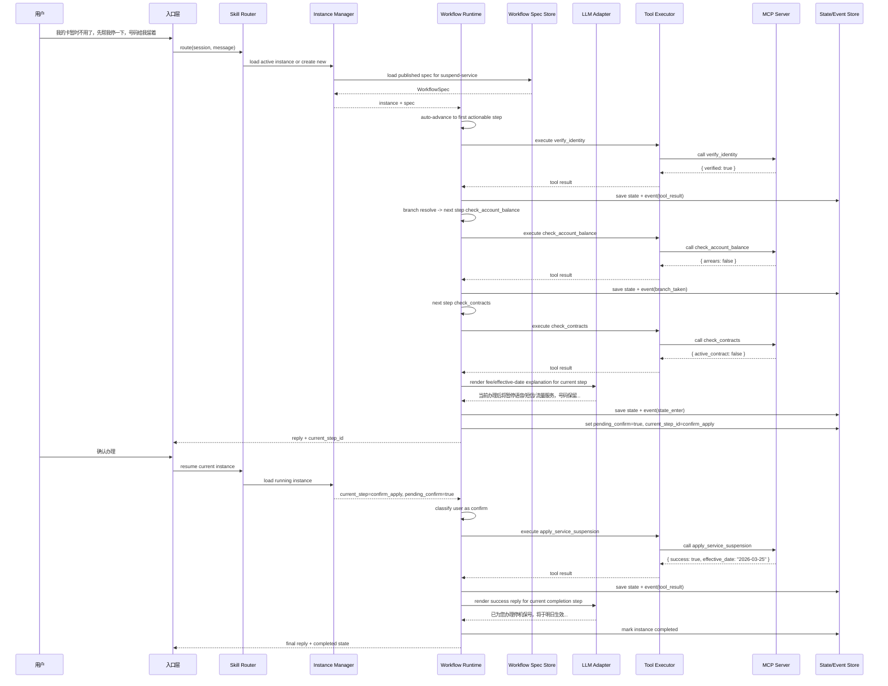

# 完整 Workflow Engine 架构说明

> 将业务 Skill 从“提示模型遵循的 SOP 文档”升级为“由运行时强制推进的可执行工作流”，使高风险业务技能具备严格顺序约束、可暂停恢复、可审计、可回放的执行能力。

**Date**: 2026-03-24  
**Status**: Draft  
**Positioning**: Target Architecture（目标态）  
**Relation**:
- `2026-03-24-execution-plan-driven-sop-design.md`：方案二，属于过渡态
- `2026-03-24-skill-instance-runtime-design.md`：偏实现导向的 durable runtime 草案
- 本文：从完整 workflow engine 的架构理念、模块边界、数据模型、运行时序角度，定义长期目标态

---

## 1. 背景与问题

当前系统已经具备以下能力：

- Skill 可用 `SKILL.md` + Mermaid 状态图描述业务 SOP
- Mermaid 状态图可编译为 `WorkflowSpec`
- `SOPGuard` 可以在运行时阻止部分越权工具调用
- MCP 工具链已经能提供真实业务执行能力

但现有方案仍然属于“**LLM 主导，runtime 纠偏**”模式，即：

1. LLM 先判断下一步要做什么
2. LLM 尝试调用某个 tool
3. Runtime 再检查这次调用是否合法

这种模式的优势是接入成本低，但它有天然上限：

- 模型仍然拥有流程推进权
- 分支判断仍然容易依赖 prompt 和启发式
- 多轮对话状态恢复不够稳定
- 高风险业务难以做到“原则上绝不跳步”

因此，如果目标是让“停机保号、退订、工单提交、外呼结果登记”等高风险业务真正**严格按 SOP 运行**，则需要从架构上升级为：

> **Runtime 主导，LLM 协作。**

---

## 2. 架构理念

完整 workflow engine 的设计基于五条原则。

### 2.1 Runtime 拥有流程控制权

运行时系统而不是 LLM 决定：

- 当前处于哪个 step
- 下一步允许执行什么动作
- 何时需要等待用户确认
- 何时允许调用某个 tool
- 何时应该转人工或结束实例

因此，LLM 不再是“流程编排者”，而是“当前步骤的协作器”。

### 2.2 Skill 是流程定义源，不只是 Prompt 资产

在完整 engine 中，`SKILL.md` 的 Mermaid 状态图不只是用来提示模型“尽量按这个做”，而是要被编译为真正的工作流定义。

也就是说：

- Skill 定义业务流程
- Compiler 将 Skill 编译为 `WorkflowSpec`
- Runtime 根据 `WorkflowSpec` 推进实例

因此，Skill 的角色从“可加载业务说明”升级为“声明式工作流定义源”。

### 2.3 每次业务处理都是一个显式实例

一旦命中某个 Skill，系统就会创建或恢复一个 `skill_instance`。  
实例至少要保存：

- 当前 skill 与 version
- 当前 step
- 是否等待确认
- 当前 branch 上下文
- 最近一次 tool 结果
- 执行事件流

这使得系统能够实现：

- 多轮恢复
- 暂停 / 继续
- 前端流程图高亮
- 事后审计与回放

### 2.4 Tool 调用是流程动作，不是模型自由选择

在完整 engine 中，Tool 不再是“模型看见后自己决定要不要调”的对象，而是某个 workflow step 的执行动作。

例如：

- 当前 step 是 `verify_identity`
- 当前 step 是 `check_account_balance`
- 当前 step 是 `apply_service_suspension`

那么 runtime 就明确知道：

- 当前只能执行这个 tool
- 不允许执行其他业务 tool
- 这个 tool 返回后应该进入哪条 branch

### 2.5 不确定时宁可停住，不可跳错

完整 workflow engine 的保守策略是：

- branch 不明确，不推进
- 用户确认不明确，不推进
- tool result 不满足 guard，不推进
- 能力缺失或系统异常，不假装成功，改走 fallback / handoff

其核心哲学是：

> 宁可保守停住，也不能为了“显得聪明”而跳错步骤。

---

## 3. 总体架构图



---

## 4. 核心模块说明

### 4.1 入口适配层

入口适配层负责承接不同渠道请求，包括：

- 在线 HTTP 聊天
- WebSocket 文本聊天
- 入呼语音
- 外呼任务

这一层不负责多步 tool 编排，只负责：

- 收集消息与会话上下文
- 调用 Skill Router
- 调用 Workflow Runtime
- 返回统一的用户回复与流程状态

### 4.2 Skill Router

Skill Router 决定当前请求应当：

- 命中新 Skill 并创建实例
- 继续现有 active instance
- 在必要时切换业务流程

Router 的核心职责是：

- 保证一个 session 在同一时刻只聚焦一个主要 workflow
- 避免模型在多 Skill 之间自由跳转

### 4.3 Workflow Instance Manager

Instance Manager 负责：

- 创建 `skill_instance`
- 恢复已有 instance
- 与 `WorkflowSpec` 绑定
- 保存实例状态
- 进行并发锁或乐观锁控制

这是 workflow engine 的会话级状态入口。

### 4.4 Workflow Runtime Core

Runtime Core 是整个 engine 的核心。  
它回答的不是“模型想做什么”，而是：

- 当前 workflow 在哪个 step
- 这个 step 应该由哪类 handler 执行
- 执行后如何推进到下一个 step

这意味着：

- Runtime 是唯一的流程推进器
- 任何 step 的前进都必须经过 Runtime 计算

### 4.5 Step Handlers

Workflow 中不同 kind 的 step 需要不同 handler。

#### `message`

- 不调用业务 tool
- LLM 仅负责生成当前步骤对应的话术

#### `ref`

- 加载 reference 文档
- 根据当前步骤生成规则解释
- 不直接执行副作用操作

#### `confirm`

- 只负责处理：
  - confirm
  - cancel
  - ambiguous
- 未确认前禁止进入操作型 tool step

#### `tool`

- Runtime 明确指定当前唯一允许执行的 tool
- LLM 如需参与，只负责补参数，不负责选工具

#### `choice`

- 根据最近一次 tool result、用户确认结果或 branch rule 决定下一条边
- 不允许模型自由脑补“下一步去哪”

#### `human`

- 统一转人工出口
- 触发 handoff 事件

#### `end`

- 标记实例完成
- 清理 active workflow 状态

### 4.6 MCP Tool Executor

Tool Executor 承担的是“执行动作”，而不是“选择动作”。  
它负责：

- 执行当前 step 指定的 tool
- 与 MCP Server 对接
- 统一标准化 tool 返回结果
- 传回 Runtime 用于 branch 选择

### 4.7 LLM Adapter

在完整 engine 中，LLM 的职责被刻意缩窄到：

- 生成当前步骤话术
- 局部确认分类
- 结构化参数补全

LLM 不再负责：

- 自由探索多步流程
- 决定调用哪个业务 tool
- 决定是否跳过确认点
- 决定 workflow 是否结束

### 4.8 State Store 与 Event Logger

完整 workflow engine 和轻量执行方案的一个根本差异，是显式状态与事件。

State Store 保存：

- 当前 step
- 等待条件
- branch context
- 最近一次工具结果

Event Logger 保存：

- 进入哪个 step
- 执行了哪个 tool
- tool 返回了什么
- 选中了哪条 branch
- 为什么转人工

这使得系统具备：

- 可恢复性
- 可观测性
- 可审计性
- 可回放性

---

## 5. 数据模型图



### 5.1 `skill_workflow_specs`

用于保存 Skill 对应的编译结果。  
运行时不再直接解析 Mermaid，而是读取已编译的 `WorkflowSpec JSON`。

### 5.2 `skill_instances`

用于保存一次真实业务处理实例的当前状态。  
核心字段包括：

- `skill_id`
- `version_no`
- `current_step_id`
- `pending_confirm`
- `branch_context`
- `last_tool_result`

### 5.3 `skill_instance_events`

用于保存执行轨迹，支持：

- 调试
- 回放
- 审计
- 前端执行轨迹可视化

### 5.4 `messages.content_json`

建议为消息表增加结构化内容字段，而不只保留纯文本。  
这样才能更可靠地保存 tool calls / tool results，并与 workflow event 流形成完整上下文。

---

## 6. 运行时时序图

以下以“停机保号”业务为例，说明一次请求如何由完整 workflow engine 执行。



这个时序图体现了完整 workflow engine 的关键差异：

- 不是 LLM 自由选择下一步
- 而是 Runtime 明确驱动每一步
- LLM 只在当前 step 的边界内工作

---

## 7. 与当前方案二的根本区别

当前方案二（execution-plan-driven SOP）的基本模式是：

```text
LLM 决定下一步 → 尝试调 tool → SOPGuard 检查是否合法
```

完整 workflow engine 则改为：

```text
Runtime 决定当前 step → 选择对应 handler → 必要时调用 LLM 或 Tool
```

两者的差别不只是“约束强弱”，而是**控制权归属不同**：

- 方案二：模型先动，系统后拦
- 完整 engine：系统先定，模型后配合

这也是“能不能原则上保证不跳步”的分水岭。

---

## 8. 该架构真正能保证什么

完整 workflow engine 可以在原则上保证：

- 没到当前 step，不能执行该 step 的 tool
- 没到确认节点后，不会执行副作用动作
- branch 不明确时不会擅自推进
- 中断后可从显式状态恢复
- 前端看到的是系统真实 step，而不是模型推测状态
- 审计时可以回答“为什么会走到这一步”

需要注意的是，这种保证并不是来自“模型更听话”，而是来自：

> 运行时系统不再把关键流程控制权交给模型。

---

## 9. 适用范围

完整 workflow engine 并不要求所有 Skill 都立即采用。  
它最适合优先落在以下类型的业务上：

- 有副作用的办理类 Skill
- 必须显式确认的 Skill
- 有合规要求且不能跳步的 Skill
- 分支复杂且需要解释链闭环的 Skill

例如：

- 停机保号
- 业务退订
- 套餐变更申请
- 工单提交
- 外呼结果登记

相反，对于纯解释型、低风险、弱流程约束的 Skill，仍可继续使用轻量模式。

---

## 10. 与现有项目资产的关系

完整 workflow engine 不是从零开始重建，而是在现有系统基础上的升级。

当前可复用的资产包括：

- Mermaid 编译器
- WorkflowSpec 类型
- Skill 版本与发布体系
- MCP 工具执行链
- Skill 与 reference 加载机制
- Mermaid 流程图高亮能力

真正需要新增的是：

- Runtime Core
- Instance Manager
- Step Handlers
- State Store
- Event Logger

因此，这是一条“从 guard 型约束演进到 runtime 型编排”的路线，而不是推倒重写。

---

## 11. 总结

完整 workflow engine 的目标，不是让 LLM 更听话，而是让系统在架构上具备以下能力：

- **Declarative**：Skill 是声明式流程定义
- **Deterministic**：流程推进由 runtime 决定
- **Durable**：状态可持久化和恢复
- **Observable**：每一步都有事件和可视化
- **Governed**：工具调用和分支推进有治理规则
- **LLM-assisted, not LLM-led**：LLM 是协作者，不是调度器

对于需要严格合规、严格顺序、严格确认点的业务 Skill，这种架构不是锦上添花，而是必要演进。
