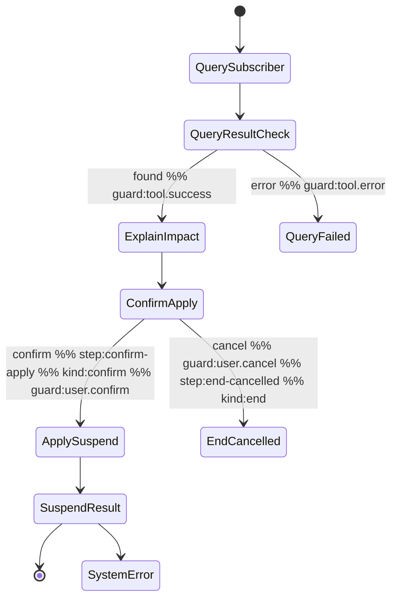

# Skill Instance Runtime Design

> Durable workflow runtime for SOP state diagrams — making SKILL.md mermaid diagrams executable, pausable, resumable, and auditable.

**Date**: 2026-03-24
**Status**: Draft
**Approach**: Path B (spec-first) — upgrade mermaid annotation conventions before building compiler and runtime.

---

## Problem Statement

Current SOP enforcement has 3 layers, each with gaps:

| Layer | Mechanism | Gap |
|-------|-----------|-----|
| Prompt | `SOP_ENFORCEMENT_SUFFIX` + system prompt rules | Pure LLM self-discipline, no runtime verification |
| Runtime | `SOPGuard` (sop-guard.ts) | Only checks tool dependencies, no state tracking, no non-tool step enforcement |
| Design-time | skill-creator-spec validation scripts | Only validates "written correctly", not "executed correctly" |

Core problem: `SOPGuard` does partial-order constraint (tool A before tool B), not state tracking. The LLM doesn't know which state it's in, and no one verifies it skipped non-tool steps.

### Specific Shortcomings

1. **Query tools not gated** — SOPGuard explicitly skips read-only tools, so query chains have no ordering enforcement
2. **No current state awareness** — SOPGuard answers "were prerequisites called?" not "which state are we in?"
3. **Global intersection, not per-branch** — dependencies are intersected across all skills/branches, not scoped to current skill + current branch
4. **Confirm/ref/human nodes are prompt-only** — no runtime gating for non-tool steps

---

## Solution Overview

Upgrade the system from "Mermaid constrains Agent via prompt" to "Mermaid drives Agent via runtime":

```
SKILL.md (with new annotations)
    |
    v
Workflow Compiler  →  WorkflowSpec JSON (stored in DB)
                            |
                            v
Skill Instance Runtime  →  Per-session state machine
    |                           |
    v                           v
runAgent (LLM + tools)    skill_instance_events (audit trail)
```

Key architectural change: the Agent no longer reads the full skill and decides what to do. Instead, the **Skill Instance Runtime decides what the current step allows**, and the Agent operates within those constraints.

---

## 1. Mermaid Annotation Conventions

### New Annotations (additive, existing ones unchanged)

| Annotation | Semantics | Example |
|------------|-----------|---------|
| `%% step:<id>` | Stable node identifier (kebab-case) | `%% step:verify-identity` |
| `%% kind:<type>` | Node type | `%% kind:tool` / `kind:confirm` / `kind:ref` / `kind:human` / `kind:message` / `kind:end` |
| `%% guard:<condition>` | Structured transition condition | `%% guard:tool.success` / `guard:user.confirm` |
| `%% output:<key>` | Tool return value reference key | `%% output:subscriber_info` |

### Existing Annotations (unchanged)

- `%% tool:<name>` — MCP tool call marker
- `%% ref:<path>` — Reference document marker
- `%% branch:<name>` — Branch endpoint marker

### Placement Rules

- Annotations go at the end of transition lines or state lines (same as existing `%% tool:`)
- `guard` only appears on transition lines (`-->`)
- `step` and `kind` can appear on either state or transition lines
- **Annotation-to-node propagation**: when annotations appear on a transition line (`A --> B %% tool:xxx`), they are associated with the **target** node (B), not the source. This matches the existing convention where `%% tool:query_subscriber` on a transition means the target state performs the query. The compiler must propagate transition-line annotations to their target nodes during parsing.

### Guard Type Enumeration

```typescript
type GuardType =
  | 'tool.success'      // Tool call succeeded with data
  | 'tool.error'        // Tool call failed
  | 'tool.no_data'      // Tool succeeded but returned no data
  | 'user.confirm'      // User confirmed
  | 'user.cancel'       // User cancelled/refused
  | 'always';           // Unconditional transition
```

Note: `user.input` removed from v1 scope. If future skills need "collect user data" steps, add `kind:input` + `user.input` guard in v2.

### Example: Annotated State Diagram



### Backward Compatibility

- `step` is optional — without it, compiler uses Chinese label as fallback id
- `kind` is optional — without it, compiler infers from context (`%% tool:` present → tool, `<<choice>>` → choice, default → message)
- `guard` is optional — without it on choice node exits, compiler uses heuristic label matching (see Compiler section)

### Files to Modify

| File | Change |
|------|--------|
| `skills/tech-skills/skill-creator-spec/references/spec-writing.md` | Add annotation conventions section |
| `skills/tech-skills/skill-creator-spec/references/spec-checklist.md` | Add checklist items for step ids, guard coverage |
| `skills/tech-skills/skill-creator-spec/scripts/validate_statediagram.ts` | Parse and validate new annotations |
| `skills/tech-skills/skill-creator-spec/SKILL.md` | Require new annotations in generated skills |
| `skills/tech-skills/skill-creator-spec/scripts/types.ts` | Expand `MermaidAnnotation.type` union with `'step' \| 'kind' \| 'guard' \| 'output'` |
| `skills/biz-skills/suspend-service/SKILL.md` | Manually add annotations (grayscale target) |
| `skills/biz-skills/service-cancel/SKILL.md` | Manually add annotations (second batch) |

---

## 2. Data Model

Three new tables. Definitions go in `packages/shared-db/src/schema/platform.ts` (the source), then re-export from `backend/src/db/schema/platform.ts` (same pattern as existing tables).

```typescript
import { sql } from 'drizzle-orm';
```

### `skill_workflow_specs` — Compiled workflow definitions

```typescript
export const skillWorkflowSpecs = sqliteTable('skill_workflow_specs', {
  id: integer('id').primaryKey({ autoIncrement: true }),
  skill_id: text('skill_id').notNull(),
  version_no: integer('version_no').notNull(),
  status: text('status').notNull(),              // 'draft' | 'published'
  mermaid_checksum: text('mermaid_checksum'),
  spec_json: text('spec_json').notNull(),         // WorkflowSpec JSON
  created_at: text('created_at').default(sql`(datetime('now'))`),
  updated_at: text('updated_at').default(sql`(datetime('now'))`),
});
```

### `skill_instances` — Per-session workflow state

```typescript
export const skillInstances = sqliteTable('skill_instances', {
  id: text('id').primaryKey(),                    // uuid
  session_id: text('session_id').notNull(),
  skill_id: text('skill_id').notNull(),
  skill_version: integer('skill_version').notNull(),
  status: text('status').notNull(),               // 'running' | 'waiting_user' | 'waiting_tool' | 'completed' | 'escalated' | 'aborted'
  current_step_id: text('current_step_id'),
  pending_kind: text('pending_kind'),             // 'confirm' | 'input' | null
  branch_path_json: text('branch_path_json'),
  context_json: text('context_json'),
  revision: integer('revision').default(1),
  started_at: text('started_at').default(sql`(datetime('now'))`),
  updated_at: text('updated_at').default(sql`(datetime('now'))`),
  finished_at: text('finished_at'),
});
```

### `skill_instance_events` — Execution trace

```typescript
export const skillInstanceEvents = sqliteTable('skill_instance_events', {
  id: integer('id').primaryKey({ autoIncrement: true }),
  instance_id: text('instance_id').notNull(),
  seq: integer('seq').notNull(),
  event_type: text('event_type').notNull(),       // 'state_enter' | 'tool_call' | 'tool_result' | 'branch_taken' | 'guard_block' | 'user_message' | 'assistant_reply' | 'handoff'
  step_id: text('step_id'),
  tool_name: text('tool_name'),
  tool_call_id: text('tool_call_id'),
  payload_json: text('payload_json'),
  message_id: integer('message_id'),
  created_at: text('created_at').default(sql`(datetime('now'))`),
});
```

### Indexes

```typescript
// For findActiveInstance(sessionId) — frequent per-turn lookup
index('idx_skill_instances_session_status').on(skillInstances.session_id, skillInstances.status)

// For ordered event retrieval
index('idx_skill_instance_events_instance_seq').on(skillInstanceEvents.instance_id, skillInstanceEvents.seq)
```

### Event `seq` Generation

`seq` is application-managed: within the `advanceStep` transaction, compute `MAX(seq) + 1` for the instance. Since `advanceStep` uses optimistic locking (`revision`), concurrent writes are already serialized.

### Why a Separate Table Instead of Adding `spec_json` to `skillVersions`

`skillVersions` tracks file-level snapshots (`snapshot_path`) with version lifecycle semantics (draft/published). `skill_workflow_specs` is a derived artifact — it can be regenerated from the source mermaid anytime. Keeping it separate means:
- Recompilation doesn't create a new version
- `skillVersions` stays file-oriented, `skill_workflow_specs` stays runtime-oriented
- `skill_workflow_specs.version_no` references `skillVersions.version_no` (same skill, same version number) but they are not FK-linked — the spec can be deleted and regenerated without affecting version history

### Design Decisions

- **Don't modify messages table** — HTTP chat responseMessages persistence is a separate concern
- **One active instance per session** — v1 constraint, avoids multi-intent state conflicts
- **Events are append-only** — write can be async, doesn't block main flow
- **Optimistic locking via revision** — prevents concurrent messages from corrupting state
- **`mermaid_checksum`** — MD5 of mermaid content, used by `syncSkillMetadata()` at startup to skip recompilation when content hasn't changed

---

## 3. Workflow Compiler

New files:
- `backend/src/engine/skill-workflow-types.ts`
- `backend/src/engine/skill-workflow-compiler.ts`

### Type Definitions

```typescript
export interface WorkflowSpec {
  skillId: string;
  version: number;
  startStepId: string;
  steps: Record<string, WorkflowStep>;
  terminalSteps: string[];
}

export interface WorkflowStep {
  id: string;
  label: string;                      // Original Chinese label
  kind: StepKind;
  tool?: string;                      // MCP tool name (kind=tool)
  ref?: string;                       // Reference doc path (kind=ref)
  output?: string;                    // Output key name
  transitions: WorkflowTransition[];
}

export type StepKind = 'tool' | 'confirm' | 'ref' | 'human' | 'message' | 'choice' | 'end';

export interface WorkflowTransition {
  target: string;                     // Target step id
  guard: GuardType;
  label?: string;                     // Original Chinese label
}

export type GuardType =
  | 'tool.success' | 'tool.error' | 'tool.no_data'
  | 'user.confirm' | 'user.cancel'
  | 'always';

export type InstanceStatus =
  | 'running' | 'waiting_user' | 'waiting_tool'
  | 'completed' | 'escalated' | 'aborted';
```

### Nested State Handling

Existing skills like `service-cancel` use nested `state ... { }` blocks (composite states). The compiler **flattens** nested states with prefixed step IDs:

```mermaid
state StandardCancelFlow {
  入口 --> 查询已订业务
  查询已订业务 --> 执行退订
}
```

Compiles to flat steps:
- `standard-cancel-flow.入口`
- `standard-cancel-flow.查询已订业务`
- `standard-cancel-flow.执行退订`

Rules:
- Prefix = parent state name (slugified to kebab-case)
- Transitions crossing composite boundaries are resolved to the flattened IDs
- Entry transitions into a composite state (`X --> CompositeState`) are rewritten to target the composite's first internal state
- The existing `parseStateDiagram` already detects `isNested` — the compiler uses this flag to trigger flattening
- If a nested state has a `%% step:xxx` annotation, that prefix overrides the auto-generated one

### Compilation Pipeline

```
1. Extract mermaid code block from SKILL.md
2. Parse lines → raw nodes + raw transitions (reuse parseStateDiagram from validate_statediagram.ts)
2a. Flatten nested states: prefix internal node IDs with parent name, rewrite cross-boundary transitions
2b. Propagate transition-line annotations to target nodes (e.g., A --> B %% tool:xxx → node B gets kind:tool, tool:xxx)
3. Determine step id per node:
   - Has %% step:xxx → use xxx
   - No annotation → use Chinese label as fallback
4. Determine kind per node:
   - Has %% kind:xxx → use xxx
   - Has %% tool:xxx → tool
   - Has <<choice>> → choice
   - Target is [*] → end
   - No annotation → message (default)
5. Determine guard per transition:
   - Has %% guard:xxx → use xxx
   - No annotation + source is choice → heuristic from label text
   - No annotation + source is not choice → always
6. Identify startStepId ([*] --> X)
7. Identify terminalSteps (X --> [*])
8. Validate:
   - Step ids unique
   - Choice nodes have >= 2 exits
   - Tool nodes followed by choice (or direct to end)
   - Confirm nodes have user.confirm + user.cancel exits
   - Has start and at least one terminal
9. Return { spec, errors, warnings }
```

### Guard Heuristic (fallback for unannotated choice exits)

```typescript
const GUARD_PATTERNS: Array<[RegExp, GuardType]> = [
  [/成功|正常|有数据|查到|通过/, 'tool.success'],
  [/失败|异常|超时|错误|系统/,   'tool.error'],
  [/未查到|无数据|不存在|为空/,   'tool.no_data'],
  [/确认|同意|办理|是的|好的/,    'user.confirm'],
  [/取消|拒绝|不要|放弃|算了/,    'user.cancel'],
];
// No match → warning + fallback to 'always'
```

### Compilation Triggers

| Trigger | Behavior |
|---------|----------|
| `/api/skill-creator/save` | Attempt compile; warnings OK, errors OK but mark status='draft' |
| `/api/skill-versions/publish` | Must compile without errors; write to `skill_workflow_specs` with status='published' |
| `syncSkillMetadata()` at startup | Check published skills for missing specs, compile if needed |

### Compiled Output Example (suspend-service)

```json
{
  "skillId": "suspend-service",
  "version": 1,
  "startStepId": "query-subscriber",
  "steps": {
    "query-subscriber": {
      "id": "query-subscriber",
      "label": "QuerySubscriber",
      "kind": "tool",
      "tool": "query_subscriber",
      "output": "subscriber_info",
      "transitions": [
        { "target": "query-result-check", "guard": "always" }
      ]
    },
    "query-result-check": {
      "id": "query-result-check",
      "label": "QueryResultCheck",
      "kind": "choice",
      "transitions": [
        { "target": "explain-impact", "guard": "tool.success", "label": "found" },
        { "target": "system-error", "guard": "tool.error", "label": "error" }
      ]
    },
    "explain-impact": {
      "id": "explain-impact",
      "label": "ExplainImpact",
      "kind": "message",
      "transitions": [
        { "target": "confirm-apply", "guard": "always" }
      ]
    },
    "confirm-apply": {
      "id": "confirm-apply",
      "label": "ConfirmApply",
      "kind": "confirm",
      "transitions": [
        { "target": "apply-suspend", "guard": "user.confirm" },
        { "target": "end-cancelled", "guard": "user.cancel" }
      ]
    },
    "apply-suspend": {
      "id": "apply-suspend",
      "label": "ApplySuspend",
      "kind": "tool",
      "tool": "apply_service_suspension",
      "transitions": [
        { "target": "complete", "guard": "tool.success" },
        { "target": "system-error", "guard": "tool.error" }
      ]
    },
    "complete": {
      "id": "complete",
      "label": "Complete",
      "kind": "end",
      "transitions": []
    },
    "end-cancelled": {
      "id": "end-cancelled",
      "label": "EndCancelled",
      "kind": "end",
      "transitions": []
    },
    "system-error": {
      "id": "system-error",
      "label": "SystemError",
      "kind": "human",
      "transitions": []
    }
  },
  "terminalSteps": ["complete", "end-cancelled", "system-error"]
}
```

---

## 4. Skill Instance Runtime

New files:
- `backend/src/engine/skill-instance-store.ts` — data layer
- `backend/src/engine/skill-instance-runtime.ts` — logic layer

### Store API

```typescript
createInstance(sessionId, skillId, skillVersion, specJson): SkillInstance
findActiveInstance(sessionId): SkillInstance | null
advanceStep(instanceId, nextStepId, revision): boolean   // optimistic lock
suspendForUser(instanceId, pendingKind): void
finishInstance(instanceId, status): void
appendEvent(instanceId, event): void
getEvents(instanceId): SkillInstanceEvent[]
```

### Runtime: Allowed Actions

```typescript
interface AllowedActions {
  allowedTools: string[];
  requireConfirm: boolean;
  requireRef: string | null;
  canEscalate: boolean;        // always true
  promptHint: string;          // injected into LLM system prompt
}
```

Per step kind:

| Current kind | allowedTools | requireConfirm | Behavior |
|-------------|-------------|----------------|----------|
| `tool` | `[step.tool]` | false | Only this tool allowed |
| `confirm` | `[]` | true | No operation tools, wait for user |
| `message` | `[]` | false | LLM speaks, then auto-advance |
| `ref` | `[]` | false | Force-load reference, then advance |
| `human` | `['transfer_to_human']` | false | Only escalation allowed |
| `choice` | — | — | Never paused here, runtime auto-evaluates |
| `end` | `[]` | false | Instance completed |

### Runtime: Guard Evaluation

```typescript
function evaluateGuard(guard: GuardType, context: {
  toolResult?: { success: boolean; hasData: boolean };
  userIntent?: 'confirm' | 'cancel' | 'other';
}): boolean
```

| Guard | Condition |
|-------|-----------|
| `tool.success` | toolResult.success && toolResult.hasData |
| `tool.error` | !toolResult.success |
| `tool.no_data` | toolResult.success && !toolResult.hasData |
| `user.confirm` | userIntent === 'confirm' |
| `user.cancel` | userIntent === 'cancel' |
| `always` | true |

### Runtime: User Intent Classification (lightweight)

```typescript
function classifyUserIntent(text: string): 'confirm' | 'cancel' | 'other' {
  const CONFIRM = /确认|同意|好的|可以|办理|没问题|是的|对|嗯|行/;
  const CANCEL  = /取消|不要|算了|放弃|不用|再说|不办/;
  if (CONFIRM.test(text)) return 'confirm';
  if (CANCEL.test(text)) return 'cancel';
  return 'other';  // LLM continues dialogue to clarify, next turn re-evaluates
}
```

When `classifyUserIntent` returns `other`, the runtime does NOT advance the state. Instead, it calls `runAgent` with the confirm step's context, letting the LLM naturally re-ask the user. The next user message is re-evaluated — this implicit retry loop is the intended behavior for ambiguous responses.

### Runtime: Per-Turn Flow

```
User message arrives
    |
    v
findActiveInstance(sessionId)
    |
    +-- Has active instance → restore
    |       |
    |       v
    |   computeAllowedActions(spec, instance)
    |       |
    |       +-- kind=confirm → classifyUserIntent(userMessage)
    |       |       +-- confirm → evaluateGuard → advanceStep
    |       |       +-- cancel  → evaluateGuard → advanceStep
    |       |       +-- other   → don't advance, LLM clarifies
    |       |
    |       +-- kind=tool → inject allowedTools → runAgent
    |       |       +-- tool returns → evaluateGuard → advanceStep
    |       |
    |       +-- kind=message → runAgent (no tools) → advanceStep(always)
    |       |
    |       +-- kind=end → finishInstance('completed')
    |
    +-- No active instance → normal routing
            |
            +-- Matches skill + has published spec → createInstance → start
            +-- Matches skill + no spec → existing SOPGuard fallback
```

### Auto-advance vs Pause

| Scenario | Behavior |
|----------|----------|
| tool → choice | Auto-evaluate guard after tool returns, advance. No pause. |
| message node | LLM generates reply, auto-advance. No pause. |
| confirm node | Suspend as `waiting_user`, next user message triggers guard. |
| Consecutive tool nodes (query chain) | Auto-advance through all, multiple tools in one turn. |
| end node | Mark `completed`, subsequent messages go through normal routing. |

### Integration with runner.ts

Runtime wraps `runAgent`, doesn't replace it. New optional field in `RunAgentOptions`:

```typescript
export interface RunAgentOptions {
  // ...existing fields
  workflowContext?: {
    currentStep: WorkflowStep;
    allowedTools: string[];
    promptHint: string;
    requireConfirm: boolean;
  };
}
```

Runner changes when `workflowContext` is present:
1. **Tool filtering**: only inject `allowedTools` + `transfer_to_human` + `get_skill_reference`
2. **Prompt injection**: append `promptHint` to system prompt tail
3. **Skip SOPGuard**: runtime handles gating, SOPGuard is bypassed
4. **maxSteps: 1** when workflow-controlled — runtime drives the outer loop (see below)

### Runtime Loop Architecture (critical design decision)

The current `runAgent` uses `generateText({ maxSteps: 10 })`, which lets the LLM chain multiple tool calls autonomously within a single invocation. With the workflow runtime, we need to intercept between steps to update state and recompute allowed tools.

**Approach: runtime-driven outer loop with `maxSteps: 1` per iteration.**

```typescript
async function runWorkflowTurn(
  sessionId: string,
  userMessage: string,
  history: CoreMessage[],
  // ...other params
): Promise<AgentResult> {
  const instance = findActiveInstance(sessionId);
  const spec = loadSpec(instance.skillId, instance.skillVersion);
  let combinedResult: AgentResult;

  while (true) {
    const step = spec.steps[instance.currentStepId];
    const actions = computeAllowedActions(spec, instance);

    // For confirm nodes: don't call LLM yet if intent is clear
    if (step.kind === 'confirm') {
      const intent = classifyUserIntent(userMessage);
      if (intent === 'other') {
        // Ambiguous — let LLM clarify, don't advance
        combinedResult = await runAgent(userMessage, history, {
          workflowContext: actions, maxStepsOverride: 1
        });
        break;
      }
      // Clear intent — advance and continue loop
      evaluateAndAdvance(instance, spec, { userIntent: intent });
      continue;
    }

    // For tool/message/ref nodes: call runAgent with maxSteps:1
    combinedResult = await runAgent(userMessage, history, {
      workflowContext: actions, maxStepsOverride: 1
    });

    // After tool return: evaluate guard and advance
    if (step.kind === 'tool') {
      const toolResult = extractToolResult(combinedResult);
      evaluateAndAdvance(instance, spec, { toolResult });
    } else if (step.kind === 'message') {
      advanceStep(instance, step.transitions[0].target);
    } else if (step.kind === 'ref') {
      // ref content was injected into context, auto-advance
      advanceStep(instance, step.transitions[0].target);
    }

    // Check if next step needs another LLM call or can auto-advance
    const nextStep = spec.steps[instance.currentStepId];
    if (nextStep.kind === 'choice') {
      // Choice nodes auto-evaluate (guard was already set by previous tool/user result)
      evaluateAndAdvance(instance, spec, lastContext);
      continue;
    }
    if (nextStep.kind === 'end') {
      finishInstance(instance.id, 'completed');
      break;
    }
    if (nextStep.kind === 'confirm') {
      suspendForUser(instance.id, 'confirm');
      break; // Wait for next user message
    }
    if (nextStep.kind === 'human') {
      finishInstance(instance.id, 'escalated');
      break;
    }
    // For consecutive tool/message nodes: continue loop (no user input needed)
    // Update history with previous result for context continuity
    history = [...history, ...combinedResult.responseMessages];
    userMessage = ''; // No new user input for continuation steps
  }

  return combinedResult;
}
```

**Why `maxSteps: 1` instead of hooking `onStepFinish`?**
- `onStepFinish` runs synchronously within `generateText` — it can log/observe but cannot change `allowedTools` for the next step
- With `maxSteps: 1`, the runtime loop has full control between each LLM invocation
- Consecutive query steps (tool → tool) still execute efficiently — the loop continues without waiting for user input
- The tradeoff is slightly more LLM round-trips, but each round-trip is precisely scoped

### `kind:ref` Handling

When the current step is `kind:ref`, the runtime loads the reference content directly (via `get_skill_reference`) and appends it to the LLM context before calling `runAgent`. The LLM does not call `get_skill_reference` itself — the runtime injects the content into `workflowContext.promptHint`:

```typescript
if (step.kind === 'ref' && step.ref) {
  const refContent = getSkillReferenceContent(instance.skillId, step.ref);
  actions.promptHint += `\n\n---\nReference: ${step.ref}\n${refContent}`;
}
```

After injection, the runtime auto-advances to the next step.

### Fallback Strategy

| Situation | Handling |
|-----------|----------|
| Skill matched but no published spec | Use existing SOPGuard, no instance created |
| Guard evaluation fails (no match) | Don't advance, let LLM respond freely, log warning event |
| Instance inactive > 30 minutes | Mark `aborted`, next message routes normally |
| User switches topic mid-instance | v1: LLM responds "currently processing XX, continue?" without advancing |

### Event Recording

Each state transition appends to `skill_instance_events`:

```typescript
{ event_type: 'state_enter',   step_id: 'explain-impact' }
{ event_type: 'tool_call',     step_id: 'query-subscriber', tool_name: 'query_subscriber', payload_json: '{...args}' }
{ event_type: 'tool_result',   step_id: 'query-subscriber', tool_name: 'query_subscriber', payload_json: '{...summary}' }
{ event_type: 'branch_taken',  step_id: 'query-result-check', payload_json: '{"guard":"tool.success","target":"explain-impact"}' }
{ event_type: 'user_message',  step_id: 'confirm-apply', payload_json: '{"intent":"confirm","text":"..."}' }
```

---

## 5. Chat Entry Points

### chat-ws.ts Changes

Insert runtime layer into existing message handling:

```
Existing: message → load history → runAgent → persist → push WS
New:      message → load history
            → findActiveInstance(sessionId)
            → has instance?
                yes → computeAllowedActions → inject workflowContext → runAgent
                       → on tool return: evaluateGuard → advanceStep
                       → push WS (with instance_id + current_step_id)
                no  → runAgent (existing logic)
                       → onStepFinish: detect get_skill_instructions call
                       → matched skill + has spec? → createInstance → start from startStep
```

New WS event:

```typescript
{
  type: 'skill_diagram_update',
  skill_name: instance.skillId,
  mermaid: stripMermaidMarkers(rawMermaid),
  active_step_id: instance.currentStepId,     // NEW
  instance_status: instance.status,            // NEW
}
```

### chat.ts Changes

Two changes:
1. Persist responseMessages (align with WS behavior)
2. Integrate runtime (same logic as WS)

### New Route: skill-instances.ts

```typescript
GET  /api/skill-instances/:sessionId/active   // Current active instance + step + allowed actions
GET  /api/skill-instances/:id/events          // Event stream (audit + replay)
POST /api/skill-instances/:id/abort           // Manual abort (agent workspace)
```

Mount in `index.ts`.

---

## 6. Frontend Changes (Minimal, v1)

Only one change: **switch diagram highlighting from inference to backend-provided `active_step_id`**.

Current: runner.ts infers highlighted node via `highlightMermaidTool()` / `highlightMermaidBranch()`.
New: WS event includes `active_step_id`, frontend highlights directly.

### Not in v1

- ExecutionTracePanel (events replay)
- Agent workspace changes
- SkillManagerPage test flow changes
- **Voice channel (`/ws/voice`) integration** — voice uses pre-loaded skill content via `getSkillContentByChannel('voice')` injected into the system prompt at session start, not lazy `get_skill_instructions` calls. Voice channel workflow runtime integration requires a different approach (injecting runtime constraints into the pre-loaded prompt) and is deferred to v2.

---

## 7. Grayscale Rollout

### Grayscale Switch

Environment variable, no DB change needed:

```bash
WORKFLOW_RUNTIME_SKILLS=suspend-service
# Later: WORKFLOW_RUNTIME_SKILLS=suspend-service,service-cancel
```

```typescript
const WORKFLOW_ENABLED = new Set(
  (process.env.WORKFLOW_RUNTIME_SKILLS ?? '').split(',').filter(Boolean)
);
// In skill routing: WORKFLOW_ENABLED.has(skillName) && hasPublishedSpec(skillName)
//   → instance runtime
//   else → existing SOPGuard
```

### Phase 0: Prerequisites (1-2 days)

| Task | File |
|------|------|
| HTTP chat: persist responseMessages | `chat.ts` |
| Add 3 new tables | `platform.ts` + `drizzle-kit push` |

### Phase 1: Spec + Compiler (2-3 days)

| Task | File |
|------|------|
| Add annotation conventions to spec-writing.md | `references/spec-writing.md` |
| Add checklist items to spec-checklist.md | `references/spec-checklist.md` |
| Upgrade validate_statediagram.ts | `scripts/validate_statediagram.ts` |
| Create WorkflowSpec types | `engine/skill-workflow-types.ts` |
| Create compiler | `engine/skill-workflow-compiler.ts` |
| Compiler tests | `tests/unittest/engine/skill-workflow-compiler.test.ts` |
| Annotate suspend-service SKILL.md | `skills/biz-skills/suspend-service/SKILL.md` |

### Phase 2: Runtime + Grayscale (3-4 days)

| Task | File |
|------|------|
| Create store | `engine/skill-instance-store.ts` |
| Create runtime | `engine/skill-instance-runtime.ts` |
| Runtime tests | `tests/unittest/engine/skill-instance-runtime.test.ts` |
| Integrate into chat-ws.ts | `chat/chat-ws.ts` |
| Integrate into chat.ts + persist fix | `chat/chat.ts` |
| skill-instances route | `chat/skill-instances.ts` + `index.ts` |
| Frontend: use active_step_id | WS message handling |
| Grayscale switch | `runner.ts` |

### Phase 3: Expand (on demand)

| Task | Description |
|------|-------------|
| Annotate service-cancel + enable | Second grayscale target |
| Update skill-creator-spec | Auto-generate new annotations in new skills |
| Demote SOPGuard to legacy fallback | Only for skills without specs |
| Frontend events replay panel | v2 |

---

## 8. Risks and Boundaries

- **One active instance per session** — v1 does not support concurrent business instances
- **User intent classification must be structured** — lightweight regex for confirm/cancel, not LLM-dependent
- **Tool return structure must be stable** — runtime needs reliable success/error signals from tool results
- **Not all skills need workflow** — prioritize high-risk, side-effect-bearing, strict-confirmation skills
- **SOPGuard remains as fallback** — skills without published specs continue using existing mechanism
