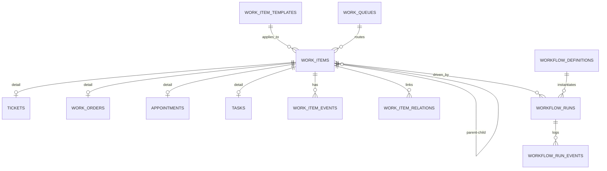
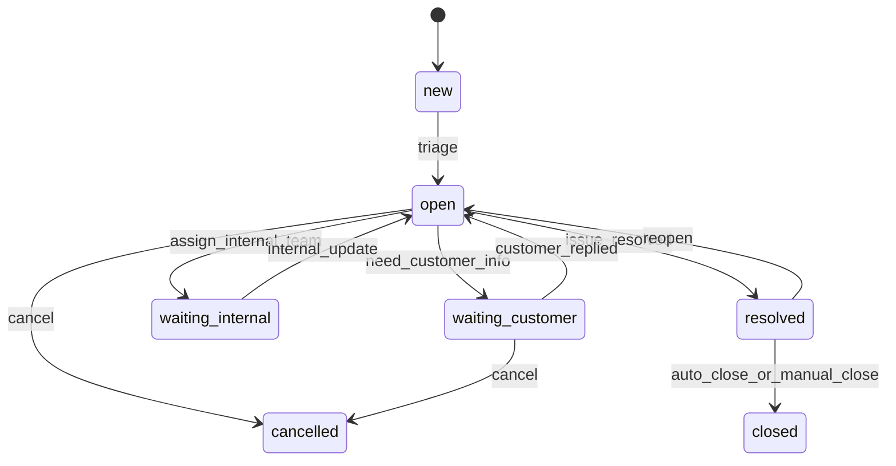
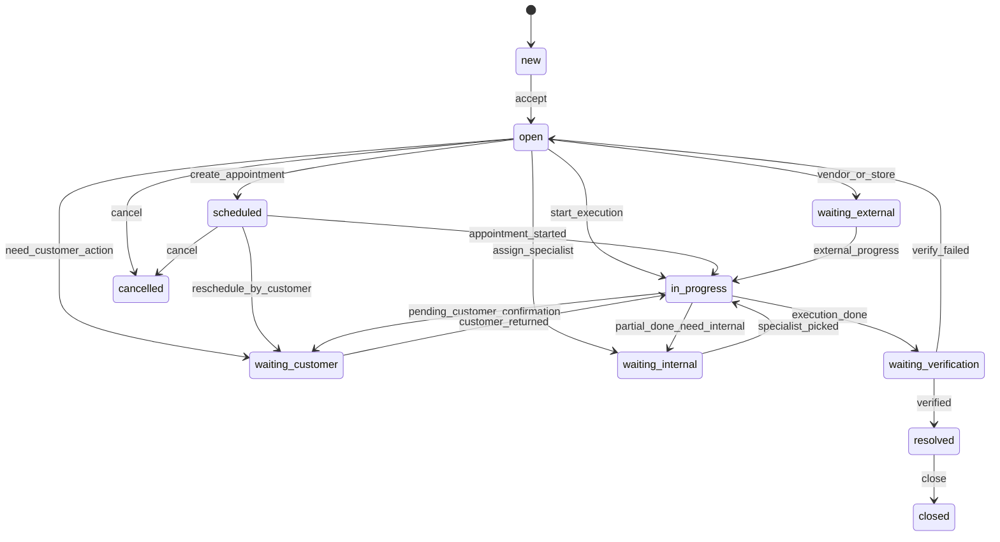
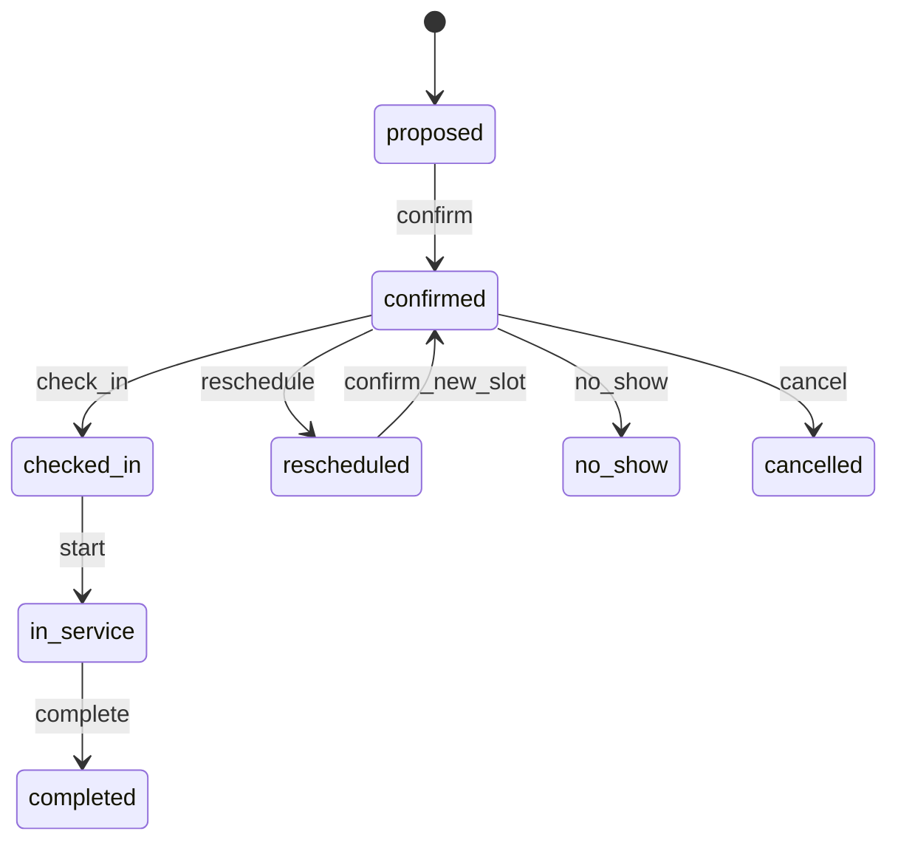
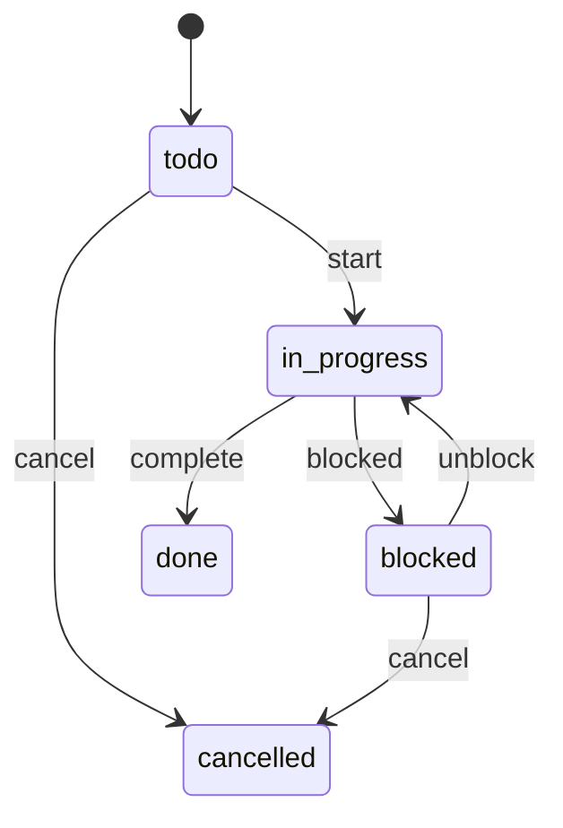
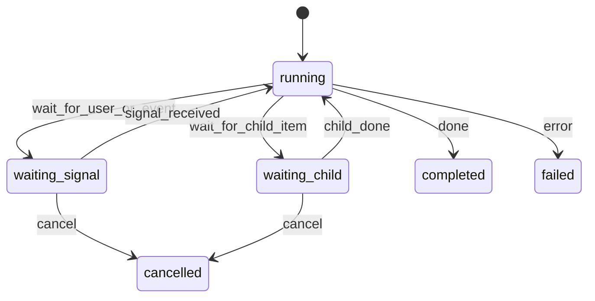

# Work Order 实现设计

> 面向当前工程栈的一版可实施设计：以 `Work Order` 为模块名和核心执行对象，同时完整支持 `Ticket`、`Appointment/Booking`、`Task`、`Sub-ticket`、`Sub-work_order`，并由 `Workflow` 驱动其创建、拆分、预约、升级与闭环。

**Date**: 2026-03-28  
**Status**: Draft  
**Scope**: ER 模型 + 状态机 + API 设计  
**Target Stack**:
- DB: SQLite + Drizzle
- Backend: Hono
- Frontend: React + Agent Workstation
- Runtime: 现有 `skill-runtime` / workflow runtime 可复用或桥接

**Related Existing Files**:
- [packages/shared-db/src/schema/platform.ts](/Users/chenjun/Documents/obsidian/workspace/ai-bot/packages/shared-db/src/schema/platform.ts)
- [backend/src/engine/skill-runtime.ts](/Users/chenjun/Documents/obsidian/workspace/ai-bot/backend/src/engine/skill-runtime.ts)
- [backend/src/agent/chat/agent-ws.ts](/Users/chenjun/Documents/obsidian/workspace/ai-bot/backend/src/agent/chat/agent-ws.ts)
- [frontend/src/agent/AgentWorkstationPage.tsx](/Users/chenjun/Documents/obsidian/workspace/ai-bot/frontend/src/agent/AgentWorkstationPage.tsx)
- [frontend/src/agent/cards/index.ts](/Users/chenjun/Documents/obsidian/workspace/ai-bot/frontend/src/agent/cards/index.ts)

---

## 1. 设计目标

本设计要同时满足四个目标：

1. `Work Order` 作为外显主模块，承载“执行、跟进、履约”。
2. 同一底座支持 `Ticket`、`Appointment/Booking`、`Task`、`Sub-ticket`、`Sub-work_order`。
3. 对象之间支持父子关系、并行子单、预约、阻塞依赖。
4. `Workflow` 能驱动对象流转，而不是只做静态记录。

一句话设计原则：

> UI 上是 Work Order 中心，模型上是统一 `work_item` 超类型，流程上是 `workflow_run` 驱动。

---

## 2. 对象分层

### 2.0 统一命名

- `Ticket`
  - 统一替代此前混用的 `Case` 或 `Case/Ticket`
  - 表示客户诉求主单

- `Sub-ticket`
  - 仅表示 `Ticket` 的同类子单
  - 即“父是 `ticket`、子也是 `ticket`”的拆分语义

- `Sub-work_order`
  - 仅表示 `Work Order` 的同类子单
  - 即“父是 `work_order`、子也是 `work_order`”的拆分语义

- `Workflow`
  - 统一表示流程能力
  - 代码层拆成：
  - `workflow_definitions`
  - `workflow_runs`
  - `workflow_run_events`

### 2.1 业务对象

- `Ticket`
  - 面向客户问题与服务请求
  - 负责承载诉求、上下文、沟通状态、解决结论

- `Work Order`
  - 面向执行与交付
  - 负责承载“谁做、做什么、做到什么算完成”

- `Appointment/Booking`
  - 面向时间承诺
  - 负责承载预约、改约、排班、到场、爽约

- `Task`
  - 面向轻量内部动作
  - 负责承载 checklist、核实、回填、提醒

- `Sub-ticket / Sub-work_order`
  - 本质上都不是独立对象类型，而是 `work_item` 的父子关系语义
  - `ticket -> ticket` 叫 `Sub-ticket`
  - `work_order -> work_order` 叫 `Sub-work_order`
  - 当子项需要独立责任人、队列、SLA 时，使用同类子单而非 `Task`

### 2.1.1 父子关系与命名矩阵

| 父对象 | 子对象 | 是否推荐 | 产品命名 | 关系语义 | 说明 |
| --- | --- | --- | --- | --- | --- |
| `ticket` | `ticket` | 是 | `sub-ticket` | 同类拆分 | 适合投诉拆分、跨部门核查、多责任链并行 |
| `ticket` | `work_order` | 是 | `derived work_order` / `关联执行工单` | 异类派生 | 诉求单派生执行单，最常见主路径 |
| `ticket` | `task` | 是 | `task` | 异类派生 | 轻量内部动作，不独立排队 |
| `ticket` | `appointment` | 否 | 不建议 | 跳层派生 | 预约通常应挂在 `work_order` 下 |
| `work_order` | `work_order` | 是 | `sub-work_order` | 同类拆分 | 适合执行拆分、转二线、转门店、转审核 |
| `work_order` | `appointment` | 是 | `appointment` | 异类派生 | 执行工单下的预约、改约、上门、回访 |
| `work_order` | `task` | 是 | `task` | 异类派生 | 轻量补充动作，如核对、发短信、补录 |
| `work_order` | `ticket` | 否 | 不建议 | 逆向派生 | 容易把执行问题重新建成诉求主单，语义会乱 |
| `appointment` | 任意 | 否 | 不建议 | 叶子对象 | 预约应保持轻量，不再向下拆单 |
| `task` | 任意 | 否 | 不建议 | 叶子对象 | Task 只承载轻量动作，不做父单 |

补充约束：

- `sub-ticket` 和 `sub-work_order` 都不是新的 `type`
- 底层仍统一使用 `work_items.parent_id` 和 `work_items.root_id`
- 只有“同类拆分”才使用 `sub-*` 命名
- “异类派生”直接使用目标对象名称，不加 `sub-`

### 2.2 流程对象

- `Workflow Definition`
  - 流程模板
  - 定义某类 Ticket / Work Order / Appointment 的推进规则

- `Workflow Run`
  - 流程运行实例
  - 驱动当前 work item 的状态变化、自动建子单、自动预约、等待外部事件

---

## 3. ER 模型

## 3.1 总览



## 3.2 统一超类型：`work_items`

这是统一列表、统一搜索、统一权限、统一时间线、统一关系的基座表。

```ts
work_items
- id: text pk
- root_id: text
- parent_id: text nullable
- type: text                  // 'ticket' | 'work_order' | 'appointment' | 'task'
- subtype: text nullable      // 如 'callback' | 'store_visit' | 'password_reset'
- title: text
- summary: text
- description: text nullable
- channel: text nullable      // 'online' | 'voice' | 'outbound' | 'internal'
- source_session_id: text nullable
- source_skill_id: text nullable
- source_skill_version: integer nullable
- source_step_id: text nullable
- source_instance_id: text nullable
- customer_phone: text nullable
- customer_name: text nullable
- requester_id: text nullable
- owner_id: text nullable
- queue_code: text nullable
- priority: text              // 'low' | 'medium' | 'high' | 'urgent'
- severity: text nullable     // 'low' | 'medium' | 'high' | 'critical'
- status: text
- lifecycle_stage: text nullable
- is_blocked: integer         // 0/1
- blocked_reason: text nullable
- waiting_on_type: text nullable // 'customer' | 'internal' | 'vendor' | 'system'
- due_at: text nullable
- next_action_at: text nullable
- sla_deadline_at: text nullable
- closed_at: text nullable
- cancelled_at: text nullable
- created_by: text nullable
- created_at: text
- updated_at: text
```

说明：

- `type` 决定详情表。
- `status` 是当前主状态。
- `lifecycle_stage` 用于更细粒度显示，不替代主状态。
- `root_id + parent_id` 用于树查询。
- `source_*` 用于和会话、技能、SOP、runtime 关联。

## 3.3 Ticket 详情：`tickets`

```ts
tickets
- item_id: text pk fk -> work_items.id
- ticket_category: text       // 'inquiry' | 'complaint' | 'incident' | 'request'
- issue_type: text nullable
- intent_code: text nullable
- customer_visible_status: text nullable
- resolution_summary: text nullable
- resolution_code: text nullable
- satisfaction_status: text nullable
- can_reopen_until: text nullable
- metadata_json: text nullable
```

适用场景：

- 在线/语音客户诉求主单
- 投诉单
- 业务咨询后续跟进单

## 3.4 Work Order 详情：`work_orders`

```ts
work_orders
- item_id: text pk fk -> work_items.id
- work_type: text             // 'execution' | 'followup' | 'review' | 'field'
- execution_mode: text        // 'manual' | 'assisted' | 'system' | 'external'
- required_role: text nullable
- required_capability: text nullable
- result_code: text nullable
- verification_mode: text nullable // 'none' | 'customer_confirm' | 'system_check' | 'agent_review'
- verification_status: text nullable
- external_ref_no: text nullable
- location_text: text nullable
- metadata_json: text nullable
```

适用场景：

- 停机保号
- 密码重置/人工解锁
- 账务复核
- 安全审核
- 待营业厅办理
- 待 App 自助后回访

## 3.5 Appointment 详情：`appointments`

```ts
appointments
- item_id: text pk fk -> work_items.id
- appointment_type: text      // 'callback' | 'store_visit' | 'onsite' | 'video_verify'
- resource_id: text nullable
- scheduled_start_at: text nullable
- scheduled_end_at: text nullable
- actual_start_at: text nullable
- actual_end_at: text nullable
- booking_status: text
- location_text: text nullable
- timezone: text nullable
- no_show_reason: text nullable
- reschedule_count: integer
- metadata_json: text nullable
```

适用场景：

- 预约回呼
- 预约营业厅到店
- 预约上门
- 视频核验

## 3.6 Task 详情：`tasks`

```ts
tasks
- item_id: text pk fk -> work_items.id
- task_type: text
- checklist_json: text nullable
- depends_on_item_id: text nullable
- auto_complete_on_event: text nullable
- completed_by: text nullable
- completed_at: text nullable
- metadata_json: text nullable
```

适用场景：

- 核对资料
- 发送提醒
- 补录截图
- 查询历史流水

## 3.7 模板：`work_item_templates`

```ts
work_item_templates
- id: text pk
- name: text
- applies_to_type: text       // 'ticket' | 'work_order' | 'appointment' | 'task'
- subtype: text nullable
- default_title: text nullable
- default_queue: text nullable
- default_priority: text nullable
- default_severity: text nullable
- default_sla_hours: integer nullable
- workflow_key: text nullable
- closure_policy_json: text nullable
- field_schema_json: text nullable
- active: integer
- created_at: text
- updated_at: text
```

说明：

- 建议所有“回访、营业厅办理、App 自助、人工改密、停机保号”等都通过模板创建。

## 3.8 队列：`work_queues`

```ts
work_queues
- code: text pk
- name: text
- queue_type: text            // 'frontline' | 'specialist' | 'store' | 'field' | 'system'
- owner_team: text nullable
- routing_policy_json: text nullable
- sla_policy_json: text nullable
- active: integer
```

## 3.9 时间线：`work_item_events`

```ts
work_item_events
- id: integer pk autoincrement
- item_id: text fk -> work_items.id
- event_type: text
- actor_type: text            // 'user' | 'agent' | 'system' | 'workflow' | 'customer'
- actor_id: text nullable
- visibility: text            // 'internal' | 'customer'
- note: text nullable
- payload_json: text nullable
- created_at: text
```

常见事件：

- `created`
- `assigned`
- `queued`
- `status_changed`
- `child_created`
- `appointment_created`
- `appointment_rescheduled`
- `customer_confirmed`
- `customer_no_show`
- `execution_succeeded`
- `execution_failed`
- `reopened`
- `closed`

## 3.10 关系：`work_item_relations`

```ts
work_item_relations
- id: integer pk autoincrement
- item_id: text fk -> work_items.id
- related_type: text          // 'session' | 'message' | 'skill_instance' | 'execution_record' | 'outbound_task'
- related_id: text
- relation_kind: text         // 'source' | 'context' | 'child' | 'blocking' | 'derived_from'
- metadata_json: text nullable
```

## 3.11 Workflow：`workflow_definitions`

```ts
workflow_definitions
- id: text pk
- key: text unique
- name: text
- target_type: text           // 'ticket' | 'work_order' | 'appointment' | 'task'
- version_no: integer
- status: text                // 'draft' | 'active' | 'retired'
- spec_json: text
- created_at: text
- updated_at: text
```

## 3.12 Workflow Run：`workflow_runs`

```ts
workflow_runs
- id: text pk
- definition_id: text fk -> workflow_definitions.id
- item_id: text fk -> work_items.id
- status: text                // 'running' | 'waiting_signal' | 'waiting_child' | 'completed' | 'failed' | 'cancelled'
- current_node_id: text nullable
- waiting_signal: text nullable
- context_json: text nullable
- started_at: text
- updated_at: text
- finished_at: text nullable
```

## 3.13 Workflow Run 事件：`workflow_run_events`

```ts
workflow_run_events
- id: integer pk autoincrement
- run_id: text fk -> workflow_runs.id
- seq: integer
- event_type: text
- node_id: text nullable
- payload_json: text nullable
- created_at: text
```

---

## 4. 推荐父子建模规则

### 4.1 何时建 Task

满足以下条件时建 `task`：

- 不需要独立队列
- 不需要独立 SLA
- 不需要独立客户可见状态
- 只服务于主单推进

### 4.2 何时建子工单

满足以下任一条件时建子工单：

- 需要跨团队接手
- 需要独立责任人和截止时间
- 需要独立预约
- 需要独立关闭判断
- 需要单独审计/报表

### 4.3 推荐关系模式

- `Ticket -> Work Order`
  - 例：客户反映 App 登录异常，派生“人工解锁工单”

- `Work Order -> Appointment`
  - 例：回访工单下挂“明天下午 3 点回呼预约”

- `Work Order -> Task`
  - 例：核查截图、补录备注、发送提醒

- `Ticket -> Sub-ticket`
  - 例：投诉主单拆为“账务核查子单”“门店核查子单”

- `Work Order -> Sub-work_order`
  - 例：主执行单拆为“安全审核子单”“营业厅办理子单”

---

## 5. 状态机设计

## 5.1 通用主状态

建议所有 `work_items` 共用一套主状态集合：

- `new`
- `open`
- `scheduled`
- `in_progress`
- `waiting_customer`
- `waiting_internal`
- `waiting_external`
- `waiting_verification`
- `resolved`
- `closed`
- `cancelled`

不同类型并不是都用全量状态，但字段统一，便于通用查询和队列统计。

## 5.2 Ticket 状态机



状态说明：

- `waiting_customer`
  - 等客户补资料、确认是否完成、确认是否去营业厅/是否在 App 自助成功

- `waiting_internal`
  - 等二线、门店、审核团队处理

## 5.3 Work Order 状态机



关键解释：

- `scheduled`
  - 有明确预约承诺

- `waiting_customer`
  - 例如“待用户去营业厅办理”“待用户完成 App 自助”

- `waiting_verification`
  - 执行动作已经完成，但仍需系统/人工/客户确认

## 5.4 Appointment 状态机



在 `work_items.status` 上做映射：

- `proposed/confirmed` -> `scheduled`
- `checked_in/in_service` -> `in_progress`
- `completed` -> `resolved`
- `no_show` -> `waiting_customer`
- `cancelled` -> `cancelled`

## 5.5 Task 状态机



在 `work_items.status` 上做映射：

- `todo` -> `open`
- `in_progress` -> `in_progress`
- `blocked` -> `waiting_internal`
- `done` -> `resolved`
- `cancelled` -> `cancelled`

## 5.6 Workflow 状态机



常见 `waiting_signal`：

- `customer_confirmed`
- `appointment_completed`
- `child_item_closed`
- `store_visit_reported`
- `app_self_service_reported`

---

## 6. Workflow 设计建议

## 6.1 工作流职责

Workflow 不直接替代工单状态，而是负责：

- 自动创建子工单
- 自动创建预约
- 控制等待点
- 在外部事件返回后继续推进
- 决定何时关闭主单

## 6.2 一个典型流程

例：`App 登录异常 -> 用户去 App 自助重置密码 -> 预约回访 -> 若失败则升级人工解锁`

```txt
Ticket 创建
-> Workflow 启动
-> 创建 Work Order(subtype=app_self_service)
-> 主单进入 waiting_customer
-> 若用户反馈“已完成” -> 创建 callback Appointment
-> Appointment 完成后回填结果
-> 若验证成功 -> Work Order resolved -> Ticket resolved
-> 若失败 -> 创建 Sub-work_order(subtype=manual_unlock)
```

## 6.3 与现有 skill-runtime 的关系

推荐做法：

- 客服对话内的 SOP 仍由现有 `skill-runtime` 驱动
- 当命中“建工单/建预约/建子任务”节点时：
  - 创建对应 `work_item`
  - 写入 `work_item_relations`，关联 `skill_instance`
  - 如需跨轮次继续，由 `workflow_run` 承接

这样不要求立刻推翻现有 runtime。

---

## 7. API 设计

API 采用“两层接口”：

- 通用 `work-items` 接口
- 类型化 `cases / work-orders / appointments / tasks` 接口

## 7.1 通用列表与详情

### `GET /api/work-items`

查询参数：

- `type`
- `status`
- `queue_code`
- `owner_id`
- `customer_phone`
- `root_id`
- `parent_id`
- `source_session_id`
- `page`
- `size`

返回：

```json
{
  "items": [
    {
      "id": "wo_001",
      "type": "work_order",
      "subtype": "callback",
      "title": "回访确认 App 密码重置结果",
      "status": "scheduled",
      "priority": "high",
      "queue_code": "callback_team",
      "customer_phone": "13800000001",
      "next_action_at": "2026-03-29T15:00:00+08:00"
    }
  ],
  "total": 1
}
```

### `GET /api/work-items/:id`

返回聚合详情：

```json
{
  "item": {},
  "detail": {},
  "children": [],
  "appointments": [],
  "tasks": [],
  "workflow": {},
  "events": []
}
```

## 7.2 Ticket

### `POST /api/tickets`

```json
{
  "title": "客户反馈 App 登录异常",
  "summary": "客户称密码正确但无法登录",
  "customer_phone": "13800000001",
  "channel": "online",
  "source_session_id": "sess_001",
  "ticket_category": "incident",
  "issue_type": "app_login"
}
```

### `POST /api/tickets/:id/transition`

```json
{
  "action": "resolve",
  "note": "客户已确认问题解决"
}
```

### `POST /api/tickets/:id/children`

用于从 Ticket 下创建子工单或任务。

```json
{
  "type": "work_order",
  "subtype": "manual_unlock",
  "title": "人工解锁处理",
  "queue_code": "security_team"
}
```

## 7.3 Work Order

### `POST /api/work-orders`

```json
{
  "template_id": "tpl_callback_followup",
  "title": "回访确认营业厅办理结果",
  "summary": "客户需先去营业厅办理实名核验",
  "customer_phone": "13800000001",
  "source_session_id": "sess_001",
  "source_skill_id": "telecom-app",
  "source_step_id": "app-escalate-frontline-final",
  "parent_id": "ticket_001",
  "priority": "high",
  "queue_code": "callback_team",
  "next_action_at": "2026-03-29T10:00:00+08:00",
  "work_type": "followup",
  "execution_mode": "manual",
  "verification_mode": "customer_confirm"
}
```

### `POST /api/work-orders/:id/transition`

```json
{
  "action": "mark_waiting_customer",
  "note": "已引导客户前往营业厅"
}
```

支持动作：

- `accept`
- `start`
- `mark_waiting_customer`
- `mark_waiting_internal`
- `mark_waiting_verification`
- `resolve`
- `close`
- `cancel`
- `reopen`

### `POST /api/work-orders/:id/appointments`

```json
{
  "appointment_type": "callback",
  "scheduled_start_at": "2026-03-29T15:00:00+08:00",
  "scheduled_end_at": "2026-03-29T15:30:00+08:00",
  "location_text": "电话回访"
}
```

### `POST /api/work-orders/:id/tasks`

```json
{
  "task_type": "collect_screenshot",
  "title": "补录客户截图",
  "owner_id": "agent_002",
  "due_at": "2026-03-28T20:00:00+08:00"
}
```

## 7.4 Appointment

### `POST /api/appointments/:id/confirm`

```json
{
  "resource_id": "agent_callback_01"
}
```

### `POST /api/appointments/:id/reschedule`

```json
{
  "scheduled_start_at": "2026-03-30T10:00:00+08:00",
  "scheduled_end_at": "2026-03-30T10:30:00+08:00",
  "reason": "customer_request"
}
```

### `POST /api/appointments/:id/check-in`

### `POST /api/appointments/:id/complete`

### `POST /api/appointments/:id/no-show`

## 7.5 Task

### `POST /api/tasks`

```json
{
  "parent_id": "wo_001",
  "task_type": "verify_identity_material",
  "title": "核对身份证明材料",
  "owner_id": "agent_003",
  "due_at": "2026-03-28T18:00:00+08:00"
}
```

### `POST /api/tasks/:id/complete`

## 7.6 事件与备注

### `POST /api/work-items/:id/events`

```json
{
  "event_type": "customer_confirmed",
  "visibility": "internal",
  "note": "客户表示已在 App 内完成密码重置",
  "payload": {
    "channel": "voice"
  }
}
```

## 7.7 Workflow

### `POST /api/workflows/runs`

```json
{
  "definition_key": "app_login_followup",
  "item_id": "ticket_001",
  "context": {
    "phone": "13800000001"
  }
}
```

### `POST /api/workflows/runs/:id/signal`

```json
{
  "signal": "customer_confirmed",
  "payload": {
    "result": "done"
  }
}
```

### `GET /api/workflows/runs/:id`

---

## 8. 建议的后端目录结构

```txt
backend/src/workorder/
  index.ts
  routes/
    work-items.ts
    tickets.ts
    work-orders.ts
    appointments.ts
    tasks.ts
    workflows.ts
  services/
    item-service.ts
    transition-service.ts
    appointment-service.ts
    workflow-service.ts
    template-service.ts
    ticket-service.ts
  policies/
    transition-policy.ts
  types.ts
```

挂载建议：

```ts
app.route('/api/work-items', workItemsRoutes);
app.route('/api/tickets', ticketRoutes);
app.route('/api/work-orders', workOrdersRoutes);
app.route('/api/appointments', appointmentsRoutes);
app.route('/api/tasks', tasksRoutes);
app.route('/api/workflows', workflowRoutes);
```

---

## 9. Agent Workstation 联动

## 9.1 WS 事件

建议新增：

- `work_item_summary`
- `work_item_timeline`
- `work_item_updated`
- `workflow_run_updated`

## 9.2 右侧卡片

建议新增：

- `work_order_summary`
- `work_order_timeline`
- `appointment_panel`

## 9.3 上下文注入规则

按手机号和 session 自动注入：

1. 当前 session 关联主单
2. 当前客户最高优先级未结单
3. 当前主单的预约和子任务

---

## 10. 关键实现决策

## 10.1 为什么要统一 `work_items`

因为否则会出现：

- Ticket 一套列表接口
- Work Order 一套列表接口
- Appointment 一套列表接口
- Task 一套列表接口

最终查询“这个客户当前还有哪些待办”会非常痛苦。

统一超类型后，列表、搜索、权限、时间线、队列统计都更简单。

## 10.2 为什么 Appointment 必须独立

因为它有独立生命周期：

- 确认
- 改约
- 爽约
- 到场
- 完成

这些状态不能压扁在 Work Order 的几个时间字段里。

## 10.3 为什么 Workflow 不能只靠状态字段替代

因为状态只能说明“现在在哪”；
Workflow 才能表达：

- 到哪个条件时建子工单
- 到哪个条件时发起预约
- 等哪个信号后继续
- 子单全部关闭后主单才能关闭

---

## 11. 推荐第一阶段实现范围

建议按以下范围先落地：

### Phase 1

- `work_items`
- `work_orders`
- `appointments`
- `work_item_events`
- `work_item_relations`
- `GET/POST /api/work-items`
- `GET/POST /api/work-orders`
- `POST /api/work-orders/:id/appointments`
- 工作台工单摘要卡

### Phase 2

- `tickets`
- `tasks`
- 子工单关系
- 通用 transition API
- `workflows` 基础能力

### Phase 3

- 与 `skill-runtime` 完整打通
- 自动建单/自动恢复
- 预约调度与 SLA 预警
- 门店/外部执行联动

---

## 12. 最终建议

推荐的最终实现方式是：

> **用 `work_items` 做统一基座，用 `tickets` 承载客户诉求，用 `work_orders` 做业务执行核心，用 `appointments` 承载承诺时间，用 `tasks`、`sub-ticket`、`sub-work_order` 承载拆解动作，用 `workflow_runs` 承载自动推进。**

这样一来：

- 模块命名上满足“我要的是 Work Order”
- 能力边界上支持 Ticket
- 调度层面支持 Appointment/Booking
- 执行层面支持 `Task`、`Sub-ticket`、`Sub-work_order`
- 运行机制上支持 Workflow

并且和你们当前 `shared-db + Hono + Agent Workstation + skill-runtime` 的结构是兼容的，可以分阶段接入，而不需要一次性重构全站。
