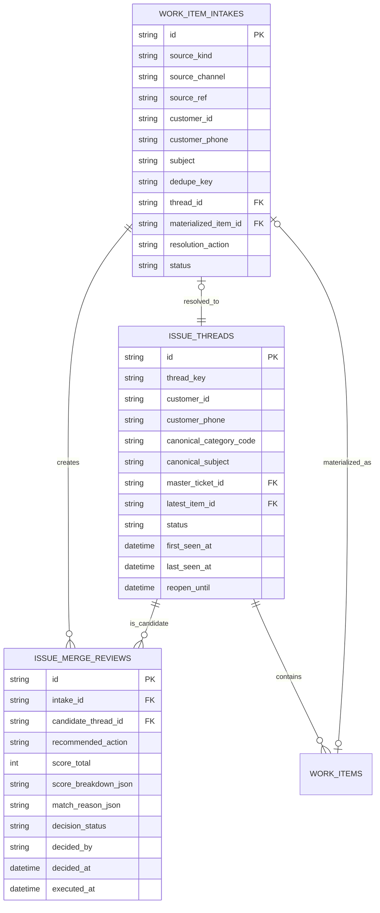

# Work Order 通用入口架构设计

> 面向多来源、多触发方式的工单场景，不再按“人工坐席建单 / 自助表单建单 / 转人工建单 / 舆情建单 / 情绪升级建单”分别设计，而是统一抽象成一条可配置的工单入口流水线。

**Date**: 2026-03-28  
**Status**: Draft  
**Scope**: `work_order_service` / `backend` / Agent Workstation / external intake adapters

---

## 1. 要解决的问题

当前你提到的 5 个场景，本质上都在做同一件事：

- 收集一个服务线索或服务请求
- 识别它应该形成什么类型的工单
- 决定是“先出草稿给人确认”还是“直接正式建单”
- 给工单挂上分类、队列、SLA、workflow
- 后续让团队跟进、预约、回访、闭环

所以从架构角度，不应该为每个场景做一套专用工单逻辑，而应该抽象出统一的：

1. `Intake` 入口层
2. `Draft` 草稿层
3. `Materialization` 正式建单层
4. `Routing + Workflow` 编排层
5. `Follow-up` 跟进履约层

---

## 2. 核心结论

最稳的架构是：

```txt
Source Event
-> Intake Record
-> Analyze / Enrich
-> Draft or Auto Create Decision
-> Materialize Work Item
-> Queue / SLA / Workflow
-> Follow-up / Appointment / Resolution
```

也就是：

- 所有场景先进入统一 `Intake`
- 先判断它是否归属于某条既有 `Issue Thread`
- `Intake` 决定是否需要生成 `Draft`
- `Draft` 被人工确认后，才转正式 `Ticket / Work Order / Appointment / Task`
- 正式工单再进入现有 `分类 + 队列 + workflow` 体系，并统一挂在某条事项主线上

这比“所有来源直接建正式工单”更稳，因为：

- 有些场景需要人工确认
- 有些场景适合自动建单
- 有些场景需要先做去重、归因、风险判断
- 有些场景是投诉，有些是跟进，有些是预约，有些是情绪升级

---

## 3. 抽象出的通用能力

## 3.1 统一入口源模型

先不要把场景写死，统一抽象为 `source_kind`。

建议枚举：

- `agent_after_service`
  - 人工坐席服务结束后生成
- `self_service_form`
  - 客户自助填写
- `handoff_overflow`
  - 转人工但无空闲坐席
- `external_monitoring`
  - 舆情、社媒、外部监控系统
- `emotion_escalation`
  - 机器人对话中的策略触发
- `workflow_generated`
  - workflow 内部自动衍生
- `manual_create`
  - 人工主动建单

再补两个维度：

- `source_channel`
  - `online | voice | app | social | outbound | internal | external_system`
- `source_ref`
  - 外部来源唯一标识，如 `session_id / post_id / form_id / monitor_event_id`

---

## 3.2 统一 Intake 记录

Intake 不是正式工单，它是“待判定的服务线索”。

建议新增：

```ts
work_item_intakes
```

字段建议：

```ts
id
source_kind
source_channel
source_ref
customer_phone
customer_id
customer_name
subject
raw_payload_json
normalized_payload_json
signal_json
dedupe_key
thread_id
materialized_item_id
resolution_action       // 'new_thread' | 'merge_master' | 'reopen_master' | 'append_followup' | 'ignored_duplicate'
resolution_reason_json
priority_hint
risk_score
sentiment_score
status               // 'new' | 'analyzed' | 'draft_created' | 'materialized' | 'discarded' | 'failed'
decision_mode        // 'manual_confirm' | 'auto_create' | 'auto_create_if_confident'
created_at
updated_at
```

它的职责是：

- 收原始输入
- 保存解析结果
- 保存触发原因
- 作为后续草稿和正式工单的根来源

---

## 3.3 统一 Draft 草稿层

不是所有场景都要草稿，但所有“需要人工确认”的场景都应该先经过这一层。

建议新增：

```ts
work_item_drafts
```

字段建议：

```ts
id
intake_id
target_type              // 'ticket' | 'work_order'
category_code
title
summary
description
customer_phone
customer_name
priority
severity
queue_code
owner_id
workflow_key
structured_payload_json
appointment_plan_json
status                   // 'draft' | 'pending_review' | 'confirmed' | 'discarded' | 'published'
confidence_score
review_required          // 0 | 1
reviewed_by
reviewed_at
published_item_id
created_at
updated_at
```

草稿层的意义：

- AI 可以先建议，但不直接污染正式工单池
- 坐席可以改标题、分类、摘要、优先级
- 确认后才正式发布

---

## 3.4 正式建单层

这一层继续复用现有：

- `work_items`
- `tickets`
- `work_orders`
- `appointments`
- `tasks`
- `work_item_relations`
- `workflow_runs`

也就是说：

- `Draft` 只是前置层
- 真正的正式工单模型不需要推翻

发布动作统一为：

```txt
draft.confirm()
-> create ticket / work_order
-> attach source relations
-> start workflow if needed
```

---

## 3.5 策略决策层

核心不是“谁来建单”，而是“什么场景下要不要人工确认”。

建议统一抽象为：

- `manual_confirm`
  - 必须人工确认后才能建正式工单
- `auto_create`
  - 自动正式建单
- `auto_create_if_confident`
  - 达到置信度阈值才自动建，否则回落草稿
- `auto_create_and_schedule`
  - 自动建单并自动创建预约

决策维度建议统一看：

- 来源可信度
- 数据结构化程度
- 风险等级
- 客诉/舆情敏感度
- 是否涉及高风险执行
- 是否已有重复工单

---

## 3.6 去重与归并能力

多来源场景必须有去重，否则会炸单。

需要统一的：

- `dedupe_key`
  - 如 `customer + scene + 24h window`
- 重复策略
  - 忽略
  - 合并到已有工单
  - 更新已有工单时间线
  - 继续新建但标记重复

典型场景：

- 同一客户先在机器人里投诉，又在社媒上投诉
- 转人工排队失败后自动建单，之后人工坐席又手动建单
- 舆情系统多次采到同一条投诉

---

## 3.7 同一事项识别与统一跟进能力

去重只是第一步，更重要的是识别“这些不同入口来的工单是不是同一件事情”。

建议在 `Intake` 和正式工单之上，再增加一层：

```ts
issue_threads
```

它不是正式工单，也不是 intake，而是“同一事项主线”。

### 为什么需要 `Issue Thread`

因为以下对象可能都在说同一件事：

- 机器人会话里触发的投诉工单
- 人工坐席服务后生成的草稿
- 客户 App 自助提交的表单
- 社媒/舆情监控抓到的投诉
- 情绪升级规则自动触发的跟进工单

如果没有 `Issue Thread`，系统只能做到：

- 单次去重
- 避免完全相同事件重复建单

但做不到：

- 把不同渠道、不同时间来的请求归并到同一事项
- 统一挂一个主跟进单
- 在一个地方看全量触点、补充信息和后续动作

### 3.7.1 ER 模型

建议围绕 3 张核心表来建：

- `work_item_intakes`
- `issue_threads`
- `issue_merge_reviews`

关系上再挂正式工单：



核心约束：

- 一个 `intake` 最终最多归属一个 `issue_thread`
- 一个 `issue_thread` 在任一时刻只有一个 `master_ticket`
- 一个 `intake` 可以生成多个 `merge_review` 候选，但最终只能执行一个
- 正式工单必须通过 relation 或外键能回挂到所属 `issue_thread`

### 3.7.2 表设计建议

```ts
issue_threads
```

字段建议：

```ts
id
thread_key
customer_id
customer_phone
canonical_category_code
canonical_subject
status                    // 'open' | 'resolved' | 'closed'
master_ticket_id
latest_item_id
first_seen_at
last_seen_at
reopen_until
dedupe_window_hours
metadata_json
created_at
updated_at
```

`thread_key` 建议不是业务展示字段，而是内部稳定指纹，例如：

```txt
customer_scope + canonical_category + canonical_business_object
```

再补一张合并审核表：

```ts
issue_merge_reviews
```

字段建议：

```ts
id
intake_id
candidate_thread_id
recommended_action        // 'merge_master' | 'reopen_master' | 'append_followup' | 'create_new_thread'
score_total
score_breakdown_json
match_reason_json
decision_status           // 'pending' | 'approved' | 'rejected' | 'executed' | 'expired'
decided_by
decided_at
executed_at
created_at
```

它的定位不是简单候选列表，而是：

- 机器匹配结果的持久化记录
- 人工审核入口
- 合并/重开/追加动作的审计记录

### 3.7.3 同事项匹配评分规则设计

识别是否属于同一事项，建议分三步：

- 第一层：精确重复
  - 同一个 `source_kind + source_ref`
  - 直接判为重复事件，不新建主事项

- 第二层：硬性过滤
  - 高置信客户身份不一致，直接不合并
  - 明确业务对象冲突，直接不合并
  - 超过重开窗口且无人工指定，默认不重开

- 第三层：同事项评分
  - 对候选 `issue_thread` 做 100 分制评分

#### 评分维度建议

| 维度 | 分值 | 规则示例 |
| --- | --- | --- |
| 客户身份匹配 | 0-30 | 同 `customer_id` +30；同手机号 +20；同社媒账号映射 +15 |
| 业务对象匹配 | 0-25 | 同 `service_id/order_id` +25；同账期/门店/产品实例 +15 |
| 分类匹配 | 0-15 | 同叶子分类 +15；同父分类 +8；同投诉域 +5 |
| 语义相似度 | 0-15 | 标题/摘要/诉求 embedding 或规则相似度高 +15，中 +8 |
| 时间窗口 | 0-10 | 24h 内 +10；72h 内 +6；7d 内 +3 |
| 风险与信号 | 0-5 | 同投诉标签、同情绪升级、同高风险标签 +5 |

总分：

```txt
score_total = identity + business_object + category + semantic + recency + risk_signal
```

#### 扣分规则

| 条件 | 扣分 |
| --- | --- |
| 客户身份弱冲突 | -20 |
| 业务对象疑似冲突 | -25 |
| 分类明显跨域 | -15 |
| 已关闭且超过重开窗口 | -20 |
| 已有其他进行中主事项且语义不一致 | -10 |

#### 硬性阻断规则

满足以下任一条件，默认不自动合并：

- 明确不同客户且双方身份都高置信
- 明确不同号码/账户/订单，且场景不允许跨对象归并
- 涉及敏感执行类工单，来源上下文不足
- 不同产品线且没有上层投诉主线可承接

#### 决策阈值建议

| 分数区间 | thread 状态 | 推荐动作 |
| --- | --- | --- |
| `exact_duplicate` | 任意 | `ignored_duplicate` |
| `>= 85` | `open/resolved` | `append_followup` 或 `merge_master` 自动执行 |
| `>= 80` | `closed` 且在 `reopen_until` 内 | `reopen_master` 自动执行 |
| `65 - 84` | 任意 | 创建 `merge_review`，人工审核 |
| `< 65` | 任意 | `create_new_thread` |

推荐动作的选择规则：

- 已有 `master_ticket` 正在处理，且新 intake 只是补充信息 -> `append_followup`
- 已经误建了重复主单，需要统一主跟进单 -> `merge_master`
- 主事项已关闭但用户再次反馈同一问题 -> `reopen_master`
- 未命中可靠事项 -> `create_new_thread`

### 3.7.4 匹配结果后的动作

| 匹配结果 | 系统动作 |
| --- | --- |
| 同一来源事件 | 直接去重，不新建 |
| 命中既有 `issue_thread` 且主单未关闭 | 追加到原事项，继续统一跟进 |
| 命中既有 `issue_thread` 但主单刚关闭且仍在重开窗口 | 重开原主单 |
| 高相关但并非同一主诉 | 作为 `sub-ticket` / `sub-work_order` 挂到主事项 |
| 低置信度 | 进入人工合并审核 |

### 统一跟进原则

统一跟进不是保留多张主单并行跑，而是：

- 一个 `issue_thread`
- 一个 `master_ticket`
- 多个来源 intake
- 必要时多个 `sub-ticket` / `sub-work_order` / `appointment`

也就是说：

- 多渠道触点统一归到同一事项主线
- 其中只有一个主单承担对外跟进责任
- 新来源事件只会：
  - 追加时间线
  - 提升优先级
  - 重开主单
  - 派生新的跟进动作

### 五个场景在这层上的统一动作

- 场景 1：坐席服务后生成草稿前，先做事项匹配，命中则补充原事项，不再盲目建新单
- 场景 2：客户自助填单时，先匹配既有事项，命中则追加为原事项的新触点
- 场景 3：转人工无人接时，自动建单前先看是否已有同类未闭环事项
- 场景 4：舆情投诉先做归因和事项匹配，再决定新建还是合并
- 场景 5：情绪升级触发前先检查是否已有待跟进事项，避免重复起单

### 3.7.5 “主单合并 / 重开 / 追加跟进” API 方案

这 3 类动作建议分成两层 API：

- 第一层：`match` 与 `review`
- 第二层：执行具体的 thread 动作

#### 1. 触发匹配

### `POST /api/intakes/:id/match`

用途：

- 对某条 intake 执行去重、同事项匹配和动作建议

返回示例：

```json
{
  "intake_id": "intk_001",
  "decision": "review_required",
  "recommended_action": "merge_master",
  "candidate_threads": [
    {
      "thread_id": "thr_123",
      "score_total": 78,
      "score_breakdown": {
        "identity": 30,
        "business_object": 20,
        "category": 10,
        "semantic": 8,
        "recency": 6,
        "risk_signal": 4
      }
    }
  ],
  "merge_review_id": "mr_001"
}
```

#### 2. 审核匹配结果

### `POST /api/merge-reviews/:id/approve`

请求示例：

```json
{
  "action": "merge_master",
  "thread_id": "thr_123",
  "operator": "agent_001"
}
```

支持动作：

- `merge_master`
- `reopen_master`
- `append_followup`
- `create_new_thread`

副作用：

- 更新 `issue_merge_reviews.decision_status = 'approved'`
- 回写 `work_item_intakes.thread_id`
- 触发后续执行 API

### `POST /api/merge-reviews/:id/reject`

用途：

- 驳回机器建议，要求重新选择线程或新建线程

#### 3. 主单合并

### `POST /api/issue-threads/:id/merge-master`

请求示例：

```json
{
  "source_item_id": "wi_duplicated_001",
  "target_master_ticket_id": "wi_master_001",
  "operator": "agent_001",
  "merge_mode": "close_duplicate"
}
```

建议支持的 `merge_mode`：

- `close_duplicate`
  - 重复主单关闭，时间线和来源关系并入主单
- `convert_to_sub_ticket`
  - 重复主单降级为 `sub-ticket`
- `convert_to_sub_work_order`
  - 重复执行单降级为 `sub-work_order`

副作用：

- 给源单写 `merged_into` relation
- 给主单写 `source_intake` / `same_issue_as` / `merged_from` 事件
- 更新 `issue_threads.master_ticket_id`
- 视模式关闭或降级重复单

#### 4. 重开主单

### `POST /api/issue-threads/:id/reopen`

请求示例：

```json
{
  "intake_id": "intk_001",
  "operator": "system",
  "reason": "same_issue_reoccurred"
}
```

副作用：

- 若 `master_ticket` 已关闭且在可重开窗口内，执行重开
- 更新 `issue_threads.status = 'open'`
- 更新 `last_seen_at`
- 给主单追加一条“同事项再次触达”事件
- 按策略提升优先级或刷新 SLA

#### 5. 追加跟进

### `POST /api/issue-threads/:id/follow-ups`

请求示例：

```json
{
  "intake_id": "intk_001",
  "mode": "append_event",
  "target_type": "task",
  "category_code": "task.review.callback_result",
  "operator": "system"
}
```

支持模式：

- `append_event`
  - 只追加时间线与来源关系，不新建子项
- `create_task`
  - 为主单补一个轻量跟进任务
- `create_appointment`
  - 为主单补一个预约
- `create_sub_ticket`
  - 为投诉主线补一个 `sub-ticket`
- `create_sub_work_order`
  - 为执行主线补一个 `sub-work_order`

副作用：

- `intake` 绑定到既有 `issue_thread`
- 更新 `issue_threads.latest_item_id` 与 `last_seen_at`
- 若创建了新子项，则自动挂到该 thread 的主单之下

#### 6. 自动执行规则

对于高置信动作，可以允许系统在 `POST /api/intakes/:id/match` 后直接执行：

- `ignored_duplicate`
- `append_followup`
- `reopen_master`

但 `merge_master` 默认建议保留人工确认，避免误并单。

---

## 3.8 统一“来源关系”能力

正式工单必须能回溯到来源。

建议统一用 `work_item_relations` 记录：

- `source_session`
- `source_form`
- `source_post`
- `source_monitor_event`
- `source_emotion_trigger`
- `source_draft`
- `source_intake`
- `source_issue_thread`
- `duplicate_of`
- `merged_into`
- `same_issue_as`

这样不管工单怎么来的，后面都能回看：

- 它从哪来
- 为什么创建
- 当时依据是什么

---

## 3.9 路由和 workflow 能力

Intake 和 Draft 解决“建不建”的问题。  
正式工单创建后，就进入已有的：

- `category_code`
- `queue_code`
- `sla_policy`
- `workflow_key`

也就是说这 5 个场景，不应该各自再发明一套后续跟进逻辑，而是统一复用：

- 分类决定业务语义
- 队列决定谁接
- SLA 决定时效
- workflow 决定是否自动建预约、建子单、等待信号

---

## 4. 五个场景如何落到这套抽象里

## 4.1 场景 1：人工坐席服务后，自动生成工单草稿，坐席确认后正式建单

### 归类

- `source_kind = agent_after_service`
- `decision_mode = manual_confirm`

### 流程

```txt
坐席会话结束
-> 根据对话和工具记录生成 intake
-> 先匹配已有 issue_thread
-> AI 提取标题 / 分类 / 摘要 / 建议队列
-> 创建 work_item_draft
-> 工作台展示草稿
-> 坐席确认或编辑
-> 发布为正式 Ticket / Work Order
```

### 结论

这是最典型的“草稿驱动型”场景。

当前系统：

- 有会话摘要
- 有正式建单
- 没有 `intake + draft + confirm publish`

所以当前是 **部分支持，不完整**。

## 4.2 场景 2：客户自助填写工单，预约客户回复

### 归类

- `source_kind = self_service_form`
- `decision_mode = auto_create_and_schedule`

### 流程

```txt
客户提交表单
-> intake 保存原始表单和标准化字段
-> 先匹配已有 issue_thread
-> 直接正式建 Ticket 或 Work Order
-> 按 category 绑定 workflow
-> workflow 自动创建 callback appointment
-> 进入后续跟进
```

### 结论

这是最典型的“结构化输入自动建单”场景。

当前系统：

- 正式工单、预约、workflow 基础模型已经有
- 缺“自助入口 adapter”与“表单到分类/workflow 的映射”

所以当前是 **底座支持，入口链路未打通**。

## 4.3 场景 3：客户转人工时无人空闲，把机器人对话沉淀成工单供后续跟进

### 归类

- `source_kind = handoff_overflow`
- `decision_mode = auto_create`

### 流程

```txt
机器人识别需要转人工
-> 判断当前无人可接
-> 从机器人对话生成 intake
-> 先匹配已有 issue_thread
-> 直接正式建 Ticket
-> source_session / handoff_reason / summary 绑定到工单
-> 路由到待跟进队列
-> 后续客服回拨或在线跟进
```

### 结论

这是“会话沉淀型自动建单”场景。

当前系统：

- 有 `handoff_card`
- 有 `source_session_id`
- 没有“无人可接时自动转正式工单”的策略层

所以当前是 **接近支持，但还没自动建单闭环**。

## 4.4 场景 4：社交媒体投诉，经舆情系统采集后建工单

### 归类

- `source_kind = external_monitoring`
- `decision_mode = auto_create_if_confident`

### 流程

```txt
舆情系统 webhook 推送投诉事件
-> 创建 intake
-> 做去重、客户归因、风险评分
-> 匹配已有 issue_thread
-> 若置信度高，直接建 complaint ticket
-> 若归因不稳，进入人工审核草稿
-> 进入舆情/投诉客服队列
```

### 结论

这是“外部事件驱动型”场景。

当前系统：

- complaint 分类、队列、workflow 底座已有
- 完全缺外部 adapter、去重、归因、审核入口

所以当前是 **概念支持，工程未实现**。

## 4.5 场景 5：机器人对话中，多次识别到客户情绪激动、不满意，创建跟进工单

### 归类

- `source_kind = emotion_escalation`
- `decision_mode = auto_create_if_confident`

### 流程

```txt
机器人对话持续做情绪分析
-> 情绪信号累计超过阈值
-> 生成 intake
-> 判断是否命中既有 issue_thread
-> 自动建 complaint / followup ticket
-> 路由到人工安抚或投诉跟进队列
```

### 结论

这是“策略触发型建单”场景。

当前系统：

- 已经有 `emotion_update`
- 还没有“情绪阈值 -> intake -> 建单”规则引擎

所以当前是 **信号有了，建单策略没接**。

---

## 5. 一张统一的场景矩阵

| 场景 | 来源 | 是否需要草稿 | 是否自动建单 | 是否需要 workflow | 是否需要预约 |
| --- | --- | --- | --- | --- | --- |
| 坐席服务后 AI 草稿 | 对话摘要 | 是 | 否 | 可选 | 可选 |
| 客户自助填单 | 结构化表单 | 否 | 是 | 是 | 常需要 |
| 转人工无人接 | 机器人对话 | 否 | 是 | 是 | 常需要 |
| 舆情投诉采集 | 外部监控事件 | 低置信度时需要 | 常需要 | 是 | 不一定 |
| 情绪激动自动跟进 | 对话信号 | 不一定 | 是 | 是 | 不一定 |

所有场景的共同前置步骤：

- 先做 `dedupe`
- 再做 `issue_thread match`
- 最后才决定“新建 / 合并 / 重开 / 追加动作”

---

## 6. 对现有架构的建议抽象

建议把通用能力拆成 6 个模块。

## 6.1 Intake Service

职责：

- 接外部事件
- 接表单
- 接对话摘要
- 保存原始 payload
- 标准化成 `work_item_intakes`

建议接口：

- `POST /api/intakes`
- `POST /api/intakes/webhooks/social`
- `POST /api/intakes/from-session`

## 6.2 Issue Matching Service

职责：

- 对 intake 做精确去重
- 识别是否命中已有 `issue_thread`
- 输出“新建 / 合并 / 重开 / 人工审核”决策

建议接口：

- `POST /api/intakes/:id/match`
- `GET /api/issue-threads/:id`
- `POST /api/issue-threads/:id/reopen`
- `POST /api/merge-reviews/:id/approve`
- `POST /api/merge-reviews/:id/reject`
- `POST /api/issue-threads/:id/merge-master`
- `POST /api/issue-threads/:id/follow-ups`

## 6.3 Draft Service

职责：

- 从 intake 生成草稿
- 草稿编辑
- 草稿确认/丢弃

建议接口：

- `POST /api/drafts/generate`
- `GET /api/drafts/:id`
- `PATCH /api/drafts/:id`
- `POST /api/drafts/:id/confirm`
- `POST /api/drafts/:id/discard`

## 6.4 Materializer

职责：

- 把 draft 或 intake 正式转换成 `ticket / work_order`
- 补齐分类、模板、队列、SLA、workflow

建议内部能力：

- `materializeDraft(draftId)`
- `materializeIntake(intakeId, mode)`

## 6.5 Policy Engine

职责：

- 判断该场景是草稿确认还是自动创建
- 判断优先级、风险、重复、归并

建议统一规则输入：

- `source_kind`
- `category_code`
- `confidence_score`
- `sentiment_score`
- `risk_score`
- `dedupe_result`

## 6.6 Follow-up Orchestrator

职责：

- 正式建单后启动 workflow
- 自动建 appointment
- 自动发提醒
- 等待客户信号和子单完成

---

## 7. 推荐的数据边界

建议最终边界如下：

- `Intake`
  - 承载“线索从哪来”
- `Issue Thread`
  - 承载“这是不是同一件事，以及统一跟进主线是什么”
- `Draft`
  - 承载“建议怎么建”
- `Work Item`
  - 承载“正式工单对象”
- `Workflow`
  - 承载“正式工单怎么推进”

不要把这五层混到一起。

最常见的错误是：

- 把所有来源直接建成正式工单
- 把“同一事项识别”简化成单次查重
- 用正式工单状态去表达草稿状态
- 用 workflow 代替 intake 决策
- 用 category 去承载 source 信息

---

## 8. 与当前代码的契合度

当前代码已经有的底座：

- `work_items / tickets / work_orders / appointments / tasks`
- `category_code`
- `work_item_categories`
- `workflow_definitions / workflow_runs`
- `source_session_id / channel / source_instance_id`
- `handoff_card`
- `emotion_update`

当前缺的关键层：

- `work_item_intakes`
- `issue_threads`
- `issue_merge_reviews`
- `work_item_drafts`
- 从 session / handoff / emotion / external webhook 到 intake 的 adapter
- 同事项匹配与主单合并能力
- draft 确认发布 API
- 去重归因策略
- 自动建单策略引擎

所以整体判断是：

> **现有系统已经具备正式工单域底座，但还缺“统一入口层”“同事项主线层”和“草稿确认层”。**

---

## 9. 落地顺序

最建议分三期：

### 第一期

- 新增 `work_item_intakes`
- 新增 `issue_threads`
- 新增 `issue_merge_reviews`
- 新增 `work_item_drafts`
- 支持场景 1
  - 会话结束自动生成工单草稿
  - 坐席确认后正式建单
  - 创建前先做事项匹配

### 第二期

- 支持场景 3 和场景 5
  - handoff overflow 自动建单
  - emotion escalation 自动建单
  - 自动合并到既有事项或重开主单

### 第三期

- 支持场景 2 和场景 4
  - 自助表单建单
  - 舆情 webhook 建单
  - 去重归因和审核策略
  - 社媒/表单/会话跨渠道事项归并

---

## 10. 最终建议

推荐最终抽象为：

> **把多场景工单创建统一收口为 “Intake -> Issue Thread Match -> Draft/Decision -> Materialization -> Workflow” 五段式架构。**

这样做的好处是：

- 同一套工单底座支持人工、机器人、自助、外部系统、舆情
- 能把不同渠道、不同时间的请求归并成同一事项并统一跟进
- 能区分“建议建单”和“正式建单”
- 能统一治理自动建单的风险
- 新增场景时只需加新的 `source_kind` 和规则，而不必重做工单域模型
