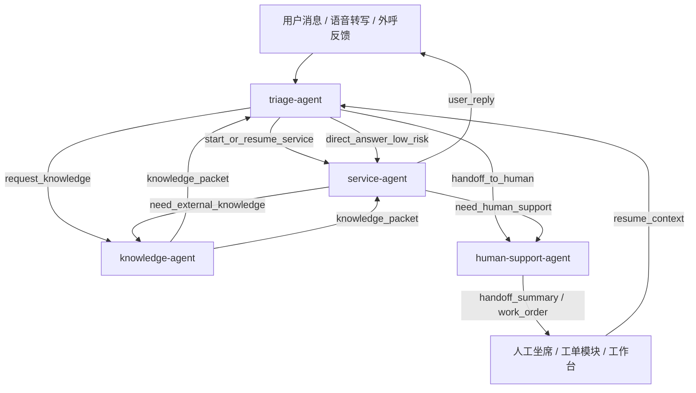

# 四 Agent 职责边界与 Handoff Contract 设计

> 为 `ai-bot` 定义一套可长期演进的多 Agent 运行时边界。目标不是“让多个 Agent 聊天”，而是让 `triage-agent / service-agent / knowledge-agent / human-support-agent` 在职责、状态、输入输出、交接契约上有明确分工，并与当前 Skill Runtime、Tool Runtime、Work Order 体系稳定对接。

**Date**: 2026-04-03  
**Status**: Draft  
**Positioning**: Target Architecture  
**Related Current Code**:
- `backend/src/chat/chat.ts`：当前在线入口，仍是 legacy-first
- `backend/src/engine/skill-router.ts`：当前仅负责恢复 active instance
- `backend/src/engine/skill-runtime.ts`：已具备 per-session workflow runtime
- `packages/shared-db/src/schema/platform.ts`：已有 `skill_instances / skill_instance_events / execution_records`
- `docs/superpowers/specs/2026-03-24-complete-workflow-engine-architecture.md`
- `docs/superpowers/specs/2026-03-28-work-order-module-design.md`
- `docs/superpowers/specs/2026-03-28-work-order-intake-architecture-design.md`

---

## 1. 设计目标

这套四 Agent 设计要解决 5 个问题：

1. 让“谁来判断意图、谁来推进流程、谁来补证据、谁来转人工”不再混在一个 Agent 里。
2. 让高风险业务由 runtime 持有流程控制权，而不是交给单个大 prompt 临场发挥。
3. 让跨 Agent 协作通过结构化 handoff 完成，而不是靠自由文本对话。
4. 让记忆、状态、事件、工单的归属关系明确，避免跨域污染。
5. 让后续评测可以精确定位失败点：路由错了、工具错了、知识错了，还是转人工错了。

---

## 2. 结论先行

推荐的四个核心 Agent 为：

- `triage-agent`
- `service-agent`
- `knowledge-agent`
- `human-support-agent`

它们的最短定义如下：

- `triage-agent`：唯一前门控制器，负责理解用户当前诉求，并决定“恢复已有流程 / 启动业务流程 / 请求知识补证 / 转人工支持”。
- `service-agent`：唯一业务执行器，负责运行 Skill Runtime、推进 SOP、调用业务工具、生成业务回复。
- `knowledge-agent`：唯一知识检索器，负责找证据、做引用整理、返回受限知识包，不直接对用户做最终业务承诺。
- `human-support-agent`：唯一人工支持桥接器，负责转人工摘要、工单创建/更新、跟进衔接、人工恢复入口。

一句话：

> `triage-agent` 决定去哪，`service-agent` 负责干活，`knowledge-agent` 负责找依据，`human-support-agent` 负责把未闭环事项接入人工体系。

---

## 3. 总体协作图



---

## 4. 设计原则

### 4.1 单一职责，不交叉持权

每个 Agent 只承担一种主职责：

- 路由
- 执行
- 检索
- 人工桥接

不允许出现以下混搭：

- `knowledge-agent` 直接创建业务写操作
- `human-support-agent` 直接决定业务分支
- `triage-agent` 长时间持有业务流程状态
- `service-agent` 自行绕过 runtime 直接转人工落单

### 4.2 结构化 handoff，不走自由文本协商

Agent 之间的交接必须输出结构化 contract。

禁止：

- “我觉得你去查一下账单吧” 这类自由文本 handoff
- 靠自然语言约定字段
- 交接后重新从会话历史猜前情

### 4.3 状态所有权唯一

同一类状态只能有一个 canonical owner：

- 会话当前路由：`triage-agent`
- 业务实例状态：`service-agent` runtime
- 知识证据包：`knowledge-agent`
- 转人工与工单状态：`human-support-agent`

### 4.4 Agent 之间传递“事实”，不传递“无限上下文”

handoff 只传高信号结构化内容：

- 当前意图
- 已确认槽位
- 当前 skill / step
- 工具结果摘要
- 风险与原因
- 待人工动作

不传：

- 全量 prompt
- 全量对话历史
- 全量工具原始返回

### 4.5 失败时回到上游控制器

除非是 `service-agent -> human-support-agent` 的正式人工升级，否则 Agent 间失败应优先返回 `triage-agent` 重新决策，而不是自行级联扩散。

---

## 5. 四个 Agent 的职责边界

## 5.1 `triage-agent`

### 核心职责

- 识别当前消息属于：
  - 恢复已有业务流程
  - 启动新的业务流程
  - 纯知识问答
  - 人工支持请求
  - 多意图需拆分
  - 高歧义需澄清
- 管理跨 Agent handoff
- 在会话层做 topic switch 与 ownership 切换

### 明确不负责

- 不直接执行高风险业务工具
- 不直接维护 Skill Runtime 的步骤推进
- 不直接创建正式业务写操作
- 不直接承担知识引用细节构造

### 输入

```ts
interface TriageInput {
  session_id: string;
  channel: 'online' | 'voice' | 'outbound';
  user_message: string;
  user_id?: string | null;
  phone?: string | null;
  lang: 'zh' | 'en';
  active_workflow?: {
    instance_id: string;
    skill_id: string;
    current_step_id: string;
    pending_confirm: boolean;
  } | null;
  recent_summary?: string | null;
  recent_intents?: string[];
  memory_context?: string[];
}
```

### 输出

```ts
interface TriageDecision {
  decision_type:
    | 'resume_service'
    | 'start_service'
    | 'request_knowledge'
    | 'handoff_human_support'
    | 'ask_clarification';
  target_agent: 'service-agent' | 'knowledge-agent' | 'human-support-agent' | null;
  primary_intent: string;
  confidence: number;
  reason_codes: string[];
  slots: Record<string, unknown>;
  knowledge_query?: string | null;
  clarification_question?: string | null;
}
```

### 关键边界

- `triage-agent` 可以决定“去哪”，但不能决定某个 Skill Runtime 内部“下一步做什么”。
- 如果会话中已经有 active workflow，默认先尝试 `resume_service`，只有明确 topic switch 才允许切换。
- `triage-agent` 是唯一可以把请求正式送入 `human-support-agent` 的入口；`service-agent` 虽然可触发升级，但升级后的正式落单仍归 `human-support-agent`。

---

## 5.2 `service-agent`

### 核心职责

- 承接 `triage-agent` 发起的业务执行请求
- 驱动 Skill Runtime 与 tool runtime
- 管理业务步骤推进、等待确认、分支选择、异常退出
- 生成对用户的业务回复

### 明确不负责

- 不负责检索全域知识资产并自行决定引用策略
- 不负责最终人工工单落单
- 不负责跨会话主路由
- 不负责长期记忆写入策略决策

### 输入

```ts
interface ServiceInput {
  session_id: string;
  trigger_type: 'resume' | 'start';
  skill_id?: string | null;
  user_message: string;
  phone?: string | null;
  lang: 'zh' | 'en';
  active_workflow?: {
    instance_id: string;
    skill_id: string;
    current_step_id: string;
    pending_confirm: boolean;
  } | null;
  resolved_slots: Record<string, unknown>;
  knowledge_packets?: KnowledgePacket[];
}
```

### 输出

```ts
interface ServiceResult {
  result_type:
    | 'user_reply'
    | 'need_knowledge'
    | 'need_human_support'
    | 'workflow_completed';
  user_text?: string;
  current_workflow?: {
    instance_id: string;
    skill_id: string;
    current_step_id: string | null;
    pending_confirm: boolean;
    finished: boolean;
  } | null;
  tool_facts: ToolFact[];
  next_action?: string | null;
  handoff_request?: HumanSupportRequest | null;
  knowledge_request?: KnowledgeRequest | null;
}
```

### 关键边界

- `service-agent` 是唯一可以直接驱动业务 tool 的 Agent。
- `service-agent` 可以向 `knowledge-agent` 请求补证，但不能把“找到什么资料”变成自己的记忆真相，必须显式接收 `knowledge_packet`。
- `service-agent` 触发人工升级时，必须输出结构化 `HumanSupportRequest`，不能直接自己写工单。

---

## 5.3 `knowledge-agent`

### 核心职责

- 接受结构化检索请求
- 从知识库、reference、workspace memory、长期记忆中找证据
- 返回受控的 `knowledge_packet`
- 标注证据来源、置信度、时效性与适用边界

### 明确不负责

- 不直接对用户输出最终结论
- 不直接调用业务写工具
- 不直接决定是否转人工
- 不直接修改 workflow 状态

### 输入

```ts
interface KnowledgeRequest {
  request_id: string;
  session_id: string;
  requester: 'triage-agent' | 'service-agent';
  query: string;
  intent: string;
  scope: Array<'skill_refs' | 'km_assets' | 'workspace_memory' | 'long_term_memory'>;
  skill_id?: string | null;
  constraints?: {
    top_k?: number;
    freshness_days?: number | null;
    require_sources?: boolean;
  };
}
```

### 输出

```ts
interface KnowledgePacket {
  packet_id: string;
  query: string;
  answer_brief: string;
  evidence_items: Array<{
    source_type: 'skill_ref' | 'km_asset' | 'memory' | 'doc';
    source_id: string;
    title: string;
    snippet: string;
    confidence: number;
    freshness?: string | null;
  }>;
  constraints: string[];
  unresolved_points: string[];
  confidence: number;
}
```

### 关键边界

- `knowledge-agent` 的输出是“证据包”，不是“最终客服答复”。
- 只要返回 `confidence` 低或 `unresolved_points` 非空，`triage-agent` 或 `service-agent` 就不能把它当成高置信业务事实直接承诺给用户。
- `knowledge-agent` 不拥有会话主状态，天然无权保持“当前用户在办什么业务”。

---

## 5.4 `human-support-agent`

### 核心职责

- 承接人工升级请求
- 生成交接摘要
- 创建或更新工单、预约、跟进事项
- 维护 AI -> 人工 -> AI 的桥接关系
- 为人工恢复会话或恢复 workflow 提供 resume context

### 明确不负责

- 不负责业务流程分支判断
- 不负责从零理解用户诉求并重建路由
- 不负责自由检索与业务解释主回答

### 输入

```ts
interface HumanSupportRequest {
  request_id: string;
  session_id: string;
  source_agent: 'triage-agent' | 'service-agent';
  handoff_reason:
    | 'user_requested_human'
    | 'policy_required'
    | 'workflow_blocked'
    | 'tool_failure'
    | 'low_confidence'
    | 'out_of_scope';
  current_intent: string;
  user_message: string;
  workflow_context?: {
    instance_id: string;
    skill_id: string;
    current_step_id: string;
    pending_confirm: boolean;
  } | null;
  tool_facts: ToolFact[];
  recommended_actions: string[];
  priority: 'low' | 'medium' | 'high' | 'urgent';
}
```

### 输出

```ts
interface HumanSupportResult {
  result_type: 'handoff_created' | 'handoff_updated' | 'human_resume_ready';
  handoff_id: string;
  summary: string;
  work_order?: {
    id: string;
    type: 'ticket' | 'work_order' | 'followup';
    status: string;
    queue_code?: string | null;
  } | null;
  resume_context?: {
    session_id: string;
    instance_id?: string | null;
    suggested_next_step?: string | null;
  } | null;
}
```

### 关键边界

- `human-support-agent` 是唯一可以写入“人工支持域”实体的 Agent。
- “转人工摘要”和“工单字段”必须来源于结构化上下文，不能重新从全量会话里临时总结一遍后丢失关键信息。
- 后续如果人工完成处理并允许恢复 AI，会由 `human-support-agent` 提供 `resume_context` 返回给 `triage-agent`。

---

## 6. 状态与数据所有权

| 数据类型 | Canonical Owner | 说明 |
| --- | --- | --- |
| 会话当前路由状态 | `triage-agent` | 当前该走哪个 agent、是否 topic switch |
| Skill 实例状态 | `service-agent` runtime | `skill_instances / skill_instance_events` |
| 工具执行审计 | `tool runtime` | `execution_records` |
| 知识证据包 | `knowledge-agent` | 可缓存，但不应替代业务状态 |
| 转人工摘要 / 工单上下文 | `human-support-agent` | 后续接人工与回流恢复的唯一桥 |
| 长期记忆提炼 | memory service | 不直接归属于单个 agent |

必须避免的反模式：

- `knowledge-agent` 私自保存“当前用户正在办停机保号”
- `service-agent` 私自写工单并把它当成已成功转人工
- `triage-agent` 存储业务步骤细节，导致和 runtime 双写

---

## 7. 通用 Handoff Contract

所有 Agent 间 handoff 都应使用统一 envelope，再根据不同目标 agent 携带专属 payload。

## 7.1 通用 Envelope

```ts
interface AgentHandoffEnvelope<TPayload = unknown> {
  handoff_id: string;
  from_agent: 'triage-agent' | 'service-agent' | 'knowledge-agent' | 'human-support-agent';
  to_agent: 'triage-agent' | 'service-agent' | 'knowledge-agent' | 'human-support-agent';
  session_id: string;
  user_id?: string | null;
  phone?: string | null;
  channel: 'online' | 'voice' | 'outbound';
  intent: string;
  priority: 'low' | 'medium' | 'high' | 'urgent';
  created_at: string;
  trace_id: string;
  payload: TPayload;
}
```

## 7.2 共用最小字段要求

每次 handoff 至少必须带：

- `handoff_id`
- `from_agent`
- `to_agent`
- `session_id`
- `intent`
- `priority`
- `trace_id`
- `payload.summary`
- `payload.reason_codes`

如果是业务相关 handoff，还必须带：

- `payload.confirmed_slots`
- `payload.tool_facts`

如果是恢复类 handoff，还必须带：

- `payload.resume_token`

---

## 8. 四种核心 Handoff 类型

## 8.1 `triage-agent -> service-agent`

使用场景：

- 新业务开始
- 恢复已有 workflow
- 低风险直接查询进入业务执行

payload 规范：

```ts
interface TriageToServicePayload {
  mode: 'start' | 'resume';
  skill_id?: string | null;
  summary: string;
  reason_codes: string[];
  confirmed_slots: Record<string, unknown>;
  active_workflow?: {
    instance_id: string;
    skill_id: string;
    current_step_id: string;
    pending_confirm: boolean;
  } | null;
  tool_facts: ToolFact[];
  memory_hints: string[];
}
```

契约要求：

- `triage-agent` 只能推荐 `skill_id`，不能替 `service-agent` 伪造步骤状态。
- 如果 `mode=resume`，必须附带 `active_workflow.instance_id`。

## 8.2 `service-agent -> knowledge-agent`

使用场景：

- 当前步骤需要额外政策、说明、参考依据
- 用户追问“为什么”或“规则依据是什么”
- 工具结果不足以组织解释

payload 规范：

```ts
interface ServiceToKnowledgePayload {
  summary: string;
  reason_codes: string[];
  query: string;
  skill_id?: string | null;
  current_step_id?: string | null;
  confirmed_slots: Record<string, unknown>;
  tool_facts: ToolFact[];
  scope: Array<'skill_refs' | 'km_assets' | 'workspace_memory' | 'long_term_memory'>;
}
```

契约要求：

- `knowledge-agent` 返回后，`service-agent` 仍负责最终话术。
- `knowledge-agent` 不得直接推进 workflow step。

## 8.3 `service-agent -> human-support-agent`

使用场景：

- 用户明确要求人工
- policy 要求人工
- runtime 卡住
- 工具连续失败
- 高风险操作需人工确认

payload 规范：

```ts
interface ServiceToHumanSupportPayload {
  summary: string;
  reason_codes: string[];
  handoff_reason: HumanSupportRequest['handoff_reason'];
  current_intent: string;
  workflow_context?: {
    instance_id: string;
    skill_id: string;
    current_step_id: string;
    pending_confirm: boolean;
  } | null;
  confirmed_slots: Record<string, unknown>;
  tool_facts: ToolFact[];
  recommended_actions: string[];
  unresolved_questions: string[];
}
```

契约要求：

- 必须明确“卡在哪一步、已经查了什么、还差什么”。
- 不允许只传“用户要求人工，请处理”这种低信息摘要。

## 8.4 `human-support-agent -> triage-agent`

使用场景：

- 人工处理完成后恢复 AI
- 工单更新后需继续由 AI 跟进
- 预约回访到点，重新进入 AI 流程

payload 规范：

```ts
interface HumanSupportToTriagePayload {
  summary: string;
  reason_codes: string[];
  resume_token: string;
  work_order_id: string;
  resolved_actions: string[];
  remaining_actions: string[];
  suggested_next_intent?: string | null;
  workflow_resume?: {
    instance_id: string;
    skill_id: string;
    next_step_id?: string | null;
  } | null;
}
```

契约要求：

- `triage-agent` 接到恢复请求后，重新做一次轻量路由判断。
- 不要求无脑回到 `service-agent`，但默认优先恢复原业务链路。

---

## 9. 通用事实对象

为避免 Agent 间反复解析 tool 原始返回，建议统一一个 `ToolFact` 结构。

```ts
interface ToolFact {
  tool_name: string;
  success: boolean;
  has_data: boolean;
  fact_type: 'identity' | 'billing' | 'plan' | 'policy' | 'risk' | 'diagnosis' | 'other';
  summary: string;
  raw_ref?: {
    execution_record_id?: string | null;
    trace_id?: string | null;
  } | null;
}
```

约束：

- `summary` 只保留 handoff 所需的高价值事实
- 原始 tool 返回只保留引用，不跨 Agent 大段传递

---

## 10. 每个 Agent 的工具白名单

## 10.1 `triage-agent`

允许：

- 轻量分类器
- session summary 读取
- active workflow 查询
- memory hint 检索

禁止：

- 所有业务写工具
- 大部分业务查询工具
- 工单创建工具

## 10.2 `service-agent`

允许：

- skill runtime 指定业务工具
- tool runtime 查询/执行工具
- step renderer 所需最小辅助工具

禁止：

- 直接写工单主实体
- 跨域检索所有知识资产的无限搜索

## 10.3 `knowledge-agent`

允许：

- 检索工具
- reference 读取工具
- memory retrieval 工具

禁止：

- 业务写工具
- workflow advance
- 工单写入

## 10.4 `human-support-agent`

允许：

- handoff summary 生成
- work order create/update
- queue / SLA / assignment 工具

禁止：

- 业务流程推进工具
- 知识自由检索作为主职责

---

## 11. 记忆作用域建议

为避免多 Agent 污染，记忆至少要按以下维度分 scope：

- `global`
- `user`
- `workspace`
- `agent`
- `agent + user`

建议默认：

- `triage-agent`：会话摘要、用户偏好、话题切换历史
- `service-agent`：SOP 经验、常见失败路径、业务澄清偏好
- `knowledge-agent`：检索提示词、常见来源映射、术语对齐
- `human-support-agent`：队列偏好、工单模板、人工恢复规则

不能共享的记忆示例：

- `knowledge-agent` 的检索召回技巧，不应自动污染 `service-agent` 的业务规则
- `human-support-agent` 的队列分配经验，不应进入 `triage-agent` 的意图分类上下文

---

## 12. 评测指标建议

每个 Agent 要有独立 eval，不要只看最终答复。

## 12.1 `triage-agent`

- intent classification accuracy
- resume vs start correctness
- handoff target accuracy
- topic switch accuracy

## 12.2 `service-agent`

- tool selection accuracy
- argument precision
- trajectory accuracy
- pending_confirm correctness
- policy violation rate

## 12.3 `knowledge-agent`

- retrieval precision@k
- citation correctness
- stale evidence rate
- unsupported-claim rate

## 12.4 `human-support-agent`

- handoff summary completeness
- work order field completeness
- queue routing accuracy
- resume context usefulness

---

## 13. 与当前代码的落地建议

### 13.1 第一优先级

把 [backend/src/engine/skill-router.ts](../../../backend/src/engine/skill-router.ts) 从“恢复 active instance 的 helper”升级成真正的 `triage-agent` 入口。

它至少要支持：

- 读取 active workflow
- 判断 topic switch
- 判断 start_service / resume_service / request_knowledge / handoff_human_support
- 输出结构化 `TriageDecision`

### 13.2 第二优先级

继续把 [backend/src/engine/skill-runtime.ts](../../../backend/src/engine/skill-runtime.ts) 保持为 `service-agent` 的核心执行器，不要让它重新退回成“大 prompt + 自由工具调用”。

### 13.3 第三优先级

将当前 `KM` 检索链路从 [km_service/src/services/reply-copilot.ts](../../../km_service/src/services/reply-copilot.ts) 的关键词优先策略，升级为可供 `knowledge-agent` 独立调用的混合检索服务。

### 13.4 第四优先级

将现有工单模块设计继续前推，让 `human-support-agent` 成为：

- 转人工摘要的唯一生成者
- 工单落单的唯一桥接器
- AI 恢复上下文的唯一回流入口

---

## 14. 最终判断

四 Agent 架构的关键，不是“是否拆成四个进程”，而是先把下面三件事做对：

1. 职责边界清楚
2. 状态归属唯一
3. handoff contract 结构化

只要这三点做对，即使初期仍跑在同一个服务里，也已经是可持续演进的真正 Agent 架构；如果这三点没做对，就算拆成十个 Agent，也只会得到十个互相甩锅的 prompt。
