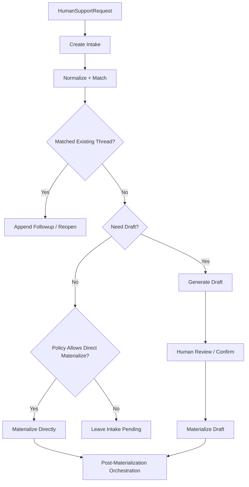

# `human-support-agent` 落单与人工衔接策略设计

> 为 `ai-bot` 的 `human-support-agent` 定义一套清晰、保守、可演进的人工升级与落单策略。目标不是让 Agent “一看到转人工就建工单”，而是明确：什么时候只留 `intake`，什么时候生成 `draft`，什么时候允许直接物化为 `ticket / work_order`，以及它如何与现有 `work_order_service` 对接。

**Date**: 2026-04-03  
**Status**: Draft  
**Positioning**: Human Escalation + Materialization Policy  
**Related Design**:
- [四 Agent 职责边界与 Handoff Contract 设计](./2026-04-03-four-agent-boundaries-and-handoff-contract.md)
- [四 Agent 数据库表结构与 API Contract 草案](./2026-04-03-four-agent-db-and-api-contract.md)
- [Triage Agent 与请求生命周期设计](./2026-04-03-triage-agent-and-request-lifecycle-design.md)
- [Memory 架构：DB 记忆与 MD 文件共存设计](./2026-04-03-memory-architecture-db-and-md-coexistence.md)
- [Work Order 通用入口架构设计](./2026-03-28-work-order-intake-architecture-design.md)

**Related Current Code**:
- `work_order_service/src/services/intake-service.ts`
- `work_order_service/src/services/draft-service.ts`
- `work_order_service/src/services/materializer-service.ts`
- `work_order_service/src/services/policy-engine-service.ts`
- `work_order_service/src/services/followup-orchestrator-service.ts`
- `packages/shared-db/src/schema/workorder.ts`

---

## 1. 要解决的问题

如果前面的四 Agent 设计已经回答了“谁负责人工桥接”，这一份文档要继续回答 6 个更细的问题：

1. `human-support-agent` 什么时候应该只创建 `intake`，而不是立刻建正式工单。
2. 什么时候应该经过 `draft`，把分类、摘要、队列先交给人工确认。
3. 什么时候可以直接物化为 `ticket` 或 `work_order`。
4. `ticket` 和 `work_order` 应该怎么选，什么时候不该直接建 `appointment / task`。
5. AI 到人工的交接里，哪些字段必须保留到工单域，避免上下文丢失。
6. 现有 `work_order_service` 已经有的 `normalize / match / policy / materialize / followup` 能力，应该如何被 `human-support-agent` 复用，而不是重复实现一套新逻辑。

---

## 2. 结论先行

### 2.1 `human-support-agent` 是唯一正式人工桥

推荐把 `human-support-agent` 定义为：

- 唯一可以把 AI 会话正式接入人工支持域的 Agent
- 唯一可以决定是否调用 `intake / draft / materialize` 链路的 Agent
- 唯一可以输出“转人工摘要 + 落单结果 + 恢复上下文”的 Agent

这意味着：

- `triage-agent` 负责“要不要转人工”
- `service-agent` 负责“为什么需要人工”
- `human-support-agent` 负责“怎么接入人工体系”

### 2.2 默认策略应是 `intake-first`

对于来自聊天或业务流程的正式 AI -> 人工升级，默认都先进入 `intake`。

推荐默认规则：

1. 正式人工升级，先落 `intake`
2. 是否需要 `draft`，由 `human-support-agent` 决定
3. 是否允许 `materializeDirectly`，只在少量高确定性场景放开

换句话说：

> “直接建单”应该是例外，不是默认。

### 2.3 `draft` 是给“不够确定，但已经足够有方向”的场景准备的

当系统已经知道：

- 这是一个应该进入人工体系的事项
- 大概是什么类型
- 大概去哪条队列

但还不能完全确信：

- 标题/摘要是否准确
- `ticket` 还是 `work_order`
- 分类/优先级/队列是否应人工确认

这时应该先走 `draft`。

### 2.4 直接物化只适用于“结构化、高确定、低歧义、可审计”的场景

推荐只在以下条件同时满足时，允许跳过 `draft`：

- 目标类型已确定
- 分类或默认队列可稳定解析
- 风险路径明确
- 去重/归并已经完成或可接受
- 该动作符合既有 policy
- 不需要人工再解释或改写关键信息

### 2.5 当前阶段不建议让 `human-support-agent` 直接创建 `appointment / task`

当前阶段的一阶正式落单目标建议仍然只有两类：

- `ticket`
- `work_order`

`appointment / task` 更适合作为：

- `work_order` 的后续编排结果
- `workflow` 的派生产物
- `followup-orchestrator` 的自动动作

这和当前 `work_order_service` 的能力也一致。

---

## 3. 在四 Agent 体系中的定位

## 3.1 它不是“另一个客服 Agent”

`human-support-agent` 不应该重新理解用户全部诉求，也不应该替代 `triage-agent` 或 `service-agent` 做业务推理。

它只做 4 件事：

1. 吃下结构化 `HumanSupportRequest`
2. 生成可追踪的人工支持入口对象
3. 把该对象映射到 `intake / draft / item`
4. 为人工回流 AI 预留 `resume_context`

## 3.2 它的核心产物不是“回复”，而是“桥”

`human-support-agent` 的核心产物应该是：

- `handoff summary`
- `intake`
- `draft`
- `ticket / work_order`
- `resume context`

它的用户价值不是“说得更像客服”，而是“让人工接得住、跟得下去、能回得来”。

---

## 4. 与现有 `work_order_service` 的关系

当前 `work_order_service` 已经具备一条完整的统一入口链路：

```txt
createIntake
-> normalizeIntake
-> matchIntake
-> resolveDecisionMode
-> generateDraft or materializeIntakeDirectly
-> orchestratePostMaterialization
```

相关实现已存在于：

- `intake-service.ts`
- `draft-service.ts`
- `materializer-service.ts`
- `policy-engine-service.ts`
- `followup-orchestrator-service.ts`

因此推荐结论是：

> `human-support-agent` 应该是 `work_order_service` 的上层编排器，而不是新的工单引擎。

它不应该自己去重新实现：

- normalize
- dedupe
- issue matching
- materialize
- post-materialization followup

它真正要补的是：

- AI 语义到 `source_kind / raw_payload / priority / handoff_reason` 的映射
- 何时只停留在 `intake`
- 何时经过 `draft`
- 何时允许调用自动物化
- 如何把 AI 会话上下文稳定传给人工支持域

---

## 5. 统一策略模型

## 5.1 推荐把 `human-support-agent` 的决策抽象为 4 种模式

```ts
type HumanSupportMaterializationMode =
  | 'intake_only'
  | 'intake_then_draft'
  | 'intake_then_direct_materialize'
  | 'append_or_reopen_existing';
```

当前阶段不推荐把“完全跳过 intake 直接建工单”作为常规模式。

如果未来确实要支持，也应视为特殊模式：

```ts
type ExceptionalMode = 'direct_create_without_intake';
```

但建议只保留给：

- 运维修复
- 数据迁移
- 人工后台
- 极少数系统级自动事件

不作为 `human-support-agent` 的日常主路径。

## 5.2 推荐的决策输入

在之前的 `HumanSupportRequest` 基础上，建议补齐以下字段：

```ts
interface HumanSupportDecisionInput {
  request_id: string;
  session_id: string;
  source_agent: 'triage-agent' | 'service-agent';
  source_message_id?: number | null;
  handoff_reason:
    | 'user_requested_human'
    | 'policy_required'
    | 'workflow_blocked'
    | 'tool_failure'
    | 'low_confidence'
    | 'out_of_scope';
  current_intent: string;
  user_message: string;
  user_requested_human: boolean;
  priority: 'low' | 'medium' | 'high' | 'urgent';
  risk_score?: number | null;
  confidence_score?: number | null;
  workflow_context?: {
    instance_id: string;
    skill_id: string;
    current_step_id: string;
    pending_confirm: boolean;
  } | null;
  tool_facts: ToolFact[];
  known_slots: Record<string, unknown>;
  recommended_actions: string[];
  existing_thread_id?: string | null;
  existing_active_item_id?: string | null;
}
```

这些字段中最关键的是：

- `user_requested_human`
- `handoff_reason`
- `priority`
- `risk_score`
- `confidence_score`
- `workflow_context`
- `existing_thread_id`

它们共同决定：

- 这是“要有人接住”还是“要立刻建正式单”
- 是新建主线，还是追加到已有主线
- 是否允许跳过 `draft`

---

## 6. `source_kind` 的兼容映射与目标态枚举

## 6.1 当前代码里的 `source_kind` 还不够细

当前 `work_order_service/src/types.ts` 中可用的 `SourceKind` 为：

- `agent_after_service`
- `self_service_form`
- `handoff_overflow`
- `external_monitoring`
- `emotion_escalation`

它已经足够支撑现有工单流水线，但对 `human-support-agent` 来说，有一个明显缺口：

- “用户主动要人工”
- “AI 业务流程卡住转人工”
- “工具失败导致转人工”

这三种都无法被自然地区分。

## 6.2 当前阶段的兼容映射

在不改 schema 的前提下，推荐这样兼容：

| AI 侧原因 | 当前映射到的 `source_kind` | 备注 |
| --- | --- | --- |
| 用户主动要求人工 | `agent_after_service` | 语义不完美，但可先通过 `raw_payload.handoff_reason` 保留原意 |
| 合规/策略要求人工 | `agent_after_service` | 通过 `raw_payload.policy_reason` 保留细节 |
| workflow 阻塞 | `agent_after_service` | 通过 `raw_payload.workflow_context` 保留阻塞位置 |
| 工具失败转人工 | `agent_after_service` | 通过 `raw_payload.tool_failures` 保留失败细节 |
| 低置信/超出范围 | `agent_after_service` | 通过 `raw_payload.confidence_score` 保留原因 |
| 情绪/舆情升级 | `emotion_escalation` | 保持现有语义 |
| 转人工无人接，系统兜底落单 | `handoff_overflow` | 保持现有语义 |

这意味着：

- 短期兼容可以成立
- 但 `agent_after_service` 会变成一个过宽的兜底来源

## 6.3 目标态建议

中期建议把 `SourceKind` 扩成更贴近 Agent 语义的枚举：

```ts
type SourceKind =
  | 'user_requested_human'
  | 'policy_required'
  | 'workflow_blocked'
  | 'tool_failure'
  | 'low_confidence'
  | 'agent_after_service'
  | 'handoff_overflow'
  | 'self_service_form'
  | 'external_monitoring'
  | 'emotion_escalation'
  | 'workflow_generated'
  | 'manual_create';
```

这样 `policy-engine` 的解释性会强很多，也更容易做分析和评测。

---

## 7. 什么时候只留 `intake`

推荐 `intake_only` 用于以下场景：

### 7.1 用户只表达“我要人工”，但事项还不够清楚

例如：

- “我要找人工”
- “你转人工吧”
- “我不想和机器人说了”

这类场景能确定的是：

- 需要人工

但不能确定的是：

- 具体问题类型
- 目标队列
- 是否需要正式建 `ticket / work_order`

因此最稳的动作是：

1. 创建 `intake`
2. 保存会话摘要、近轮上下文、基础身份信息
3. 不立即生成 `draft`
4. 由人工工作台再决定后续物化

### 7.2 需要有人接住，但不应该由系统抢先定义问题

例如：

- 用户情绪很差，但事实还很不完整
- 用户同时表达多个问题
- AI 只知道“出问题了”，但不知道该怎么归类

如果这时系统擅自生成 `draft` 或直接建单，很容易把问题定错。

### 7.3 重复/归并风险很高，但还没有足够依据

例如：

- 该手机号近期已有多个类似事项
- 当前会话提到的事可能是已有 thread 的补充
- 但缺少足够信号判断是 `append_followup` 还是 `create_new_thread`

这类情况下，`intake` 应作为缓冲层。

### 7.4 当前人工升级的目标只是“接手会话”，不是“立刻排执行”

推荐区分两个意图：

- `conversation_handoff`
- `service_work_item`

如果当前只是让人工加入会话或回拨联系，而不是马上触发履约或执行动作，推荐只停在 `intake`。

---

## 8. 什么时候走 `intake -> draft`

推荐 `intake_then_draft` 用于以下场景：

### 8.1 问题方向清楚，但正式单字段仍需人工确认

例如：

- 这是一个投诉，但投诉分类可能有两个候选
- 这是一个服务请求，但是 `ticket` 还是 `work_order` 仍不稳
- 系统能总结问题，但标题/摘要还可能需要人工润色

### 8.2 业务风险允许提建议，但不允许自动定责或自动定单

例如：

- 用户对费用、合约、停开机这类问题不满，需要转人工复核
- AI 已经走过一段业务流程，知道关键信息，但最终落单仍需要人工确认

这类场景中，`draft` 的价值特别高：

- AI 先把结构化内容填好
- 人工只需要快速审核和调整

### 8.3 来自 `service-agent` 的正式升级，且已有比较完整的流程上下文

例如：

- `service-agent` 已确认用户身份
- 已跑过若干工具
- 已拿到关键事实
- 只是由于策略或系统限制不能继续自动闭环

这种情况下，不应该浪费前序工作，让人工从零看聊天记录判断。

最好的模式是：

1. `human-support-agent` 创建 `intake`
2. 生成 `draft`
3. 把已有流程上下文转成结构化草稿字段
4. 由人工确认后发布

### 8.4 当前阶段的大多数 AI 会话升级，都应该优先落在这一档

如果需要一句最实用的默认建议，那就是：

> 聊天或 Skill Runtime 里产生的正式升级，大多数默认走 `intake -> draft`，而不是直建。

---

## 9. 什么时候允许 `intake -> direct materialize`

推荐只有在下列条件都满足时，才使用 `intake_then_direct_materialize`：

### 9.1 目标类型已确定

系统已经能稳定判断：

- 就是 `ticket`
或
- 就是 `work_order`

### 9.2 分类与路由足够确定

系统能稳定得到：

- `category_code`
- 或基于 `category_code` 解析出的 `queue_code / workflow_key / priority`

### 9.3 用户或系统不需要人工先审内容

例如：

- 这是结构化事件，不是需要人工理解语义的投诉文本
- 这是机器生成的确定性事件
- 或者即便来自会话，其关键信息已经足够标准化

### 9.4 去重/归并已经处理过

即：

- 已知应 `append_followup`
- 已知应 `reopen_master`
- 或者已确认 `create_new_thread` 是合理的

### 9.5 符合既有 policy，且动作后果可接受

这点最重要：

- 不是“系统能建”，就“应该建”
- 只有 policy 允许自动物化时，才跳过 `draft`

## 9.6 典型可放行场景

### `handoff_overflow`

当用户明确要人工，但系统无人接听，且已经收集到足够结构化信息时：

- 可以自动建 `ticket`
- 让人工稍后跟进

这与当前 `policy-engine-service.ts` 中的 `handoff_overflow -> auto_create` 一致。

### `emotion_escalation`

当情绪升级已明确，且风险较高时：

- 可以自动建 `ticket`
- 让队列尽快接住

这也与当前 policy 一致：

- 高风险 `auto_create`
- 否则 `auto_create_if_confident`

### `external_monitoring`

这是最典型的直接物化来源：

- 机器生成
- 结构化高
- 风险可量化
- 适合直接建 `ticket / work_order`

当前系统甚至已支持：

- `auto_create_and_schedule`

### 机器判定非常强、且只是履约派发

例如：

- 已明确是某个后续执行动作
- 类型和队列已经被规则稳定命中
- 不需要人工再理解语义

这类场景可以直接 `work_order`。

---

## 10. `append_or_reopen_existing` 应该优先于新建

对 `human-support-agent` 来说，一个很重要的原则是：

> 先判断是不是已有事项主线，再决定要不要新建。

这点与现有 `issue_thread` 设计天然一致。

推荐顺序：

1. 创建 `intake`
2. 标准化
3. 走 `match`
4. 如果命中已有 thread：
   - `append_followup`
   - 或 `reopen_master`
5. 只有确定应 `create_new_thread` 时，才考虑 `draft` 或直接物化

这意味着：

- `human-support-agent` 不应该把所有升级都看成“新单”
- 追加上下文、重开旧单，往往比新建更符合真实运营流程

---

## 11. `ticket` 与 `work_order` 的选择规则

## 11.1 推荐判断原则

### 优先选 `ticket` 的场景

- 用户在表达问题、诉求、投诉、咨询、异常
- 还需要有人继续判断、解释、沟通
- 工单首先承担的是“接住、分流、跟进”

一句话：

> `ticket` 更像“事项受理与沟通主线”。

### 优先选 `work_order` 的场景

- 下一步动作已经比较明确
- 已知需要执行、跟进、复核、派发、上门、外呼
- 工单首先承担的是“执行与履约”

一句话：

> `work_order` 更像“可执行动作载体”。

## 11.2 当前阶段的具体建议

### 默认从 AI 会话升级到人工时，优先落 `ticket`

原因很简单：

- 大部分 AI 会话升级，第一需求还是“有人接住”
- 而不是“系统马上派执行单”

因此推荐：

- `user_requested_human`
- `policy_required`
- `tool_failure`
- `low_confidence`
- `out_of_scope`

默认优先 `ticket`

### 只有当“下一步动作”已非常明确时，才优先 `work_order`

例如：

- 明确需要回访
- 明确需要人工复核
- 明确需要现场执行
- 明确需要某个后续工作流

这时再优先 `work_order`。

## 11.3 当前阶段不建议直接把 `followup` 作为正式主类型

在前面的 `HumanSupportResult` 里出现过 `followup` 这种语义化类型，但从当前 `work_order_service` 建模看，更稳的做法是：

- 把 `followup` 视为 `work_order.subtype`
- 或视为 `workflow` 派生动作

而不是把它当成新的主类。

---

## 12. 推荐的决策矩阵

| 场景 | 推荐模式 | 推荐目标 | 理由 |
| --- | --- | --- | --- |
| 用户只说“转人工” | `intake_only` | 暂不建正式单 | 只确定需要人工，问题本身还不清楚 |
| AI 流程卡住，但已有较完整事实 | `intake_then_draft` | 默认 `ticket` | 人工接手前需要审核摘要/分类 |
| AI 已明确需要执行动作 | `intake_then_draft` 或 `intake_then_direct_materialize` | `work_order` | 取决于类型和队列是否已稳定 |
| 高风险情绪升级 | `intake_then_direct_materialize` | `ticket` | 要先让队列接住，速度比草稿更重要 |
| 无人接的人工升级兜底 | `intake_then_direct_materialize` | 默认 `ticket` | 当前 policy 已支持自动建单 |
| 外部监控/结构化事件 | `intake_then_direct_materialize` | `ticket` 或 `work_order` | 结构化程度高，适合直接物化 |
| 命中已有 thread 的补充信息 | `append_or_reopen_existing` | 复用已有主线 | 避免炸单 |
| 已关闭事项再次触达 | `append_or_reopen_existing` | 重开已有主线 | 比新建更符合运营逻辑 |

---

## 13. 推荐的编排顺序

## 13.1 统一编排流程



## 13.2 对当前 API 的映射

推荐 `human-support-agent` 内部按以下顺序调用现有能力：

1. `POST /api/intakes`
2. 如需自动处理：
   - `POST /api/intakes/:id/process`
3. 如需草稿：
   - `POST /api/drafts/generate`
   - `POST /api/drafts/:id/confirm`
4. 如需显式 workflow：
   - `POST /api/workflows/runs`

一句话：

> `human-support-agent` 更像“调度这些能力的 orchestrator”，而不是“新建一套工单业务”。

---

## 14. Handoff 到工单域的字段映射

## 14.1 必须保留的 AI 上下文字段

只要是 AI -> 人工升级，推荐至少保留以下字段：

```ts
interface HumanSupportAuditContext {
  handoff_id: string;
  session_id: string;
  source_agent: 'triage-agent' | 'service-agent';
  source_message_id?: number | null;
  source_skill_id?: string | null;
  source_instance_id?: string | null;
  source_step_id?: string | null;
  source_execution_record_ids?: string[];
  handoff_reason: string;
  current_intent: string;
  summary: string;
  recommended_actions: string[];
}
```

这些信息推荐至少进入：

- `raw_payload_json`
- `work_item_relations`
- 后续 `agent_handoffs.result_json`

## 14.2 为什么这一步重要

如果这些字段丢了，人工域就只会看到一个“新建工单”，却不知道：

- 为什么建
- 从哪个流程来的
- AI 做到了哪一步
- 哪些工具已经执行过
- 回流 AI 时应该从哪里继续

这会直接破坏多 Agent 架构最重要的“可恢复性”。

---

## 15. 明确的反模式

## 15.1 `service-agent` 直接自己建工单

不推荐。

原因：

- 会让业务执行权和人工支持域写权限混在一起
- 后续很难统一工单策略
- 会让 `human-support-agent` 失去存在意义

## 15.2 把所有升级都自动物化

不推荐。

原因：

- 会制造大量低质量正式单
- 会让人工队列被“机器人误判”淹没
- 会掩盖真正需要 `draft` 的场景

## 15.3 把所有升级都只留在 `intake`

也不推荐。

原因：

- 高风险场景需要立刻进正式队列
- 已知可自动建的结构化事件不该再等人工二次判断

## 15.4 为了保守而跳过 `issue_thread`

不推荐。

原因：

- 这会显著增加重复工单
- 与现有 `appendFollowup / reopenThread` 能力背道而驰

---

## 16. 当前阶段的默认建议

如果现在就要在 `ai-bot` 里落一版可运行的策略，我的推荐是：

### 16.1 默认策略

- AI 会话产生的正式升级：默认 `intake_then_draft`
- 用户只说要人工：默认 `intake_only`
- 命中已有主线：默认 `append_or_reopen_existing`
- 高风险情绪升级：默认 `intake_then_direct_materialize`
- 结构化系统事件：默认 `intake_then_direct_materialize`

### 16.2 默认目标类型

- AI 会话升级：默认 `ticket`
- 明确执行/回访/复核动作：优先 `work_order`

### 16.3 默认写权限边界

- 只有 `human-support-agent` 能正式触发 `intake / draft / materialize`
- `service-agent` 只能提交 `HumanSupportRequest`

### 16.4 默认的一句设计原则

> 先保证“人工接得住”，再追求“自动建得快”。

---

## 17. 后续评测指标

这块如果不上评测，很快就会变成凭感觉调策略。

推荐至少跟踪：

- `intake_only` 之后被人工补建正式单的比例
- 本应 `draft` 却被直接物化的误判率
- 重复正式单率
- `append_followup / reopen` 命中率
- 队列命中准确率
- 人工首次响应时长
- 正式单重开率
- 人工退回“信息不足”的比例

这些指标将决定后面是否应该：

- 放宽直建条件
- 缩小 `draft` 适用面
- 扩展 `source_kind`
- 调整 `ticket / work_order` 的默认选择规则

---

## 18. 最终结论

`human-support-agent` 的本质，不是“帮 AI 再说一遍转人工话术”，而是把 AI 世界里的半结构化语义，安全地翻译成人工支持世界里的正式对象。

对当前 `ai-bot` 来说，最稳的落地方式不是“所有升级都自动建单”，而是：

1. 默认 `intake-first`
2. 大多数 AI 会话升级走 `intake -> draft`
3. 只有高确定、高结构化场景才允许直接物化
4. 永远优先利用 `issue_thread` 做追加与重开
5. 让 `human-support-agent` 成为唯一正式人工桥

一句话总结：

> `human-support-agent` 应该先做“可靠的桥”，再做“激进的自动化器”。
