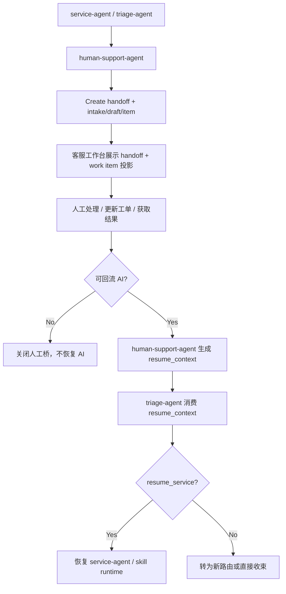

# `human-support-agent` 工作台协作与 `resume_context` 回流协议设计

> 为 `ai-bot` 定义 `human-support-agent -> 客服工作台 -> triage-agent` 的完整协作闭环。目标不是让人工处理和 AI 处理各干各的，而是让人工接手时看得清、做得动、留得住，处理完成后又能把高信号结果结构化回流给 Agent Runtime，而不是重新从聊天记录猜一次。

**Date**: 2026-04-03  
**Status**: Draft  
**Positioning**: Workstation Projection + Human Resume Protocol  
**Related Design**:
- [四 Agent 职责边界与 Handoff Contract 设计](./2026-04-03-four-agent-boundaries-and-handoff-contract.md)
- [四 Agent 数据库表结构与 API Contract 草案](./2026-04-03-four-agent-db-and-api-contract.md)
- [`human-support-agent` 落单与人工衔接策略设计](./2026-04-03-human-support-agent-materialization-policy.md)
- [工单模块设计与客服工作台协同方案](./2026-03-28-work-order-module-design.md)

**Related Current Code**:
- `frontend/src/agent/AgentWorkstationPage.tsx`
- `frontend/src/agent/inbox/InboxContext.ts`
- `frontend/src/agent/inbox/useWorkspaceWs.ts`
- `frontend/src/agent/cards/index.ts`
- `frontend/src/agent/cards/contents/HandoffContent.tsx`
- `frontend/src/agent/cards/contents/WorkOrderSummaryContent.tsx`
- `frontend/src/agent/cards/contents/WorkOrderTimelineContent.tsx`
- `frontend/src/agent/pages/ActionBar.tsx`
- `frontend/src/agent/inbox/WrapUpDialog.tsx`
- `frontend/src/agent/pages/CreateFollowUpDialog.tsx`

---

## 1. 问题定义

前面的文档已经回答了：

- 什么时候该转人工
- `human-support-agent` 何时应走 `intake / draft / materialize`
- 工单如何作为人工支持域的正式对象存在

但还有 5 个关键问题没有完全收口：

1. 人工坐席在工作台里到底应该看到什么，而不是只看到一条“转人工摘要”。
2. 工作台到底是“工单真相源”，还是“工单与 handoff 的投影层”。
3. 人工处理完成后，什么信息应该回流给 AI，而不只是写一段 wrap-up note。
4. `resume_context` 应该长什么样，谁生产，谁消费，何时过期。
5. 当前工作台已有的 `handoff / work_order_summary / work_order_timeline / wrap-up / create follow-up`，应如何与四 Agent 设计接起来，而不是被推翻。

---

## 2. 现状判断

## 2.1 当前工作台已经具备“人工接住”的外壳

从现有实现看，工作台已经有几块很有价值的基础能力：

- Inbox `interaction` 已有 `handoff_summary`
- `ConversationHeader` 已能显示 queue / priority / routing
- 右侧已有 `handoff` 卡片
- 右侧已有 `work_order_summary` 卡片
- 右侧已有 `work_order_timeline` 卡片
- `ActionBar` 已有 `转队列 / 建工单 / 回呼 / 收尾`
- `WrapUpDialog` 已支持“结束会话 + 可选后续工单”

所以问题不是“完全没有人工工作台”，而是：

- 这些能力目前仍偏人工 UI 流程
- 还没有多 Agent 语义上的 handoff/read model
- 更没有正式的 `resume_context` 回流协议

## 2.2 当前工作台更像“会话工作台”，还不是“AI 人工桥工作台”

当前工作台的主轴还是：

- 处理 interaction
- 看卡片
- 转队列
- 收尾

而不是：

- 接收来自 `human-support-agent` 的结构化 handoff
- 基于 handoff 与工单联动处理
- 产出 `resume_context`
- 让 `triage-agent` 决定是否恢复 AI

这正是这份设计要补齐的地方。

---

## 3. 核心结论

### 3.1 工作台是“投影层”，不是多 Agent 状态真相源

推荐明确分层：

- `platform + runtime + work_order_service` 是事实层
- 客服工作台是事实层的操作性投影

因此：

- 工作台可以展示 handoff、工单、resume 信息
- 但不能把工作台本地状态当成 handoff 或 resume 的真相源

一句话：

> 工作台负责“可见、可操作”，不负责“定义事实”。

### 3.2 `human-support-agent` 是人工桥所有语义的唯一 owner

推荐保持这个边界不变：

- 工作台不是 `human-support-agent`
- 但工作台的一切人工桥体验，都应该从 `human-support-agent` 的 read model 出发

这意味着工作台应该消费：

- `agent_handoffs`
- `session_agent_state`
- `work_item_intakes / drafts / items / timeline`
- `resume_context`

而不是自己再拼一套“猜测版转人工状态”。

### 3.3 人工处理完成后的回流，不应等于“收尾备注”

`WrapUpDialog` 里的 `wrap_up_note` 很有用，但它不是 `resume_context`。

原因很简单：

- wrap-up 面向人工记录
- `resume_context` 面向 Agent 恢复

两者服务的对象不同，所以结构必须不同。

### 3.4 当前阶段应采用“人工手动触发恢复，AI 不自动抢回”

对当前 `ai-bot` 阶段，我的主张很明确：

- 先不做激进自动恢复
- 默认 `manual_resume`
- 人工明确点击“恢复 AI”后，才生成 `resume_context`
- `triage-agent` 收到回流后，做一次轻量重路由

这样最稳，也最容易 debug。

---

## 4. 工作台在整条链路里的定位

## 4.1 不是第二个工单中心

前面的设计已经定过：

- 工单中心是独立模块
- 工作台是工单上下文投影层

这里继续沿用这个原则。

工作台应该负责：

- 看当前 interaction 的人工桥上下文
- 快速查看关联工单
- 快速处理当前会话相关的动作
- 在处理完成后生成结构化回流

工作台不应该负责：

- 全局工单运营视图
- 队列批量操作
- 报表与 SLA 全量管理

## 4.2 工作台只聚焦“当前 interaction 的主线”

一个客户可能有多个工单、多条事项主线，但工作台不应该全部摊开。

推荐只展示与当前 interaction 直接相关的：

- 当前激活 handoff
- 当前主工单或主事项
- 最近几条关键 timeline
- 当前是否允许恢复 AI

这和已有 `handoff_summary + work_order_summary + timeline` 卡片方向是一致的。

---

## 5. 推荐的工作台读模型

## 5.1 引入统一的 `HumanSupportWorkbenchContext`

工作台不应该分别从十几个接口拼数据，推荐形成一个聚合读模型。

```ts
interface HumanSupportWorkbenchContext {
  interaction_id: string;
  session_id: string;
  conversation_id?: string | null;
  queue_code?: string | null;
  customer_party_id?: string | null;

  handoff: {
    handoff_id: string;
    status: 'created' | 'accepted' | 'completed' | 'cancelled' | 'expired' | 'failed';
    source_agent: 'triage-agent' | 'service-agent';
    handoff_reason: string;
    current_intent: string;
    summary: string;
    recommended_actions: string[];
    risk_flags: string[];
    created_at: string;
  } | null;

  source_workflow: {
    instance_id?: string | null;
    skill_id?: string | null;
    current_step_id?: string | null;
    pending_confirm?: boolean;
  } | null;

  support_object: {
    intake_id?: string | null;
    draft_id?: string | null;
    item_id?: string | null;
    item_type?: 'ticket' | 'work_order' | null;
    item_status?: string | null;
    queue_code?: string | null;
    owner_id?: string | null;
  } | null;

  resume: {
    status: 'not_applicable' | 'not_ready' | 'ready' | 'consumed' | 'expired';
    resume_mode: 'none' | 'manual_resume' | 'auto_resume';
    resume_token?: string | null;
    suggested_next_step?: string | null;
    last_updated_at?: string | null;
  } | null;
}
```

## 5.2 这个读模型的来源

推荐从以下对象聚合：

- `InboxInteraction`
- `session_agent_state`
- `agent_handoffs`
- `work_item_intakes`
- `work_item_drafts`
- `work_items`
- `skill_instances`

工作台要拿到的是“聚合后的当前视图”，而不是直接理解四 Agent 的底层细节。

---

## 6. 工作台应该呈现的 4 类核心信息

## 6.1 Handoff 事实

这是当前已有 `handoff` 卡片最接近的部分，但建议把它从“摘要文本”升级成“受控结构化 handoff 投影”。

至少应显示：

- 当前意图
- 转人工原因
- 会话摘要
- 已执行动作
- 风险标记
- 来源 skill / step
- 当前 handoff 状态

当前 `HandoffContent` 已经有这些基础字段：

- `session_summary`
- `customer_intent`
- `main_issue`
- `next_action`
- `handoff_reason`
- `actions_taken`
- `risk_flags`

推荐下一步只是增强，不是推翻。

## 6.2 工单/事项事实

这是当前 `work_order_summary` 和 `work_order_timeline` 卡片已经承接的部分。

至少应显示：

- 当前主事项 ID
- 类型
- 状态
- 优先级
- 队列
- owner
- 下一个动作时间
- 最近 timeline

## 6.3 来源流程事实

这是当前工作台最缺的部分。

人工需要知道：

- 这是不是从 Skill Runtime 升级来的
- 原来卡在什么步骤
- AI 已经做到哪里

推荐把下面这些信息作为“来源流程上下文”展示：

- `skill_id`
- `instance_id`
- `current_step_id`
- `pending_confirm`

这类信息不需要大张旗鼓放一大卡片，但至少应该能在 handoff 卡或 route context 卡里展开。

## 6.4 恢复状态事实

这是当前工作台几乎没有的能力。

人工需要明确知道：

- 这个案子是不是可以回 AI
- 回 AI 是不是安全
- 回去后 AI 大概率从哪里继续

推荐把 `resume` 状态做成显式可见对象，而不是藏在备注里。

---

## 7. 工作台建议的交互形态

## 7.1 延续现有“会话 + 卡片 + 快捷动作”

不建议为了人机桥接再发明一套完全新的页面。

推荐继续基于现有工作台形态：

- 中间是会话
- 右侧是上下文卡片
- 底部是快捷动作

原因：

- 与当前 `AgentWorkstationPage` 一致
- 与既有 `handoff / work_order` 卡片兼容
- 人工不用切换心智模型

## 7.2 右侧卡片建议

当前推荐保留并增强：

- `handoff`
- `work_order_summary`
- `work_order_timeline`
- `route_context`

当前阶段建议新增 1 张小卡，或把它折进 `handoff` 卡：

- `resume_context_status`

如果不想新增卡片，推荐先把以下字段加进 `handoff` 卡底部：

- `resume_status`
- `resume_mode`
- `suggested_next_step`
- `linked_item_id`

## 7.3 底部快捷动作建议

对当前 `ActionBar`，推荐明确分成两类：

### 现有人工工作台动作

- 转机器人
- 转队列
- 建工单
- 预约回呼
- 收尾

### 新增的人机桥动作

- 接受 handoff
- 标记人工已接手
- 生成恢复上下文
- 恢复 AI
- 结束人工桥但不恢复 AI

不是所有动作都需要立刻上，但语义上应该先分清。

---

## 8. 工作台状态机建议

当前 interaction 的工作台视图，推荐至少区分 5 个状态：

```ts
type HumanSupportWorkbenchState =
  | 'waiting_handoff_accept'
  | 'human_active'
  | 'waiting_support_object'
  | 'resume_ready'
  | 'closed_no_resume';
```

## 8.1 `waiting_handoff_accept`

表示：

- handoff 已创建
- 人工工作台已收到
- 但还没人正式接手

推荐动作：

- 查看摘要
- 接受
- 转队列

## 8.2 `human_active`

表示：

- 已有人工 owner
- 当前正在处理

推荐动作：

- 更新工单
- 写关键结论
- 必要时转队列
- 准备恢复上下文

## 8.3 `waiting_support_object`

表示：

- handoff 已创建
- 但关联 `intake/draft/item` 还没完全就绪

这种状态通常较短，但工作台要能容忍。

## 8.4 `resume_ready`

表示：

- 人工处理已达到可回流条件
- `resume_context` 已生成
- 等待人工点击“恢复 AI”或等待系统消费

## 8.5 `closed_no_resume`

表示：

- 人工处理结束
- 但不回流 AI

例如：

- 纯人工闭环
- 投诉直接人工处理完成
- 会话已自然结束，无需继续 Skill Runtime

---

## 9. `resume_context` 的设计原则

## 9.1 它不是全量会话快照

`resume_context` 不应该复制：

- 全量聊天记录
- 全量工具返回
- 全量工单 timeline

它应该只携带“对恢复有决定意义的高信号结果”。

## 9.2 它不是人工笔记

人工笔记可以很自由，但 `resume_context` 必须受控。

因为它要被 `triage-agent` 和 `service-agent` 消费，所以需要：

- 可解析
- 可审计
- 可过期
- 可评测

## 9.3 它应该由 `human-support-agent` 生产，而不是由工作台前端拼接

工作台只能发起“我要恢复”的动作。

真正的 `resume_context` 应由：

- `human-support-agent`
- 基于 handoff、工单状态、人工输入、来源 workflow
- 统一生成

这样才能保证格式稳定。

---

## 10. 推荐的 `resume_context` 结构

```ts
interface ResumeContext {
  resume_token: string;
  session_id: string;
  handoff_id: string;
  generated_by: 'human-support-agent';
  resume_mode: 'manual_resume' | 'auto_resume';
  resume_reason:
    | 'human_completed'
    | 'customer_confirmed'
    | 'information_collected'
    | 'work_item_resolved'
    | 'queue_returned';
  target: {
    target_type: 'triage' | 'skill_instance';
    instance_id?: string | null;
    skill_id?: string | null;
    step_id?: string | null;
  };
  human_resolution_summary: string;
  user_visible_summary?: string | null;
  confirmed_facts: Array<{
    key: string;
    value: string;
    source: 'human' | 'work_item' | 'customer';
  }>;
  changed_facts: Array<{
    key: string;
    old_value?: string | null;
    new_value: string;
    reason?: string | null;
  }>;
  work_item_refs: Array<{
    item_id: string;
    item_type: 'ticket' | 'work_order';
    status: string;
  }>;
  next_action_hint?: string | null;
  should_send_user_message: boolean;
  expires_at: string;
  created_at: string;
}
```

## 10.1 关键字段解释

### `target`

推荐支持两种恢复目标：

- `triage`
- `skill_instance`

当前阶段主推荐是：

- 默认先回 `triage`
- 由 `triage-agent` 再判断是不是恢复原实例

### `human_resolution_summary`

这是给 AI 用的摘要，不是给人看的宣传文案。

它应回答：

- 人工做了什么
- 结果是什么
- 原流程还能不能继续

### `confirmed_facts / changed_facts`

这是最关键的部分。

AI 恢复后最需要知道的，不是“人工聊了很多”，而是：

- 哪些关键事实被确认了
- 哪些关键事实被改写了

### `should_send_user_message`

用来表达恢复后是否应主动回用户一句。

例如：

- 人工已处理完，AI 需要向用户继续说明
- 人工只是补充了信息，不需要 AI 立刻说话

---

## 11. 什么时候允许生成 `resume_context`

推荐至少满足以下条件之一：

### 11.1 人工已补齐原流程缺失信息

例如：

- AI 原来缺少人工核验
- 现在人工已核验完毕

### 11.2 人工已完成一个中间动作，AI 可以继续下游步骤

例如：

- 人工审核通过
- 工单已进入某个可继续自动化的状态

### 11.3 人工处理结果需要回到用户会话里表达

例如：

- 人工已代办完成
- 需要 AI 继续给用户解释后续动作

不建议生成 `resume_context` 的场景：

- 纯人工闭环且不需要 AI 再参与
- 人工尚未形成稳定结果
- 只是临时备注，没有形成结构化结论

---

## 12. 推荐的回流顺序



---

## 13. 与现有工作台能力的关系

## 13.1 现有 `handoff` 卡片应继续保留

当前 `HandoffContent` 已经很接近这个目标，不建议废弃。

建议只增强：

- 增加 `handoff_status`
- 增加 `source_skill_id / source_step_id`
- 增加 `linked_item_id`
- 增加 `resume_status`

## 13.2 现有 `work_order_summary / timeline` 卡片正好继续承载事项域信息

这两张卡就是人工桥的“支持对象投影层”。

推荐继续沿用：

- `work_item_summary`
- `work_item_updated`
- `work_item_timeline`

不建议为了多 Agent 再发明新的平行卡片体系。

## 13.3 `WrapUpDialog` 不应直接等同于“恢复 AI”

当前 `WrapUpDialog` 适合处理：

- interaction 收尾
- 人工备注
- 可选 follow-up

但它不应直接承担：

- 生成 `resume_context`
- 决定恢复到哪个 Skill Runtime 步骤

原因：

- 这会把“人工收尾”和“Agent 恢复协议”混在一起

## 13.4 `CreateFollowUpDialog` 仍然有价值，但应视为人工手动兜底入口

在四 Agent 体系下：

- 正式 AI -> 人工的落单主线由 `human-support-agent` 统一编排
- `CreateFollowUpDialog` 仍可保留给人工主动补建/兜底

两者不是互斥关系。

---

## 14. 推荐新增的工作台动作语义

当前阶段不一定要立刻全部实现，但语义上建议先定义清楚：

### `accept_handoff`

表示人工正式接手该 handoff。

### `mark_human_in_progress`

表示人工已开始处理。

### `prepare_resume`

表示人工认为已具备回流条件，请系统生成 `resume_context` 草案。

### `resume_to_ai`

表示确认把结果回给 `triage-agent`。

### `close_without_resume`

表示人工桥结束，但不恢复 AI。

这些动作比“只有收尾”更贴近你现在要搭的多 Agent 语义。

---

## 15. 推荐的 API / 事件补充方向

## 15.1 读模型接口

前面的设计里已经有：

```txt
GET /internal/agent/sessions/:id/state
```

这很适合作为底层调试与聚合来源。

但对工作台来说，推荐最终补一层更直接的读模型接口：

```txt
GET /internal/agent/human-support/workbench/:interactionId
```

返回前面定义的：

- `HumanSupportWorkbenchContext`

这样前端不需要理解四 Agent 的底层表结构。

## 15.2 动作接口

推荐把“人机桥动作”与“普通 interaction 操作”分开。

例如：

```txt
POST /internal/agent/human-support/handoffs/:id/accept
POST /internal/agent/human-support/handoffs/:id/prepare-resume
POST /internal/agent/human-support/handoffs/:id/resume
POST /internal/agent/human-support/handoffs/:id/close-without-resume
```

当前阶段不一定都要实现成独立接口，但从语义上值得先分清。

## 15.3 工作台事件

当前已经有：

- `handoff_card`
- `work_item_summary`
- `work_item_updated`
- `work_item_timeline`

如果要补齐人工桥闭环，推荐再加两类事件：

- `human_support_context`
- `resume_context_ready`

这样工作台可以在不轮询的情况下更新恢复状态。

---

## 16. 明确的反模式

## 16.1 用 `handoff_summary` 代替完整的人工桥上下文

不推荐。

`handoff_summary` 只适合做预览或卡片摘要，不足以承担：

- 状态
- 支持对象
- 恢复协议

## 16.2 让前端自己拼 `resume_context`

不推荐。

原因：

- 容易丢字段
- 格式难以稳定
- 难以审计

## 16.3 人工处理后直接把 Skill Runtime 标成恢复

不推荐。

工作台不应直接改 runtime。

推荐始终经由：

- `human-support-agent`
- `triage-agent`

两级控制。

## 16.4 把“收尾 interaction”和“结束人工桥”看成同一件事

不推荐。

因为：

- interaction 可以结束
- 但工单/人工桥未必结束
- 或相反，人工桥可结束，但 interaction 还需要 AI 再说一句

---

## 17. 当前阶段的实施建议

如果现在继续做设计收敛，我建议按这个顺序理解：

### 17.1 v1 目标

- 工作台继续采用“会话 + 卡片 + 快捷动作”
- `handoff` 卡片升级为人工桥上下文卡
- `work_order_summary/timeline` 继续作为支持对象投影
- 恢复只支持 `manual_resume`
- 回流默认先到 `triage-agent`

### 17.2 v1 不急着做的

- 自动恢复 AI
- 多个 `resume_context` 并发
- 工作台直接驱动 Skill Runtime
- 前端侧复杂的恢复编排

### 17.3 当前一句最重要的原则

> 人工工作台负责“处理与确认”，恢复协议负责“结构化回流”，这两件事不要混在一个按钮和一段备注里。

---

## 18. 最终结论

对 `ai-bot` 来说，真正的人工闭环不是“AI 转过去了”，而是：

1. 工作台能看见清晰的 handoff 与工单上下文
2. 人工能沿着这条主线处理
3. 处理结果能以结构化 `resume_context` 回给 Agent
4. `triage-agent` 再决定是否恢复原流程

因此：

- 工作台应继续做“上下文投影层”
- `human-support-agent` 应继续做“人工桥 owner”
- `resume_context` 应成为 AI 恢复的唯一正式回流对象

一句话总结：

> 转人工不是终点，`resume_context` 才是 AI 与人工真正握手完成的地方。
