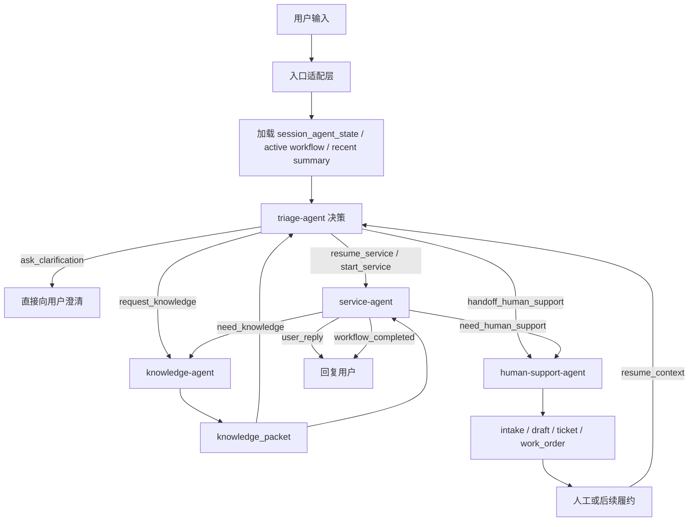
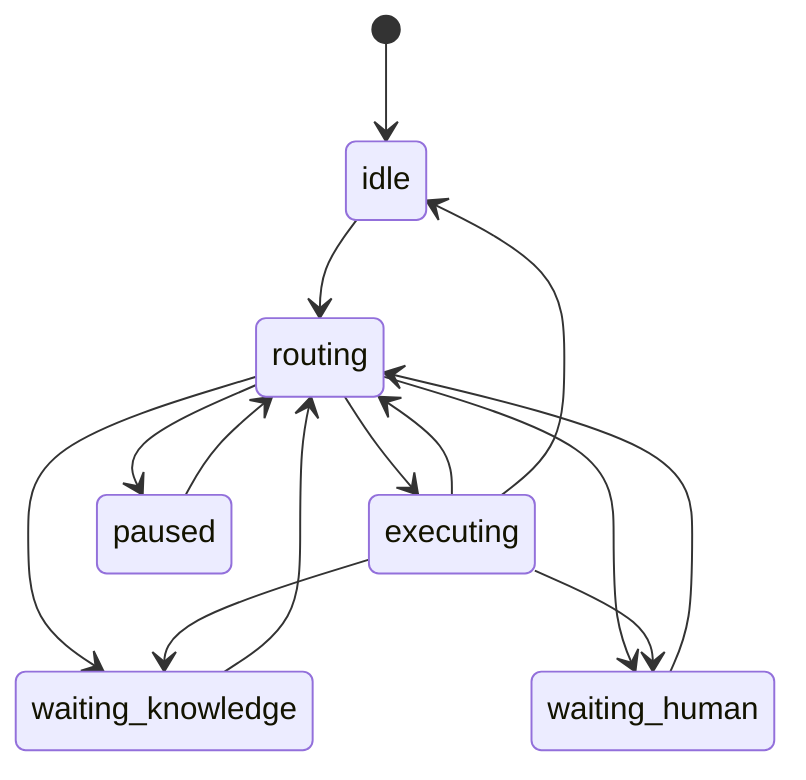

# Triage Agent 与请求生命周期设计

> 在四 Agent 架构下，`triage-agent` 是整个系统的唯一前门控制器。这份文档聚焦三个问题：`triage-agent` 应该如何决策、整条请求生命周期如何流转、以及哪些设计选择适合当前 `ai-bot` 阶段先落地。

**Date**: 2026-04-03  
**Status**: Draft  
**Positioning**: Runtime Decision Design  
**Related Design**:
- [四 Agent 职责边界与 Handoff Contract 设计](./2026-04-03-four-agent-boundaries-and-handoff-contract.md)
- [四 Agent 数据库表结构与 API Contract 草案](./2026-04-03-four-agent-db-and-api-contract.md)
- [运行时视角：用户请求的完整执行链路](./2026-03-23-runtime-request-flow.md)
- [Skill Instance Runtime Design](./2026-03-24-skill-instance-runtime-design.md)

---

## 1. 要解决的问题

如果没有一个清晰的前门控制器，四 Agent 架构会很快退化成下面几种坏模式：

1. 每个 Agent 都试图“理解一遍用户意图”，造成重复判断和冲突。
2. 已有 workflow 时，系统不知道该恢复原流程还是切新话题。
3. 用户一句话里同时有“问规则 + 要办理 + 要人工”，没有统一裁决顺序。
4. `knowledge-agent` 和 `service-agent` 边界不清，检索结果会被误当成业务事实。
5. 人工升级和业务执行都各自能建单，导致重复工单和 ownership 混乱。

因此，`triage-agent` 不是一个“普通 intent classifier”，而是：

> 整个多 Agent 运行时的第一层控制平面。

---

## 2. 结论先行

### 2.1 `triage-agent` 采用“规则兜底 + LLM 决策”的混合设计

不建议：

- 纯规则：太僵，无法处理自然语言歧义、ASR 错误、多意图切换
- 纯 LLM：高风险不可控，且恢复已有 workflow、topic switch、人工优先级这些地方不稳定

推荐：

- 第一层：硬规则拦截
- 第二层：结构化状态判断
- 第三层：LLM 做语义裁决
- 第四层：阈值与 fallback

### 2.2 `knowledge-agent` 先逻辑独立，不急于物理拆服务

当前阶段更重要的是：

- 输出 contract 稳定
- scope 明确
- 证据包结构统一

而不是先把它拆成单独进程。

### 2.3 `human-support-agent` 默认走 intake，允许少量场景直建

默认原则：

- 正式人工升级优先写 `intake`
- 高置信、明确类别、无需人工审核的场景可直建 `ticket/work_order`

### 2.4 记忆先做 DB 化，再引入完整 MD 体系

当前更适合先做：

- `memory_candidates`
- `memory_items`
- scope、TTL、revision

等到 retrieval 和 write-back 成熟后，再把 `SOUL.md / USER.md / AGENTS.md / TOOLS.md / MEMORY.md` 系统化接入。

### 2.5 四 Agent 先逻辑分层，不急于拆独立服务

当前阶段优先级应该是：

1. 边界清楚
2. handoff 稳定
3. 状态单写

而不是先做服务化。

---

## 3. `triage-agent` 的定位

`triage-agent` 不是业务执行器，也不是知识检索器。

它的职责只有三类：

1. 判断这轮输入应该进入哪条处理路径
2. 管理当前 session 的 ownership
3. 生成结构化 handoff

它明确不做的事情：

- 不推进业务 SOP
- 不直接调高风险业务工具
- 不直接创建正式工单
- 不生成最终知识引用答案

最短一句话：

> `triage-agent` 决定“下一轮由谁主导”，但不负责“下一步具体怎么做”。

---

## 4. 请求生命周期总览



---

## 5. `triage-agent` 决策栈

推荐把 `triage-agent` 做成 4 层决策栈，而不是单次 prompt。

## 5.1 Layer 0：硬规则优先

这是最高优先级，直接阻断后续自由判断。

### 必须优先命中的情况

- 用户明确要求人工
- 当前 session 已存在 active human handoff，且尚未恢复
- 当前 message 触发强安全/合规规则
- 当前 workflow 明确要求只能恢复或只能确认

### 典型输出

- `handoff_human_support`
- `resume_service`
- `ask_clarification`

### 原因

这些场景不应该再让 LLM“想一想”。

---

## 5.2 Layer 1：结构化状态判断

读取当前状态：

- `session_agent_state`
- active `skill_instance`
- 最近 `agent_handoffs`
- 最近 `knowledge_packets`

### 重点判断

1. 当前是否存在 active workflow
2. 当前 workflow 是否处于 `pending_confirm`
3. 当前是否刚做过 human handoff
4. 当前是否已有足够新的 knowledge packet 可复用

### 典型规则

- 有 active workflow 且用户消息看起来是确认/取消/补充同话题
  - 优先 `resume_service`
- 刚从 `knowledge-agent` 回来且本轮仍是同一问题
  - 优先回 `service-agent`
- 已经处于 `waiting_human`
  - 除非用户明确撤回或系统收到恢复信号，否则不应重新开始业务执行

---

## 5.3 Layer 2：LLM 语义裁决

在前两层没有把问题完全确定时，再进入 LLM 裁决。

### LLM 输入应该尽量结构化

```ts
interface TriageModelContext {
  user_message: string;
  channel: 'online' | 'voice' | 'outbound';
  active_workflow: {
    exists: boolean;
    skill_id?: string;
    current_step_id?: string;
    pending_confirm?: boolean;
  };
  recent_summary?: string | null;
  recent_intents?: string[];
  latest_handoff_status?: 'none' | 'created' | 'accepted' | 'waiting_human' | 'resume_ready' | 'completed';
  memory_hints: string[];
}
```

### LLM 只输出有限集合

```ts
type TriageDecisionType =
  | 'resume_service'
  | 'start_service'
  | 'request_knowledge'
  | 'handoff_human_support'
  | 'ask_clarification';
```

### LLM 不应该直接输出

- 自由文本工作流说明
- 最终客服回复
- 工单字段
- 具体工具调用

---

## 5.4 Layer 3：阈值与 fallback

即使 LLM 给了决策，也不应直接盲信。

### 推荐阈值

- `>= 0.85`：可直接执行
- `0.60 - 0.84`：结合规则与已有状态做二次判定
- `< 0.60`：优先澄清或人工支持

### 推荐 fallback

- 多意图但主意图不明确：`ask_clarification`
- 与 active workflow 冲突但无法判断是否切题：`ask_clarification`
- 既像知识问答又像业务办理：默认 `start_service`，由 `service-agent` 按需再请求知识

---

## 6. `triage-agent` 的决策优先级

建议按以下优先级执行，顺序不可乱：

1. `explicit_human_request`
2. `active_human_waiting`
3. `active_workflow_resume`
4. `safety_or_policy_block`
5. `clear_new_service_intent`
6. `clear_knowledge_request`
7. `topic_switch_clarification`
8. `low_confidence_clarification`

也就是说：

- 人工优先级高于知识和业务
- 恢复已有 workflow 高于新开 workflow
- 新开业务高于独立知识问答

这是一种偏保守但更稳定的排序。

---

## 7. topic switch 判定

这是 `triage-agent` 最关键也最容易做坏的部分。

## 7.1 不要用单一关键词切换

坏例子：

- 当前办停机保号，用户说“这个大概多少钱”
- 系统误判成新话题“资费查询”

因此，topic switch 必须综合：

- 当前 active skill
- 当前 step
- 用户消息与当前 skill 的语义相似度
- 是否出现新的强意图 trigger

## 7.2 推荐三分类

不要直接做“切/不切”，而是做三分类：

- `same_topic`
- `possible_switch`
- `clear_switch`

### 示例

#### same_topic

- “那多久生效？”
- “需要我确认什么？”
- “如果我下个月恢复呢？”

#### possible_switch

- “顺便问一下，营业厅能办吗？”
- “这个和销号有什么区别？”

#### clear_switch

- “先不办这个了，帮我查下上个月账单”
- “我想转人工”
- “另外我这个网速慢怎么处理”

## 7.3 `possible_switch` 的处理

不要直接切。

建议：

- 若当前 workflow 高风险且未完成
  - 优先 `ask_clarification`
- 若当前 workflow 低风险或仅查询阶段
  - 可允许暂时 `request_knowledge` 或回答后回流

---

## 8. 多意图处理策略

`triage-agent` 不应该试图一次性编排多个完整流程。

推荐策略：

- 识别主意图
- 识别次意图列表
- 当前轮只选一个 owner agent
- 把剩余意图挂到 `pending_intents`

### 示例

用户说：

> “帮我查一下账单，另外我还想问停机保号怎么办。”

建议输出：

- `primary_intent = bill_inquiry`
- `secondary_intents = [temporary_service_suspension_info]`
- 本轮先走 `service-agent` 完成账单
- 返回时提示可继续问停机保号

原因：

当前 `ai-bot` 的 runtime 和工单体系都偏单主线，不适合真正并发多业务实例。

---

## 9. `knowledge-agent` 何时应被显式调用

不建议把所有“解释类问题”都送去 `knowledge-agent`。

推荐只在以下情况显式调用：

1. 当前步骤需要引用规则、政策、reference
2. 当前工具结果不足以回答“为什么”
3. 当前回复需要可审计的证据链
4. 当前问题本身不是业务执行，而是知识型查询

### 不建议调用的情况

- 简单 FAQ，且当前 skill 或 prompt 已足够
- 当前只是要继续 workflow，不需要外部知识
- 当前只是确认/取消

换句话说：

> `knowledge-agent` 应该是高价值补证器，而不是默认问答入口。

---

## 10. `human-support-agent` 何时应被显式调用

建议分成两类：

### 10.1 强制升级

- 用户明确要求人工
- 合规/安全要求人工
- 高风险写操作要求人工复核
- 工具连续失败
- workflow 卡在不可自动推进的节点

### 10.2 策略升级

- 当前 confidence 太低
- 当前多轮澄清仍无法确定
- 当前知识冲突无法裁决

### 默认策略

只要进入正式人工升级，应该由 `human-support-agent` 统一负责：

- handoff summary
- intake / draft / materialization
- resume context

不建议让 `service-agent` 自己顺手建工单。

---

## 11. 请求生命周期中的状态机

建议把 session 层状态机控制在小集合：

```ts
type RouteStatus =
  | 'idle'
  | 'routing'
  | 'executing'
  | 'waiting_knowledge'
  | 'waiting_human'
  | 'paused';
```

### 状态转换建议



### 关键约束

- `waiting_human` 状态下，不应自动进入新的业务执行
- `waiting_knowledge` 是短暂中间态，不应长期停留
- `paused` 适合澄清、等待用户继续、等待恢复信号

---

## 12. 评测维度

`triage-agent` 的评测应该独立于 `service-agent`。

核心指标：

- intent classification accuracy
- resume vs start correctness
- topic switch accuracy
- clarification appropriateness
- human handoff appropriateness
- false escalation rate
- missed escalation rate

### 必须纳入的边界样本

- 用户中途换话题
- 同一 skill 内的追问
- 语音 ASR 错字
- 多意图混合
- 用户在等待人工时再次发消息
- 已有 workflow 但用户明确取消

---

## 13. 对当前 `ai-bot` 的建议决策

这部分是针对当前阶段的明确推荐，不是永久真理。

## 13.1 先做逻辑型 `triage-agent`

也就是：

- 先在同一个 backend 里形成独立决策层
- 先不拆独立服务
- 先不做 agent-to-agent 异步消息队列

## 13.2 先做 hybrid triage

优先顺序：

- 规则
- 活跃 workflow 状态
- LLM 裁决
- 阈值 fallback

## 13.3 先保持单主线 session

即：

- 一个 session 同时只有一个 active workflow
- 多意图先串行处理
- 通过 `pending_intents` 保存剩余事项

## 13.4 先把 `knowledge-agent` 做成显式 contract，不急着拆物理进程

当前最需要的是：

- `request -> packet` 结构稳定
- scope、sources、confidence 统一

## 13.5 先让 `human-support-agent` 成为唯一正式人工桥

这会带来两个好处：

- 杜绝重复建单
- 人工恢复入口唯一

---

## 14. 最终判断

四 Agent 能不能落稳，核心不在 `knowledge-agent`，也不在工单，而在：

> `triage-agent` 是否足够保守、足够结构化、足够理解当前状态。

如果 `triage-agent` 做成了一个“更聪明的意图分类器”，那这套架构很快还会退化。  
如果它真正成为会话级控制器，那么即使后续 agent 数量增加，整个系统也还能保持边界清楚、状态单写和流程可控。

