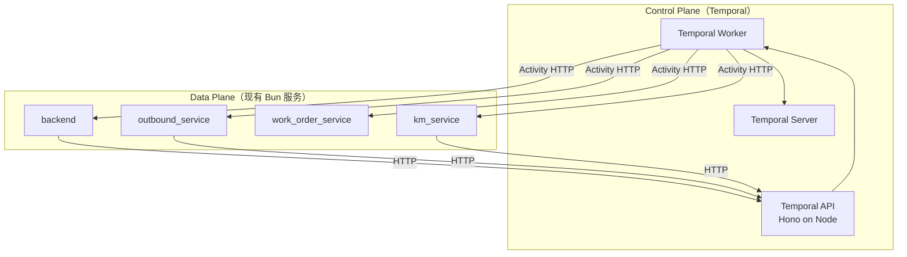
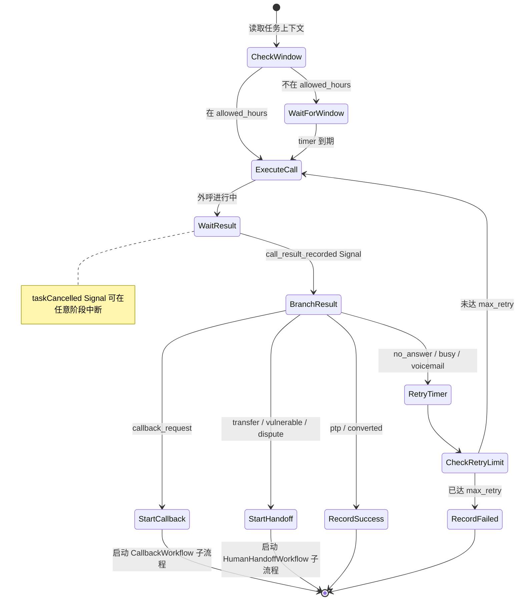
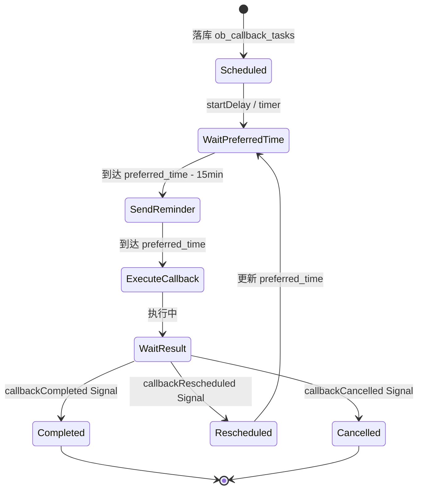
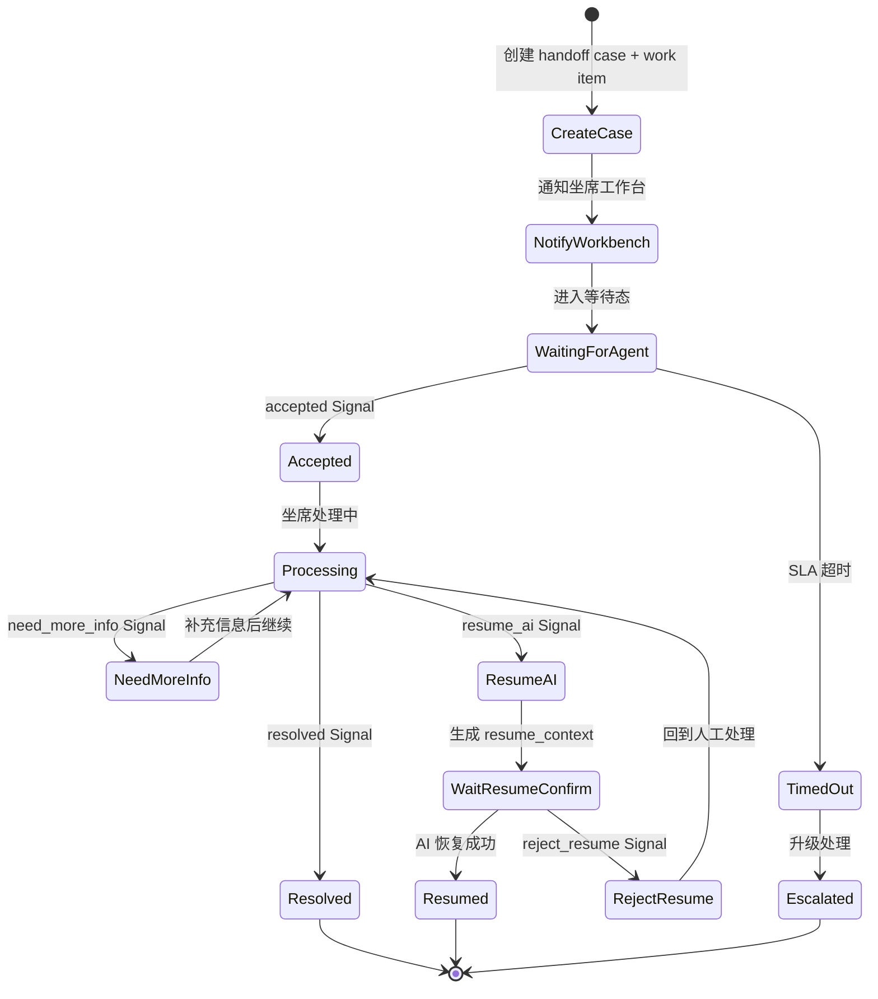
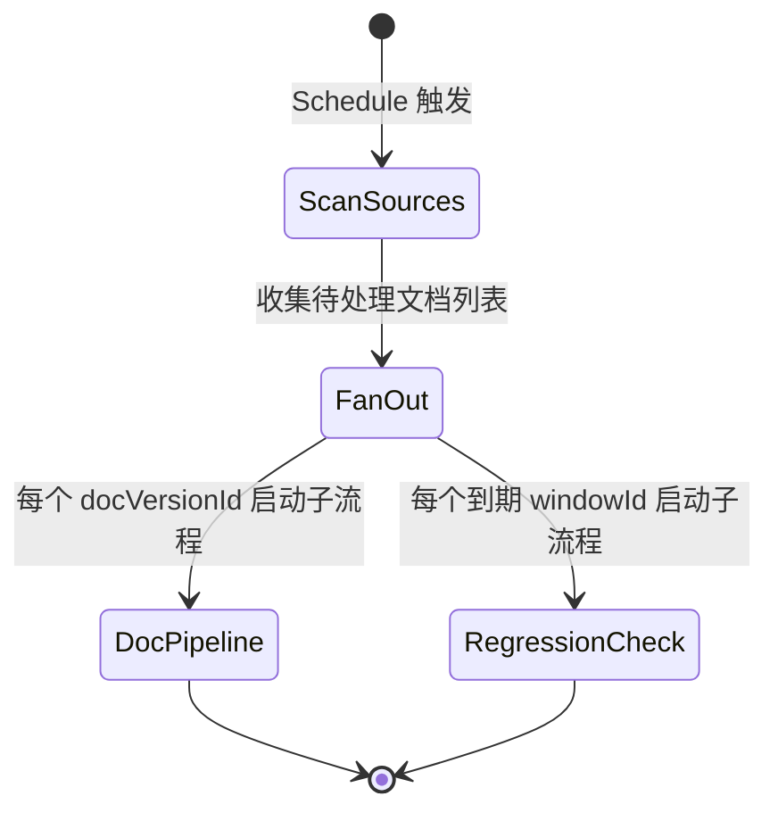
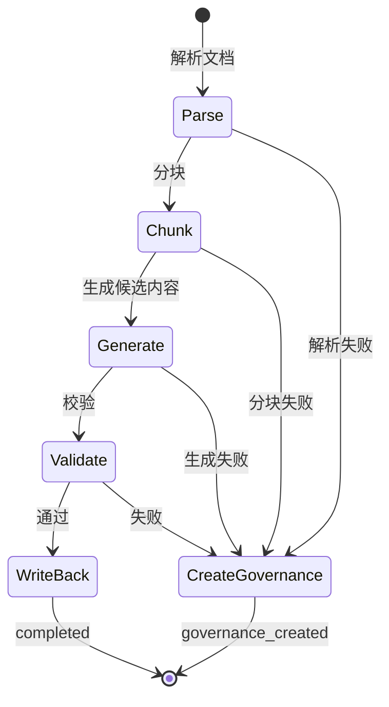

# Temporal Orchestrator 持久化流程编排设计

> 把 Temporal 引入为"跨天、跨服务、可恢复流程"的控制面，不替换现有业务服务和数据库。先接管 4 类真正需要 durable orchestration 的链路：外呼任务、回访/回拨、人工介入、知识定时更新。

**Date**: 2026-04-04
**Status**: Draft
**Positioning**: Target Architecture — Durable Workflow Orchestration Layer

**Related Design**:
- [四 Agent 最小实施计划](2026-04-03-four-agent-minimal-implementation-plan.md)
- [四 Agent 职责边界与 Handoff Contract 设计](2026-04-03-four-agent-boundaries-and-handoff-contract.md)
- [人工工作台与恢复协议](2026-04-03-human-support-agent-workstation-and-resume-protocol.md)
- [四 Agent 数据库表结构与 API Contract 草案](2026-04-03-four-agent-db-and-api-contract.md)

**Related Current Code**:
- `backend/src/chat/outbound.ts` — 外呼 WebSocket 入口
- `outbound_service/src/routes/tasks.ts` — 外呼任务 CRUD
- `outbound_service/src/routes/results.ts` — 外呼结果落表
- `work_order_service/src/services/workflow-service.ts` — 现有工单工作流
- `work_order_service/src/services/appointment-service.ts` — 预约服务
- `km_service/src/routes/documents.ts` — 文档解析入口
- `km_service/src/routes/tasks.ts` — 知识治理任务
- `packages/shared-db/src/schema/outbound.ts` — 外呼 Schema
- `packages/shared-db/src/schema/workorder.ts` — 工单 Schema
- `packages/shared-db/src/schema/km.ts` — 知识 Schema

**Key References**:
- [TypeScript SDK guide](https://docs.temporal.io/develop/typescript)
- [Quickstart](https://docs.temporal.io/develop/typescript/set-up-your-local-typescript)
- [Schedules](https://docs.temporal.io/develop/typescript/schedules)
- [Message Passing](https://docs.temporal.io/develop/typescript/message-passing)
- [Continue-As-New](https://docs.temporal.io/develop/typescript/continue-as-new)
- [Human-in-the-Loop AI Agent](https://docs.temporal.io/ai-cookbook/human-in-the-loop-python)

---

## 1. 结论先行

> Temporal 做"长流程调度器"，现有服务继续做事实层。先控制面，后能力面。

- Temporal 负责：流程状态、定时器、重试、Signals、Schedule、审计历史
- 现有服务仍是事实源：外呼 → `outbound_service`，工单 → `work_order_service`，知识 → `km_service`
- Temporal Workflow 里只放业务 ID 和轻状态，不放大文本、完整 transcript、知识正文
- 所有 Activity 必须幂等，因为 Temporal 会重试
- 长生命周期 workflow 用 `Continue-As-New`

---

## 2. 关键约束

### 2.1 运行时约束

官方 TypeScript SDK 要求 `Node.js 18+`，仓库现有服务是 Bun。**不要**把 Temporal Worker 塞进 Bun 进程。

**方案**：新建独立 `temporal_orchestrator` workspace，用 Node 运行 Worker 和 Client，对现有服务提供内部 HTTP 入口。

### 2.2 架构定位



### 2.3 不做的事

| 不做 | 原因 |
|------|------|
| 废掉 `workflow-service.ts` | 现有工单工作流先保留，Temporal 做外层编排 |
| 迁移 `skill_instances` | 单次会话内 SOP 控制继续用现有 runtime |
| Temporal 直接写业务库 | Activity 走 HTTP 调现有服务，保持事实源不变 |
| Bun 进程内跑 Worker | SDK 不兼容，独立 Node 服务 |

---

## 3. Workspace 结构

```
temporal_orchestrator/
  package.json
  tsconfig.json
  src/
    client.ts                          # Temporal Client 连接
    worker.ts                          # Temporal Worker 启动
    api.ts                             # 内部 HTTP API（Hono + Node）
    types.ts                           # 核心类型定义
    workflows/
      outbound-task.ts                 # 外呼任务 Workflow
      callback.ts                      # 回访/回拨 Workflow
      human-handoff.ts                 # 人工介入 Workflow
      km-document-pipeline.ts          # 文档处理流水线 Workflow
      km-refresh.ts                    # 知识定时刷新 Workflow
    activities/
      outbound.ts                      # 外呼相关 Activity
      work-order.ts                    # 工单相关 Activity
      km.ts                            # 知识管理 Activity
      notify.ts                        # 通知 Activity
```

### 3.1 `package.json`

```json
{
  "name": "@ai-bot/temporal-orchestrator",
  "version": "1.0.0",
  "private": true,
  "type": "module",
  "scripts": {
    "dev:worker": "node --import tsx/esm src/worker.ts",
    "dev:api": "node --import tsx/esm src/api.ts",
    "check": "tsc -p tsconfig.json --noEmit"
  },
  "dependencies": {
    "@temporalio/client": "^1.11.0",
    "@temporalio/worker": "^1.11.0",
    "@temporalio/workflow": "^1.11.0",
    "hono": "^4.7.5",
    "@hono/node-server": "^1.14.3",
    "zod": "^3.24.4"
  },
  "devDependencies": {
    "@types/node": "^25.5.0",
    "tsx": "^4.21.0",
    "typescript": "^5.9.3"
  }
}
```

### 3.2 `tsconfig.json`

```json
{
  "extends": "../tsconfig.base.json",
  "compilerOptions": {
    "target": "ES2022",
    "module": "NodeNext",
    "moduleResolution": "NodeNext",
    "strict": true,
    "skipLibCheck": true,
    "types": ["node"],
    "outDir": "dist"
  },
  "include": ["src/**/*"]
}
```

---

## 4. 核心类型

```typescript
// src/types.ts

// ─── Workflow 输入 ───

export interface OutboundTaskInput {
  taskId: string;
  taskType: 'collection' | 'marketing';
  phone: string;
  campaignId?: string;
  sessionId?: string;
  source: 'task_created' | 'ws_connected' | 'schedule_triggered';
}

export interface CallbackInput {
  callbackTaskId: string;
  originalTaskId: string;
  phone: string;
  preferredTime: string;           // ISO 8601
  customerName?: string;
  productName?: string;
}

export interface HumanHandoffInput {
  handoffId: string;
  phone: string;
  sourceSkill: string;
  queueName: string;
  reason: string;
  sessionId?: string;
  taskId?: string;
  workItemId?: string;
}

export interface KmDocumentPipelineInput {
  docVersionId: string;
  stages: Array<'parse' | 'chunk' | 'generate' | 'validate'>;
  trigger: 'manual' | 'schedule' | 'document_change';
}

export interface KmRefreshInput {
  scope: 'daily_refresh' | 'review_due' | 'regression_window';
}

// ─── Workflow 输出 ───

export interface OutboundTaskResult {
  taskId: string;
  finalStatus: 'completed' | 'handoff' | 'callback_scheduled' | 'cancelled';
}

export interface CallbackResult {
  callbackTaskId: string;
  finalStatus: 'completed' | 'rescheduled' | 'cancelled';
}

export interface HumanHandoffResult {
  handoffId: string;
  finalStatus: 'resolved' | 'resumed_ai' | 'closed_without_resume';
}

export interface KmDocumentPipelineResult {
  docVersionId: string;
  finalStatus: 'completed' | 'failed' | 'governance_created';
}
```

---

## 5. 四类 Workflow 设计

### 5.1 OutboundTaskWorkflow

**对象**：`ob_tasks.id`

**职责**：拨前门控 → 合法时段等待 → 执行外呼 → 结果分支 → 重拨/回访/转人工

**启动点**：外呼任务创建后，或 `backend/src/chat/outbound.ts` 建链时 `signalWithStart`



**Signals**：
- `callResultRecorded` — 外呼结果落表后触发
- `handoffRequested` — 通道内触发转人工
- `taskCancelled` — 任务取消

**设计要点**：
- Campaign 级批量外呼：`CampaignWaveWorkflow` 只负责 fan-out，单用户单 task 一个 child workflow
- DND 检查在 Activity 中做，幂等
- 长链路（多次重拨跨天）使用 `Continue-As-New`

### 5.2 CallbackWorkflow

**对象**：`ob_callback_tasks.task_id`

**职责**：等待到 `preferred_time` → 发提醒短信 → 执行回拨 → 成功/重排/取消

**启动点**：`outbound_service/src/routes/tasks.ts` 创建回拨任务成功后



**Signals**：
- `callbackCompleted` — 回拨成功
- `callbackRescheduled` — 重新排期（附带新 `preferredTime`）
- `callbackCancelled` — 取消回拨

**设计要点**：
- 一次性回访用 `startDelay`
- 大批量固定窗口回访用 Temporal `Schedule`
- 若需联动工单，调 `work-order-client` 的 `createAppointmentFromSkill`

### 5.3 HumanHandoffWorkflow

**对象**：`ob_handoff_cases.case_id` 或未来 `agent_handoffs.handoff_id`

**职责**：转人工 → 创建工单/工作项 → 通知工作台 → 等待人工处理 → 恢复 AI 或关闭

**启动点**：外呼通道触发 `transfer_to_human` 后，`triggerHandoff` 之后立刻启动



**Signals**：
- `accepted` — 坐席接单
- `needMoreInfo` — 需要补充信息
- `resolved` — 坐席完成处理
- `resumeAi` — 请求恢复 AI 处理（附带 `resume_context`）
- `rejectResume` — 拒绝 AI 恢复

**设计要点**：
- UI 查询当前状态用 Temporal Query
- 同步返回结果场景用 Update；大部分场景 Signal 就够
- 和现有 `manual_resume` 设计完全兼容
- HITL 模式对齐 Temporal AI Cookbook

### 5.4 KmDocumentPipelineWorkflow + KmRefreshWorkflow

**角色不同**：不是"在线业务会话"，而是"后台治理流水线"。

#### KmRefreshWorkflow（调度层）

**职责**：定时扫描 → 发现需处理项 → fan-out 子流程

**触发**：Temporal `Schedule`，每晚执行

扫描来源：
- `km_assets.next_review_date` 到期
- `km_regression_windows.observe_until` 到期
- 新增/变更文档



#### KmDocumentPipelineWorkflow（执行层）

**对象**：`km_doc_versions.id`

**职责**：parse → chunk → generate candidates → validate → 回写 `km_pipeline_jobs` → 失败建 `km_governance_tasks`



**KnowledgeRegressionWorkflow**（附加）：
- 到 `observe_until` 自动跑 retrieval eval
- 判断是否关闭回归窗口或升级治理任务

---

## 6. Activity 边界

所有 Activity 走 HTTP 调用现有服务，不直接碰业务库。

### 6.1 `activities/outbound.ts`

| Activity | HTTP 目标 | 说明 |
|----------|-----------|------|
| `getOutboundTask(taskId)` | `GET outbound_service/api/outbound/tasks/:id` | 读取任务详情 |
| `updateOutboundTaskStatus(taskId, status)` | `POST outbound_service/api/outbound/internal/tasks/:id/status` | **需新增** |
| `recordCallResult(body)` | `POST outbound_service/api/outbound/results` | 已有 |
| `createCallbackTask(body)` | `POST outbound_service/api/outbound/tasks/callbacks` | 已有 |
| `createHandoffCase(body)` | `POST outbound_service/api/outbound/handoff-cases` | 已有 |

### 6.2 `activities/work-order.ts`

| Activity | HTTP 目标 | 说明 |
|----------|-----------|------|
| `createAppointment(body)` | `POST work_order_service/api/appointments` | 已有 |
| `startWorkflowRun(body)` | `POST work_order_service/api/workflows/runs` | 已有 |
| `signalWorkflow(runId, signal, payload)` | `POST work_order_service/api/workflows/runs/:id/signal` | 已有 |

### 6.3 `activities/km.ts`

| Activity | HTTP 目标 | 说明 |
|----------|-----------|------|
| `enqueuePipelineJobs(docVersionId, stages)` | `POST km_service/api/internal/pipeline/jobs` | **需新增** |
| `markPipelineJobStatus(jobId, status, error?)` | `POST km_service/api/internal/pipeline/jobs/:id/status` | **需新增** |
| `createGovernanceTask(body)` | `POST km_service/api/internal/governance/tasks` | **需新增** |
| `closeRegressionWindow(windowId, verdict)` | `POST km_service/api/internal/regression-windows/:id/conclude` | **需新增** |

### 6.4 `activities/notify.ts`

| Activity | HTTP 目标 | 说明 |
|----------|-----------|------|
| `notifyWorkbench(handoffId)` | `POST backend/api/internal/notify/workbench` | **需新增** |
| `notifySmsReminder(phone, type)` | `POST backend/api/internal/notify/sms` | **需新增** |

---

## 7. Temporal API（供现有服务调用）

`temporal_orchestrator` 暴露一层薄 HTTP API，端口建议 `18030`：

```
POST /api/temporal/outbound/tasks/:taskId/start
POST /api/temporal/outbound/tasks/:taskId/call-result
POST /api/temporal/callbacks/:callbackTaskId/start
POST /api/temporal/callbacks/:callbackTaskId/complete
POST /api/temporal/callbacks/:callbackTaskId/reschedule
POST /api/temporal/callbacks/:callbackTaskId/cancel
POST /api/temporal/handoffs/:handoffId/start
POST /api/temporal/handoffs/:handoffId/signal
POST /api/temporal/km/doc-versions/:vid/start
POST /api/temporal/km/refresh/daily/trigger
```

### Workflow ID 规范

| Workflow | ID 模式 | 说明 |
|----------|---------|------|
| OutboundTaskWorkflow | `outbound-task/{taskId}` | 外部可直接 `getHandle` |
| CallbackWorkflow | `callback/{callbackTaskId}` | 外部可直接 `getHandle` |
| HumanHandoffWorkflow | `handoff/{handoffId}` | 外部可直接 `getHandle` |
| KmDocumentPipelineWorkflow | `km-doc/{docVersionId}` | 外部可直接 `getHandle` |
| KmRefreshWorkflow | `km-refresh/daily` | 单例 |

---

## 8. 现有服务接入点

### 8.1 接入方式总览

| 触发场景 | 调用源 | 调用目标 |
|----------|--------|----------|
| 外呼建链 | `backend/src/chat/outbound.ts` | `POST /api/temporal/outbound/tasks/:taskId/start` |
| 通话结果落库 | `outbound_service/src/routes/results.ts` | `POST /api/temporal/outbound/tasks/:taskId/call-result` |
| 回拨任务创建 | `outbound_service/src/routes/tasks.ts` | `POST /api/temporal/callbacks/:callbackTaskId/start` |
| 人工工作台动作 | 工作台后端 | `POST /api/temporal/handoffs/:handoffId/signal` |
| 文档解析 | `km_service/src/routes/documents.ts` | `POST /api/temporal/km/doc-versions/:vid/start` |

### 8.2 现有服务需新增的最小 API

#### `outbound_service`

| 端点 | 说明 |
|------|------|
| `GET /api/outbound/tasks/callbacks/:id` | callback 单条详情 |
| `PUT /api/outbound/tasks/callbacks/:id` | callback 状态更新 |
| `POST /api/outbound/internal/tasks/:id/status` | 内部：任务状态更新 |
| `POST /api/outbound/internal/callbacks/:id/status` | 内部：callback 状态更新 |

> 现在只有创建和列表，缺 callback 单条详情和状态更新。

#### `km_service`

| 端点 | 说明 |
|------|------|
| `POST /api/internal/pipeline/jobs` | 内部：批量创建 pipeline jobs |
| `POST /api/internal/pipeline/jobs/:id/status` | 内部：更新 job 状态 |
| `POST /api/internal/governance/tasks` | 内部：创建治理任务 |
| `POST /api/internal/regression-windows/:id/conclude` | 内部：关闭回归窗口 |

> 现在 `documents.ts` 只插 pending job，真正执行和回写状态的内部面不够。

#### `work_order_service`

> 第一阶段不需要新增。现有 `/api/workflows/runs` 和 `/api/workflows/runs/:id/signal` 已够用。

---

## 9. 四个业务目标与 Temporal 覆盖度

| 目标 | 可行性 | Temporal 负责什么 | 当前仓库基础 | 主要缺口 |
|------|--------|------------------|-------------|----------|
| 1. 自主回访客户，记录反馈，有需要时找客服 | **强可行，最适合第一批落地** | 到点回访、等待结果、重试、转人工、恢复 AI | 已有外呼任务/回拨/结果/转人工表；已有外呼实时入口；已有工单预约 | 缺 callback 单条查询/状态更新 API；缺"结果落库后发 Signal" |
| 2. 每天自主排班，生成日程给每个客服 | **可行，但排班算法本身还得增强** | 每天定时触发、失败重试、发布审批、下发日程 | 已有排班算法和发布流程 | 算法是规则轮转型，不是预测优化型；缺日程发送渠道和异常回滚 |
| 3. 自主知识演进，从工单/反馈获取知识，过期自动提醒 | **可行，第一版半自动** | 定时扫描、启动文档流水线、创建治理任务、到期提醒、回归窗口收口 | 已有 pipeline_jobs / governance_tasks / regression_windows / next_review_date | 缺"从工单/反馈抽取 candidate"的自动链路；缺 owner/审批闭环 |
| 4. 识别常见问题，生成问答流程，自动生成测试用例 | **可行，但本质是治理自动化** | 周期聚类、生成候选 SOP/QA、建评审包、生成测试、触发回归 | 已有评测/观测设计和 KM 治理结构 | 缺 FAQ 聚类器、自动流程生成器、统一 testcase 执行 API |

### 扩展 Workflow 全景

在原有 5 个 Workflow 基础上，扩展到 11 个覆盖全部 4 个目标：

| Workflow | 覆盖目标 | Workflow ID | 期数 |
|----------|---------|-------------|------|
| `OutboundTaskWorkflow` | 目标 1 | `outbound-task/{taskId}` | 第一期 |
| `CallbackWorkflow` | 目标 1 | `callback/{callbackTaskId}` | 第一期 |
| `HumanHandoffWorkflow` | 目标 1 | `handoff/{handoffId}` | 第一期 |
| `KmRefreshWorkflow` | 目标 3 | `km-refresh/{scope}/{date}` | 第一期 |
| `KmDocumentPipelineWorkflow` | 目标 3 | `km-doc/{docVersionId}` | 第一期 |
| `PolicyExpiryReminderWorkflow` | 目标 3 | `policy-expiry/{assetId}/{date}` | 第一期 |
| `DailyScheduleWorkflow` | 目标 2 | `daily-schedule/{date}` | 第二期 |
| `SchedulePublishWorkflow` | 目标 2 | `schedule-publish/{planId}/{versionNo}` | 第二期 |
| `HotIssueMiningWorkflow` | 目标 4 | `hot-issue-mining/{windowStart}/{windowEnd}` | 第二期 |
| `QaFlowSuggestionWorkflow` | 目标 4 | `qa-suggest/{clusterId}` | 第二期 |
| `AutoTestRegressionWorkflow` | 目标 4 | `auto-test/{targetType}/{targetId}` | 第二期 |

### 扩展类型定义

```typescript
// ─── 目标 2：排班 ───

export interface DailyScheduleInput {
  date: string;                    // YYYY-MM-DD
  planName: string;
  groupId?: string;
  autoPublish: boolean;
  notifyAgents: boolean;
}

export interface SchedulePublishInput {
  planId: string;
  versionNo: number;
  requestedBy: string;
  autoPublishThreshold?: number;   // 校验错误数阈值
}

// ─── 目标 3 扩展：过期提醒 ───

export interface PolicyExpiryReminderInput {
  assetId: string;
  nextReviewDate: string;
  owner?: string;
  severity: 'low' | 'medium' | 'high' | 'critical';
}

// ─── 目标 4：热点挖掘 + 自动测试 ───

export interface HotIssueMiningInput {
  windowStart: string;
  windowEnd: string;
  channels: string[];
  minFrequency: number;
  sources: Array<'work_orders' | 'copilot_queries' | 'negative_feedback' | 'retrieval_miss'>;
}

export interface QaFlowSuggestionInput {
  clusterId: string;
  issueText: string;
  evidenceRefs: string[];
  sceneCode?: string;
}

export interface AutoTestRegressionInput {
  targetType: 'skill' | 'qa_pair' | 'document';
  targetId: string;
  generatedCaseIds: string[];
  runMode: 'full' | 'smoke' | 'regression_only';
}
```

---

## 10. 落地顺序

### Phase 0：基础设施

1. 新建 `temporal_orchestrator` workspace，跑通 `client.ts / worker.ts / api.ts`
2. 本地 Temporal Server（`temporal server start-dev`）
3. 根 `package.json` 的 `workspaces` 加入 `"temporal_orchestrator"`

### Phase 1（第一期）：回访 + 人工 + 外呼 + 知识流水线

1. `CallbackWorkflow` + `HumanHandoffWorkflow`（收益最大、侵入最小）
2. `OutboundTaskWorkflow`（把重试/时段/DND/转人工收口）
3. `KmRefreshWorkflow` + `KmDocumentPipelineWorkflow` + `PolicyExpiryReminderWorkflow`
4. 现有服务新增最小 API（§8.2）

### Phase 2（第二期）：排班 + 热点挖掘 + 自动测试

1. `DailyScheduleWorkflow` + `SchedulePublishWorkflow`
2. `HotIssueMiningWorkflow` + `QaFlowSuggestionWorkflow`
3. `AutoTestRegressionWorkflow`

---

## 11. 复杂度论证

### 为什么引入 Temporal 而不是继续用扫表 + cron

| 场景 | 扫表 + cron 的问题 | Temporal 的收益 |
|------|-------------------|----------------|
| 回拨等待 2 小时 | 需要定时扫 `preferred_time`，扫频和延迟矛盾 | `sleep(duration)` 精确唤醒 |
| 外呼重试跨天 | 状态散落在表字段，恢复逻辑在代码里 | 状态就是 workflow history，crash 自动恢复 |
| 人工介入等待不确定时长 | 轮询或回调，状态管理复杂 | `setHandler(signal)` 精确等待 |
| 知识流水线多阶段 | 每阶段状态用字段标记，补跑需要手动 | 每步是 Activity，重试/补跑是内建能力 |
| 批量外呼并发控制 | 应用层自己做限流 | Task Queue + Worker concurrency 内建 |

### 被否决的简单方案

1. **在 Bun 进程内做 setTimeout**：进程重启丢失，不可接受
2. **用 BullMQ / Agenda**：能解决定时，但缺 Signal/Query/子流程，复杂状态图仍需手写状态机
3. **把 Temporal Worker 塞进现有 Bun 服务**：SDK 不兼容，且耦合部署
