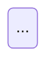

请仔细分析这张流程图/草图，完成以下任务：

1. **流程描述**：{{DESC_LANG}}，描述图中的完整流程，包括每个步骤、判断条件、分支走向。
2. **Mermaid 状态图**：将流程转换为 Mermaid stateDiagram-v2 格式，要求：
   - {{NODE_RULE}}
   - 包含所有分支和判断条件
   - 用 [*] 标记起始和结束状态

请按以下格式输出：

## 流程描述
（{{DESC_LANG}}）

## Mermaid 状态图

